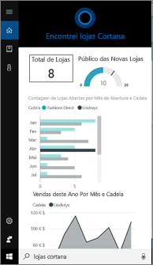
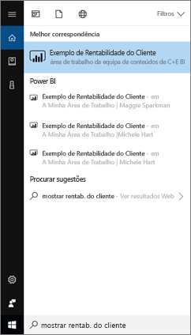
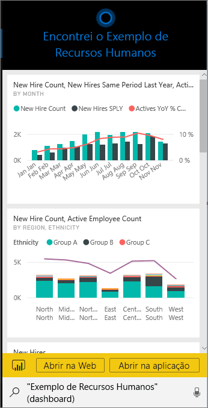
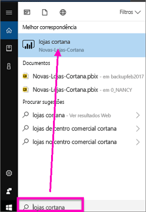
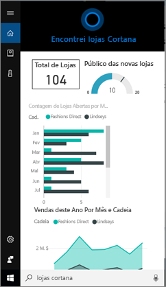
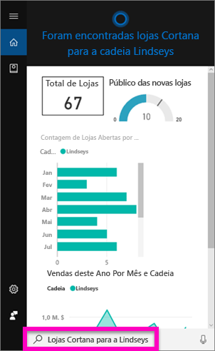
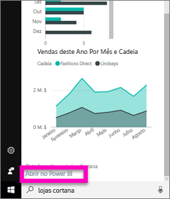

# Localizar e ver os dados do Power BI através da Cortana para Power BI
Utilize o Cortana nos seus dispositivos Windows 10 para obter respostas instantâneas às suas perguntas empresariais importantes. Com a integração no Power BI, o Cortana pode obter informações-chave diretamente dos dashboards e relatórios do Power BI. Apenas precisa da versão de novembro de 2015 ou posterior do Windows 10, do Cortana, do Power BI e de acesso a, pelo menos, um conjunto de dados.

> [!IMPORTANT]
> A integração da Cortana irá ser preterida no Power BI. A partir de 11 de junho, a Cortana deixará de funcionar para os dashboards e relatórios.

## Pré-visualizar a nova experiência de pesquisa de *dashboards* do Cortana para Windows 10
Durante algum tempo foi possível [utilizar o Cortana para obter determinados tipos de páginas de relatórios](service-cortana-answer-cards.md). Agora, adicionámos uma **nova experiência**: a capacidade de obter também dashboards. Experimente e [envie-nos os seus comentários no Power BI Ideas](https://ideas.powerbi.com/forums/265200-power-bi). Eventualmente, a *nova experiência* será expandida para incluir também a pesquisa de relatórios do Cortana.  Uma das principais vantagens da nova experiência é não ter de fazer nada de especial para configurá-la: não tem de ativar a Cortana nem configurar o Windows 10. Simplesmente funciona.

> [!NOTE]
> Se não "funcionar simplesmente", veja o [Artigo de resolução de problemas](service-cortana-troubleshoot.md) para obter ajuda.
> 
> 

A tecnologia subjacente está a utilizar o [Microsoft Azure Search Service](https://docs.microsoft.com/azure/search/). Este serviço de pesquisa fornece capacidades adicionais, tais como classificação inteligente, correção de erros e preenchimento automático.

Ambas as experiências do Cortana podem existir lado a lado.

## Documentação do Cortana para Power BI
Quatro documentos que o ajudam a configurar e utilizar a Cortana para o Power BI.

**Artigo 1** (este artigo): Compreender como o Cortana e o Power BI funcionam em conjunto

**Artigo 2**: [Procurar relatórios do Power BI: ativar a integração entre o Cortana, Power BI e Windows](service-cortana-enable.md)

**Artigo 3**: [Procurar relatórios do Power BI: criar *cartões de resposta da Cortana especiais*](service-cortana-answer-cards.md)

**Artigo 4**: [resolução de problemas](service-cortana-troubleshoot.md)

## Como a Cortana e o Power BI funcionam em conjunto
Quando utiliza o Cortana para fazer uma pergunta, o Power BI pode ser um dos locais onde o Cortana procura respostas. No Power BI, o Cortana pode encontrar respostas avançadas condicionadas por dados em relatórios do Power BI (que contêm um tipo especial de página de relatório denominado *cartão de resposta do Cortana*) e em dashboards do Power BI.

Se o Cortana encontrar uma correspondência, apresenta o nome do dashboard ou da página de relatório no ecrã do Cortana. É possível abrir o dashboard ou a página de relatório no Power BI. As páginas de relatório também podem ser exploradas diretamente no Cortana, uma vez que são interativas.

### Cortana e Dashboards (a *nova experiência*)
O Cortana consegue encontrar respostas em dashboards de que é proprietário e em dashboards que foram partilhados consigo. Faça perguntas ao Cortana através de títulos, palavras-chave, nomes de proprietário, nomes de área de trabalho, nomes de aplicação, etc.

A sua pergunta tem de ter, pelo menos, duas palavras para que a Cortana possa encontrar uma resposta. Assim, se procurar num dashboard com um nome de uma só palavra (Marketing), adicione a palavra “mostrar” ou “Power BI” à sua pergunta, tal como em “mostrar Marketing” e “exemplo michele hart”. 

Se o dashboard tiver um título com mais do que uma palavra, a Cortana só devolverá esse dashboard se a pesquisa corresponder a, pelo menos, duas das palavras ou a uma das palavras e ao nome do proprietário. Para um dashboard com o nome "Exemplo de Rentabilidade do Cliente": 

* "mostrar-me cliente" *não* devolve um resultado de dashboard do Power BI.   
* expressões como "mostrar-me rentabilidade cliente", "cliente p", "cliente s", "exemplo rentabilidade", "exemplo michele hart", "mostrar exemplo rentabilidade cliente" e "mostrar cliente p" *devolve* um resultado do Power BI.
* Adicionar a palavra "powerbi" conta como uma das duas palavras necessárias, por isso, "exemplo powerbi" *devolve* um resultado do Power BI. 
  
    

### Cortana e Relatórios
 O Cortana pode encontrar respostas em relatórios com [páginas concebidas especificamente para serem apresentadas pelo Cortana](service-cortana-answer-cards.md). Basta fazer perguntas com o título ou as palavras-chave a partir de uma destas páginas de relatório específicas.  

A tecnologia subjacente para relatórios utiliza as [Perguntas e Respostas do Power BI](power-bi-tutorial-q-and-a.md).

Quando faz uma pergunta no Cortana, o Power BI responde a partir das páginas de relatório concebidas especificamente para o Cortana. As respostas potenciais são determinadas pelo Cortana diretamente a partir dos *cartões de resposta* já criados no Power BI.  Para explorar mais uma resposta, abra um resultado no Power BI.

> [!NOTE]
> Antes de o Cortana poder procurar respostas nos relatórios do Power BI, terá de [ativar esta funcionalidade através do serviço Power BI e configurar o Windows para comunicar com o Power BI](service-cortana-enable.md).  
> 
> 

## Utilizar o Cortana para obter respostas do Power BI
1. Vamos começar pelo Cortana. Existem muitas formas diferentes de *abrir* o Cortana: selecione o ícone do Cortana na barra de tarefas (ilustrada abaixo), utilize os comandos de voz ou toque no ícone de pesquisa no seu dispositivo móvel Windows.
   
     
2. Depois de o Cortana ser iniciado, escreva ou fale a sua pergunta na barra de pesquisa do Cortana. O Cortana apresenta os resultados disponíveis. Se existir um dashboard do Power BI que corresponda à pergunta, este aparece em **Melhor correspondência** ou **Power BI**.
   
     
   
   > [!NOTE]
   > Neste momento, apenas é suportado o idioma inglês.
   > 
   > 
3. Selecione o dashboard para abri-lo na Cortana.

    

    Pode alterar o esquema ao [editar a *vista do telefone* do dashboard](service-create-dashboard-mobile-phone-view.md). 

1. Na Cortana, também tem as opções de abrir o dashboard no serviço Power BI ou no Power BI Mobile. Abra o dashboard no serviço Power BI ao selecionar **Abrir na Web**. 
   
      
4. Agora, vamos utilizar o Cortana para procurar um relatório. Vamos precisar de um [relatório que tenha uma página com um cartão de resposta do Cortana](service-cortana-answer-cards.md). Neste exemplo, um relatório denominado "Novos-Arquivos-Cortana" tem uma página de cartão de resposta com o nome "arquivos do cortana".  
   
     Escreva ou fale a sua pergunta na barra de pesquisa do Cortana. O Cortana apresenta os resultados disponíveis. Se existir uma página de relatório do Power BI que corresponda à pergunta, esta aparece em **Melhor correspondência** ou **Power BI**. Neste exemplo, o ficheiro .pbix (e a cópia de segurança) utilizado para criar o cartão de resposta também é apresentado, em **Documentos**.
   
      
5. Selecione a página de relatório **Arquivos do Cortana** para apresentá-la na janela do Cortana.
   
       
   
    Tenha em atenção que um *cartão de resposta* é um tipo especial de página de relatório do Power BI criado por um proprietário de conjunto de dados.  Para obter mais informações, veja [Criar um cartão de resposta do Cortana](service-cortana-answer-cards.md).
6. Mas não é tudo. Interaja com as visualizações no cartão de resposta, tal como faria no Power BI.
   
   * Por exemplo, selecione um elemento numa visualização para aplicar um filtro cruzado e realçar as outras visualizações no cartão de resposta.
     
     
   * Também pode utilizar uma linguagem natural para filtrar os resultados.  Por exemplo, peça "arquivos do Cortana para Lindseys" e veja o cartão filtrado para mostrar apenas os dados da cadeia Lindseys.
     
     
7. Continue a explorar. Desloque-se para a parte inferior da janela do Cortana e selecione **Abrir no Power BI**.
   
     
8. A página de relatório é aberta no Power BI.    
     .
* Continua a não conseguir utilizar a Cortana juntamente com o Power BI?  Experimente a [ferramenta de resolução de problemas do Cortana](service-cortana-troubleshoot.md).
* O Cortana para Power BI está atualmente disponível apenas em inglês.
* O Cortana para Power BI só está disponível em dispositivos móveis Windows.

Mais perguntas? [Experimente a Comunidade do Power BI](https://community.powerbi.com/).
Comentários? [Envie-nos comentários para o Power BI Ideas](https://ideas.powerbi.com/forums/265200-power-bi).

## Próximos passos
[Ativar a integração entre o Cortana, Power BI e Windows para relatórios](service-cortana-enable.md)

