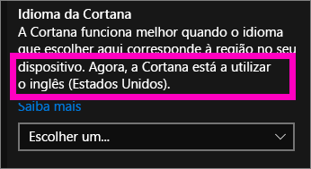
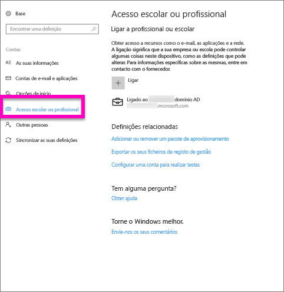
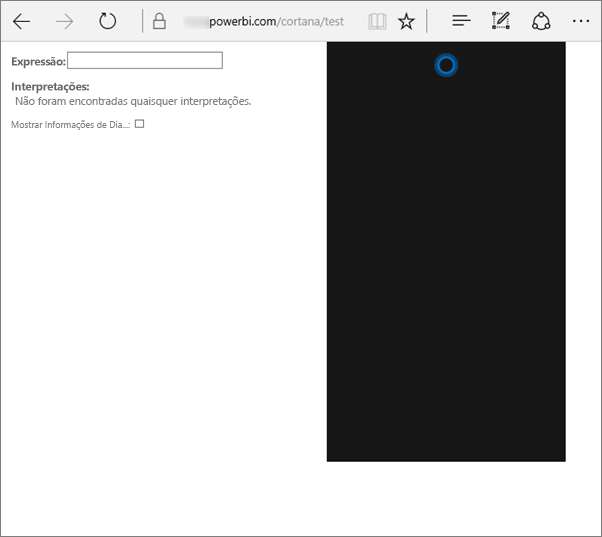
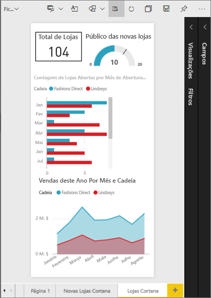
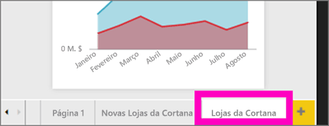
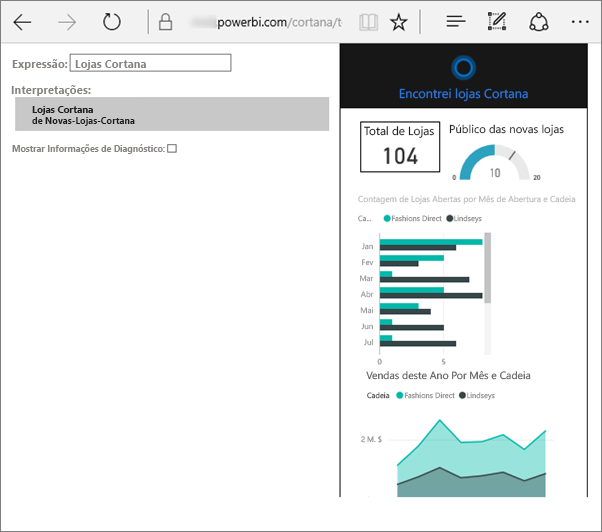
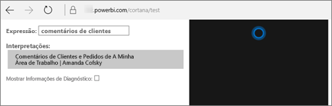

# Resolução de problemas do Cortana para Power BI
Este artigo faz parte de uma série. 

> [!IMPORTANT]
> A integração da Cortana irá ser preterida no Power BI. A partir de 11 de junho, a Cortana deixará de funcionar para os dashboards e relatórios.

Se está a ter problemas ao obter a Cortana para integração no Power BI, veio ao sítio certo. Siga os passos abaixo para diagnosticar e corrigir o problema.

## Por que motivo o Cortana não encontra respostas a partir dos meus relatórios ou dashboards do Power BI?
1. Tem uma conta do Power BI?  Se não tiver, [inscreva-se numa avaliação gratuita](https://powerbi.microsoft.com/get-started/).
2. O Cortana está a funcionar?  Vê o ícone do Cortana na barra de tarefas?

    

    Ao selecioná-lo, o Cortana é aberto com um campo onde pode escrever?
3. Utilizou, pelo menos, 2 palavras na pesquisa? O Cortana precisa de, pelo menos, 2 palavras para encontrar respostas no Power BI. Experimente adicionar "mostrar" ao início da pergunta.
4. Se o dashboard tiver um título com mais do que uma palavra, o Cortana só irá devolver esse dashboard se a pesquisa corresponder a, pelo menos, duas das palavras. Para um dashboard com o nome "Vendas FY16":

   * "mostrar vendas" *não* devolverá um resultado do Power BI.   
   * "mostrar-me vendas fy16", "vendas fy16", "mostrar vendas fy16" e "mostrar-me vendas f" *irá* devolver um resultado do Power BI.    
   * Adicionar as palavras "powerbi" conta como uma das 2 palavras necessárias, por isso, "vendas powerbi" *irá* devolver um resultado do Power BI.
5. Tem permissões de acesso ou edição para relatórios ou dashboards? Para relatórios, certifique-se de que o conteúdo que está a tentar pesquisar tem um [cartão de resposta](service-cortana-answer-cards.md).  Para dashboards, certifique-se de que o conteúdo que está a tentar pesquisar está em **Partilhado comigo**, uma área de trabalho de aplicação, ou em **A minha área de trabalho**. [Utilize a ferramenta de resolução de problemas](#try-the-cortana-troubleshooting-tool) para ajudar a identificar o problema.
6. Está a utilizar um dispositivo móvel?  Atualmente, apenas é suportada a integração do Power BI e do Cortana em dispositivos móveis Windows.
7. O Cortana está configurado para inglês?  A integração atual entre o Cortana e o Power BI é suportada apenas em inglês. Abra o Cortana e selecione o ícone de engrenagem para apresentar as Definições. Desloque-se para baixo até **Idioma do Cortana** e certifique-se de que está definido para uma das opções em inglês.

   
8. Tem mais do que 100 relatórios ativados para o Cortana?  O Cortana procura apenas um total de 100.  Para assegurar que o seu relatório está incluído, mova-o ou copie-o para **A Minha Área de Trabalho**, uma vez que o Cortana procura primeiro aí.
9. Pode ter de aguardar algum tempo. Quando escrever uma consulta pela primeira vez, o modelo pode estar *inativo*. Aguarde alguns segundos até os dados serem carregados para a memória e, em seguida, tente novamente.
10. Para dashboards, pode demorar até 24 horas para que fiquem acessíveis para o Cortana.    
11. Para relatórios, quando um novo conjunto de dados ou cartão de resposta personalizado é adicionado ao Power BI e ativado para o Cortana, pode demorar até 30 minutos para que os resultados comecem a aparecer no Cortana. Iniciar e terminar sessão no Windows 10, ou reiniciar o processo do Cortana no Windows 10, permitirá que o novo conteúdo de relatórios seja apresentado de imediato.  
12. O Administrador do Power BI pode "optar ativamente por não participar". Contacte o administrador para verificar se é este o caso.

## Apenas relatórios: por que motivo o Cortana não encontra respostas a partir dos meus relatórios do Power BI
1. Se estiver à procura de respostas em relatórios, tem relatórios com **cartões de resposta** do Cortana? Os cartões de resposta são a única forma do Cortana conseguir encontrar respostas nos seus relatórios do Power BI.  Saiba como criar um cartão de resposta ao ler [Criar cartões de resposta do Cortana no serviço Power BI e no Power BI Desktop](service-cortana-answer-cards.md).
2. Tem a versão do Windows 1511 ou posterior?  Descubra ao abrir as Definições do Windows e ao selecionar **Sistema > Acerca de**. Se não for o caso, atualize a sua versão do Windows.
3. As contas do Windows e do Power BI estão ligadas? Isto pode ser confuso. Siga as instruções em [Ativar o Cortana para o Power BI](service-cortana-enable.md#add-your-power-bi-credentials-to-windows).
4. Os conjuntos de dados subjacentes têm sido ativados para o Cortana? Talvez um colega tenha partilhado um conjunto de dados que já tenha sido ativado para a Cortana. No entanto, se não for o caso, [saiba como ativar conjuntos de dados para o Cortana](service-cortana-enable.md). É fácil e rápido.

## Apenas dashboards: por que motivo o Cortana não encontra respostas a partir dos meus dashboards do Power BI
1. Certifique-se de que está ligado à sua conta profissional. O Power BI precisa desta ligação para conseguir autenticar as suas permissões de acesso aos dados. Para verificar se está ou não ligado, para ligar a sua conta profissional, utilize a caixa de pesquisa do Windows para navegar até "Ligar a profissional ou escolar".  

    
2. Tem acesso ao Cortana? Selecione a caixa de pesquisa do Windows e forneça ao Cortana as permissões de acesso às suas informações.

## Experimentar a ferramenta de resolução de problemas do Cortana
Continua a ter problemas?  Agora é uma boa altura para executar a ferramenta de resolução de problemas do Cortana e reduzir os problemas possíveis.

### Está a ter problemas ao obter respostas a partir de um relatório?
1. Para relatórios, antes de executar a ferramenta de resolução de problemas, certifique-se de que define os filtros **ao nível da página** no cartões de resposta do Cortana para **Requer seleção única**. Para obter ajuda, veja [Criar cartões de resposta do Cortana](service-cortana-answer-cards.md).
2. Abra a ferramenta de resolução de problemas ao adicionar "/cortana/test" ao final do URL do serviço Power BI. O URL deve ser semelhante ao seguinte:

   app.powerbi.com/cortana/test

   
3. No campo **Expressão**, para resolver problemas de relatórios, escreva o nome de um cartão de resposta do Cortana ***exatamente como aparece no separador do Power BI***.

   

    

   
4. Por vezes, quando escreve algo pela primeira vez no campo **Expressão**, nada acontece. Pense nisto como estar a ativar o sistema; está a indicar à ferramenta de resolução de problemas que está na altura de começar a funcionar. Corte e cole ou volte a escrever no **Expressão**. Neste exemplo, o nome do cartão de resposta é **Arquivos do Cortana**. Colar ou escrever **Arquivos do Cortana** na ferramenta produz um resultado único apresentado no campo **Interpretações**. Clique para ver o cartão de resposta apresentado na janela do Cortana, neste caso, **Arquivos do Cortana**.

   

   Como obtivemos um resultado, sabemos agora que o Cortana **está** ativado no Power BI. Isso restringe o problema para algo no Windows, na definição de idioma do Cortana ou ter mais do que 100 conjuntos de dados ativados para o Cortana.

### Está a ter problemas ao obter respostas a partir de um dashboard?
Está à procura de um dashboard que foi partilhado consigo?  Abra o Power BI > **Partilhado comigo** e localize o nome do dashboard.  Em seguida, escreva o nome no campo **Expressão**.

#### Problemas conhecidos da ferramenta de resolução de problemas
* Se a ferramenta não obtiver os resultados pela primeira vez, cole a consulta na caixa de texto Expressão.
* A consulta tem de ter 2 ou mais palavras, por predefinição.  Se a consulta for demasiado pequena, adicione a palavra "mostrar".
* Algumas cadeias de consulta com preposições podem não funcionar (por exemplo, vendas por item). Experimente termos de consulta diferentes que não utilizem preposições e sejam significativos/exclusivos.

Mais perguntas? [Pergunte à Comunidade do Power BI](http://community.powerbi.com/)
