# Criar e publicar aplicações com dashboards e relatórios no Power BI

No Power BI, pode criar *aplicações* para reunir dashboards e relatórios relacionados, tudo num só local, e publicá-los para grandes grupos de pessoas na sua organização. Pode também ligar a [Aplicações do Power BI para serviços externos](service-connect-to-services.md), como o Google Analytics e o Microsoft Dynamics CRM.

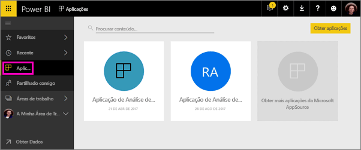

Muitas vezes, os utilizadores empresariais precisam de vários dashboards e relatórios do Power BI para realizarem os seus negócios. As aplicações reúnem as partes, para que os utilizadores não tenham de se lembrar dos nomes e localizações de todos os dashboards. Nas aplicações do Power BI, pode criar coleções de dashboards e relatórios e publicar estas aplicações para toda a organização ou para pessoas específicas ou grupos. Para si, como criador ou administrador de relatórios, as aplicações facilitam a gestão das permissões em coleções de dashboards.

Os utilizadores empresariais obtêm as suas aplicações de algumas formas diferentes. Se o administrador do Power BI lhe der permissões, pode instalar aplicações automaticamente nas contas do Power BI dos seus colegas de trabalho. Caso contrário, eles podem instalar as aplicações a partir da Microsoft AppSource ou pode enviar-lhes uma ligação direta. Eles podem facilmente encontrar e voltar aos seus conteúdos porque estes se encontram num só local. Obtêm as atualizações automaticamente e pode controlar a frequência de atualização dos dados. Leia mais sobre a [experiência de aplicação para utilizadores empresariais](service-install-use-apps.md).

### Licenças para aplicações
Como criador de aplicações, precisa de uma licença do Power BI Pro. Para os utilizadores da aplicação, existem duas opções para ver a aplicação.

* Opção 1: foi atribuída uma licença do **Power BI Pro** a um utilizador da aplicação. 
* Opção 2: não foi atribuída uma licença do **Power BI Pro** a um utilizador da aplicação, mas a aplicação reside numa capacidade do Power BI Premium. Para mais detalhes, leia [O que é o Power BI Premium?](service-premium.md).

### Pacotes de conteúdos de aplicações e organizacionais
As aplicações são a evolução dos pacotes de conteúdos organizacionais. Se já tiver pacotes de conteúdos organizacionais, estes continuarão a funcionar lado a lado com as aplicações.

Agora que tem uma descrição geral das aplicações, vamos abordar as *áreas de trabalho de aplicações*, onde criar aplicações. 

## Vídeo: aplicações e áreas de trabalho de aplicações
<iframe width="640" height="360" src="https://www.youtube.com/embed/Ey5pyrr7Lk8?showinfo=0" frameborder="0" allowfullscreen></iframe>

## Áreas de trabalho de aplicações
As *Áreas de trabalho de aplicações* são os locais onde pode criar aplicações, por isso terá de criar uma área de trabalho de aplicação em primeiro lugar, antes de criar a aplicação. Se já tiver trabalhado numa área de trabalho de grupo do Power BI, estará familiarizado com as áreas de trabalho de aplicações. São a evolução das áreas de trabalho de grupo – áreas de teste e contentores para o conteúdo na aplicação. 

Pode adicionar colegas a estas áreas de trabalho como membros ou administradores. Todos os membros e administradores da área de trabalho da aplicação têm licenças do Power BI Pro. Na área de trabalho, todos podem colaborar nos dashboards, relatórios e outros artigos que planear publicar para um vasto público ou mesmo para toda a organização. 

Quando os conteúdos estiverem prontos, selecione os dashboards e relatórios que pretende publicar e poderá publicar a aplicação. Pode enviar uma ligação direta para esse vasto público ou pode localizar a aplicação a partir do separador Aplicações, acedendo a **Transferir e explorar mais aplicações da AppSource**. Essas pessoas não conseguem modificar os conteúdos da aplicação, mas podem interagir no serviço Power BI ou numa das aplicações móveis – filtrando, destacando e ordenando os próprios dados. 

## Criar uma área de trabalho de aplicação
[!INCLUDE [powerbi-service-create-app-workspace](./includes/powerbi-service-create-app-workspace.md)]

Está vazia, pelo que, agora pode adicionar conteúdo à mesma. Tenha em atenção que, quando a criar, poderá ter de aguardar uma hora, para a área de trabalho ser propagada para o Office 365. 

Adicionar conteúdo é como adicionar conteúdo a A minha área de trabalho, exceto que as outras pessoas na área de trabalho também a podem ver e trabalhar nela. Uma grande diferença é que, quando tiver concluído, pode publicar o conteúdo como uma aplicação. Enquanto estiver na área de trabalho da aplicação pode carregar ou ligar aos ficheiros ou ligar aos serviços de terceiros, tal como faria na sua própria área de trabalho. Por exemplo:

* [Ligar a serviços](service-connect-to-services.md), como o Microsoft Dynamics CRM, Salesforce ou Google Analytics.
* [Obter dados de ficheiros](service-get-data-from-files.md), como ficheiros do Excel, CSV ou Power BI Desktop (PBIX).

Ao visualizar o conteúdo numa área de trabalho da aplicação, o proprietário é apresentado como o nome da área de trabalho da aplicação.

## Adicionar uma imagem à aplicação (opcional)
Por predefinição, o Power BI cria um círculo ligeiramente colorido para a aplicação, com as iniciais da aplicação. Mas talvez o queira personalizar com uma imagem. Para adicionar uma imagem, precisa de uma licença do Exchange Online.

1. Selecione **Áreas de trabalho**, selecione as reticências (…) junto ao nome da área de trabalho e, em seguida, **Membros**. 
   
     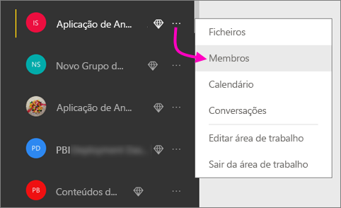
   
    A conta do Office 365 Outlook para a área de trabalho é aberta numa nova janela do browser.
2. Quando paira o rato sobre o círculo colorido no canto superior esquerdo, transforma-se num ícone de lápis. Selecione-o.
   
     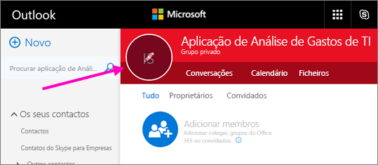
3. Selecione novamente o ícone de lápis e localize a imagem que pretende utilizar.
   
     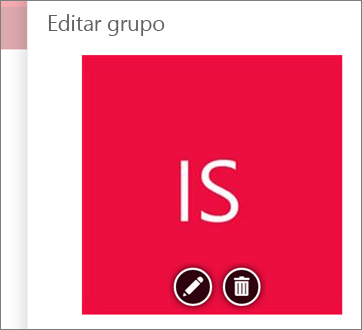
4. Selecione **Guardar**.
   
     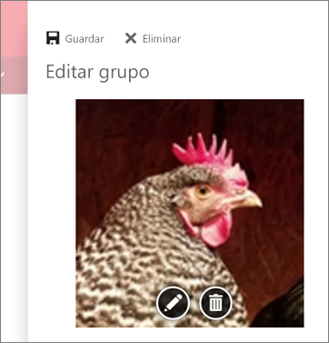
   
    A imagem substitui o círculo colorido na janela do Office 365 Outlook. 
   
     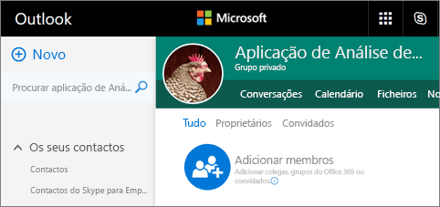
   
    Em alguns minutos, irá ser também apresentada na aplicação do Power BI.
   
     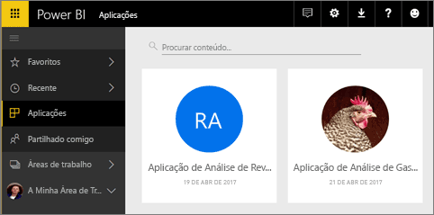

## Publicar a aplicação
Quando os dashboards e relatórios da área de trabalho da aplicação estiverem prontos, publique-os como uma aplicação. Lembre-se de que não tem de publicar todos os relatórios e dashboards da área de trabalho. Pode publicar apenas aqueles que estão prontos.

1. Na vista de lista da área de trabalho, tem de decidir quais os dashboards e relatórios que pretende incluir na aplicação.

     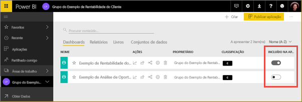

     Se optar por não publicar um relatório, verá um aviso junto ao relatório e dashboard relacionado. Pode publicar a aplicação, mas o dashboard relacionado não terá os mosaicos desse relatório.

     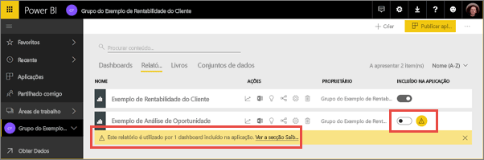

2. Selecione o botão **Publicar aplicação** no canto superior direito para iniciar o processo de partilhar todo o conteúdo dessa área de trabalho.
   
     

3. Em **Detalhes**, preencha a descrição para ajudar as pessoas a encontrarem a aplicação. Pode definir uma cor de fundo para personalizá-la.
   
     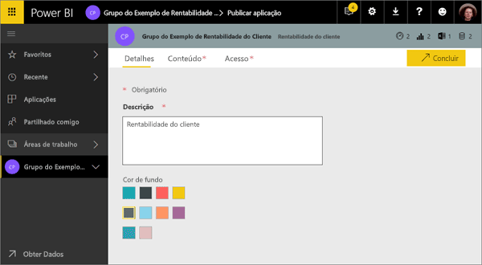

4. Em **Conteúdo**, veja o conteúdo que vai ser publicado como parte da aplicação – tudo o que selecionou na área de trabalho. Também pode definir a página de destino da aplicação – o dashboard ou relatório que as pessoas irão ver primeiro quando entrarem na sua aplicação. Pode escolher **Nenhum**. As pessoas serão então direcionadas para uma lista de todos os conteúdos da aplicação. 
   
     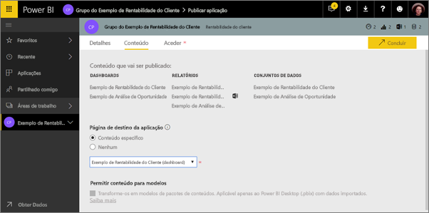

5. Em **Acesso**, decida quem tem acesso à aplicação: todas as pessoas na sua organização, pessoas específicas ou grupos de segurança do Active Directory. Se tiver permissões, pode optar por instalar a aplicação automaticamente para os destinatários. Pode ativar esta definição no [Portal de Administração do Power BI](#how-to-enable-pushing-apps). Pode saber mais considerações sobre [enviar uma aplicação por push](#how-to-enable-pushing-apps).

    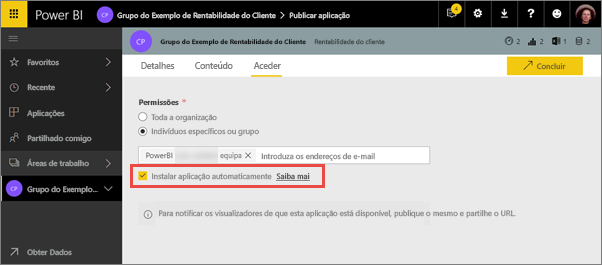

6. Quando selecionar **Concluir**, verá uma mensagem a confirmar que está pronto para publicar. Na caixa de diálogo de êxito, pode copiar o URL, que é uma ligação direta para esta aplicação, e enviá-lo às pessoas com as quais partilhou a aplicação.
   
     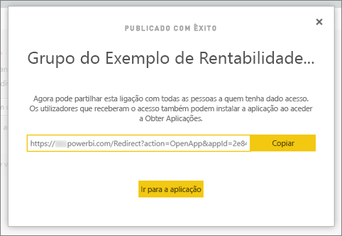

Os utilizadores empresariais que tenham publicado a aplicação podem localizá-la de algumas formas diferentes. Se conseguir instalar a aplicação automaticamente, ela será apresentada em Aplicações na conta do Power BI dos utilizadores. Pode enviar-lhes a ligação direta para a aplicação ou podem procurá-la no Microsoft AppSource, onde veem todas as aplicações a que podem aceder. Independentemente da forma como foi obtida, depois disso, sempre que acederem a Aplicações, verão esta aplicação na lista.

Leia mais sobre a [experiência de aplicação para utilizadores empresariais](service-install-use-apps.md).

## Alterar a aplicação publicada
Depois de publicar a aplicação, poderá querer alterá-la ou atualizá-la. É fácil atualizá-la se for um administrador ou membro da área de trabalho da aplicação. 

1. Abra a área de trabalho de aplicação que corresponde à aplicação. 
   
     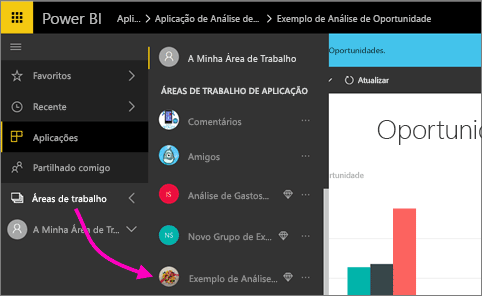
2. Abra o dashboard ou relatório. Pode constatar que pode efetuar todas as alterações que desejar.
   
     A área de trabalho da aplicação é a área de teste, pelo que as suas alterações não são enviadas por push em direto para a aplicação até a publicar novamente. Isto permite-lhe efetuar alterações sem afetar as aplicações publicadas.  
 
3. Volte à lista de conteúdos da área de trabalho da aplicação e selecione **Atualizar aplicação**.
   
     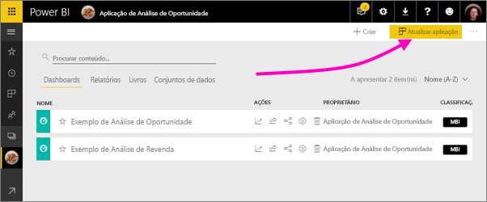

4. Atualize os **Detalhes**, o **Conteúdo**, e o **Acesso**, se necessário, e selecione **Atualizar aplicação**.
   
     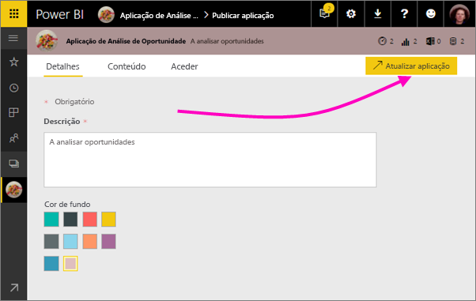

As pessoas com as quais partilhou a aplicação veem automaticamente a versão atualizada da aplicação. 

# Instalar automaticamente as aplicações para os utilizadores finais
Pode instalar automaticamente as aplicações para os utilizadores finais, tornando mais fácil distribuir as aplicações certas para as pessoas ou grupos certos.

As aplicações fornecem dados que os seus utilizadores finais precisam para realizarem as suas tarefas. Agora pode instalar automaticamente estas aplicações na Lista de conteúdos da aplicação em vez de procurá-las no Microsoft AppSource ou seguir uma ligação de instalação. Esta ação torna mais simples implementar conteúdo padrão do Power BI para os seus utilizadores.

## Como instalar uma aplicação automaticamente para os utilizadores finais
Assim que o administrador tiver ativado a funcionalidade, os fabricantes da aplicação têm uma nova opção disponível para **instalar a aplicação automaticamente**. Quando a caixa está ***Selecionada*** e o fabricante da aplicação seleciona **Concluir** (ou **Atualizar aplicação**, para aplicações existentes), a aplicação será enviada por push para todos os utilizadores ou grupos definidos na secção **Permissões** da aplicação no separador **Acesso**.

## Como é que os utilizadores obtêm as aplicações que lhes foram enviadas por push
Após enviar uma aplicação por push, esta é apresentada automaticamente na lista Aplicações. Pode organizar as aplicações que um utilizador ou um cargo na sua organização precisa de ter ao seu alcance.

### Considerações para instalar automaticamente as aplicações
Seguem-se alguns aspetos a ter em atenção quando enviar aplicações por push para utilizadores finais:

* Instalar uma aplicação automaticamente para os utilizadores pode demorar algum tempo. A maioria das aplicações será instalada automaticamente, mas as aplicações push podem demorar algum tempo.  Depende do número de itens na aplicação e do número de pessoas com acesso. Recomendamos que envie aplicações por push fora do horário de expediente e com bastante tempo de antecedência antes que os utilizadores precisem delas. Confirme com vários utilizadores antes de enviar comunicação abrangente sobre a disponibilidade das aplicações.

* Atualize o seu browser. Antes de ver a aplicação enviada por push na lista Aplicações, o utilizador poderá ter de atualizar ou fechar e abrir novamente o browser.

* Se o utilizador não vir imediatamente a aplicação na lista Aplicações, deve atualizar ou fechar e abrir novamente o seu browser.

* Tente não sobrecarregar os utilizadores. Tenha cuidado e não envie demasiadas aplicações por push para que os seus utilizadores compreendam que as aplicações pré-instaladas são úteis. É recomendável controlar quem pode enviar aplicações por push para os utilizadores finais para coordenar os horários. Pode estabelecer um ponto de contacto para enviar aplicações por push para os utilizadores finais na sua organização.

* Os utilizadores convidados que não tenham aceite um convite não recebem as aplicações automaticamente instaladas.  

## Anular publicação de uma aplicação
Qualquer membro da área de trabalho da aplicação pode anular a publicação da aplicação.

* Na área de trabalho da aplicação, selecione as reticências (**...** ) no canto superior direito > **Anular aplicação**.
  
     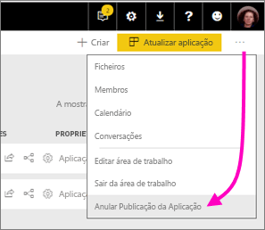

Esta ação desinstala a aplicação de todas as pessoas para as quais a publicou e já não terão acesso à mesma. Não elimina a área de trabalho da aplicação nem os respetivos conteúdos.

## Perguntas frequentes sobre as aplicações do Power BI
### Em que divergem as áreas de trabalho de aplicações das áreas de trabalho de grupo?
Nesta versão, mudámos o nome de todas as áreas de trabalho de grupo para áreas de trabalho de aplicação. Pode publicar uma aplicação a partir de qualquer uma destas áreas de trabalho. A funcionalidade permanece igual à de áreas de trabalho de grupo, na maior parte. Nos próximos meses, planeamos as seguintes melhorias para as áreas de trabalho de aplicações: 

* A criação de áreas de trabalho de aplicações não irá criar entidades correspondentes no Office 365, como nas áreas de trabalho de grupo. Portanto, pode criar qualquer número de áreas de trabalho da aplicações sem se preocupar com a criação de grupos do Office 365 em segundo plano (pode continuar a utilizar o OneDrive para Empresas de um grupo do Office 365 para armazenar os ficheiros). 
* Atualmente, só pode adicionar indivíduos aos membros da lista de administradores. Em breve, poderá adicionar vários grupos de segurança do Active Directory ou grupos modernos a estas listas, para uma gestão mais fácil.  

### Quais são as diferenças entre as aplicações e os pacotes de conteúdos organizacionais?
As aplicações são uma evolução e simplificação dos pacotes de conteúdos, com algumas diferenças principais. 

* Depois de os utilizadores empresariais instalarem um pacote de conteúdos, este perde a respetiva identidade agrupada: é apenas uma lista de dashboards e relatórios misturados com outros dashboards e relatórios. As aplicações, por outro lado, mantêm o respetivo agrupamento e identidade, mesmo após a instalação. Isto torna mais fácil aos utilizadores empresariais continuarem a navegar nelas ao longo do tempo.
* Pode criar vários pacotes de conteúdos a partir de qualquer área de trabalho, mas uma aplicação tem uma relação de 1:1 com a respetiva área de trabalho. Acreditamos que isto faz com que as aplicações sejam mais fáceis de compreender e manter ao longo do tempo. Consulte a secção de planos do blogue do Power BI para obter mais informações sobre como estamos a planear melhorar esta área. 
* Ao longo do tempo, planeamos preterir pacotes de conteúdos organizacionais, pelo que recomendamos que crie aplicações a partir de agora.  

### E os membros só de leitura em grupos?
Nos grupos, pode adicionar membros só de leitura que só podem ver o conteúdo. O problema principal desta abordagem era que não podia adicionar grupos de segurança como membros. 

Nas aplicações, pode publicar uma versão só de leitura da sua área de trabalho da aplicação destinada ao grande público, incluindo grupos de segurança. Pode testar as suas alterações dos dashboards e relatórios na aplicação, sem afetar os utilizadores finais. Recomendamos a utilização de aplicações desta forma no futuro. A longo prazo, planeamos preterir também os membros só de leitura de áreas de trabalho.  

## Passos seguintes
* [Instalar e utilizar aplicações no Power BI](service-install-use-apps.md)
* [Aplicações do Power BI para serviços externos](service-connect-to-services.md)
* [Portal de Administração do Power BI](https://docs.microsoft.com/en-us/power-bi/service-admin-portal)
* Perguntas? [Experimente perguntar à Comunidade do Power BI](http://community.powerbi.com/)
