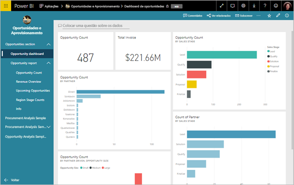
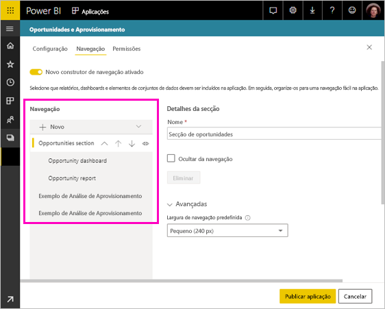
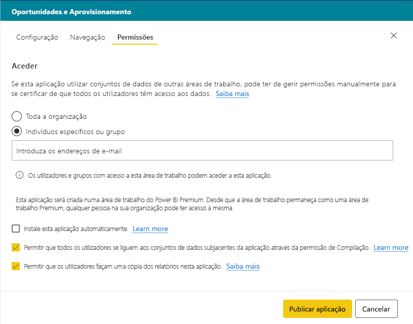
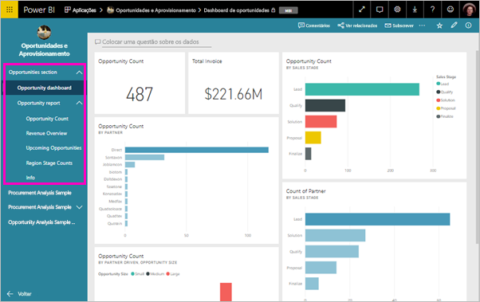

# Publicar uma aplicação no Power BI

No Power BI, pode criar oficial empacotado conteúdo, em seguida, distribuí-la para um público amplo como um *aplicação*. Crie aplicações nas *áreas de trabalho de aplicações*, onde pode colaborar em conteúdos do Power BI com os seus colegas. Em seguida, pode publicar aplicações concluídas em grandes grupos de pessoas na sua organização. 

Muitas vezes, os utilizadores empresariais precisam de vários dashboards e relatórios do Power BI para realizarem os seus negócios. Nas aplicações do Power BI, pode criar coleções de dashboards e relatórios e publicar estas aplicações para toda a organização ou para pessoas específicas ou grupos. Enquanto criador ou administrador de relatórios, as aplicações facilitam a gestão de permissões nestas coleções.

Os utilizadores empresariais obtêm as aplicações de algumas formas diferentes:

- Eles possam localizar e instalar a aplicação do Microsoft AppSource
- Pode enviar-lhes uma ligação direta.
- Pode instalar aplicações automaticamente nas contas do Power BI dos seus colegas de trabalho, se o administrador do Power BI lhe der permissão.

Pode criar a aplicação com a sua própria navegação incorporada, para que os utilizadores podem facilmente encontrar sua maneira em torno de seu conteúdo. Não podem modificar o conteúdo da aplicação. Eles podem interagir com ele no serviço Power BI ou uma das aplicações móveis- – filtragem, destacando e ordenando os próprios dados. Obtêm as atualizações automaticamente e pode controlar a frequência de atualização dos dados. Leia mais sobre a [experiência de aplicação para utilizadores empresariais](consumer/end-user-apps.md).

## Licenças para aplicações
Para criar ou atualizar uma aplicação, terá de uma licença do Power BI Pro. Para a aplicação *consumidores*, existem duas opções.

* Opção 1: todos os utilizadores empresariais precisam de licenças do **Power BI Pro** para ver a aplicação. 
* Opção 2: Se a sua área de trabalho de aplicação reside na capacidade do Power BI Premium, os utilizadores gratuitos na sua organização podem ver o conteúdo da aplicação. Para mais detalhes, leia [O que é o Power BI Premium?](service-premium.md).

## Publicar a aplicação
Quando os dashboards e relatórios na sua área de trabalho estiverem prontos, pode escolher quais pretende publicar e publicá-los como uma aplicação. 

1. Na vista de lista de área de trabalho, decidir quais os dashboards e relatórios que pretende **incluído na aplicação**.

     

     Se optar por não incluir um relatório que tenha um dashboard relacionado, verá um aviso junto ao relatório. Pode publicar a aplicação, mas o dashboard relacionado não terá os mosaicos desse relatório.

     

2. Selecione o **publicar aplicação** botão no canto superior direito para iniciar o processo de criar e publicar uma aplicação a partir da área de trabalho.
   
     

3. No **configuração**, preencha o nome e descrição para ajudar as pessoas a encontrarem a aplicação. Pode definir a cor do tema para personalizá-la. Também pode adicionar uma ligação a um site de suporte.
   
     

4. No **navegação**, selecione o conteúdo a ser publicado como parte da aplicação. Em seguida, adicionar a navegação de aplicação, para organizar o conteúdo nas secções. Ver [conceber a experiência de navegação para a sua aplicação](#design-the-navigation-experience-for-your-app) neste artigo para obter detalhes.
   
     

5. No **acesso**, decida quem tem acesso à aplicação. 
    - Na [áreas de trabalho clássicas](service-create-workspaces.md): todas as pessoas na sua organização, pessoas específicas ou grupos de segurança do Azure Active Directory (AAD).
    - Na [novas áreas de trabalho de experiência](service-create-the-new-workspaces.md): pessoas específicas, grupos de segurança do AAD e listas de distribuição e grupos do Office 365.

6. Se tiver permissões, pode instalar a aplicação automaticamente para os destinatários. Um administrador do Power BI pode ativar esta definição no Portal de Administração do Power BI. Leia mais sobre [instalar automaticamente uma aplicação](#automatically-install-apps-for-end-users) neste artigo.

     

7. Quando seleciona **publicar aplicação**, verá uma mensagem a confirmar que está pronto para publicar. Na **partilhar esta aplicação** caixa de diálogo, pode copiar o URL que é uma ligação direta para esta aplicação.
   
     

Pode enviar que a ligação direta para as pessoas que tenha partilhado com, ou é possível localizar a sua aplicação no separador aplicações, acedendo a **transferir e explorar mais aplicações do AppSource**. Leia mais sobre a [experiência de aplicação para utilizadores empresariais](consumer/end-user-apps.md).

## Alterar a aplicação publicada
Depois de publicar a aplicação, poderá querer alterá-la ou atualizá-la. É fácil atualizá-la, se for um administrador ou membro na área de trabalho de aplicação nova. 

1. Abra a área de trabalho de aplicação que corresponde à aplicação. 
   
     

2. Faça as alterações que pretende que os dashboards ou relatórios.
 
     A área de trabalho da aplicação é a área de teste, pelo que as suas alterações não são apresentadas em direto na aplicação até a publicar novamente. Isto permite-lhe efetuar alterações sem afetar as aplicações publicadas.  
 
    > [!IMPORTANT]
    > Se remover um relatório e atualizar a aplicação, mesmo que adicione o relatório ao aplicativo, os consumidores da sua aplicação perdem todas as personalizações, como marcadores, comentários, etc.  
 
3. Volte à lista de área de trabalho de aplicações do conteúdo e selecione **atualizar aplicação** no canto superior direito.
   
1. Atualização **programa de configuração**, **navegação**, e **permissões**, se necessário, em seguida, selecione **atualizar aplicação**.
   
As pessoas com as quais partilhou a aplicação veem automaticamente a versão atualizada da aplicação. 

## Conceber a experiência de navegação para a sua aplicação
O **novo construtor de navegação** opção permite-lhe criar uma navegação personalizada para a sua aplicação. Painel de navegação personalizada torna mais fácil para os seus utilizadores a localizar e usar o conteúdo na aplicação. As aplicações existentes têm esta opção desativada e o novo padrão de aplicações para a opção a ser no.

Quando a opção estiver desativada, pode selecionar o **página de destino da aplicação** ser **conteúdo específico**, por exemplo um dashboard ou relatório ou selecione **None** para mostrar uma lista básica de conteúdo para o usuário.

Quando liga **novo construtor de navegação**, é possível projetar uma navegação personalizada. Por predefinição são listados todos os relatórios, dashboards e livros do Excel incluídos na sua aplicação como uma lista simples. 

Pode personalizar ainda mais a navegação de aplicação por:
* Reordenar os itens com a cópia de segurança / para baixo setas. 
* Mudar o nome de itens a **reportar detalhes**, **detalhes de Dashboard**, e **detalhes do livro**.
* Ocultar determinados itens no painel de navegação.
* Utilizar o **New** opção para adicionar **secções** ao grupo de conteúdos relacionados.
* Utilizar o **New** opção para adicionar um **ligação** a um recurso externo para o painel de navegação esquerdo. 

Quando adiciona um **link**, na **ligam detalhes** pode escolher em que o link é aberto. Por predefinição as ligações abertas na **separador atual**, mas pode selecionar **novo separador**, ou **área de conteúdo**. 

### Considerações sobre como utilizar a nova opção de construtor de navegação
Seguem-se geral aspetos a ter em conta ao utilizar o novo construtor de navegação:
* Páginas de relatório são apresentadas na área de navegação de aplicação como uma seção expansível
* Se desativar o novo construtor de navegação e, em seguida, publicar ou atualizar a sua aplicação, perderá as personalizações efetuadas. Por exemplo, são perdidos todas as secções, ordenação de mensagens em fila, links e nomes personalizados para itens de navegação.

Ao adicionar links para a navegação de aplicação e selecionar a opção de área de conteúdo:
* Certifique-se de que a ligação pode ser incorporada. Alguns serviços bloqueiam a incorporação do seu conteúdo em sites de terceiros, como o Power BI.
* Incorporar conteúdo do serviço Power BI, como relatórios ou dashboards em outras áreas de trabalho não é suportada. 
* Incorpore o Power BI Report Server conteúdo através da respetivo nativo incorporar conteúdo do URL de uma implementação de locais no. Utilize os passos em [criando o URL do servidor de relatório do Power BI](https://docs.microsoft.com/power-bi/report-server/quickstart-embed#creating-the-power-bi-report-server-report-url) para obter o URL. Tenha em atenção que se aplicam a regras de autenticação normal, para que visualizar o conteúdo requer uma ligação de VPN para o servidor no local. 
* É apresentado um aviso de segurança, na parte superior do conteúdo incorporado, para indicar que o conteúdo não está no Power BI.

## Instalar automaticamente as aplicações para os utilizadores finais
Se um administrador dá-lhe as permissões, pode instalar aplicações automaticamente, *enviar* -los aos utilizadores finais. Esta funcionalidade de push torna mais fácil distribuir as aplicações certas para as pessoas ou grupos certos. A aplicação é apresentada automaticamente na lista de conteúdo de aplicações dos utilizadores finais. Não precisam se encontrá-lo a partir do Microsoft AppSource ou seguir uma ligação de instalação. Veja como ativar a admins [enviar aplicações por push aos utilizadores finais](service-admin-portal.md#push-apps-to-end-users) o artigo portal de administração do Power BI.

### Como enviar uma aplicação automaticamente para os utilizadores finais
Após o administrador lhe ter atribuído permissões, tem uma nova opção para **instalar a aplicação automaticamente**. Quando a caixa de verificação e selecionar **publicar aplicação** (ou **aplicação de atualização**), a aplicação é enviada por push para todos os utilizadores ou grupos definidos no **permissões** secção da aplicação no **Acesso** separador.

### Como os utilizadores obtêm as aplicações que push aos mesmos
Depois de enviar uma aplicação, esta é apresentada na lista de aplicações automaticamente. Dessa forma, pode organizar as aplicações que utilizadores específicos ou funções de trabalho na sua organização necessitam para ter ao seu alcance.

### Considerações para instalar automaticamente as aplicações
Seguem-se alguns aspetos a ter em atenção quando enviar aplicações por push para utilizadores finais:

* Instalar uma aplicação automaticamente para os utilizadores pode demorar algum tempo. A maioria das aplicações, instalação imediatamente para os utilizadores, mas aplicações push pode demorar algum tempo.  Depende do número de itens na aplicação e do número de pessoas com acesso. Recomendamos que envie aplicações por push fora do horário de expediente e com bastante tempo de antecedência antes que os utilizadores precisem delas. Confirme com vários utilizadores antes de enviar comunicação abrangente sobre a disponibilidade das aplicações.

* Atualize o browser. Antes de ver a aplicação enviada por push na lista Aplicações, o utilizador poderá ter de atualizar ou fechar e abrir novamente o browser.

* Se os utilizadores não a vir imediatamente a aplicação na lista de aplicações, eles devem atualizar ou fechar e abrir novamente o browser.

* Tente não sobrecarregar os utilizadores. Tenha cuidado e não envie demasiadas aplicações por push para que os seus utilizadores compreendam que as aplicações pré-instaladas são úteis. É recomendável controlar quem pode enviar aplicações por push para os utilizadores finais para coordenar os horários. Estabelece um ponto de contacto para obtenção de aplicações na sua organização enviada por push para utilizadores finais.

* Utilizadores convidados que ainda não aceitaram o convite não obtém aplicações automaticamente instaladas.  

## Anular publicação de uma aplicação
Qualquer membro da área de trabalho da aplicação pode anular a publicação da aplicação.

>[!IMPORTANT]
>Quando anular a publicação de uma aplicação, os utilizadores da aplicação perdem as suas personalizações. Eles perderem-se ao pessoas marcadores, comentários ou subscrições associadas com conteúdo na aplicação. Apenas anule a publicação de uma aplicação se precisar de a remover.
> 
> 

* Na área de trabalho da aplicação, selecione as reticências ( **...** ) no canto superior direito > **Anular aplicação**.
  
     

Esta ação desinstala a aplicação de todas as pessoas para as quais a publicou e já não terão acesso à mesma. Não elimina a área de trabalho da aplicação nem os respetivos conteúdos.

## Ver a sua aplicação publicada

Quando os consumidores da sua aplicação abra a sua aplicação, verão a navegação que criou, em vez do painel de navegação esquerdo padrão do Power BI. A navegação de aplicação lista os relatórios e dashboards nas secções que definiu. Ele também lista as páginas individuais de cada relatório, em vez disso, que só o nome do relatório.

## Próximos passos
* [Create an app workspace](service-create-workspaces.md) (Criar uma área de trabalho de aplicação)
* [Instalar e utilizar aplicações no Power BI](consumer/end-user-apps.md)
* [Aplicações do Power BI para serviços externos](service-connect-to-services.md)
* [Portal de Administração do Power BI](https://docs.microsoft.com/power-bi/service-admin-portal)
* Perguntas? [Experimente perguntar à Comunidade do Power BI](http://community.powerbi.com/)
