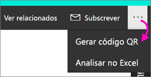
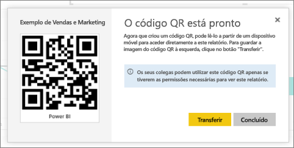

# Criar um código QR para um relatório no Power BI a utilizar nas aplicações móveis
Os códigos QR no Power BI podem ligar qualquer item do mundo real diretamente às informações do BI relacionadas; não é necessária navegação ou pesquisa.

É possível criar um código QR no serviço Power BI, mesmo para um relatório que não possa editar. Em seguida, coloque o código QR num local estratégico. Por exemplo, pode colá-lo num e-mail ou imprimir e colá-lo numa localização específica. 

Os colegas com quem partilhou o relatório podem [digitalizar o código QR para aceder ao relatório diretamente no respetivo dispositivo móvel](consumer/mobile/mobile-apps-qr-code.md). Podem utilizar o scanner de código QR localizado na aplicação do Power BI ou qualquer outro scanner QR instalado no dispositivo. Também podem [ler um código QR do relatório com a aplicação Power BI for Mixed Reality](consumer/mobile/mobile-mixed-reality-app.md#scan-a-report-qr-code-in-holographic-view).

## Criar um código QR para um relatório
1. Abra um relatório no serviço Power BI.
2. Selecione as reticências (...) no canto superior direito e selecione **Gerar código QR**. 
   
    
3. Será apresentada uma caixa de diálogo com o código QR. 
   
    
4. Aqui, pode digitalizar o código QR ou transferir e guardá-lo para: 
   
   * Adicioná-lo a um e-mail ou a outro documento ou 
   * Imprimi-lo e colocá-lo numa localização específica. 

## Imprimir o código QR
O Power BI gera o código QR como um ficheiro JPG pronto para impressão. 

1. Selecione **Transferir** e abra o ficheiro JPG num computador ligado a uma impressora.  
   
   O ficheiro JPG tem o mesmo nome do mosaico. Por exemplo, "Exemplo de Vendas e Marketing.jpg".
   
1. Imprima o ficheiro em 100% ou "tamanho real".  
2. Corte o código QR pelas margens e cole-o num local relevante para o relatório. 

## Próximos passos
* [Ligar a dados do Power BI do mundo real](consumer/mobile/mobile-apps-data-in-real-world-context.md) com as aplicações móveis
* [Digitalizar um código QR do Power BI a partir do seu dispositivo móvel](consumer/mobile/mobile-apps-qr-code.md)
* [Criar um código QR para um mosaico](service-create-qr-code-for-tile.md)
* Perguntas? [Experimente perguntar à Comunidade do Power BI](http://community.powerbi.com/)

