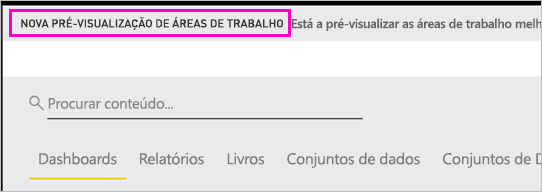
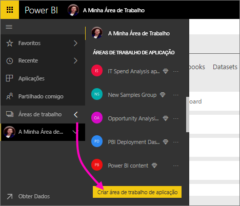
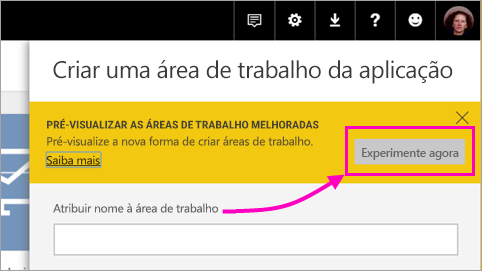
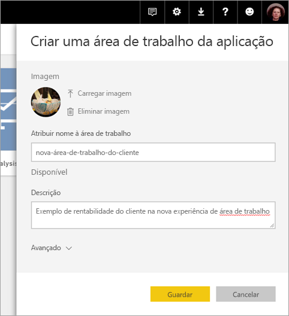
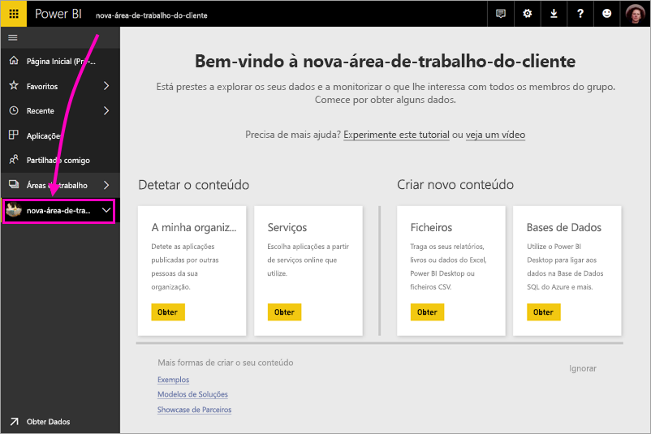
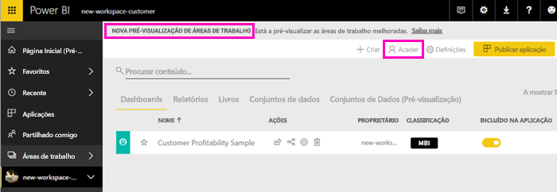
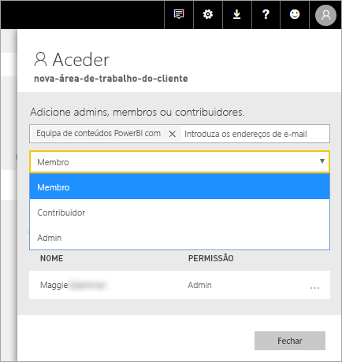
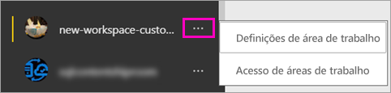

# Criar as novas áreas de trabalho (pré-visualização) no Power BI

O Power BI está a apresentar uma nova experiência de área de trabalho em modo de pré-visualização. As áreas de trabalho são locais fixos para colaborar com colegas de forma a criar coleções de dashboards e relatórios, que pode agrupar em *aplicações* e distribuir por toda a sua organização ou por pessoas ou grupos específicos. 

Com a pré-visualização das novas áreas de trabalho, pode:

- Atribuir funções de área de trabalho a grupos de utilizadores: grupos de segurança, listas de distribuição, grupos do Office 365 e utilizadores individuais.
- Criar uma área de trabalho no Power BI sem criar um grupo do Office 365.
- Utilizar funções de áreas de trabalho mais avançadas para uma gestão de permissões mais flexível numa área de trabalho.
 
Ao criar uma das novas áreas de trabalho, não está a criar um grupo do Office 365 subjacente associado. Todas as tarefas de administração da área de trabalho são efetuadas no Power BI, não no Office 365. Ainda pode adicionar um grupo do Office 365 à área de trabalho para continuar a gerir o acesso dos utilizadores aos conteúdos através de grupos do Office 365. No entanto, também pode utilizar grupos de segurança, listas de distribuição e adicionar utilizadores individuais diretamente no Power BI, o que lhe permite gerir de forma flexível o acesso à área de trabalho

Pode adicionar grupos de utilizadores ou utilizadores individuais às novas áreas de trabalho como membros, contribuidores ou administradores. Todas as pessoas num grupo de utilizadores obtêm a função que definiu. Se um utilizador estiver em múltiplos grupos de utilizadores, este recebe o nível de permissão mais elevado concedido pela função.  Veja [Funções nas novas áreas de trabalho](#roles-in-the-new-workspaces) mais adiante neste artigo para obter uma explicação sobre as diferentes funções.

Todas as pessoas que adicionar à área de trabalho de uma aplicação precisam de ter uma licença do Power BI Pro. Na área de trabalho, estes utilizadores podem colaborar nos dashboards e relatórios que planear publicar para um vasto público ou mesmo para toda a organização. Se quiser distribuir conteúdos para outras pessoas na sua organização, pode atribuir licenças do Power BI Pro a esses utilizadores ou colocar a área de trabalho numa Capacidade do Power BI Premium.
Como esta é uma funcionalidade de pré-visualização, existem algumas limitações que deve conhecer. Veja <section link> mais adiante neste artigo para obter uma explicação sobre as limitações atuais. Com as novas áreas de trabalho, estamos a reestruturar algumas funcionalidades. Veja <section link> mais adiante neste artigo para obter uma explicação sobre as alterações que podem ser permanentes na pré-visualização.

## Implementar novas áreas de trabalho de aplicação

Durante o período de pré-visualização, as antigas e novas áreas de trabalho podem coexistir lado a lado e pode criar qualquer uma delas. Quando a pré-visualização das novas áreas de trabalho terminar e estas estiverem disponíveis para o público, as áreas de trabalho antigas podem continuar a existir durante algum tempo. Não poderá criá-las e terá de se preparar para migrar as suas áreas de trabalho para a nova infraestrutura de áreas de trabalho. Não se preocupe, terá vários meses para concluir a migração.

## Criar uma das novas áreas de trabalho de aplicação

1. Comece por criar a área de trabalho de aplicação. Selecione **Áreas de Trabalho** > **Criar área de trabalho de aplicação**.
   
     

2. Em **Pré-visualizar as áreas de trabalho melhoradas**, selecione **Experimente agora**.
   
     

2. Atribua um nome à área de trabalho. Se o nome não estiver disponível, edite-o para criar um ID exclusivo.
   
     A aplicação terá o mesmo nome que a área de trabalho.
   
1. Adicione uma imagem, se quiser. O tamanho do ficheiro tem de ser inferior a 45 KB.
 
    

1. Selecione **Guardar**.

    No **Ecrã de boas-vindas** da sua nova área de trabalho, pode adicionar dados. 

    

1. Por exemplo, selecione **Exemplos** > **Exemplo de Rentabilidade do Cliente**.

    Agora na lista de conteúdos da área de trabalho, pode ver a **Nova pré-visualização de áreas de trabalho**. Como é um administrador, também vê uma nova ação, **Aceder**.

    

1. Selecione **Aceder**.

1. Adicione grupos de segurança, listas de distribuição, grupos do Office 365 ou utilizadores individuais a estas áreas de trabalho como membros, contribuidores ou administradores. Veja [Funções nas novas áreas de trabalho](#roles-in-the-new-workspaces) mais adiante neste artigo para obter uma explicação sobre as diferentes funções.

    

9. Selecione **Adicionar** > **Fechar**.

1. O Power BI cria a área de trabalho e abre-a. É apresentada na lista de áreas de trabalho das quais é membro. Visto que é um administrador, pode selecionar as reticências (…) para voltar atrás e fazer alterações a definições da área de trabalho, adicionar novos membros ou alterar as respetivas permissões.

     

## Adicionar conteúdos à área de trabalho da sua aplicação

Depois de criar uma área de trabalho de aplicação com o novo estilo, é altura de adicionar conteúdos à mesma. A adição de conteúdos é semelhante nas antigas e novas experiências de área de trabalho, com uma exceção. Embora possa carregar ou ligar-se a ficheiros em ambas as áreas de trabalho de aplicação, tal como em A Minha Área de Trabalho. Nas novas áreas de trabalho não se pode ligar a pacotes de conteúdos organizacionais ou de terceiros, como o Microsoft Dynamics CRM, o Salesforce ou o Google Analytics. Nas áreas de trabalho atuais, pode ligar-se a pacotes de conteúdos.

Ao visualizar os conteúdos na lista de conteúdos de uma área de trabalho de aplicação, o nome da área de trabalho de aplicação é indicado como sendo o do proprietário.

### Ligar-se a serviços de terceiros em novas áreas de trabalho (pré-visualização)

Na nova experiência de áreas de trabalho, estamos a fazer uma alteração ao foco nas aplicações. As aplicações para serviços de terceiros tornam mais fácil para os utilizadores obterem dados de serviços que utilizam, como o Microsoft Dynamics CRM, o Salesforce ou o Google Analytics.
As aplicações organizacionais fornecem aos seus utilizadores os dados internos de que precisam. Planeamos adicionar funcionalidades às aplicações organizacionais para que os utilizadores possam personalizar os conteúdos que encontram nas aplicações. Estas irão eliminar a necessidade de pacotes de conteúdos. 

Com a nova pré-visualização de áreas de trabalho, não pode criar ou consumir pacotes de conteúdos organizacionais. Em alternativa, pode utilizar as aplicações fornecidas para se ligar a serviços de terceiros ou pedir às suas equipas internas que forneçam aplicações para os pacotes de conteúdos que esteja a utilizar. 

## Funções nas novas áreas de trabalho

As funções permitem-lhe gerir as ações de cada utilizador numa área de trabalho, para que as equipas possam colaborar. As novas áreas de trabalho permitem-lhe atribuir funções a utilizadores individuais e a grupos de utilizadores: grupos de segurança, grupos do Office 365 e listas de distribuição. 

Quando atribui funções a um grupo de utilizadores, os utilizadores nesse grupo têm acesso aos conteúdos. Se aninhar grupos de utilizadores, todos os utilizadores incluídos nos mesmos têm permissão. Um utilizador que esteja em vários grupos de utilizadores com diferentes funções obtém o nível mais elevado de permissão concedida. 

As novas áreas de trabalho dispõem de três funções: administradores, membros e contribuidores.

**Os administradores podem:**

- Atualizar e eliminar a área de trabalho. 
- Adicionar/remover pessoas, incluindo outros administradores.
- Fazer tudo o que os membros podem fazer.

**Os membros podem:** 

- Adicionar membros ou outras pessoas com permissões mais baixas.
- Publicar e atualizar aplicações.
- Partilhar itens e aplicações.
- Permitir que outras pessoas voltem a partilhar itens.
- Fazer tudo o que os contribuidores podem fazer.

**Os contribuidores podem:** 

- Criar, editar e eliminar conteúdos na área de trabalho. 
- Publicar relatórios na área de trabalho, eliminar conteúdos.
- Não podem conceder acesso aos conteúdos a novas pessoas, não podem partilhar novos conteúdos, mas podem partilhar com alguém com quem já partilha a área de trabalho, o item ou a aplicação. 
- Não podem modificar os membros do grupo.
 
Estamos a criar fluxos de trabalho Pedir Acesso no serviço para que os utilizadores que não têm acesso possam pedi-lo. Os fluxos de trabalho Pedir Acesso estão atualmente disponíveis para dashboards, relatórios e aplicações.

## Distribuir uma aplicação

Quando os conteúdos estiverem prontos, selecione os dashboards e relatórios que pretende publicar e, em seguida, publique-os como uma *aplicação*. Os seus colegas podem obter as suas aplicações de algumas formas diferentes. Pode instalar aplicações automaticamente nas contas do Power BI dos seus colegas de trabalho, se o administrador do Power BI lhe der permissão. Caso contrário, os utilizadores podem encontrar e instalar as aplicações a partir do Microsoft AppSource ou pode enviar-lhes uma ligação direta. Obtêm as atualizações automaticamente e pode controlar a frequência de atualização dos dados. Veja [Publicar aplicações com dashboards e relatórios no Power BI](service-create-distribute-apps.md) para obter detalhes.

## Converter as áreas de trabalho de aplicação antigas em novas áreas de trabalho de aplicação

Durante o período de pré-visualização, não pode converter automaticamente as suas áreas de trabalho antigas em novas. No entanto, pode criar uma nova área de trabalho de aplicação e publicar os seus conteúdos numa nova localização. 

Quando as novas áreas de trabalho ficarem disponíveis para o público (GA), pode optar ativamente por migrar as áreas de trabalho antigas automaticamente. No futuro, após a experiência ficar disponível para o público, terá de migrar as mesmas.

## Perguntas frequentes sobre as aplicações do Power BI

### Como é que as novas áreas de trabalho de aplicação diferem das áreas de trabalho de aplicação atuais?
* A criação de áreas de trabalho de aplicação não irá criar entidades correspondentes no Office 365, tal como acontece nas áreas de trabalho de aplicação atuais. (Ainda pode adicionar um grupo do Office 365 à sua área de trabalho ao atribuir uma função ao mesmo.) 
* Nas áreas de trabalho de aplicação atuais, só pode adicionar utilizadores individuais à lista de membros e administradores. Nas novas áreas de trabalho de aplicação, pode adicionar múltiplos grupos de segurança do AD, listas de distribuição ou grupos do Office 365 a estas listas para uma gestão de utilizadores mais fácil. 
- Pode criar um pacote de conteúdos organizacionais a partir de uma área de trabalho de aplicação atual. Não pode criar um pacote a partir das novas áreas de trabalho de aplicação.
- Pode utilizar um pacote de conteúdos organizacionais a partir de uma área de trabalho de aplicação atual. Não pode utilizar um pacote a partir das novas áreas de trabalho de aplicação.
- Durante a pré-visualização, algumas funcionalidades ainda não estão ativadas para as novas áreas de trabalho de aplicação. Veja a próxima secção, [Outras funcionalidades previstas na nova área de trabalho](service-create-the-new-workspaces.md#other-planned-new-app-workspace-preview-features), para obter detalhes.

## Funcionalidades de pré-visualização previstas na nova área de trabalho de aplicação

Algumas outras funcionalidades da pré-visualização da nova área de trabalho de aplicação ainda estão a ser desenvolvidas, mas não estão disponíveis no momento do lançamento da pré-visualização:

- O botão **Sair da área de trabalho** não existe.
- As métricas de utilização ainda não são suportadas.
- Como funciona o Premium: pode atribuir e criar áreas de trabalho numa capacidade Premium, mas para mover uma área de trabalho entre capacidades, tem de aceder às definições da mesma.
- A incorporação da peça Web do SharePoint ainda não é suportada.
- O botão **OneDrive** para grupos do Office 365 em Obter Dados/Ficheiros não existe.

## Funcionalidades da área de trabalho de aplicação que funcionam de forma diferente

Algumas funcionalidades funcionam de forma diferente das áreas de trabalho de aplicação atuais nas novas áreas de trabalho de aplicação. Estas diferenças são intencionais, baseadas no feedback que recebemos dos clientes e irão permitir uma abordagem mais flexível à colaboração com as áreas de trabalho:

- Os membros podem ou não podem voltar a partilhar: esta opção foi substituída pela função Contribuidor
- Áreas de trabalho só de leitura: esta opção será substituída pela futura função Visualizador, que permite o acesso só de leitura a conteúdos numa área de trabalho.

## Problemas conhecidos

Os seguintes problemas são conhecidos e as correções estão em desenvolvimento:

- Os utilizadores ou grupos de utilizadores gratuitos que são adicionados como destinatários de subscrições a e-mails podem não receber os e-mails que deviam receber. O problema ocorre quando a nova experiência de áreas de trabalho se encontra numa capacidade Premium, mas A Minha Área de Trabalho do utilizador que está a criar a subscrição não se encontra na capacidade Premium. Se A Minha Área de Trabalho se encontrar numa capacidade Premium, os utilizadores e grupos de utilizadores gratuitos receberão os e-mails.
- Depois de uma área de trabalho ser movida de uma capacidade Premium para uma capacidade partilhada, os utilizadores e grupos de utilizadores gratuitos continuarão, em alguns casos, a receber e-mails que não deveriam receber. O problema ocorre quando A Minha Área de Trabalho do utilizador que está a criar a subscrição se encontra numa capacidade Premium.

## Próximos passos

- [Criar as áreas de trabalho atuais](service-create-workspaces.md)
* [Instalar e utilizar aplicações no Power BI](service-install-use-apps.md)
* Perguntas? [Experimente perguntar à Comunidade do Power BI](http://community.powerbi.com/)
