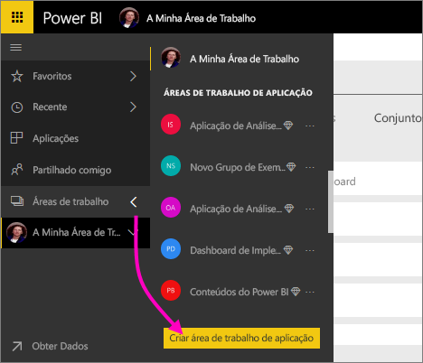
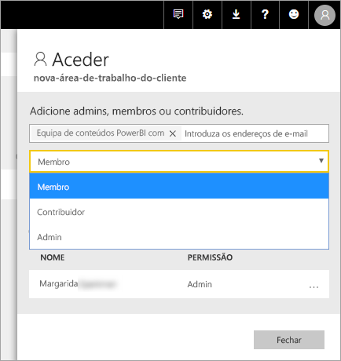

# Criar novas áreas de trabalho no Power BI

Power BI está a introduzir uma nova experiência de área de trabalho. Áreas de trabalho ainda são o local onde pode colaborar com colegas para criar coleções de dashboards, relatórios e os relatórios paginados. Em seguida, pode agrupar essa coleção numa *aplicação* e distribuí-la para toda a organização ou para pessoas específicas ou grupos. 

Eis o que é diferente. As novas áreas de trabalho, pode:

- Atribuir funções de área de trabalho a grupos de utilizadores: grupos de segurança, listas de distribuição, grupos do Office 365 e utilizadores individuais.
- Criar uma área de trabalho no Power BI sem criar um grupo do Office 365.
- Utilizar funções de áreas de trabalho mais avançadas para uma gestão de permissões mais flexível numa área de trabalho.

> [!NOTE]
> Para impor a segurança ao nível da linha (RLS) para utilizadores do Power BI Pro conteúdo numa área de trabalho de navegação, continuar a utilizar [áreas de trabalho clássicas](service-create-workspaces.md). Selecione o **os membros podem visualizar apenas conteúdo do Power BI** opção. Em alternativa, publicar uma aplicação do Power BI para esses utilizadores ou utilizar a partilha de mensagens em fila para distribuir conteúdo. A função de Visualizador de lançamento permitirá que este cenário no futuro em novas áreas de trabalho de experiência de área de trabalho.

Para obter mais informações, veja a [novas áreas de trabalho](service-new-workspaces.md) artigo.

## Criar uma das novas áreas de trabalho de aplicação

1. Comece por criar a área de trabalho de aplicação. Selecione **Áreas de Trabalho** > **Criar área de trabalho de aplicação**.
   
     

2. Automaticamente estiver a criar uma área de trabalho atualizada, a menos que opte por **reverter para a clássica**.
   
     
     
     Se selecionou **reverter para a clássica**, cria uma área de trabalho com base num grupo do Office 365. Utilize esta opção se precisar do **os membros podem visualizar apenas conteúdo do Power BI** opção para impor segurança ao nível da linha (RLS) para os membros da área de trabalho.

2. Atribua um nome à área de trabalho. Se o nome não estiver disponível, edite-o para obter com um nome exclusivo.
   
     A aplicação para a área de trabalho terão o mesmo nome e o ícone como a área de trabalho.
   
1. Aqui estão alguns itens opcionais que pode definir sua área de trabalho:

    Carregar uma **imagem de área de trabalho**. Ficheiros podem ser o formato. png ou. jpg. Tamanho do ficheiro tem de ser inferior a 45 KB.
    
    [Adicionar uma **lista de contacto**](#workspace-contact-list). Por predefinição, os administradores de área de trabalho são os contactos. 
    
    [Especifique um **OneDrive de área de trabalho** ](#workspace-onedrive) ao escrever apenas o nome de um existente grupo do Office 365, não o URL. Agora esta área de trabalho pode utilizar a localização de armazenamento de arquivo desse grupo do Office 365. 

    

    Para atribuir a área de trabalho para um **capacidade dedicado**, na **Premium** separador select **capacidade dedicado**.
     
    

1. Selecione **Guardar**.

    O Power BI cria a área de trabalho e abre-a. Irá vê-la na lista de áreas de trabalho das quais é membro. 

## Lista de contatos da área de trabalho

A nova lista de contactos de área de trabalho permite que especifique quais usuários recebem notificações sobre problemas que ocorrem na área de trabalho. Por predefinição, nenhum usuário ou grupo especificado como uma área de trabalho administração é notificada, mas pode personalizar a lista. Os utilizadores ou grupos listados na lista de contactos serão apresentados na interface do usuário (IU) para ajudar a utilizadores obter ajuda relacionados com a área de trabalho.

1. Aceder a nova **lista de contacto** definição de uma de duas formas:

    Na **criar uma área de trabalho** painel quando cria pela primeira vez.

    No painel de navegação esquerdo, selecione a seta junto a **áreas de trabalho**, selecione as reticências (...) junto ao nome da área de trabalho > **definições de área de trabalho**. O **definições** painel abre-se.

    

2. Sob **avançadas** > **lista de contacto**, aceite a predefinição **administradores de área de trabalho**, ou adicione a sua própria lista de **utilizadores ou gruposespecíficos**. 
3. Selecione **Guardar**.

## Workspace OneDrive

O recurso do OneDrive da área de trabalho permite-lhe configurar um grupo do Office 365 cujo armazenamento de ficheiros de biblioteca de documentos do SharePoint está disponível para utilizadores de área de trabalho. Criar o grupo de fora do Power BI pela primeira vez. 

Power BI não sincronizar as permissões de utilizadores ou grupos que estão configurados para terem acesso a área de trabalho com a associação de grupo do Office 365. A melhor prática é dar o mesmo grupo do Office 365, cujo configurar neste grupo de definição do Office 365, o armazenamento de ficheiros [acesso à área de trabalho](#give-access-to-your-workspace). Em seguida, gerir o acesso de área de trabalho ao gerir a associação do grupo do Office 365. 

1. Aceder a nova **OneDrive de área de trabalho** definição de uma de duas formas:

    Na **criar uma área de trabalho** painel quando cria pela primeira vez.

    No painel de navegação esquerdo, selecione a seta junto a **áreas de trabalho**, selecione as reticências (...) junto ao nome da área de trabalho > **definições de área de trabalho**. O **definições** painel abre-se.

    

2. Sob **avançadas** > **OneDrive de área de trabalho**, escreva o nome do grupo do Office 365 que criou anteriormente. Power BI seleciona automaticamente o OneDrive para o grupo.

    

3. Selecione **Guardar**.

### Aceder à área de trabalho de localização do OneDrive

Depois de configurar a localização do OneDrive, pode obter a ele a partir de alguns locais diferentes na área de trabalho:

- Selecione **áreas de trabalho** > *nome da área de trabalho* > nas reticências ( **...** ) menu > **arquivos**. 

    

- Selecione as reticências ( **...** ) menu no canto superior direito da área de trabalho > **arquivos**.

    
    
- Na **obter dados** > **ficheiros** experiência. O **OneDrive – empresas** entrada é o seu OneDrive para empresas. A segunda OneDrive é aquela que adicionou.

    

## Adicionar conteúdos à área de trabalho da sua aplicação

Depois de criar uma nova área de trabalho de experiência de área de trabalho, está na altura de adicionar conteúdo à mesma. Adicionar conteúdo é semelhante em áreas de trabalho novas e clássicas. Utilize o botão Criar ou obter dados para adicionar conteúdo à sua área de trabalho.

1. Na **bem-vindo** ecrã para a sua nova área de trabalho, pode adicionar conteúdo. 

    

1. Por exemplo, selecione **Exemplos** > **Exemplo de Rentabilidade do Cliente**.

> [!NOTE]
> As novas áreas de trabalho, não pode consumir pacotes de conteúdos organizacionais ou pacotes de conteúdos de terceiros. As aplicações estão disponíveis para pacotes de todo o conteúdo de terceiros utilizou anteriormente. Utilizar espaços de trabalho clássicos se tiver de continuar a utilizar pacotes de conteúdos. Pacotes de conteúdos são preteridos, portanto, é melhor prática para utilizar aplicações em vez disso.

Ao visualizar os conteúdos na lista de conteúdos de uma área de trabalho de aplicação, o nome da área de trabalho de aplicação é indicado como sendo o do proprietário.

### Ligar a serviços de terceiros em novas áreas de trabalho

Na nova experiência de áreas de trabalho, estamos a fazer uma alteração ao foco nas *aplicações*. As aplicações para serviços de terceiros tornam mais fácil para os utilizadores obterem dados de serviços que utilizam, como o Microsoft Dynamics CRM, o Salesforce ou o Google Analytics.

Na nova experiência de área de trabalho, não é possível criar ou consomem pacotes de conteúdos organizacionais. Em alternativa, pode utilizar as aplicações fornecidas para se ligar a serviços de terceiros ou pedir às suas equipas internas que forneçam aplicações para os pacotes de conteúdos que esteja a utilizar. 

## Conceder acesso à área de trabalho

1. Na lista de conteúdo de área de trabalho, porque é um administrador verá uma nova ação **acesso**.

    

1. Selecione **Aceder**.

1. Adicione grupos de segurança, listas de distribuição, grupos do Office 365 ou utilizadores individuais a estas áreas de trabalho como membros, contribuidores ou administradores. Veja [Funções nas novas áreas de trabalho](service-new-workspaces.md#roles-in-the-new-workspaces) para obter uma explicação sobre as diferentes funções.

    

9. Selecione **Adicionar** > **Fechar**.

## Distribuir uma aplicação

Se pretender distribuir conteúdo oficial para uma vasta audiência dentro da sua organização, pode publicar uma aplicação da sua área de trabalho.  Quando o conteúdo estiver pronto, selecione os dashboards e relatórios que pretende publicar e, em seguida, publicá-la como uma *aplicação*. Pode criar uma aplicação a partir de cada área de trabalho.

Leia sobre [publicar uma aplicação a partir de novas áreas de trabalho](service-create-distribute-apps.md)

## Próximos passos
* Leia sobre [organizar o trabalho na nova experiência de áreas de trabalho no Power BI](service-new-workspaces.md)
* [Criar áreas de trabalho clássicas](service-create-workspaces.md)
* [Publicar uma aplicação a partir de novas áreas de trabalho no Power BI](service-create-distribute-apps.md)
* Perguntas? [Experimente perguntar à Comunidade do Power BI](http://community.powerbi.com/)
