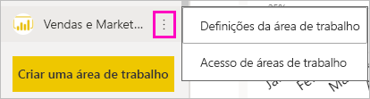
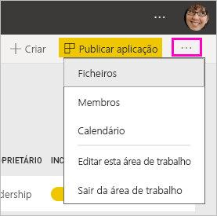
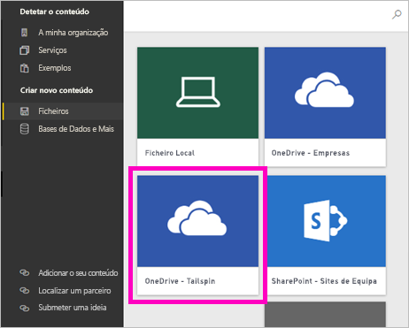
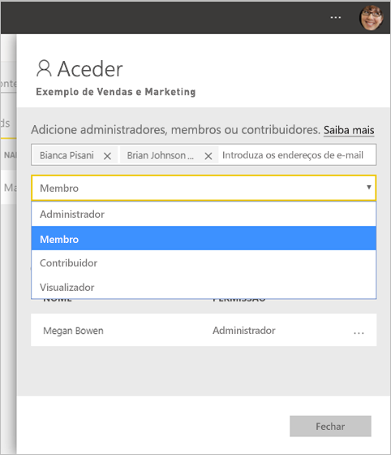

# Criar as novas áreas de trabalho no Power BI

O Power BI está a apresentar uma nova experiência de área de trabalho. As áreas de trabalho são também locais onde pode colaborar com colegas para criar coleções de dashboards, relatórios e relatórios paginados. Depois poderá agrupar esta coleção numa *aplicação* e distribuí-la por toda a organização ou por um conjunto de pessoas ou grupo específico. 

Veja as diferenças a seguir. Nas novas áreas de trabalho, pode:

- Atribuir funções de área de trabalho a grupos de utilizadores: grupos de segurança, listas de distribuição, grupos do Office 365 e utilizadores individuais.
- Criar uma área de trabalho no Power BI sem criar um grupo do Office 365.
- Utilizar funções de áreas de trabalho mais avançadas para uma gestão de permissões mais flexível numa área de trabalho.

> [!NOTE]
> Para impor a segurança a nível da linha (RLS) para os utilizadores do Power BI Pro que procuram conteúdos numa área de trabalho, atribua a Função Visualizador aos mesmos.

Para obter mais informações, veja o artigo [novas áreas de trabalho](service-new-workspaces.md).

## Criar uma das novas áreas de trabalho

1. Comece por criar a área de trabalho. Selecione **Áreas de trabalho** > **Criar área de trabalho**.
   
     

2. Está automaticamente a criar uma área de trabalho atualizada, a não ser que opte por **Reverter para a clássica**.
   
     
     
     Se selecionar **Reverter para clássica**, criará uma [área de trabalho baseada num Grupo do Office 365](service-create-workspaces.md). 

2. Atribua um nome à área de trabalho. Se o nome não estiver disponível, edite-o para criar um nome exclusivo.
   
     A aplicação para a área de trabalho terá o mesmo nome e ícone que a área de trabalho.
   
1. Aqui estão alguns itens opcionais que pode definir para a área de trabalho:

    Carregue uma **Imagem da área de trabalho**. Os ficheiros podem ser .png ou .jpg. O tamanho do ficheiro tem de ser inferior a 45 KB.
    
    [Adicione uma **Lista de contactos**](#workspace-contact-list). Por predefinição, os administradores da área de trabalho são os contactos. 
    
    [Especifique uma **Área de trabalho OneDrive**](#workspace-onedrive) ao introduzir apenas o nome de um Grupo do Office 365 existente, não o URL. Agora esta área de trabalho pode utilizar a localização de armazenamento dos ficheiros do grupo do Office 365. 

    

    Para atribuir a área de trabalho a uma **Capacidade dedicada**, no separador**Premium**, selecione **Capacidade dedicada**.
     
    

1. Selecione **Guardar**.

    O Power BI cria a área de trabalho e abre-a. Irá vê-la na lista de áreas de trabalho das quais é membro. 

## Lista de contactos da área de trabalho

A nova lista de contactos da área de trabalho permite-lhe especificar os utilizadores que recebem notificações sobre problemas que afetam a área de trabalho. Por predefinição, qualquer utilizador ou grupo especificado como administrador da área de trabalho é notificado, mas pode personalizar a lista. Os utilizadores ou grupos incluídos na lista de contactos serão apresentados na interface de utilizador (IU) para ajudar os utilizadores a obterem ajuda relacionada com a área de trabalho.

1. Aceda à configuração da nova **Lista de contactos** de uma destas duas formas:

    No painel **Criar uma área de trabalho** quando a cria pela primeira vez.

    No painel de navegação esquerdo, selecione a seta junto a **Áreas de Trabalho**, selecione as reticências (…) junto ao nome da área de trabalho > **Definições da área de trabalho**. O painel **Definições** é apresentado.

    

2. Em **Avançado** > **Lista de contactos**, aceite a predefinição, **Administradores da área de trabalho**, ou adicione a sua própria lista de **Utilizadores ou grupos específicos**. 
3. Selecione **Guardar**.

## OneDrive da área de trabalho

A funcionalidade OneDrive da área de trabalho permite-lhe configurar um Grupo do Office 365 cujo armazenamento de ficheiros da Biblioteca de Documentos do SharePoint está disponível para os utilizadores da área de trabalho. Crie primeiro o grupo fora do Power BI. 

O Power BI não sincroniza as permissões de utilizadores ou grupos que estão configurados para terem acesso à área de trabalho com a associação ao Grupo do Office 365. A melhor prática consiste em conceder o [acesso à área de trabalho](#give-access-to-your-workspace) ao mesmo Grupo do Office 365 cujo armazenamento de ficheiros configurar nesta definição do grupo do Office 365. Em seguida, gira o acesso à área de trabalho ao gerir a associação do grupo do Office 365. 

1. Aceda à nova definição da **Área de trabalho do OneDrive** de uma destas duas formas:

    No painel **Criar uma área de trabalho** quando a cria pela primeira vez.

    No painel de navegação esquerdo, selecione a seta junto a **Áreas de Trabalho**, selecione as reticências (…) junto ao nome da área de trabalho > **Definições da área de trabalho**. O painel **Definições** é apresentado.

    

2. Em **Avançado** > **Área de trabalho OneDrive**, introduza o nome do grupo do Office 365 que criou anteriormente. O Power BI seleciona automaticamente o OneDrive para o grupo.

    

3. Selecione **Guardar**.

### Aceder à localização da área de trabalho OneDrive

Após ter configurado a localização do OneDrive, pode aceder-lhe a partir de algumas diferentes localizações na área de trabalho:

- Selecione **Áreas de trabalho** > *nome da área de trabalho* > menu das reticências ( **...** ) > **Ficheiros**. 

    

- Selecione as reticências ( **…** ) no canto superior direito da área de trabalho > **Ficheiros**.

    
    
- Na experiência **Obter Dados** > **Ficheiros**. A entrada **OneDrive – Empresas** é o seu próprio OneDrive para Empresas. O segundo OneDrive é aquele que adicionou.

    

## Adicionar conteúdos à área de trabalho

Depois de ter criado uma nova área de trabalho de experiência de área de trabalho, é altura de adicionar conteúdos à mesma. Adicionar conteúdo é semelhante na área de trabalho nova e na área de trabalho clássica. Utilize o botão Criar ou utilize Obter dados para adicionar conteúdo à área de trabalho.

1. Pode adicionar conteúdo no ecrã de **Boas-vindas** da nova área de trabalho. 

    

1. Por exemplo, selecione **Exemplos** > **Exemplo de Rentabilidade do Cliente**.

> [!NOTE]
> Não pode adicionar pacotes de conteúdo organizacional ou pacotes de conteúdo de terceiros às novas áreas de trabalho. As aplicações estão disponíveis para muitos pacotes de conteúdo de terceiros que utilizou anteriormente. Utilize as áreas de trabalho clássicas se precisar de continuar a utilizar os pacotes de conteúdo. Os pacotes de conteúdo foram preteridos, por isso, é uma prática recomendada utilizar antes as aplicações.

Ao visualizar os conteúdos na lista de conteúdos de uma área de trabalho, o nome da área de trabalho é indicado como sendo o do proprietário.

### Ligar-se a serviços de terceiros nas novas áreas de trabalho

Na nova experiência de áreas de trabalho, estamos a fazer uma alteração ao foco nas *aplicações*. As aplicações para serviços de terceiros tornam mais fácil para os utilizadores obterem dados de serviços que utilizam, como o Microsoft Dynamics CRM, o Salesforce ou o Google Analytics.

Na nova experiência de áreas de trabalho, não pode criar ou consumir pacotes de conteúdos organizacionais. Em alternativa, pode utilizar as aplicações fornecidas para se ligar a serviços de terceiros ou pedir às suas equipas internas que forneçam aplicações para os pacotes de conteúdos que esteja a utilizar. 

## Conceder acesso à área de trabalho

1. Na lista de conteúdo da área de trabalho, devido a ser um administrador, pode ver uma nova ação, **Acesso**.

    

1. Selecione **Aceder**.

1. Adicione grupos de segurança, listas de distribuição, grupos do Office 365 ou utilizadores individuais a estas áreas de trabalho como membros, contribuidores ou administradores. Veja [Funções nas novas áreas de trabalho](service-new-workspaces.md#roles-in-the-new-workspaces) para obter uma explicação sobre as diferentes funções.

    

9. Selecione **Adicionar** > **Fechar**.

## Distribuir uma aplicação

Se quiser distribuir conteúdos oficiais para um grande público na sua organização, poderá publicar uma aplicação a partir da sua área de trabalho.  Quando os conteúdos estiverem prontos, selecione os dashboards e relatórios que pretende publicar e, em seguida, publique-os como uma *aplicação*. Pode criar uma aplicação a partir de cada área de trabalho.

Leia sobre como [publicar uma aplicação com base nas novas áreas de trabalho](service-create-distribute-apps.md)

## Próximos passos
* Leia mais no artigo [Organizar o trabalho na nova experiência de áreas de trabalho no Power BI](service-new-workspaces.md)
* [Criar as áreas de trabalho clássicas](service-create-workspaces.md)
* [Publicar uma aplicação a partir das novas áreas de trabalho no Power BI](service-create-distribute-apps.md)
* Perguntas? [Experimente perguntar à Comunidade do Power BI](http://community.powerbi.com/)
