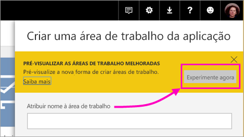
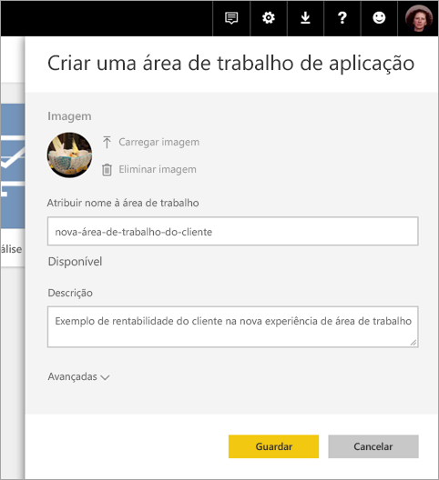
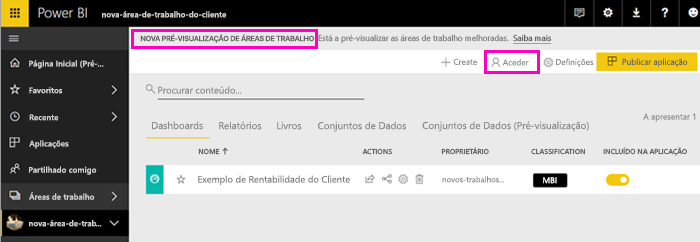
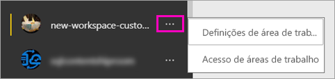

# Criar as novas áreas de trabalho (pré-visualização) no Power BI

O Power BI está a apresentar uma nova experiência de área de trabalho em modo de pré-visualização. As áreas de trabalho são locais fixos para colaborar com colegas de forma a criar coleções de dashboards e relatórios, que pode agrupar em *aplicações* e distribuir por toda a sua organização ou por pessoas ou grupos específicos. 

Com a pré-visualização das novas áreas de trabalho, pode:

- Atribuir funções de área de trabalho a grupos de utilizadores: grupos de segurança, listas de distribuição, grupos do Office 365 e utilizadores individuais.
- Criar uma área de trabalho no Power BI sem criar um grupo do Office 365.
- Utilizar funções de áreas de trabalho mais avançadas para uma gestão de permissões mais flexível numa área de trabalho.

Para obter mais informações, veja o artigo [Novas áreas de trabalho (pré-visualização)](service-new-workspaces.md).

## Criar uma das novas áreas de trabalho de aplicação

1. Comece por criar a área de trabalho de aplicação. Selecione **Áreas de Trabalho** > **Criar área de trabalho de aplicação**.
   
     

2. Em **Pré-visualizar as áreas de trabalho melhoradas**, selecione **Experimente agora**.
   
     

2. Atribua um nome à área de trabalho. Se o nome não estiver disponível, edite-o para criar um ID exclusivo.
   
     A aplicação terá o mesmo nome que a área de trabalho.
   
1. Adicione uma imagem, se quiser. O tamanho do ficheiro tem de ser inferior a 45 KB.
 
    

1. Selecione **Guardar**.

    No **Ecrã de boas-vindas** da sua nova área de trabalho, pode adicionar dados. 

    

1. Por exemplo, selecione **Exemplos** > **Exemplo de Rentabilidade do Cliente**.

    Agora na lista de conteúdos da área de trabalho, pode ver a **Nova pré-visualização de áreas de trabalho**. Como é um administrador, também vê uma nova ação, **Aceder**.

    

1. Selecione **Aceder**.

1. Adicione grupos de segurança, listas de distribuição, grupos do Office 365 ou utilizadores individuais a estas áreas de trabalho como membros, contribuidores ou administradores. Veja [Funções nas novas áreas de trabalho](service-new-workspaces.md#roles-in-the-new-workspaces) para obter uma explicação sobre as diferentes funções.

    

9. Selecione **Adicionar** > **Fechar**.

1. O Power BI cria a área de trabalho e abre-a. Irá vê-la na lista de áreas de trabalho das quais é membro. Visto que é um administrador, pode selecionar as reticências (…) para voltar atrás e fazer alterações a definições da área de trabalho, adicionar novos membros ou alterar as respetivas permissões.

     

## Adicionar conteúdos à área de trabalho da sua aplicação

Depois de criar uma área de trabalho de aplicação com o novo estilo, é altura de adicionar conteúdos à mesma. A adição de conteúdos é semelhante nas antigas e novas experiências de área de trabalho, com uma exceção. Embora possa carregar ou ligar-se a ficheiros em ambas as áreas de trabalho de aplicação, tal como em A Minha Área de Trabalho. Nas novas áreas de trabalho não se pode ligar a pacotes de conteúdos organizacionais ou de terceiros, como o Microsoft Dynamics CRM, o Salesforce ou o Google Analytics. Nas áreas de trabalho atuais, pode ligar-se a pacotes de conteúdos.

Ao visualizar os conteúdos na lista de conteúdos de uma área de trabalho de aplicação, o nome da área de trabalho de aplicação é indicado como sendo o do proprietário.

### Ligar-se a serviços de terceiros em novas áreas de trabalho (pré-visualização)

Na nova experiência de áreas de trabalho, estamos a fazer uma alteração ao foco nas *aplicações*. As aplicações para serviços de terceiros tornam mais fácil para os utilizadores obterem dados de serviços que utilizam, como o Microsoft Dynamics CRM, o Salesforce ou o Google Analytics.
As aplicações organizacionais fornecem aos seus utilizadores os dados internos de que precisam. Planeamos adicionar funcionalidades às aplicações organizacionais para que os utilizadores possam personalizar os conteúdos que encontram nas aplicações. Estas funcionalidades vão eliminar a necessidade de pacotes de conteúdos. 

Com a nova pré-visualização de áreas de trabalho, não pode criar ou consumir pacotes de conteúdos organizacionais. Em alternativa, pode utilizar as aplicações fornecidas para se ligar a serviços de terceiros ou pedir às suas equipas internas que forneçam aplicações para os pacotes de conteúdos que esteja a utilizar. 

## Distribuir uma aplicação

Quando os conteúdos estiverem prontos, selecione os dashboards e relatórios que pretende publicar e, em seguida, publique-os como uma *aplicação*. Pode criar uma aplicação a partir de cada área de trabalho. Os seus colegas podem obter a sua aplicação de algumas formas diferentes. Pode instalar aplicações automaticamente nas contas do Power BI dos seus colegas de trabalho, se o administrador do Power BI lhe der permissão. Caso contrário, os utilizadores podem procurar e instalar as aplicações a partir do Microsoft AppSource ou pode enviar-lhes uma ligação direta. Obtêm as atualizações automaticamente e pode controlar a frequência de atualização dos dados. Veja [Publicar aplicações com dashboards e relatórios no Power BI](service-create-distribute-apps.md) para obter detalhes.

## Converter as áreas de trabalho de aplicação antigas em novas áreas de trabalho de aplicação

Durante o período de pré-visualização, não pode converter automaticamente as suas áreas de trabalho antigas em novas. No entanto, pode criar uma nova área de trabalho de aplicação e publicar os seus conteúdos numa nova localização. 

Quando as novas áreas de trabalho ficarem disponíveis para o público (GA), pode optar ativamente por migrar as áreas de trabalho antigas automaticamente. No futuro, após a experiência ficar disponível para o público, terá de migrar as mesmas.

## Próximos passos
* Leia mais no artigo [Organizing work in the new workspaces (preview) in Power BI](service-new-workspaces.md) (Organizar o trabalho nas novas áreas de trabalho [pré-visualização] no Power BI)
* [Criar as áreas de trabalho atuais](service-create-workspaces.md)
* [Instalar e utilizar aplicações no Power BI](service-create-distribute-apps.md)
* Perguntas? [Experimente perguntar à Comunidade do Power BI](http://community.powerbi.com/)
