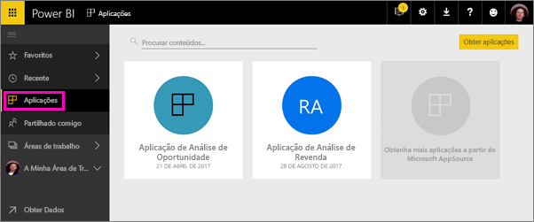

# Criar áreas de trabalho com os seus colegas no Power BI

No Power BI, pode criar *áreas de trabalho*, ou seja, locais onde pode colaborar com colegas para criar e otimizar coleções de dashboards e relatórios. Depois poderá agrupá-los em *aplicações* que pode distribuir por toda a organização ou por um conjunto de pessoas ou grupos específico. 

Ao criar uma área de trabalho, está também a criar um grupo subjacente associado ao Office 365. Todas as tarefas de administração da área de trabalho são efetuadas no Office 365. Pode adicionar colegas a estas áreas de trabalho como membros ou administradores. Na área de trabalho, todos podem colaborar nos dashboards, relatórios e outros artigos que planear publicar para um público mais vasto. Todas as pessoas que adicionar à área de trabalho de uma aplicação precisam de ter uma licença do Power BI Pro. 

**Sabia que?** O Power BI está a apresentar uma nova experiência de área de trabalho em modo de pré-visualização. Leia [Criar as novas áreas de trabalho (pré-visualização)](service-create-the-new-workspaces.md) para saber como as áreas de trabalho irão mudar no futuro. 

## Vídeo: Aplicações e áreas de trabalho de aplicações
<iframe width="640" height="360" src="https://www.youtube.com/embed/Ey5pyrr7Lk8?showinfo=0" frameborder="0" allowfullscreen></iframe>

## Criar uma área de trabalho de aplicação baseada num grupo do Office 365

Quando cria uma área de trabalho de aplicação, esta é criada com base num grupo do Office 365.

[!INCLUDE [powerbi-service-create-app-workspace](./includes/powerbi-service-create-app-workspace.md)]

Ao criá-la pela primeira vez, poderá ter de aguardar aproximadamente uma hora para a área de trabalho ser propagada para o Office 365. 

### Adicionar uma imagem à área de trabalho de aplicação do Office 365 (opcional)
Por predefinição, o Power BI cria um círculo ligeiramente colorido para a aplicação, com as iniciais da aplicação. Mas talvez o queira personalizar com uma imagem. Para adicionar uma imagem, precisa de uma licença do Exchange Online.

1. Selecione **Áreas de trabalho**, selecione as reticências (…) junto ao nome da área de trabalho e, em seguida, **Membros**. 
   
     
   
    A conta do Office 365 Outlook para a área de trabalho é aberta numa nova janela do browser.
2. Quando paira o rato sobre o círculo colorido no canto superior esquerdo, transforma-se num ícone de lápis. Selecione-o.
   
     
3. Selecione novamente o ícone de lápis e localize a imagem que pretende utilizar.
   
     

4. Selecione **Guardar**.
   
     
   
    A imagem substitui o círculo colorido na janela do Office 365 Outlook. 
   
     
   
    Em alguns minutos, irá ser também apresentada na aplicação do Power BI.
   
     

## Adicionar conteúdos à área de trabalho da sua aplicação

Depois de ter criado uma área de trabalho de aplicação, é altura de adicionar conteúdos à mesma. O processo é igual ao de adicionar conteúdos em A Minha Área de Trabalho, exceto que as outras pessoas na área de trabalho também a podem ver e trabalhar nela. Uma grande diferença é que, quando tiver concluído, pode publicar o conteúdo como uma aplicação. Ao visualizar os conteúdos na lista de conteúdos de uma área de trabalho de aplicação, o nome da área de trabalho de aplicação é indicado como sendo o do proprietário.

### Ligar a serviços de terceiros em áreas de trabalho de aplicações

As aplicações são disponibilizadas para todos os serviços de terceiros suportados pelo Power BI, para que possa obter dados dos serviços que utiliza mais facilmente, como o Microsoft Dynamics CRM, o Salesforce ou o Google Analytics. Pode publicar aplicações organizacionais para fornecer aos utilizadores os dados de que estes precisam.

Também pode ligar-se a serviços nas áreas de trabalho atuais através de pacotes de conteúdos organizacionais e de terceiros, como o Microsoft Dynamics CRM, o Salesforce ou o Google Analytics. Pondere migrar os seus pacotes de conteúdos organizacionais para aplicações.

## Distribuir uma aplicação

Quando os conteúdos estiverem prontos, selecione os dashboards e relatórios que pretende publicar e, em seguida, publique-os como uma *aplicação*. Os seus colegas podem obter as suas aplicações de algumas formas diferentes. Pode instalar aplicações automaticamente nas contas do Power BI dos seus colegas de trabalho, se o administrador do Power BI lhe der permissão. Caso contrário, os utilizadores podem encontrar e instalar as aplicações a partir do Microsoft AppSource ou pode enviar-lhes uma ligação direta. Obtêm as atualizações automaticamente e pode controlar a frequência de atualização dos dados. Veja [Publicar aplicações com dashboards e relatórios no Power BI](service-create-distribute-apps.md) para obter detalhes.

## Perguntas frequentes sobre as aplicações do Power BI

### Quais são as diferenças entre as aplicações e os pacotes de conteúdos organizacionais?
As aplicações são a evolução dos pacotes de conteúdos organizacionais. Se já tiver pacotes de conteúdos organizacionais, estes continuarão a funcionar lado a lado com as aplicações. As aplicações e os pacotes de conteúdos apresentam algumas diferenças importantes. 

* Depois de os utilizadores empresariais instalarem um pacote de conteúdos, este perde a respetiva identidade agrupada: é apenas uma lista de dashboards e relatórios misturados com outros dashboards e relatórios. As aplicações, por outro lado, mantêm o respetivo agrupamento e identidade, mesmo após a instalação. Isto torna mais fácil aos utilizadores empresariais continuarem a navegar nelas ao longo do tempo.
* Pode criar vários pacotes de conteúdos a partir de qualquer área de trabalho, mas uma aplicação tem uma relação de 1:1 com a respetiva área de trabalho. 
* Ao longo do tempo, planeamos preterir pacotes de conteúdos organizacionais, pelo que recomendamos que crie aplicações a partir de agora.  
* Com a pré-visualização da nova experiência de área de trabalho, estamos a dar os primeiros passos no sentido de descontinuar os pacotes de conteúdos organizacionais. Não os poderá utilizar ou criar em áreas de trabalho de pré-visualização.

Veja [How are the new app workspaces different from existing app workspaces?](service-create-the-new-workspaces.md#how-are-the-new-app-workspaces-different-from-current-app-workspaces) (Em que diferem as novas áreas de trabalho de aplicação das já existentes?) para comparar as áreas de trabalho de aplicação novas e as atuais. 

## Próximos passos
* [Instalar e utilizar aplicações no Power BI](service-install-use-apps.md)
* [Aplicações do Power BI para serviços externos](service-connect-to-services.md)
- [Criar as novas áreas de trabalho (pré-visualização)](service-create-the-new-workspaces.md)
* Perguntas? [Experimente perguntar à Comunidade do Power BI](http://community.powerbi.com/)
