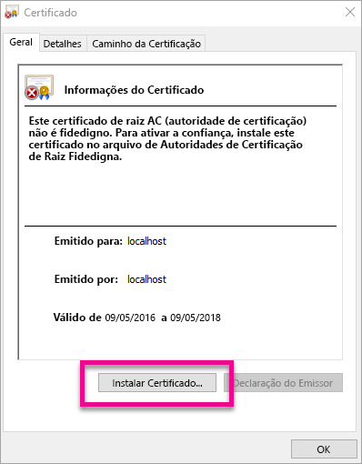
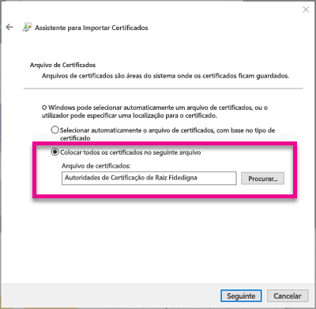
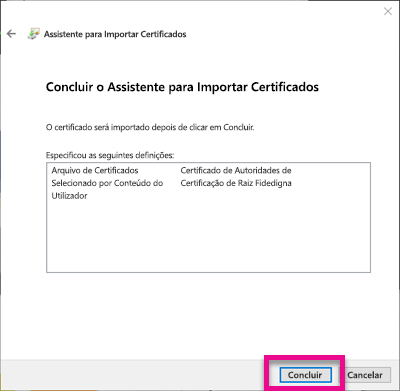
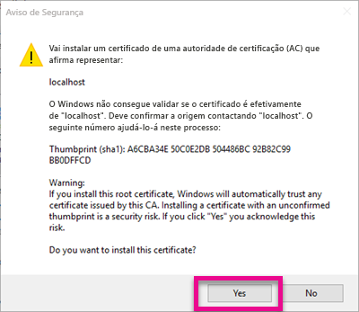
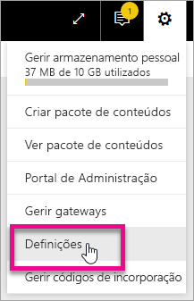
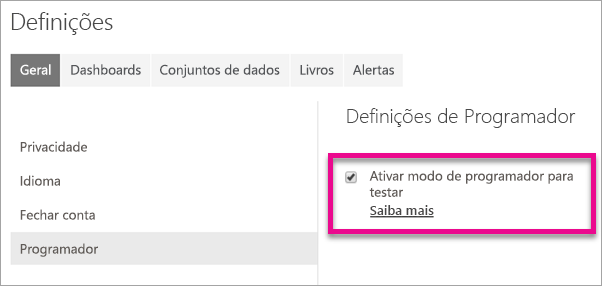
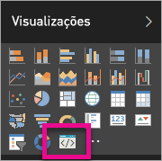

# <a name="use-developer-tools-to-create-custom-visuals"></a>Utilizar ferramentas de programador para criar visuais personalizados
Os visuais personalizados permitem-lhe atender às necessidades dos seus utilizadores e corresponder ao design da sua aplicação. Saiba como criar um elemento visual personalizado para o Power Bi utilizando as ferramentas de programador.

> [!NOTE]
> Pode utilizar este documento para começar a trabalhar. Para obter mais informações aprofundadas, consulte as informações de referência no [repositório de git do Power BI Visuals](https://github.com/Microsoft/PowerBI-visuals).
> 
> 

## <a name="requirements"></a>Requirements
* É necessário utilizar o NodeJS 4.0+ (é recomendado utilizar o 5.0 ou posterior) [Transferir o NodeJS](https://nodejs.org)

## <a name="install-nodejs-and-the-power-bi-tools"></a>Instalar as ferramentas NodeJS e Power BI
Para criar um visual personalizado, tem de instalar o NodeJS. O NodeJS é necessário para executar as ferramentas de linha de comandos.

1. Transfira e instale o [NodeJS](https://nodejs.org). Não é necessária a versão 4.0 ou posterior, mas é recomendado ter 5.0 ou posterior.
2. Instale as ferramentas da linha de comandos. Execute o seguinte comando numa linha de comandos.

        npm install -g powerbi-visuals-tools
3. Pode confirmar que ferramentas estão instaladas, executando o seguinte comando sem quaisquer parâmetros.

        pbiviz

    É apresentado o resultado da ajuda.

    <pre><code>
         +syyso+/
    oms/+osyhdhyso/
    ym/       /+oshddhys+/
    ym/              /+oyhddhyo+/
    ym/                     /osyhdho
    ym/                           sm+
    ym/               yddy        om+
    ym/         shho /mmmm/       om+
     /    oys/ +mmmm /mmmm/       om+
    oso  ommmh +mmmm /mmmm/       om+
   ymmmy smmmh +mmmm /mmmm/       om+
   ymmmy smmmh +mmmm /mmmm/       om+
   ymmmy smmmh +mmmm /mmmm/       om+
   +dmd+ smmmh +mmmm /mmmm/       om+
         /hmdo +mmmm /mmmm/ /so+//ym/
               /dmmh /mmmm/ /osyhhy/
                 //   dmmd
                       ++

       PowerBI Custom Visual Tool

    Usage: pbiviz [options] [command]

    Commands:

    new [name]        Create a new visual
    info              Display info about the current visual
    start             Start the current visual
    package           Package the current visual into a pbiviz file
    update [version]  Updates the api definitions and schemas in the current visual. Changes the version if specified
    help [cmd]        display help for [cmd]

    Options:

    -h, --help      output usage information
    -V, --version   output the version number
    --install-cert  Install localhost certificate
    </code></pre>

<a name="ssl-setup"></a>

### <a name="server-certificate-setup"></a>Configurar o certificado do servidor
Para ativar uma pré-visualização do seu visual em direto, é necessário um servidor https fidedigno. Antes de começar, terá de instalar um certificado SSL que lhe permita carregar recursos visuais no seu browser. 

> [!NOTE]
> Esta é uma configuração única para a sua estação de trabalho de programador.
> 
> 

Para *criar* um certificado, execute o comando seguinte.

    pbiviz --create-cert

> [!NOTE]
> Deverá ver uma mensagem a informá-lo do caminho de localização para o certificado e uma Frase de acesso recentemente criada.
> 
> 


Para *instalar* o certificado, execute o comando seguinte.

    pbiviz --install-cert

> [!NOTE]
> Deverá ver uma mensagem a pedir que utilize a Frase de acesso recentemente criada para instalar um certificado PFX.
> 
> 

**SO Windows**

1. Selecione **Instalar certificado...**.

    
2. Selecione **Utilizador Atual** e, em seguida, selecione **Seguinte**.

    
3. Selecione **Colocar todos os certificados no seguinte arquivo** e selecione **Procurar...** .
4. Selecione **Autoridades de Certificação de Raiz Fidedigna** e, em seguida, selecione **OK**. Selecione **Seguinte**.

    
5. Selecione **Concluir**.

    
6. Selecione **Sim** na caixa de diálogo de aviso de segurança.

    
7. Feche os browsers que tenha aberto.

> [!NOTE]
> Se o certificado não for reconhecido, pode ter de reiniciar o computador.
> 
> 

**OSX**

1. Se o bloqueio no canto superior esquerdo estiver bloqueado, selecione-o para desbloquear. Procure *localhost* e faça duplo clique no certificado.

    
2. Selecione **Confiar Sempre** e feche a janela.

    
3. Introduza o nome de utilizador e a palavra-passe. Selecione **Definições de atualização**.

    
4. Feche os browsers que tenha aberto.

> [!NOTE]
> Se o certificado não for reconhecido, pode ter de reiniciar o computador.
> 
> 

## <a name="enable-live-preview-of-developer-visual"></a>Ativar a pré-visualização em direto do elemento visual de programador
Para ativar uma pré-visualização em direto do seu visual personalizado, siga estes passos. Isto permite que o elemento visual seja utilizado no serviço Power BI quando editar os relatórios.

1. Procure e inicie sessão em [app.powerbi.com](https://app.powerbi.com).
2. Selecione o **ícone de engrenagem** e, em seguida, selecione **Definições**.

    
3. Selecione **Programador** e depois selecione **Ativar modo do programador para testar**.

    
4. Selecione o **Modo de programador** no painel **Visualização**.

    

   > [!NOTE]
   > Isto requer a execução de `pbiviz start` a partir da pasta visual no seu computador de programação. Para obter mais informações sobre como criar o seu elemento visual, consulte [Criar um novo elemento visual](#create-a-new-visual) neste artigo.
   > 
   > 
5. Selecione o elemento visual na tela do relatório. É possível vincular dados da mesma forma que faz para outros elementos visuais.

Agora pode começar a desenvolver o seu elemento visual.

## <a name="create-a-new-visual"></a>Criar um novo elemento visual
Pode criar um novo projeto visual executando o seguinte comando.

```
pbiviz new MyVisualName
```

Pode substituir *MyVisualName* pelo nome que pretende atribuir ao elemento visual. Isto pode ser alterado posteriormente, modificando os campos `name` e `displayName` no ficheiro `pbiviz.json` gerado.

Este comando cria uma nova pasta em direto onde o comando foi executado. Será gerado um modelo de arranque básico para o elemento visual. Depois do comando ser concluído, pode abrir o diretório e utilizar o seu editor preferido para começar a trabalhar no seu novo elemento visual.

## <a name="testing-your-visual-in-power-bi"></a>Testar o elemento visual no Power BI
Pode testar o elemento visual no serviço Power BI em relatórios e dashboards.

<a name="running-your-visual"></a>

### <a name="running-your-visual"></a>Executar o elemento visual
Pode executar o seu elemento visual efetuando o seguinte procedimento.

1. Abra uma linha.
2. Altere o diretório para a pasta visual. Esta é a pasta que contém o ficheiro `pbiviz.json`.
3. Execute o seguinte comando.

    ```
    pbiviz start
    ```

    

Se estiver na localização incorreta, verá um erro semelhante ao seguinte.

```
    error  LOAD ERROR Error: pbiviz.json not found. You must be in the root of a visual project to run this command.
        at e (C:\Users\[user]\AppData\Roaming\npm\node_modules\powerbi-visuals-tools\lib\VisualPackage.js:67:35)
        at Function.loadVisualPackage (C:\Users\[user]\AppData\Roaming\npm\node_modules\powerbi-visuals-tools\lib\VisualPackage.js:62:16)
        at Object.<anonymous> (C:\Users\[user]\AppData\Roaming\npm\node_modules\powerbi-visuals-tools\bin\pbiviz-start.js:43:15)
        at Module._compile (module.js:556:32)
        at Object.Module._extensions..js (module.js:565:10)
        at Module.load (module.js:473:32)
        at tryModuleLoad (module.js:432:12)
        at Function.Module._load (module.js:424:3)
        at Module.runMain (module.js:590:10)
        at run (bootstrap_node.js:394:7)
```

### <a name="viewing-your-visual-in-power-bi"></a>Visualizar o elemento visual no Power BI
Para ver o seu elemento visual num relatório, aceda a esse relatório e selecione o elemento visual no painel **Visualizações**.

> [!NOTE]
> Deve executar o comando `pbiviz start` antes de efetuar este procedimento, como descrito na secção [Executar o seu elemento visual](#running-your-visual).
> 
> 


Em seguida, verá o modelo de arranque do elemento visual.


| Item da barra de ferramentas | Descrição |
| --- | --- |
| Atualizar elemento visual |Atualize manualmente o elemento visual se a opção de recarregamento automático estiver desativada. |
| Alternar o recarregamento automático |Quando ativado, o elemento visual atualiza automaticamente sempre que guardar o ficheiro visual. |
| Mostrar a vista de dados |Mostra a vista de dados subjacente do elemento visual para depuração |
| Obter ajuda |Documentação no GitHub |
| Enviar comentários |Indique-nos se podemos fazer algo para melhorar a experiência! (Requer conta GitHub) |

## <a name="package-your-visual-for-use-in-power-bi-desktop-and-distribution"></a>Prepare o seu elemento visual para utilização numa distribuição e no Power BI Desktop
Antes de pode carregar o seu elemento visual para o [Power BI Desktop](https://powerbi.microsoft.com/desktop/) ou partilhá-lo com a comunidade na [Galeria de elementos visuais do Power BI](https://visuals.powerbi.com), terá de gerar um ficheiro `pbiviz`.

Pode preparar o seu elemento visual do seguinte modo:

1. Abra uma linha.
2. Altere o diretório para a pasta visual. Esta é a pasta que contém o ficheiro `pbiviz.json`.
3. Execute o seguinte comando.

    ```
    pbiviz package
    ```

Este comando cria um `pbiviz` no diretório `dist/` do seu projeto de elementos visuais. Se já houver um ficheiro `pbiviz`, será substituído.

## <a name="updating-the-visuals-api-version"></a>Atualizar a versão de API de elementos visuais
Quando cria um visual com `pbiviz new`, uma cópia das definições de tipo de API adequadas e os esquemas de json são copiados para o diretório do seu elemento visual. Pode utilizar o comando `pbiviz update` para atualizar estes ficheiros, se necessário. Isto pode ser útil se lançarmos uma correção para uma versão de API anterior ou se quiser atualizar para a versão mais recente da API.

### <a name="updating-your-existing-api-version"></a>Atualizar a versão da sua API existente
Se lançarmos uma atualização para uma API existente, pode obter a versão mais recente do seguinte modo:

```
#Update your version of pbiviz
npm install -g powerbi-visuals-tools

#Run update from the root of your visual project, where pbiviz.json is located
pbiviz update
```

Isto irá transferir as ferramentas mais recentes de npm, que incluem esquemas e definições de tipo atualizados. Se utilizar `pbiviz update`, irá substituir a propriedade `apiVersion` no seu ficheiro *pbiviz.json* pela versão mais recente.

### <a name="upgrading-to-a-different-api-version"></a>Atualizar para uma versão de API diferente
Pode atualizar para uma versão de API diferente, utilizando os passos indicados acima. Pode especificar explicitamente a versão de API que pretende utilizar.

```
#Update your version of pbiviz
npm install -g powerbi-visuals-tools

#Run update from the root of your visual project, where pbiviz.json is located
pbiviz update 1.2.0
```

Isto atualiza o seu elemento visual para a API, versão 1.2.0. Pode substituir `1.2.0` por qualquer versão que pretenda utilizar.

> [!WARNING]
> A versão da API predefinida utilizada pelas ferramentas será sempre a versão estável da API. Todas as versões posteriores à versão de API predefinida são instáveis e sujeitas a alterações. Podem ter comportamentos inesperados e comportam-se de maneira diferente entre o serviço Power BI e o Power BI Desktop. Para a atual versão de API estável, consulte [alterar registo](https://github.com/Microsoft/PowerBI-visuals/blob/master/ChangeLog.md). Para obter mais informações sobre as versões de pré-lançamento, consulte o [plano](https://github.com/Microsoft/PowerBI-visuals/blob/master/Roadmap/README.md).
> 
> 

## <a name="inside-the-visual-project"></a>Dentro do projeto visual
O projeto visual é a pasta criada quando executa o comando `pbiviz new`. 

### <a name="file-structure"></a>Estrutura do ficheiro

| Item | Descrição |
| --- | --- |
| recursos/ |Utilizado para armazenar elementos visuais (ícone, capturas de ecrã, etc.). |
| dist/ |Quando executa `pbiviz package`, é gerado aqui o ficheiro pbiviz. |
| src/ |Código de typescript para o seu elemento visual. |
| estilo/ |Menos estilos para o seu elemento visual. |
| .gitignore |Indica ao git para ignorar ficheiros que não devem ser controlados no repositório. |
| capabilities.json |Utilizado para definir as [capacidades](https://github.com/Microsoft/PowerBI-visuals/blob/master/Capabilities/Capabilities.md) do seu elemento visual. |
| package.json |Utilizado por [npm](https://www.npmjs.com/) para gerir módulos. |
| pbiviz.json |Ficheiro de configuração principal. |
| tsconfig.json |Definições de compilador typescript. Saiba mais sobre [tsconfig.json](https://www.typescriptlang.org/docs/handbook/tsconfig-json.html). |

### <a name="pbivizjson"></a>pbiviz.json
Este é o ficheiro de configuração principal para o seu elemento visual. Contém os metadados, bem como informações sobre os ficheiros, necessários para criar o seu elemento visual.

```
{
    "visual": {
        "name": "myVisual", // internal visual name (should not contain spaces)
        "displayName": "My Visual!", // visual name displayed to user (used in gallery)
        "guid": "PBI_CV_xxxxxxx", // a unique id for this visual MUST BE UNIQUE
        "visualClassName": "Visual" // the entry class for your visual
        "version": "1.0.0", // visual version. Should be semantic version (increment if you update the visual)
        "description": "", // description used in gallery
        "supportUrl": "", // url to where users can get support for this visual
        "gitHubUrl": "" // url to the source in github (if applicable)
    },
    "apiVersion": "1.0.0", //API version this visual was created with
    "author": {
        "name": "", // your name
        "email": "" // your e-mail
    },
    "assets": {
        "icon": "assets/icon.png" // relative path to your icon file (20x20 png)
    },
    "style": "style/visual.less", // relative path to your less file
    "capabilities": "capabilities.json" // relative path to your capabilities definition 
}
```

### <a name="visual-source-typescript"></a>Visual source (TypeScript)
O código visual deve ser escrito em TypeScript, um superconjunto de JavaScript que suporta funcionalidades mais avançadas e acesso atempado à funcionalidade ES6/ES7.

Todos os ficheiros TypeScript devem ser armazenados no diretório `src/` e adicionados à matriz `files` na `tsconfig.json`. Isto permite ao compilador TypeScript carregá-los e organizá-los.

Quando o seu elemento visual é criado, todos os TypeScript são compilados num único ficheiro JavaScript. Isto permite-lhe referenciar elementos exportados a partir de outros ficheiros sem terem de criá-los `require` manualmente, desde que ambos os ficheiros estejam listados no tsconfig.

Pode criar os ficheiros e classes necessários para criar o seu elemento visual.

Saiba mais sobre [TypeScript](http://www.typescriptlang.org/).

### <a name="visual-style-less"></a>Estilo visual (Less)
O estilo visual é processado através de folhas de estilo CSS. Para sua comodidade, utilizamos o pré-compilador Less, que suporta algumas funcionalidades avançadas, como aninhamento, variáveis, misturas, condições, ciclos, etc. Se não quiser utilizar algumas destas funcionalidades, pode escrever CSS simples no ficheiro Less.

Todos os ficheiros Less devem ser armazenados no diretório `style/`. O ficheiro especificado no campo `style` no seu ficheiro `pbiviz.json` será carregado. Os ficheiros adicionais devem ser carregados com `@import`.

Saiba mais sobre o [Less](http://lesscss.org/).

## <a name="debugging"></a>Depurar
Para obter sugestões sobre como depurar elementos visuais personalizados, consulte o [guia de depuração](https://github.com/Microsoft/PowerBI-visuals/blob/master/tools/debugging.md).

## <a name="submit-your-visual-to-appsource"></a>Submeter o seu elemento visual para o AppSource
Pode listar o seu elemento visual, para que outras pessoas possam utilizá-lo, ao submetê-lo para o AppSource. Para obter mais informações sobre este processo, veja [Publicar elementos visuais personalizados no AppSource](developer/office-store.md).

## <a name="troubleshooting"></a>Resolução de problemas
**Comando Pbiviz não encontrado (ou erros semelhantes)**

Se executar `pbiviz` no seu terminal/linha de comandos, verá o ecrã da ajuda. Caso contrário, não está instalado corretamente. Certifique-se de que tem, pelo menos, a versão 4.0 do NodeJS instalada.

Para obter mais informações, consulte [Instalar o NodeJS e as ferramentas do Power BI](#install-nodejs-and-the-power-bi-tools)...

**Não é possível localizar o elemento visual de depuração no separador Visualizações**

O elemento visual de depuração é parecido com um ícone de linha de comandos no separador **Visualizações**.


Se não o vir, certifique-se de que está ativado nas definições do Power BI. 

> [!NOTE]
> O elemento visual de depuração está apenas disponível no serviço Power BI e não no Power BI Desktop ou na aplicação móvel. O elemento visual vai continuar a funcionar por todo o lado.
> 
> 

Para obter mais informações, consulte [Ativar pré-visualização em direto do elemento visual do programador](#enable-live-preview-of-developer-visual)...

**Não é possível contactar o servidor visual**

Execute o servidor visual com o comando `pbiviz start` no seu terminal/linha de comandos a partir da raiz do seu projeto visual. Se o servidor estiver em execução, é provável que os seus certificados SSL não foram instalados corretamente.

Para obter mais informações, consulte [Executar o seu elemento visual](#running-your-visual) ou [Configurar o certificado do servidor](#ssl-setup).

## <a name="next-steps"></a>Próximos passos
[Visualizações no Power BI](visuals/power-bi-report-visualizations.md)  
[Visualizações personalizadas no Power BI](power-bi-custom-visuals.md)  
[Publicar elementos visuais personalizados na Loja do Office](developer/office-store.md)  
[TypeScript](http://www.typescriptlang.org/)  
[Menos CSS](http://lesscss.org/)  

Mais perguntas? [Experimente perguntar à Comunidade do Power BI](http://community.powerbi.com/)

