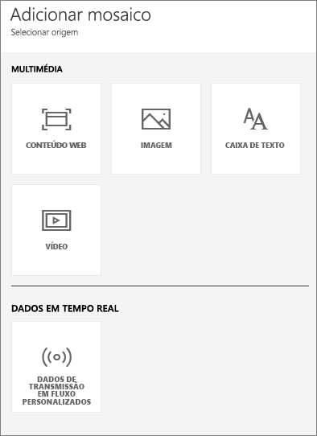
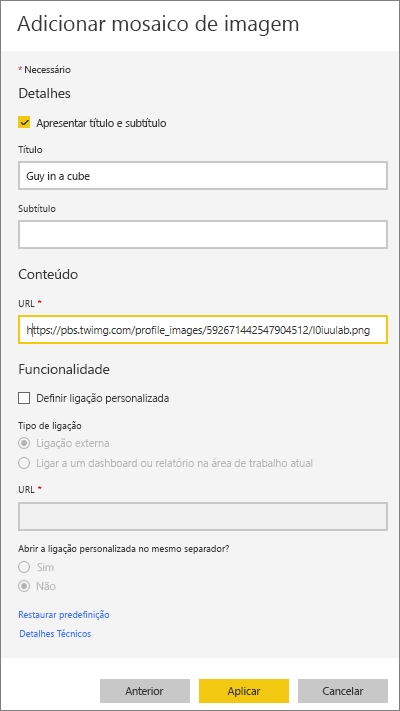
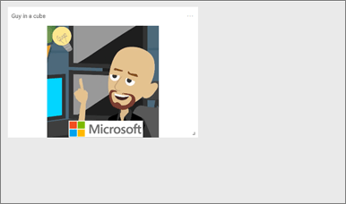
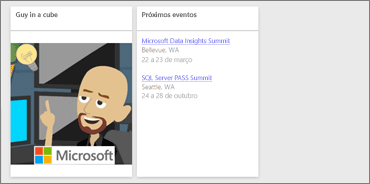
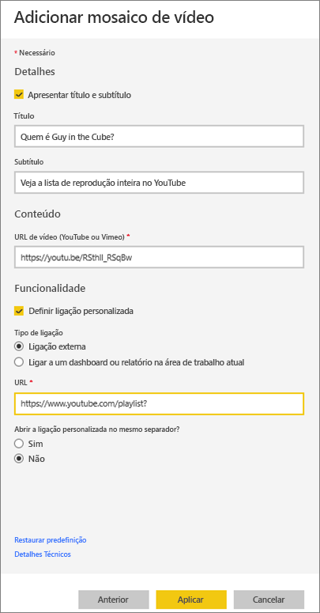
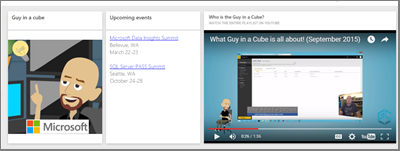
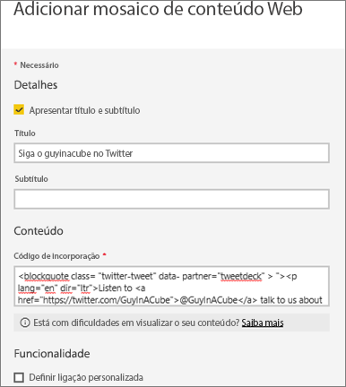
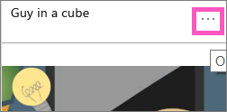
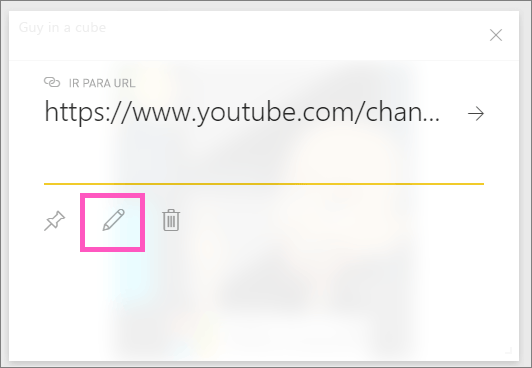

# <a name="add-image-text-video-and-more-to-your-dashboard"></a>Adicionar imagem, texto, vídeo e muito mais ao dashboard
<iframe width="560" height="315" src="https://www.youtube.com/embed/e2PD8m1Q0vU" frameborder="0" allowfullscreen></iframe>


## <a name="add-tile"></a>Adicionar Mosaico
O controlo **Adicionar mosaico** permite adicionar diretamente uma imagem, caixa de texto, vídeo, dados de transmissão em fluxo ou código Web ao seu dashboard.

1. Selecione **Adicionar mosaico** na barra de menus superior. Consoante as limitações de espaço, pode ver apenas o sinal de adição .
   
    
2. Selecione o tipo de mosaico a adicionar: **Imagem**, **Caixa de texto**, **Vídeo**, **Conteúdo Web** ou **Dados de transmissão em fluxo personalizados**.
   
    

## <a name="add-an-image"></a>Adicionar uma imagem
Digamos que pretende ter o registootipo da empresa, ou outra imagem, no dashboard. Terá de guardar o ficheiro de imagem online e ligar ao mesmo. Certifique-se de que não são necessárias credenciais especiais para aceder ao ficheiro de imagem. Por exemplo, o OneDrive e o SharePoint exigem autenticação, pelo que as imagens armazenadas não podem ser adicionadas um dashboard desta forma.  

1. Selecione **Imagem** > **Seguinte**.
2. Adicione informações da imagem ao painel **Detalhes do mosaico** .
   
    
   
   * para exibir um título acima da imagem, selecione *Exibir título e subtítulo* e introduza um título e/ou subtítulo.
   * introduza o URL da imagem
   * para tornar o mosaico numa hiperligação, selecione **Definir ligação personalizada** e introduza o URL.  Quando os colegas clicarem neste título ou nesta imagem, serão encaminhados para esse URL.
   * Selecione **Aplicar**.  No dashboard, redimensione e mova a imagem, conforme necessário.
     
     

## <a name="add-a-text-box-or-dashboard-heading"></a>Adicionar uma caixa de texto ou um cabeçalho de dashboard
1. Selecione **Caixa de texto > Seguinte**.
   
    
   
   > **NOTA**: para adicionar um cabeçalho de dashboard, escreva o cabeçalho na caixa de texto e aumente o tipo de letra.
   > 
   > 
2. Formatar a caixa de texto:
   
   * para exibir um título acima da caixa de texto, selecione **Exibir título e subtítulo** e digite um título e/ou subtítulo.
   * introduza e formate o conteúdo da caixa de texto.  
   * Opcionalmente, defina uma ligação personalizada para o título.  No entanto, neste exemplo, como adicionamos hiperligações à própria caixa de texto, deixe a opção **Definir ligação personalizada** desmarcada.
3. Selecione **Aplicar**.  No dashboard, redimensione e mova a caixa de texto, conforme necessário.
   
   

## <a name="add-a-video"></a>Adicionar um vídeo
Quando adicionar um mosaico de título do YouTube ou Vimeo ao seu dashboard, o vídeo é reproduzido diretamente no dashboard.

1. Selecione **Vídeo > Seguinte**.
2. Adicione informações do vídeo ao painel **Detalhes do mosaico** .
   
    
   
   * para exibir um título e subtítulo na parte superior do mosaico do vídeo, selecione *Exibir título e subtítulo* e introduza um título e/ou subtítulo. Neste exemplo, vamos adicionar um subtítulo e, em seguida, torná-lo numa hiperligação para a lista de reprodução inteira no YouTube.
   * introduza o URL do vídeo
   * Adicione uma hiperligação para o título e subtítulo.  Depois dos seus colegas verem o vídeo incorporado, talvez queira que estes vejam a liste de reprodução completa no YouTube – adicione uma ligação para a lista de reprodução aqui.
   * Selecione **Aplicar**.  No dashboard, redimensione e mova o mosaico do vídeo, conforme necessário.
     
      
3. Selecione o mosaico de vídeo para reproduzir o vídeo.
4. Selecione o subtítulo para visitar a lista de reprodução no YouTube.

## <a name="add-streaming-data"></a>Adicionar dados de transmissão em fluxo
<iframe width="560" height="315" src="https://www.youtube.com/embed/kOuINwgkEkQ" frameborder="0" allowfullscreen></iframe>

## <a name="add-web-content"></a>Adicionar conteúdo da Web
Cole ou introduza qualquer conteúdo HTML.  O Power BI adiciona o conteúdo, como um mosaico, ao dashboard. Introduza o código de incorporação manualmente ou copie/cole de sites como o Twitter, o YouTube, o embed.ly e muito mais.

1. Selecione **Conteúdo Web > Seguinte**.
2. Adicione as informações ao painel **Adicionar mosaico de conteúdo Web**.
   
    
   
   * para apresentar um título acima do mosaico, selecione *Apresentar título e subtítulo* e introduza um título e/ou um subtítulo.
   * introduza o código de incorporação. Neste exemplo, estamos a copiar e colando colar um feed do Twitter.
   * Selecione **Aplicar**.  No dashboard, redimensione e mova o mosaico dos conteúdos Web, conforme necessário.
     
      

## <a name="tips-for-embedding-web-content"></a>Sugestões para incorporar o conteúdo Web
* Para iframes, utilize uma origem segura. Se introduzir o código de incoporação do iframe e obter um mosaico em branco, verifique se está a utilizar **http** para a origem de iframe.  Nesse caso, altere-a para **https**.
  
  ```
  <iframe src="https://xyz.com">
  ```
* Edite as informações de largura e de altura. Este código de incorporação incorpora um vídeo e define o leitor de vídeo para 560 x 315 pixels.  Este tamanho não será alterado ao redimensionar o mosaico.
  
  ```
  <iframe width="560" height="315"
  src="https://www.youtube.com/embed/Cle_rKBpZ28" frameborder="0"
   allowfullscreen></iframe>
  ```
  
  Se quiser que o leitor seja redimensionado para ser ajustado ao tamanho do mosaico, defina a largura e a altura para 100%.
  
  ```
  <iframe width="100%" height="100%"
  src="https://www.youtube.com/embed/Cle_rKBpZ28" frameborder="0"
   allowfullscreen></iframe>
  ```
* Este código incorpora um tweet e mantém, como ligações separadas no dashboard, as ligações para o podcast **AFK**, **a página do Twitter do @GuyInACube**, **Seguir**, **#analytics**, **responder**, **fazer retweet** e **gostar**.  Selecionar o mosaico propriamente dito leva-o até ao podcast no Twitter.
  
  ```
  <blockquote class="twitter-tweet" data-partner="tweetdeck">
  <p lang="en" dir="ltr">Listen to
  <a href="https://twitter.com/GuyInACube">@GuyInACube</a> talk to
  us about making videos about Microsoft Business Intelligence
  platform
  <a href="https://t.co/TmRgalz7tv">https://t.co/TmRgalz7tv </a>
  <a href="https://twitter.com/hashtag/analytics?src=hash">
  #analytics</a></p>&mdash; AFTK Podcast (@aftkpodcast) <a
  href="https://twitter.com/aftkpodcast/status/693465456531771392">
  January 30, 2016</a></blockquote> <script async src="//platform.twitter.com/widgets.js" charset="utf-8"></script>
  ```

## <a name="edit-a-tile"></a>Editar um mosaico
Para fazer alterações a um mosaico...

1. Passe o rato sobre o canto superior direito do mosaico e selecione as reticências.
   
    
2. Selecione o ícone de edição para reabrir o painel **Detalhes do mosaico** e faça as alterações.
   
    

## <a name="considerations-and-troubleshooting"></a>Considerações e resolução de problemas
* Para facilitar ainda mais a movimentação do mosaico no dashboard, adicione um título e/ou um subtítulo.
* Se pretende introduzir algum conteúdo de um site, mas se o site não fornecer o código de incorporação para copiar e colar, confira embed.ly para obter ajuda sobre a geração do código de incorporação.

## <a name="next-steps"></a>Próximos passos
[Mosaicos do Dashboard](service-dashboard-tiles.md)

Mais perguntas? [Experimente a Comunidade do Power BI](http://community.powerbi.com/).

