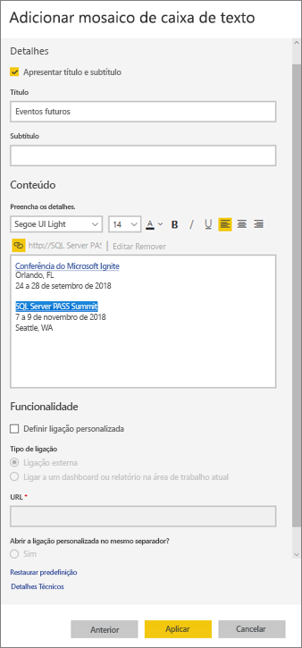

# <a name="add-images-videos-and-more-to-your-dashboard"></a>Adicionar imagens, vídeos e mais ao dashboard

Ao adicionar um mosaico ao seu dashboard, pode colocar uma imagem, uma caixa de texto, um vídeo, dados de transmissão ou código Web no mesmo. 

Veja a Amanda a adicionar mosaicos a um dashboard.

   
<iframe width="560" height="315" src="https://www.youtube.com/embed/e2PD8m1Q0vU" frameborder="0" allowfullscreen></iframe>


## <a name="add-an-image-video-or-other-tile"></a>Adicionar uma imagem, um vídeo ou outro mosaico
Pode adicionar uma imagem, uma caixa de texto, um vídeo, dados de transmissão ou código Web diretamente ao seu dashboard.

1. Selecione **Adicionar mosaico** na barra de menus superior do seu dashboard. Consoante as limitações de espaço, poderá ver apenas o sinal de adição .
   
    
2. Selecione o tipo de mosaico a adicionar: 

    **[Conteúdo Web](#add-web-content)**

    **[Imagem](#add-an-image)**

    **[Caixa de texto](#add-a-text-box-or-dashboard-heading)**

    **[Vídeo](#add-a-video)**

    **[Dados de transmissão em fluxo personalizados](#add-streaming-data)**
   
    

## <a name="add-an-image"></a>Adicionar uma imagem
Se quiser adicionar o logótipo da sua empresa ou outra imagem ao seu dashboard, guarde o ficheiro de imagem online e ligue ao mesmo. Certifique-se de que não são necessárias credenciais de segurança para aceder ao ficheiro de imagem. Por exemplo, o OneDrive e o SharePoint exigem autenticação, pelo que as imagens lá armazenadas não podem ser adicionadas a um dashboard desta forma.  

1. Na janela **Adicionar mosaico**, selecione **Imagem** > **Seguinte**.

2. Na janela **Adicionar mosaico de imagem**, adicione as informações da imagem:   
   
   a. Para apresentar um título acima da imagem, selecione **Apresentar título e subtítulo** e introduza um **Título** e um **Subtítulo** opcional.

   b. Introduza o **URL** da imagem.

   c. Para tornar o mosaico numa hiperligação, selecione **Definir ligação personalizada** e introduza o **URL**. 

      Quando os colegas clicarem na imagem ou no título, serão encaminhados para este URL.

   d. Selecione **Aplicar**. 

      

3. No dashboard, redimensione e mova a imagem, conforme necessário.
     
     

## <a name="add-a-text-box-or-dashboard-heading"></a>Adicionar uma caixa de texto ou um cabeçalho de dashboard

para adicionar um cabeçalho de dashboard, escreva o cabeçalho na caixa de texto e aumente o tipo de letra.

1. Na janela **Adicionar mosaico**, selecione **Caixa de texto** > **Seguinte**.

2. Formatar a caixa de texto:
   
   a. Para apresentar um título acima da caixa de texto, selecione **Apresentar título e subtítulo** e introduza um **Título** e um **Subtítulo** opcional.

   b. Introduza e formate o **Conteúdo** da caixa de texto.  

   c. Opcionalmente, defina uma ligação personalizada para o título. Uma ligação personalizada pode ser um site externo ou um dashboard ou relatório na sua área de trabalho. No entanto, neste exemplo, como adicionamos hiperligações à própria caixa de texto, deixamos a opção **Definir ligação personalizada** desselecionada.

   d. Selecione **Aplicar**. 

     
   
3. No dashboard, redimensione e mova a caixa de texto, conforme necessário.
   
   

## <a name="add-a-video"></a>Adicionar um vídeo
Quando adicionar um mosaico de título do YouTube ou Vimeo ao seu dashboard, o vídeo é reproduzido diretamente no dashboard.

1. Na janela **Adicionar mosaico**, selecione **Vídeo** > **Seguinte**.
2. Adicione as informações do vídeo na janela **Adicionar mosaico de vídeo**:   
   
   a. Para apresentar um título e subtítulo na parte superior do mosaico de vídeo, selecione **Apresentar título e subtítulo** e introduza um **Título** e um **Subtítulo** opcional. Neste exemplo, vamos adicionar um **Subtítulo** e, em seguida, convertê-lo numa hiperligação para toda a lista de reprodução do YouTube.

   b. Introduza o **URL do Vídeo**.

   c. Adicione uma hiperligação para o **Título** e **Subtítulo**, para que os seus colegas possam ver toda a lista de reprodução no YouTube após visualizarem o vídeo incorporado. Para fazê-lo, em **Funcionalidade**, selecione **Definir ligação personalizada** e, em seguida, introduza o **URL** da lista de reprodução.

   d. Selecione **Aplicar**.  

   

3. No dashboard, redimensione e mova o mosaico do vídeo, conforme necessário.
     
   
4. Selecione o mosaico de vídeo para reproduzir o vídeo.
5. Selecione o subtítulo para visitar a lista de reprodução no YouTube.

## <a name="add-streaming-data"></a>Adicionar dados de transmissão em fluxo
Pode utilizar o PubNub para adicionar dados de transmissão, como feeds do Twitter ou dados de sensor, a um mosaico no seu dashboard. O Power BI criou uma integração para obter os dados do PubNub. Neste vídeo, o Will explica como isto funciona.
   

Pode utilizar o PubNub para adicionar dados de transmissão, como feeds do Twitter ou dados de sensor, a um mosaico no seu dashboard. O Power BI criou uma integração para obter os dados do PubNub. Neste vídeo, o Will explica como isto funciona. 

<iframe width="560" height="315" src="https://www.youtube.com/embed/kOuINwgkEkQ" frameborder="0" allowfullscreen></iframe>

1. Na janela **Adicionar mosaico**, selecione **Dados de Transmissão em Fluxo Personalizados** > **Seguinte**.
2. Selecione **Adicionar conjunto de dados de transmissão em fluxo**.
3. Crie um **Novo conjunto de dados de transmissão** com a API Power BI ou o PubNub.
4. Preencha os campos **Nome do conjunto de dados**, **Chave de subscrição** e **Nome do canal**. Se a ligação for segura, também tem uma chave de autorização. Pode utilizar os valores de exemplo do PubNub para experimentá-la.
5. Selecione **Seguinte**.
    Verá os campos disponíveis no conjunto de dados, com os seus tipos de dados e formato JSON.
6. Selecione **Ligar**.
    Já criou um conjunto de dados de transmissão.
7. Regresse ao dashboard e selecione **Adicionar mosaico** > **Dados de Transmissão em Fluxo Personalizados** > **Seguinte** novamente.
8. Selecione o conjunto de dados de sensor que criou > **Seguinte**.
9. Selecione o tipo de elemento visual pretendido. Normalmente, um gráfico de linhas funciona bem para estes dados.
10. Selecione o **Eixo**, a **Legenda** e os **Valores**.
11. Decida o tempo da apresentação, optando por segundos, minutos ou horas.
12. Selecione **Seguinte**.
13. Atribua um **Título** e **Subtítulo**, se quiser.
14. Afixe o conjunto de dados no seu dashboard.


1. Na janela **Adicionar mosaico**, selecione **Dados de Transmissão em Fluxo Personalizados** > **Seguinte**.

2. Selecione **Adicionar conjunto de dados de transmissão em fluxo**.

3. Crie um **Novo conjunto de dados de transmissão** com a API Power BI ou o PubNub.

4. Preencha os campos **Nome do conjunto de dados**, **Chave de subscrição** e **Nome do canal**. Se a ligação for segura, também tem uma chave de autorização. Pode utilizar os valores de exemplo do PubNub para experimentá-la.

5. Selecione **Seguinte**.

   Verá os campos disponíveis no conjunto de dados, com os seus tipos de dados e formato JSON.

6. Selecione **Ligar**.

   Já criou um conjunto de dados de transmissão.

7. Regresse ao dashboard e selecione **Adicionar mosaico** > **Dados de Transmissão em Fluxo Personalizados** > **Seguinte** novamente.

8. Selecione o conjunto de dados de sensor que criou > **Seguinte**.

9. Selecione o tipo de elemento visual pretendido. Normalmente, um gráfico de linhas funciona bem para estes dados.

10. Selecione o **Eixo**, a **Legenda** e os **Valores**.

11. Decida o tempo da apresentação, optando por segundos, minutos ou horas.

12. Selecione **Seguinte**.

13. Opcionalmente, atribua um **Título** e **Subtítulo**.

14. Afixe o conjunto de dados no seu dashboard.

## <a name="add-web-content"></a>Adicionar conteúdo da Web
Pode colar ou escrever qualquer conteúdo HTML, como um mosaico, ao seu relatório ou dashboard. Introduza o código de incorporação manualmente ou copie/cole de sites como o Twitter, YouTube, embed.ly, entre outros.

1. Na janela **Adicionar mosaico**, selecione **Conteúdo Web** > **Seguinte**.

2. Adicione informações à janela **Adicionar mosaico de conteúdo Web**:
   
   a. Para apresentar um título acima do mosaico, selecione **Apresentar título e subtítulo** e introduza um **Título** e um **Subtítulo** opcional.

   b. Introduza o código de incorporação. Neste exemplo, copiamos e colamos um feed do Twitter.

   c. Selecione **Aplicar**.

   
   

3. No dashboard, redimensione e mova o mosaico dos conteúdos Web, conforme necessário.
     
   

### <a name="tips-for-embedding-web-content"></a>Sugestões para incorporar o conteúdo Web
* Para iframes, utilize uma origem segura. Se introduzir o código de incorporação do iframe e obtiver um mosaico em branco, certifique-se de que não está a utilizar *http* para a origem de iframe. Se estiver a utilizar http, altere-o para *https*.
  
  ```html
  <iframe src="https://xyz.com">
  ```
* Edite as informações de largura e de altura. O código de incorporação incorpora um vídeo e define o leitor de vídeo para 560 x 315 píxeis. Este tamanho não será alterado ao redimensionar o mosaico.
  
  ```html
  <iframe width="560" height="315"
  src="https://www.youtube.com/embed/Cle_rKBpZ28" frameborder="0"
   allowfullscreen></iframe>
  ```
  
  Se quiser que o leitor seja redimensionado para ser ajustado ao tamanho do mosaico, defina a largura e a altura para 100%.
  
  ```html
  <iframe width="100%" height="100%"
  src="https://www.youtube.com/embed/Cle_rKBpZ28" frameborder="0"
   allowfullscreen></iframe>
  ```
* Este código incorpora um tweet e mantém, como ligações separadas no dashboard, ligações para o podcast AFK, a página de Twitter do \@GuyInACube, Seguir, a hashtag #analytics, responder, fazer retweet e gostar.  Selecionar o mosaico propriamente dito leva-o até ao podcast no Twitter.
  
  ```html
  <blockquote class="twitter-tweet" data-partner="tweetdeck">
  <p lang="en" dir="ltr">Listen to
  <a href="https://twitter.com/GuyInACube">@GuyInACube</a> talk to
  us about making videos about Microsoft Business Intelligence
  platform
  <a href="https://t.co/TmRgalz7tv">https://t.co/TmRgalz7tv </a>
  <a href="https://twitter.com/hashtag/analytics?src=hash">
  #analytics</a></p>&mdash; AFTK Podcast (@aftkpodcast) <a
  href="https://twitter.com/aftkpodcast/status/693465456531771392">
  January 30, 2016</a></blockquote> <script async src="//platform.twitter.com/widgets.js" charset="utf-8"></script>
  ```

## <a name="edit-a-tile"></a>Editar um mosaico
Para alterar um mosaico existente:

1. Paire o cursor do rato sobre o canto superior direito do mosaico e selecione **Mais opções** (...).
   
    
2. Selecione **Editar detalhes** para apresentar a janela **Detalhes do mosaico** e fazer alterações.
   
    

## <a name="considerations-and-troubleshooting"></a>Considerações e resolução de problemas
* Para facilitar ainda mais a movimentação do mosaico no dashboard, adicione um título e um subtítulo opcional.
* Se quiser introduzir conteúdo de um site, mas o site não fornecer o código de incorporação para copiar e colar, aceda a embed.ly para obter ajuda para gerar o código de incorporação.

## <a name="next-steps"></a>Próximos passos
[Introdução aos mosaicos dos dashboards para designers do Power BI](service-dashboard-tiles.md)

Mais perguntas? [Experimente a Comunidade do Power BI](https://community.powerbi.com/).

