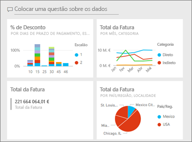
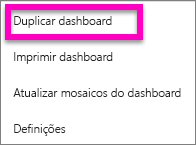
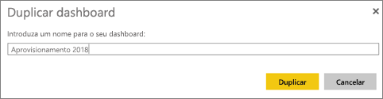
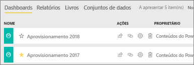

# Criar uma cópia de um dashboard no serviço Power BI

 Existem muitas razões diferentes para fazer uma cópia de um dashboard. Talvez queira efetuar alterações e testar o desempenho relativamente ao original; ou criar versões ligeiramente diferentes para distribuir por colega, região ou equipa. Talvez um colega admire a estrutura do dashboard e queira utilizá-lo nos relatórios para os seus gestores. Outra razão seria se tiver uma nova base de dados com a mesma estrutura de dados e tipos de dados e quiser reutilizar o dashboard já criado. Isto também pode ser feito, mas iria requerer algum trabalho no Power BI Desktop. 

Os dashboards são criados (e copiados) através do serviço Power BI e podem ser vistos no Power BI mobile e no Power BI Embedded.  Os dashboards não estão disponíveis no Power BI Desktop. 

Para fazer uma cópia de um dashboard, o utilizador tem de ser o *criador* do dashboard. Os dashboards foram partilhados consigo como uma aplicação que não pode ser duplicada.

1. Abra o dashboard.
2. No canto superior direito, selecione as reticências (...) e selecione **Duplicar dashboard**.
   
   
3. Dê um nome ao dashboard e selecione **Duplicar**. 
   
   
4. O novo dashboard é guardado na mesma área de trabalho do original. 
   
   

5.    Abra o novo dashboard e edite conforme necessário. Eis algumas coisas que pode fazer em seguida:    
    a. [Mover, mudar o nome, redimensionar ou até mesmo eliminar mosaicos](service-dashboard-edit-tile.md).  
    b. Editar detalhes do mosaico e hiperligações ao selecionar as reticências (…) do mosaico e escolher **Editar detalhes**.  
    c. [Adicionar novos mosaicos a partir da barra de menu do dashboard](service-dashboard-add-widget.md) (**Adicionar mosaico**)  
    d. Afixar mosaicos novos [das Perguntas e Respostas](service-dashboard-pin-tile-from-q-and-a.md) ou [dos relatórios](service-dashboard-pin-tile-from-report.md).  
    e. Mudar o nome do dashboard, ativar ou desativar as Perguntas e Respostas e definir o fluxo de mosaico a partir do painel de Definições do dashboard.  (selecione a lista pendente das reticências (…) do dashboard e escolha **Definições**)  
    f. Partilhe o seu dashboard diretamente com os seus colegas ou como parte de uma aplicação do Power BI. 

## Próximos passos
* [Sugestões para criar um excelente dashboard](service-dashboards-design-tips.md) 

Mais perguntas? [Pergunte à Comunidade do Power BI](http://community.powerbi.com/)

