# Criar um dashboard do Power BI a partir de um relatório
Já leu [Dashboards no Power BI](service-dashboards.md) e agora deseja criar o seu próprio. Há várias formas diferentes de criar um dashboard: a partir de um relatório, de raiz, de um conjunto de dados, ao duplicar um dashboard existente e muito mais.  

Pode parecer muito confuso quando começa a utilizá-lo, pelo que iremos começar por criar um dashboard de forma rápida e fácil ao afixar visualizações existentes de um relatório. Depois de concluir este início rápido, terá uma boa compreensão da relação entre os dashboards e os relatórios, como abrir a Vista de edição no editor de relatórios, como afixar mosaicos e como navegar entre um dashboard e um relatório. Em seguida, utilize as ligações no Índice à esquerda ou os **Passos seguintes** na parte inferior para avançar para tópicos mais avançados.

## Como posso criar um dashboard?
A criação de dashboards é uma funcionalidade do **criador** e precisa de permissões de edição para o relatório. As permissões de edição estão disponíveis para os criadores de relatórios e para os colegas aos quais o criador concede acesso. Por exemplo, se o David cria um relatório na área de trabalho ABC e, em seguida, o adiciona como um membro dessa área de trabalho, você e David terão ambos permissões de edição. Por outro lado, se um relatório tiver sido partilhado consigo diretamente ou como parte de uma [aplicação do Power BI](service-create-distribute-apps.md) (está a **consumir** o relatório), não poderá afixar mosaicos a um dashboard.

> **NOTA**: os dashboards são uma funcionalidade do serviço Power BI, não do Power BI Desktop. Os dashboards não podem ser criados no Power BI mobile, mas podem ser [visualizados e partilhados](consumer/mobile/mobile-apps-view-dashboard.md).
>
> 

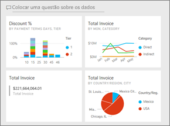

## Vídeo: Criar um dashboard ao afixar elementos visuais e imagens de um relatório
Veja a Amanda a criar um novo dashboard ao afixar visualizações de um relatório. Depois, siga os passos abaixo do vídeo para experimentar por si próprio, com o exemplo de Análise de Aprovisionamento.

<iframe width="560" height="315" src="https://www.youtube.com/embed/lJKgWnvl6bQ" frameborder="0" allowfullscreen></iframe>

### Pré-requisitos
Para acompanhar, terá de transferir o livro do Excel de exemplo “Análise de Aprovisionamento” e abri-lo no serviço Power BI (app.powerbi.com).

## Importar um conjunto de dados com um relatório
Vamos importar um dos conjuntos de dados de exemplo do Power BI e utilizá-lo para criar o nosso novo dashboard. O exemplo que vamos utilizar é um livro do Excel com duas folhas do PowerView. Quando o Power BI importar o livro, este irá adicionar um conjunto de dados e também um relatório à sua área de trabalho.  O relatório é automaticamente criado a partir das folhas do PowerView.

1. [Selecione esta ligação](http://go.microsoft.com/fwlink/?LinkId=529784) para transferir e guardar o ficheiro do Excel de exemplo de Análise de Aprovisionamento. Recomendamos que o guarde no seu OneDrive para Empresas.
2. Abra o serviço Power BI no seu browser (app.powerbi.com).
3. Selecione **A Minha Área de Trabalho**.
4. Na navegação à esquerda, selecione **Obter Dados**.

    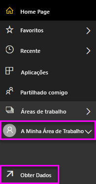
5. Selecione **Ficheiros**.

   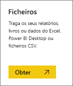
6. Navegue para o local onde guardou o ficheiro de exemplo de Análise de Aprovisionamento do Excel. Selecione-o e selecione **Ligar**.

   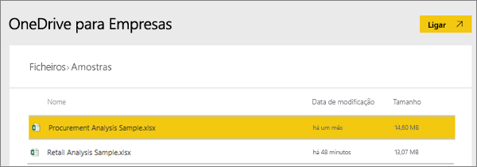
7. Neste exercício, selecione **Importar**.

    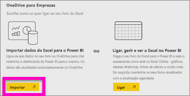
8. Quando aparecer a mensagem de Sucesso, selecione o **x** para fechá-la.

   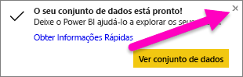

### Abrir o relatório e afixar mosaicos a um dashboard
1. Mantendo-se na mesma área de trabalho, selecione o separador **Relatórios**. O relatório recém-importado é apresentado com um asterisco amarelo. Selecione o nome do relatório para abril-lo.

    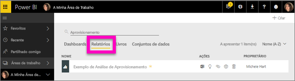
2. O relatório é aberto na Vista de leitura. Repare que tem dois separadores na parte inferior: Análise de Desconto e Descrição Geral de Gastos. Cada separador representa uma página do relatório.
    Selecione **Editar relatório** para abrir o relatório na Vista de edição.

    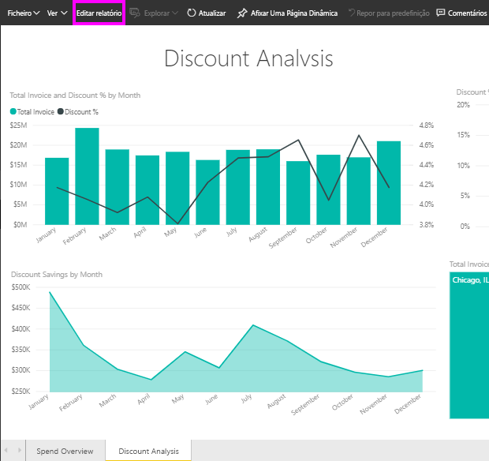
3. Passe o cursor sobre uma visualização para ver as opções disponíveis. Para adicionar uma visualização a um dashboard, selecione o ícone de pino .

    
4. Uma vez que estamos a criar um novo dashboard, selecione a opção de **Novo dashboard** e atribua um nome ao mesmo.

   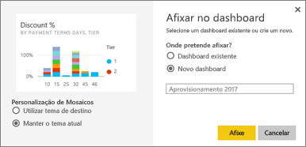
5. Quando selecionar **Afixar**, o Power BI irá criar o novo dashboard na área de trabalho atual. Quando for apresentada a mensagem **Afixado ao dashboard**, selecione **Ir para o dashboard**. Se lhe for pedido que guarde o relatório, selecione **Guardar**.

     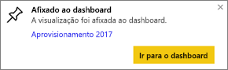
6. O Power BI abre o novo dashboard e há um mosaico (a visualização que acabou de afixar).

   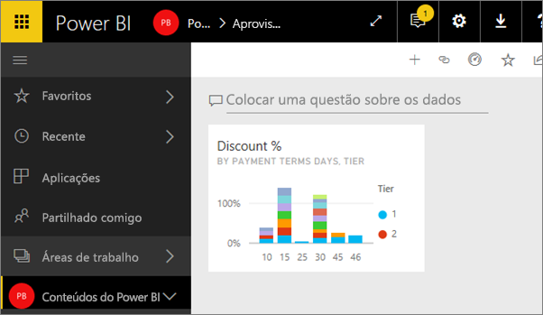
7. Para regressar ao relatório, selecione o mosaico. Afixe mais alguns mosaicos ao dashboard. Desta vez, quando for apresentada a janela **Afixar ao dashboard**, selecione **Dashboard existente**.  

   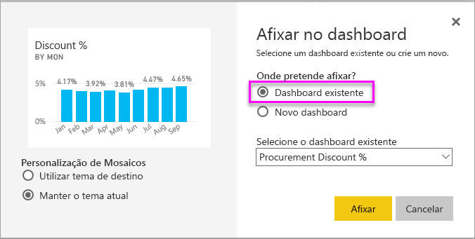

## Afixar uma página de relatório inteira ao dashboard
Em vez de afixar um elemento visual de cada vez, pode [afixar uma página de relatório inteira como um *mosaico dinâmico*](service-dashboard-pin-live-tile-from-report.md). Vamos a isso.

1. No editor de relatórios, selecione o separador **Descrição Geral de Gastos** para abrir a segunda página do relatório.

   

2. Quer todos estes elementos visuais no dashboard.  No canto superior direito da barra de menus, selecione **Afixar página dinâmica**. Num dashboard, os mosaicos de página dinâmicos são atualizados sempre que a página é atualizada.

   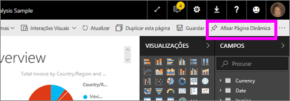

3. Quando for apresentada a janela **Afixar ao dashboard**, selecione **Dashboard existente**.

   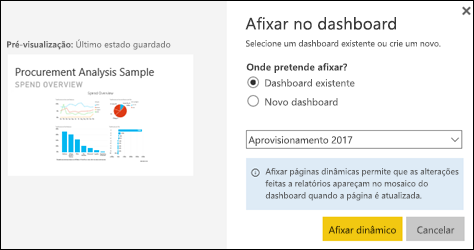

4. Quando a mensagem Êxito aparecer, selecione **Ir para o dashboard**. Aqui verá os mosaicos afixados a partir do relatório. No exemplo abaixo, afixamos dois mosaicos da página 1 do relatório e um mosaico dinâmico que corresponde à página 2 do relatório.

   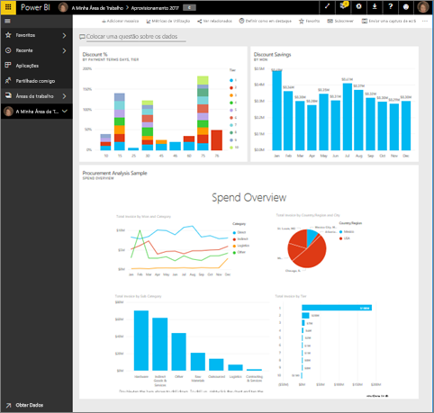

Parabéns pela criação do seu primeiro dashboard! Agora que tem um dashboard, pode fazer muito mais com ele.  Experimente um dos **Próximos passos** sugeridos abaixo ou comece a experimentar e explorar de forma autónoma.   

## Próximos passos
* [Redimensionar e mover mosaicos](service-dashboard-edit-tile.md)
* [Tudo sobre mosaicos de dashboards](service-dashboard-tiles.md)
* [Partilhar o seu dashboard ao criar uma aplicação](service-create-workspaces.md)
* [Power BI - Conceitos Básicos](service-basic-concepts.md)
* [Sugestões para criar um excelente dashboard](service-dashboards-design-tips.md)

Mais perguntas? [Pergunte à Comunidade do Power BI](http://community.powerbi.com/)
