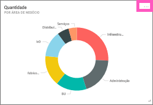
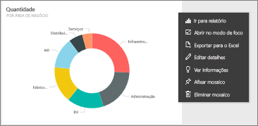
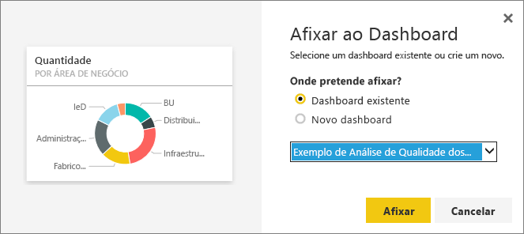
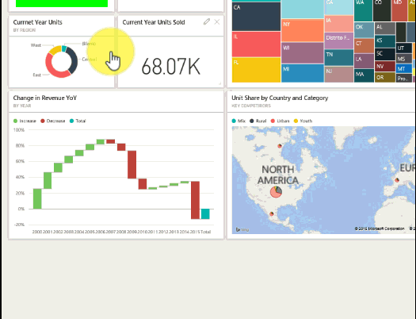

# Editar ou remover um mosaico do dashboard
Pode alterar o aspeto e o comportamento predefinido de um mosaico num dashboard.

<iframe width="560" height="315" src="https://www.youtube.com/embed/lJKgWnvl6bQ" frameborder="0" allowfullscreen></iframe>

Este artigo abrange o seguinte.

* [Afixar um mosaico a um dashboard diferente](#different)
* [Mudar o nome de um mosaico](#rename)
* [Mover um mosaico](#move)
* [Redimensionar um mosaico](#resize)
* [Adicionar uma hiperligação a um mosaico](#hyperlink)
* [Eliminar um mosaico](#delete)
  
  > [!TIP]
  > Para alterar a visualização mostrada no próprio mosaico, elimine o mosaico e adicione um novo [mosaico do dashboard](service-dashboard-tiles.md).
  > 
  > 

## Como começar
1. Abra um [dashboard](service-dashboards.md) que tenha pelo menos um mosaico. 
   
   
2. Coloque o cursor sobre um mosaico do dashboard e selecione as reticências para apresentar as opções.
   
   

## Afixar um mosaico a um dashboard
1. Selecione o ícone **Afixar mosaico** .
2. Decida se pretende afixar num dashboard existente ou num novo dashboard. 
   
   
3. Selecione **Afixar**.

- - -

## Mudar o nome do mosaico e editar os detalhes do mosaico
Selecione o ícone Detalhes do mosaico  para editar o título e apresentar a hora da última atualização.

- - -

## Mover o mosaico
Selecione e mantenha premido o mosaico para o arrastar para um novo local na tela do dashboard.

- - -

## Redimensionar o mosaico
Pode fazer muitos tamanhos diferentes de mosaicos - de unidades de mosaico 1x1 até 5x5. Selecione e arraste a alça (no canto inferior direito) para redimensionar o mosaico.
    

- - -

## Alterar a hiperligação predefinida
Por predefinição, a seleção de um mosaico permite aceder ao relatório no qual o mosaico foi criado ou às Perguntas e Respostas (se o mosaico foi criado em Perguntas e Respostas). Para associar a uma página Web, outro dashboard ou relatório (na mesma área de trabalho), um relatório do SSRS ou outro conteúdo online, adicione uma ligação personalizada:

1. Selecione o ícone **Editar detalhes**  para editar o mosaico.
2. Coloque uma marca de verificação junto a **Definir ligação personalizada** e selecione o tipo de ligação.    
   
   * Para uma ligação externa, introduza o URL.     
   * Para ligar a um dashboard ou relatório na área de trabalho atual, selecione-o no menu pendente.
   
   

- - -

## Excluir o mosaico
* Selecione o ícone **Eliminar mosaico**  para eliminar o mosaico. Eliminar um mosaico não elimina o relatório ou visualização subjacente.

- - -
## Próximos passos
[Mosaicos do dashboard no Power BI](service-dashboard-tiles.md)

[Dashboards no Power BI](service-dashboards.md)

[Power BI - Conceitos Básicos](service-basic-concepts.md)

Mais perguntas? [Experimente a Comunidade do Power BI](http://community.powerbi.com/)

