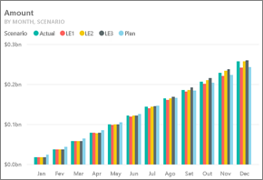
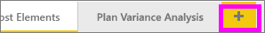
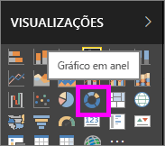
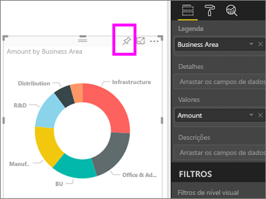
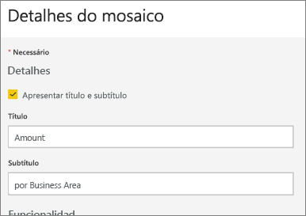
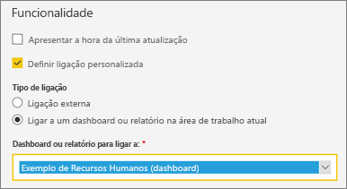
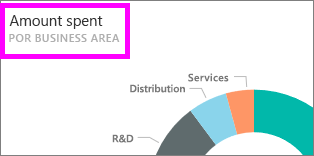

# Editar ou remover um mosaico do dashboard

## *Proprietários* de dashboard versus *consumidores* de dashboard
Quando cria ou é proprietário de um dashboard, tem muitas opções para alterar o aspeto e o comportamento predefinido dos mosaicos nesse dashboard. Utilize as definições e estratégias abaixo para delinear a experiência de *consumo* do dashboard para os seus colegas.  Selecionar um mosaico abrirá o relatório subjacente, um URL personalizado ou um dashboard diferente? Talvez queira [adicionar um mosaico que apresente um vídeo ou dados de transmissão em fluxo](service-dashboard-add-widget.md)? E poderá querer até [criar um mosaico que tenha segmentação de dados interativos](service-dashboard-pin-live-tile-from-report.md). Como *criador*, tem muitas opções. 

<iframe width="560" height="315" src="https://www.youtube.com/embed/lJKgWnvl6bQ" frameborder="0" allowfullscreen></iframe>

Este artigo abrange o seguinte.

* [Criar uma visualização e afixá-la a um dashboard](#create)
* [Mover um mosaico](#move)
* [Redimensionar um mosaico](#resize)
* [Mudar o nome de um mosaico](#rename)
* [Adicionar uma hiperligação a um mosaico](#hyperlink)
* [Afixar um mosaico a um dashboard diferente](#different)
* [Eliminar um mosaico](#delete)
  
 > [!TIP]
 > Para alterar a visualização mostrada no próprio mosaico, elimine o mosaico e adicione um novo [mosaico do dashboard](service-dashboard-tiles.md).
 > 

 ### Pré-requisitos
 1. Para acompanhar, abra o serviço Power BI (não o Power BI Desktop) e [transfira o exemplo de Análise de Gastos de TI](sample-it-spend.md). Quando a mensagem "Êxito" aparecer, selecione **Ir para o dashboard**

- - -

## Criar uma nova visualização e afixá-la ao dashboard
1. A partir do dashboard Análise de Gastos de TI, selecione o mosaico "Amount" (Valor) para abrir o relatório.

    

2. Abra o relatório na Vista de edição, selecionando **Editar relatório** na barra de menus superior.

3. Adicione uma nova página de relatório, selecionando o sinal de adição (+) na parte inferior do relatório.

    

4. No painel CAMPOS, selecione **Facto > Valor** e **Área de Negócio > Área de Negócio**.
 
5. No painel VISUALIZAÇÕES, selecione o ícone de Gráfico em anel para converter a visualização para um Gráfico em anel.

    

5. Selecione o ícone de pin e afixe o Gráfico em anel ao dashboard de exemplo de Análise de Gastos de TI.

   

6. Quando a mensagem "Êxito" aparecer, selecione **Ir para o dashboard**. É-lhe pedido que guarde as alterações. Selecione **Guardar**.

- - -

## Mover o mosaico
No dashboard, localize o novo mosaico. Selecione e mantenha premido o mosaico para o arrastar para um novo local na tela do dashboard.

- - -

## Redimensionar o mosaico
Pode fazer muitos tamanhos diferentes de mosaicos - de unidades de mosaico 1x1 até 5x5. Selecione e arraste a alça (no canto inferior direito) para redimensionar o mosaico.

- - -
## O menu de reticências (…)

1. Selecione as reticências (...) no canto superior direito do mosaico. 
   
   

2. Paire o rato sobre o mosaico "Conta" e selecione as reticências para apresentar as opções. As opções disponíveis irão variar consoante o tipo de mosaico.  Por exemplo, as opções disponíveis para um mosaico dinâmico são diferentes das opções disponíveis para um mosaico de visualização padrão. Além disso, se um dashboard tiver sido partilhado consigo (não é o proprietário), terá menos opções.

   

3. Selecione **Editar detalhes** para abrir a janela "Detalhes do mosaico". 

    Altere o título e o comportamento predefinido do mosaico.  Por exemplo, pode decidir que quando um *consumidor* seleciona um mosaico, em vez de abrir o relatório que foi utilizado para criar esse mosaico, é apresentado em alternativa um novo dashboard.  
   

### Mudar o nome do mosaico
Na parte superior da janela "Detalhes do mosaico", altere **Título** para **Valor gasto**.

### Alterar a hiperligação predefinida
Por predefinição, a seleção de um mosaico normalmente permite aceder ao relatório no qual o mosaico foi criado ou às Perguntas e Respostas (se o mosaico tiver sido criado em Perguntas e Respostas). Para associar a uma página Web, outro dashboard ou relatório (na mesma área de trabalho), um relatório de SSRS ou outro conteúdo online, adicione uma ligação personalizada.

1. Sob o cabeçalho Funcionalidade, selecione **Definir ligação personalizada**.

2. Selecione **Ligar a um dashboard ou relatório na área de trabalho atual** e, em seguida, selecione no menu de lista pendente.  Neste exemplo, selecionámos o dashboard de exemplo de Recursos Humanos. Se ainda não tiver este exemplo na sua área de trabalho, pode adicioná-lo e voltar a este passo ou pode selecionar um dashboard diferente. 

    

3. Selecione **Aplicar**.

4. O novo título é apresentado no mosaico.  Além disso, quando seleciona o mosaico, o Power BI abre o dashboard de Recursos Humanos. 

    

### Afixar o mosaico a um dashboard diferente
1. No menu de lista pendente das reticências, selecione **Afixar mosaico** .
2. Decida se pretende afixar um duplicado deste mosaico a um dashboard existente ou a um novo dashboard. 
   
   
3. Selecione **Afixar**.

### Excluir o mosaico
1. Para remover permanentemente um mosaico de um dashboard, selecione **Eliminar mosaico**  no menu de lista pendente das reticências. 

2. Eliminar um mosaico não elimina a visualização subjacente. Abra o relatório subjacente, selecionando o mosaico "Valor". Abra a última página do relatório para ver que a visualização original não foi eliminada do relatório. 

- - -
## Próximos passos
[Mosaicos do dashboard no Power BI](service-dashboard-tiles.md)

[Dashboards no Power BI](service-dashboards.md)

[Power BI - Conceitos Básicos](service-basic-concepts.md)

Mais perguntas? [Pergunte à Comunidade do Power BI](http://community.powerbi.com/)

