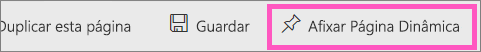
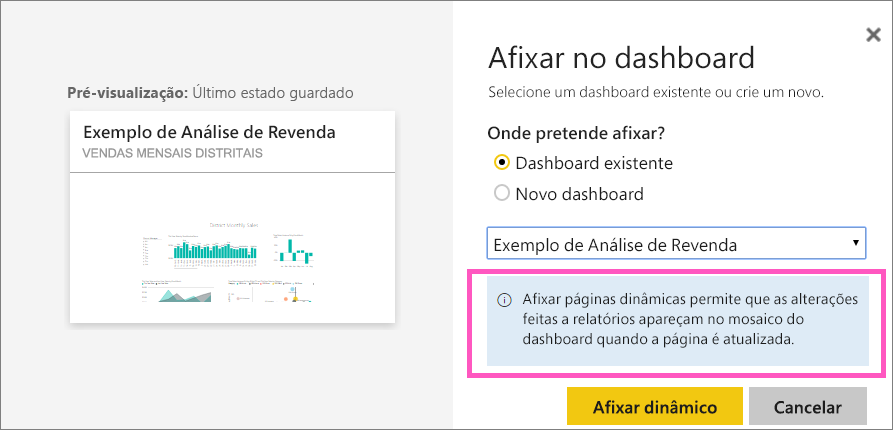
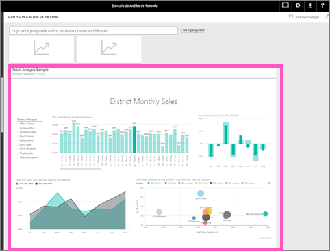

# Afixar uma página de relatório inteira, como um mosaico dinâmico, a um dashboard do Power BI
Outra forma de adicionar um novo [mosaico de dashboard](service-dashboard-tiles.md) é afixar uma página inteira do relatório. Esta é uma forma fácil de afixar mais de uma visualização de cada vez.  Além disso, quando afixa uma página inteira, os mosaicos são *dinâmicos*; pode interagir com eles diretamente no dashboard. As alterações feitas a qualquer uma das visualizações no editor de relatórios, como adicionar um filtro ou alterar os campos utilizados no gráfico, também são refletidas no mosaico do dashboard.  

A afixação de mosaicos dinâmicos de relatórios nos dashboards só está disponível no serviço Power BI (app.powerbi.com).

> [!NOTE]
> Não é possível afixar mosaicos a partir de relatórios que são partilhados consigo.
> 
> 

## Afixar uma página de relatório
Veja a Amanda afixar uma página de relatório dinâmico num dashboard e, em seguida, siga as instruções passo a passo abaixo do vídeo para poder experimentar.

<iframe width="560" height="315" src="https://www.youtube.com/embed/EzhfBpPboPA" frameborder="0" allowfullscreen></iframe>

1. Abra um relatório na [Vista de edição](service-interact-with-a-report-in-editing-view.md).
2. Sem visualizações selecionadas, a partir da barra do menu, selecione **Afixar Página Dinâmica**.
   
    
3. Afixe o mosaico num dashboard existente ou num novo dashboard. Observe o texto realçado: *Afixar esta página em tempo real permite que as alterações nos relatórios sejam apresentadas no mosaico do dashboard quando a página é atualizada.*
   
   * Dashboard existente: selecione o nome do dashboard na lista pendente. Os dashboard que foram partilhados consigo não aparecerão na lista pendente.
   * Novo dashboard: escreva o nome do novo dashboard.
     
     
4. Selecione **Afixar dinâmico**. Uma mensagem de Êxito (perto do canto superior direito) informa que a página foi adicionada, como um mosaico, ao dashboard.

## Abra o dashboard para ver o mosaico dinâmico afixado
1. No painel de navegação, selecione o dashboard com o novo mosaico dinâmico. No dashboard poderá executar ações como [renomear, redimensionar, associar e mover](service-dashboard-edit-tile.md) a página do relatório afixada.  
2. Interaja com os mosaicos dinâmicos.  Na captura de ecrã abaixo, a seleção de uma barra no gráfico de colunas tem um filtro cruzado e realçado nas outras visualizações do mosaico.
   
    

## Próximos passos
[Dashboards no Power BI](service-dashboards.md)

Mais perguntas? [Pergunte à Comunidade do Power BI](http://community.powerbi.com/)

