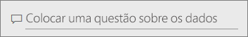
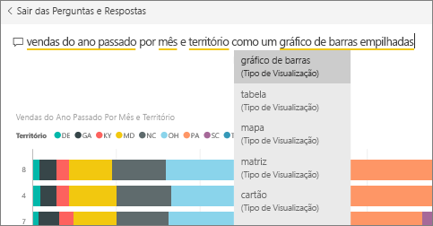
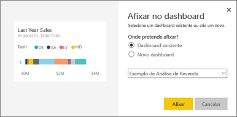
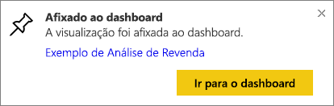
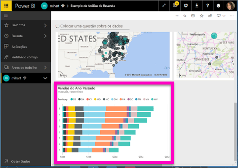
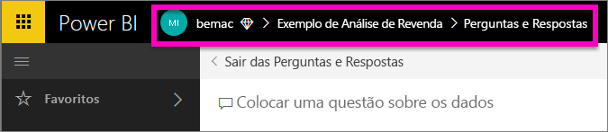

# Afixar um mosaico a um dashboard a partir das Perguntas e Respostas
## Como afixar um mosaico a partir das Perguntas e Respostas
P e R é a ferramenta de geração de relatórios ad hoc do Power BI. Precisa de encontrar informações específicas? Faça uma pergunta sobre os dados e receba uma resposta na forma de uma visualização.

Nesta explicação de procedimento, utilizaremos o serviço Power BI (app.powerbi.com) para abrir um dashboard, fazer uma pergunta com linguagem natural para criar uma visualização e afixar essa visualização num dashboard. Os dashboards não estão disponíveis no Power BI Desktop. Para obter informações sobre como utilizar as Perguntas e Respostas com outras ferramentas e conteúdo do Power BI, veja a [Descrição geral das Perguntas e Respostas do Power BI](power-bi-q-and-a.md). 

Para acompanhar, abra o [dashboard do exemplo de Análise de Revenda](sample-retail-analysis.md).

1. Abra um [dashboard](service-dashboards.md) que tenha pelo menos um mosaico afixado de um relatório. Quando fizer uma pergunta, o Power BI procura uma resposta em qualquer conjunto de dados que tenha um mosaico afixado a esse dashboard.  Para obter mais informações, veja [Obter dados](service-get-data.md).
2. Na caixa de perguntas, na parte superior do dashboard, escreva o que pretende saber sobre os dados.  
   
3. Por exemplo, ao escrever "vendas do ano passado por mês e território"...  
   

   a caixa de pergunta dá-lhe sugestões.
4. Para adicionar o gráfico ao dashboard como um mosaico, selecione o pino  no lado direito superior da tela. Se o dashboard foi partilhado consigo, não poderá afixar visualizações.

5. Afixe o mosaico num dashboard existente ou num novo dashboard.

   

   * Dashboard existente: selecione o nome do dashboard a partir da lista pendente. As suas opções estão limitadas apenas a estes dashboards na área de trabalho atual.
   * Novo dashboard: escreva o nome do novo dashboard e este será adicionado à sua área de trabalho atual.

6. Selecione **Afixar**.

   Uma mensagem de êxito (perto do canto superior direito) informa que a visualização foi adicionada, como um mosaico, ao dashboard.  

   
7. Selecione **Ir para o dashboard** para ver o novo mosaico. Aqui, pode [mudar o nome, redimensionar, adicionar uma hiperligação, reposicionar o mosaico e muito mais](service-dashboard-edit-tile.md) no seu dashboard.

   

## Considerações e resolução de problemas
* Quando começa a escrever uma pergunta, o P e R começa imediatamente a procurar a melhor resposta de todos os conjuntos de dados associados ao dashboard atual.  O "dashboard atual" é o dashboard, listado na barra de navegação superior. Por exemplo, esta questão está a ser feita no dashboard **Exemplo de Análise de Revenda** que faz parte da área de trabalho da aplicação **mihart**.

  
* **De que forma as Perguntas e Respostas sabem que conjuntos de dados devem utilizar**?  As Perguntas e Respostas têm acesso a todos os conjuntos de dados que têm, pelo menos, uma visualização afixada nesse dashboard.

* **Não vê a caixa de pergunta**? Fale com o seu administrador do Power BI. O administrador tem a capacidade de desativar as Perguntas e Respostas.

## Próximos passos
[Mudar o nome, redimensionar, adicionar uma hiperligação, reposicionar o mosaico e muito mais](service-dashboard-edit-tile.md)    
[Apresentar um mosaico do dashboard no Modo de detalhe](service-focus-mode.md)     
[Voltar às Perguntas e Repostas no Power BI](power-bi-q-and-a.md)  
Mais perguntas? [Pergunte à Comunidade do Power BI](http://community.powerbi.com/)
