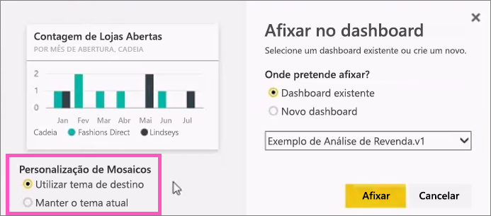
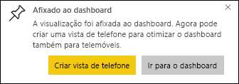

# Afixar um mosaico a um dashboard do Power BI a partir de um relatório
## Afixar mosaicos a partir de um relatório
Uma maneira de adicionar um novo [mosaico de dashboard](service-dashboard-tiles.md) é a partir de um [relatório do Power BI](service-reports.md). Na verdade, pode adicionar vários novos mosaicos a partir de um relatório.  Quando clica em cada um desses mosaicos, é direcionado de volta para o relatório.

Pode adicionar páginas de relatório inteiras a um dashboard.  Esta ação também é conhecida como afixação de um mosaico *dinâmico*.  É *dinâmico* porque pode interagir com o mosaico no dashboard e porque, ao contrário dos mosaicos de visualização individual, as alterações feitas no relatório são sincronizadas com o dashboard. Leia mais sobre isto a seguir.

Não é possível afixar mosaicos de relatórios que tenham sido partilhados consigo ou do Power BI Desktop. 

> **DICA**: algumas visualizações utilizam imagens de fundo. A afixação poderá não funcionar se a imagem de fundo for demasiado grande.  Tente reduzir o tamanho da imagem ou utilizar a compressão de imagem.  
> 
> 

## Afixar um mosaico a partir de um relatório
Veja a Amanda criar um dashboard ao afixar elementos visuais e imagens a partir de um relatório do Power BI.

<iframe width="560" height="315" src="https://www.youtube.com/embed/lJKgWnvl6bQ" frameborder="0" allowfullscreen></iframe>

Agora, crie o seu próprio dashboard utilizando um dos relatórios de exemplo do Power BI.

1. Paire o rato sobre a visualização que quer afixar e selecione o ícone de afixar . O Power BI abre o ecrã **Afixar no dashboard**.
   
     
2. Decida se quer fixar a um dashboard existente ou a um novo.
   
   * Dashboard existente: selecione o nome do dashboard na lista pendente. Os dashboard que foram partilhados consigo não aparecerão na lista pendente.
   * Novo dashboard: escreva o nome do novo dashboard.
3. Em alguns casos, o item afixado pode ter um *tema* já aplicado.  Por exemplo, os elementos visuais afixados a partir de um livro do Excel. Nesse caso, selecione o tema a aplicar ao mosaico.
4. Selecione **Afixar**.
   
   Uma mensagem de Êxito (perto do canto superior direito) informa que a visualização foi adicionada, como um mosaico, ao dashboard.
   
   
5. No painel de navegação, selecione o dashboard com o novo mosaico. Selecione o mosaico para voltar ao relatório. Ou, [edite a apresentação e o comportamento do mosaico](service-dashboard-edit-tile.md).

## Afixar uma página de relatório inteira
Outra opção é afixar uma página de relatório inteira a um dashboard. Esta é uma forma fácil de afixar mais de uma visualização de cada vez.  Além disso, quando afixa uma página inteira, os mosaicos são *dinâmicos*; pode interagir com eles diretamente no dashboard. As alterações feitas a qualquer uma das visualizações no editor de relatórios, como adicionar um filtro ou alterar os campos utilizados no gráfico, também são refletidas no mosaico do dashboard.  

Para obter mais informações, veja [Afixar uma página de relatório inteira](service-dashboard-pin-live-tile-from-report.md)

## Próximos passos
[Dashboards no Power BI](service-dashboards.md)

[Mosaicos de dashboard no Power BI](service-dashboard-tiles.md)

[Relatórios no Power BI](service-reports.md)

[Atualização de dados no Power BI](refresh-data.md)

[Conceitos básicos do Power BI](service-basic-concepts.md)

Mais perguntas? [Pergunte à Comunidade do Power BI](http://community.powerbi.com/)

