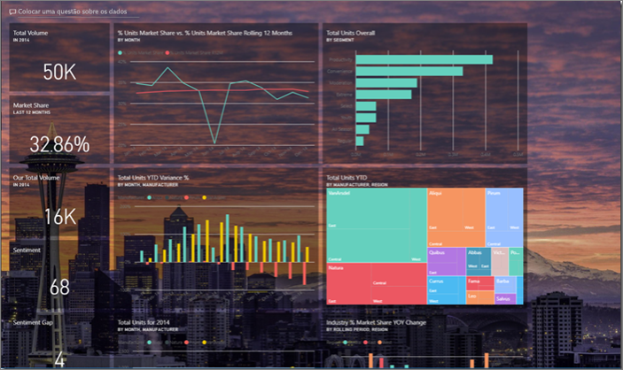
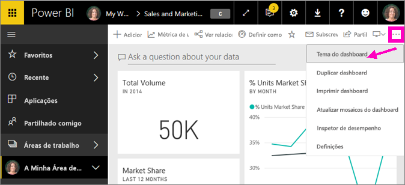
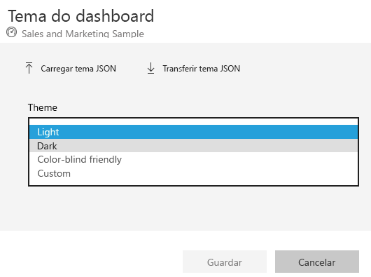
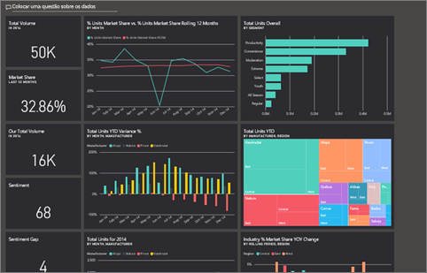
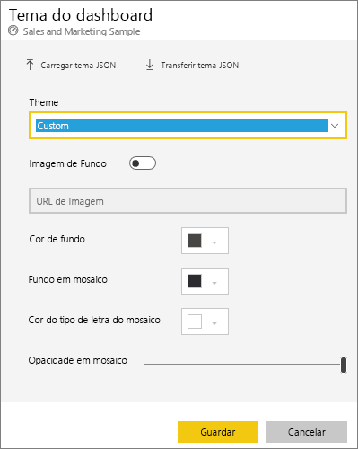
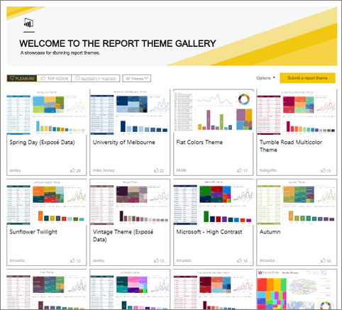
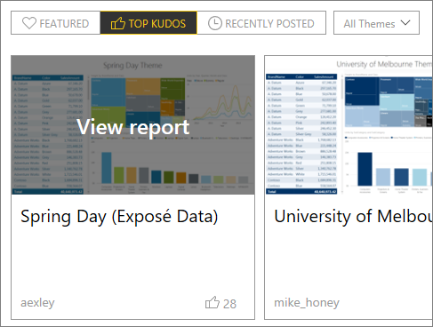
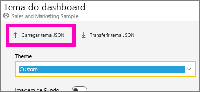
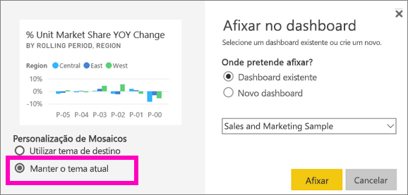
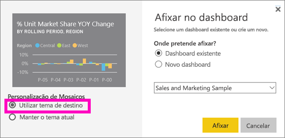

# Utilizar Temas de Dashboard no serviço Power BI
Com **Temas de Dashboard**, pode aplicar um tema de cores a todo o dashboard, como cores empresariais, cores sazonais ou qualquer outro tema de cores que pretenda aplicar. Quando aplica um **Tema do Dashboard**, todos os elementos visuais no dashboard utilizam as cores do tema selecionado (aplicam-se algumas exceções, descritas mais à frente neste artigo).

Alterar as cores dos elementos visuais do relatório no dashboard não afetará os elementos visuais no relatório. Além disso, ao afixar mosaicos de um relatório que já tem um [tema de relatório aplicado](desktop-report-themes.md), terá a opção de manter o tema atual ou utilizar o tema do dashboard.

## Pré-requisitos
* Para acompanhar, abra o [dashboard de exemplo de Vendas e Marketing](sample-datasets.md).

## Como funcionam os Temas de Dashboard
Para começar, abra um dashboard que tenha criado (ou no qual tenha permissão de edição) e que pretenda personalizar. Selecione as reticências (...) e selecione **Tema do dashboard**. 

No painel do dashboard apresentado, selecione um dos temas pré-criados.  No exemplo abaixo, selecionámos **Escuro**.

## Criar um tema personalizado

O tema predefinido para os dashboards do Power BI é **Claro**. Se quiser personalizar as cores ou criar o seu próprio tema, selecione **Personalizar** no menu pendente. 

Utilize as opções de personalização para criar o seu próprio tema do dashboard. Se adicionar uma imagem de fundo, recomendamos que a sua imagem tenha uma resolução mínima de 1920x1080. Para utilizar uma imagem como fundo, carregue a imagem para um site público, copie o URL e cole-o no campo **URL da imagem**. 

### Utilizar temas JSON
Outra forma de criar um tema personalizado é carregar um ficheiro JSON que tenha definições para todas as cores que pretende utilizar no seu dashboard. No Power BI Desktop, os criadores de relatórios utilizam ficheiros JSON para [criar temas para relatórios](desktop-report-themes.md). Estes ficheiros JSON podem ser carregados para dashboards ou pode encontrar e carregar ficheiros JSON a partir da [página da galeria de temas](https://community.powerbi.com/t5/Themes-Gallery/bd-p/ThemesGallery) na Comunidade do Power BI 

Também pode guardar o seu tema personalizado como um ficheiro JSON e, em seguida, partilhá-lo com outros criadores de dashboards. 

### Utilizar um tema da Galeria de Temas

Tal como as opções personalizadas e incorporadas, quando o tema é carregado, as cores são automaticamente aplicadas em todos os mosaicos no dashboard. 

1. Paire o cursor sobre um tema e selecione **View report (Ver relatório)**.

    

2. Desloque-se para baixo e procure a ligação para o ficheiro JSON.  Selecione o ícone de transferência e guarde o ficheiro.

    

3. No serviço Power BI, na janela Personalizar tema do dashboard, selecione **Carregar tema JSON**.

    

4. Navegue até à localização onde guardou o ficheiro do tema JSON e selecione **Abrir**.

5. Na página Tema do dashboard, selecione **Guardar**. O novo tema é aplicado ao seu dashboard.

    

## Considerações e limitações

* Se o relatório estiver a utilizar um tema diferente do tema do dashboard, pode controlar se o elemento visual mantém o tema atual ou utiliza o tema do dashboard para obter consistência em elementos visuais de várias origens. Quando afixar um mosaico a um dashboard, para manter o tema do relatório, selecione **Manter o tema atual**. O elemento visual no dashboard irá manter o tema do relatório, incluindo as definições de transparência. 

    Só verá as opções de **Personalização de Mosaicos** se tiver criado o relatório no Power BI Desktop, [adicionado um tema de relatório](desktop-report-themes.md) e, em seguida, publicado o relatório no serviço Power BI. 

    

    Experimente afixar novamente o mosaico e selecionar **Utilizar tema do dashboard**.

    

* Os temas de dashboard não podem ser aplicados a páginas de relatórios dinâmicos afixados, mosaicos de iFrame, mosaicos de SSRS, mosaicos de livros ou imagens.
* Os temas de dashboard podem ser vistos em dispositivos móveis, mas só pode criar um tema de dashboard no serviço Power BI. 
* Os temas de dashboard personalizados só funcionam com mosaicos afixados a partir de relatórios. 

