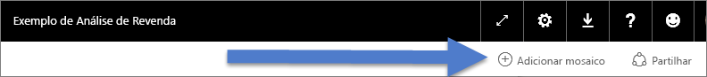
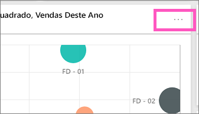
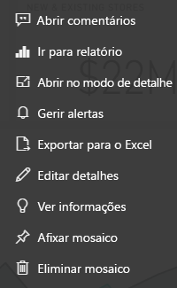

# Introdução aos mosaicos dos dashboards para designers do Power BI

Um mosaico é um instantâneo dos seus dados, afixado ao dashboard. Um mosaico pode ser criado a partir de um relatório, de um conjunto de dados, dashboard, a partir da caixa de Perguntas e Respostas, do Excel, dos relatórios do SQL Server Reporting Services (SSRS) e muito mais.  Esta captura de ecrã mostra vários mosaicos diferentes afixados a um dashboard.

Os dashboards e os mosaicos de dashboard são uma funcionalidade do serviço Power BI e não do Power BI Desktop. Não pode criar dashboards em dispositivos móveis, mas pode [ver e partilhá-los](mobile-apps-view-dashboard.md) lá.

Para além da afixação, pode criar mosaicos autónomos diretamente no dashboard com a opção [Adicionar mosaico](service-dashboard-add-widget.md). Os mosaicos autónomos incluem: caixas de texto, imagens, vídeos, dados de transmissão em fluxo e conteúdo Web.

Precisa de ajuda para compreender os mosaicos modulares que compõem o Power BI?  Veja [Power BI – Conceitos básicos](service-basic-concepts.md).

> [!NOTE]
> Se a visualização original utilizada para criar o mosaico for alterada, o mosaico não será alterado.  Por exemplo, se afixou um gráfico de linhas de um relatório e, em seguida, alterou o gráfico de linhas para um gráfico de barras, o mosaico do dashboard continua a mostrar um gráfico de linhas. Os dados são atualizados, mas o tipo de visualização não.
> 
> 

## Afixar um mosaico a partir de...
Existem diversas formas diferentes de adicionar (afixar) um mosaico a um dashboard. Os mosaicos podem ser afixados a partir de:

* [Perguntas e Respostas do Power BI](service-dashboard-pin-tile-from-q-and-a.md)
* [um relatório](service-dashboard-pin-tile-from-report.md)
* [outro dashboard](service-pin-tile-to-another-dashboard.md)
* [um livro do Excel no OneDrive para Empresas](service-dashboard-pin-tile-from-excel.md)
* [Power BI Publisher para Excel](publisher-for-excel.md)
* [Informações Rápidas](service-insights.md)
* [Reporting Services](https://docs.microsoft.com/sql/reporting-services/pin-reporting-services-items-to-power-bi-dashboards)

E os mosaicos autónomos para imagens, caixas de texto, vídeos, dados de transmissão em fluxo e conteúdo Web podem ser criados diretamente no dashboard com a opção [Adicionar mosaico](service-dashboard-add-widget.md).

  

## Interagir com mosaicos num dashboard
### Mover e redimensionar um mosaico
Pegue num mosaico e [mova-o no dashboard](service-dashboard-edit-tile.md). Paire o cursor e selecione a  para redimensionar o mosaico.

### Passe o rato sobre um mosaico para alterar a aparência e o comportamento
1. Passe o rato sobre o mosaico para apresentar as reticências.
   
    
2. Selecione as reticências para abrir o menu de ação do mosaico.
   
    
   
    A partir daqui, pode:
   
   * [Abrir o relatório utilizado para criar este mosaico ](service-reports.md)   
   
   * [Abrir a folha de cálculo utilizada para criar este mosaico ](service-reports.md)   
     
    * [Ver no modo de detalhe ](service-focus-mode.md)   
     * [Exportar os dados utilizados no mosaico](visuals/power-bi-visualization-export-data.md) 
     * [Editar o título e subtítulo, adicionar uma hiperligação](service-dashboard-edit-tile.md) 
     * [Executar informações ](service-insights.md) 
     * [Afixar o mosaico a outro dashboard ](service-pin-tile-to-another-dashboard.md)
       
     * [Remover o mosaico](service-dashboard-edit-tile.md)
     
3. Para fechar o menu de ação, selecione uma área em branco na tela.

### Selecionar (clicar) um mosaico
Ao selecionar um mosaico, o que ocorre a seguir depende de como o criou. Além disso, se o mosaico tiver uma [ligação personalizada](service-dashboard-edit-tile.md), a seleção do mesmo irá encaminhar para essa ligação. Caso contrário, a seleção do mosaico encaminha para o relatório, livro do Excel Online, relatório local do Reporting Services ou pergunta das Perguntas e Respostas que foi utilizada para criar o mosaico.

> [!NOTE]
> A exceção são os mosaicos de vídeo criados diretamente no dashboard com a opção **Adicionar mosaico**. A seleção de um mosaico de vídeo (criado desta forma) faz com que o vídeo seja reproduzido diretamente no dashboard.   
> 
> 

## Considerações e resolução de problemas

* Se o relatório usado para criar a visualização não tiver sido guardado, então selecionar um mosaico não produzirá nenhuma ação.
* Se o mosaico foi criado a partir de um livro no Excel Online, terá de ter pelo menos permissões de leitura para esse livro. Caso contrário, selecionar o mosaico não abrirá o livro no Excel Online.
* Digamos que cria um mosaico diretamente no dashboard através da opção **Adicionar mosaico** e define uma hiperligação personalizada para o mesmo. Se assim for, quando selecionar o título, o subtítulo ou o mosaico, esse URL será aberto. Caso contrário, por predefinição, não acontecerá nada ao selecionar um destes mosaicos criados diretamente no dashboard para uma imagem, código Web ou caixa de texto.
* Se não tiver permissão para o relatório no Reporting Services, a seleção de um mosaico criado a partir dos Reporting Services irá encaminhar para uma página com a indicação de que não tem acesso (rsAccessDenied).
* Se não tiver acesso à rede onde o servidor Reporting Services está localizado, a seleção de um mosaico criado a partir do Reporting Services irá encaminhar para uma página com a indicação de que não é possível localizar o servidor (HTTP 404). O seu dispositivo precisa de acesso de rede ao servidor de relatórios para ver o relatório.
* Se a visualização original utilizada para criar o mosaico for alterada, o mosaico não será alterado.  Por exemplo, se afixar um gráfico de linhas de um relatório e, em seguida, alterar o gráfico de linhas para um gráfico de barras, o mosaico do dashboard continuará a apresentar um gráfico de linhas. Os dados são atualizados, mas o tipo de visualização não.

## Próximos passos
[Criar um cartão (mosaico de número grande) para o dashboard](power-bi-visualization-card.md)

[Dashboards no Power BI](service-dashboards.md)  

[Atualização de dados](refresh-data.md)

[Power BI - Conceitos Básicos](service-basic-concepts.md)

[Exportar um mosaico para o Power Point](http://blogs.msdn.com/b/powerbidev/archive/2015/09/28/integrating-power-bi-tiles-into-office-documents.aspx)

[Afixar itens do Reporting Services nos Dashboards do Power BI](https://msdn.microsoft.com/library/mt604784.aspx)

Mais perguntas? [Pergunte à Comunidade do Power BI](http://community.powerbi.com/)

