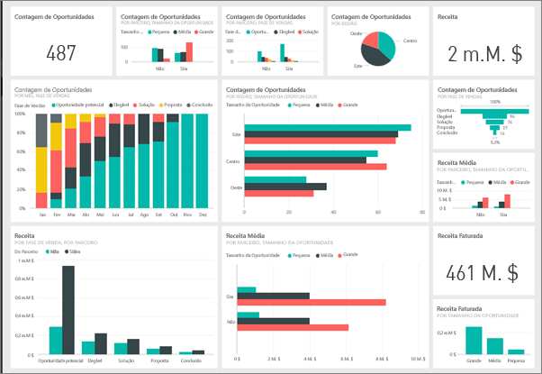
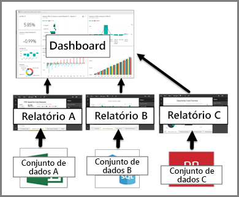

# Introdução aos dashboards para designers do Power BI

Um ***dashboard*** do Power BI é uma página única, frequentemente denominada tela, que utiliza visualizações para contar uma história. Como está limitado a uma página, um dashboard bem concebido contém apenas os elementos mais importantes da história. Os leitores podem ver relatórios relacionados para obter detalhes.

Os dashboards são uma funcionalidade do serviço Power BI. Não estão disponíveis no Power BI Desktop. Não pode criar dashboards em dispositivos móveis, mas pode [ver e partilhá-los](mobile-apps-view-dashboard.md) lá.

## Conceitos básicos dos dashboard 

As visualizações que vê no dashboard são denominadas *mosaicos*. Pode *afixar* os mosaicos num dashboard a partir de relatórios. Se for um novo utilizador do Power BI, pode obter uma boa base de aprendizagem ao ler os [conceitos básicos do Power BI](service-basic-concepts.md).

> [!IMPORTANT]
> É necessário uma licença [Power BI Pro](service-free-vs-pro.md) para criar dashboards.

As visualizações num dashboard são provenientes de relatórios e cada relatório baseia-se num conjunto de dados. Uma forma de pensar num dashboard é pensar numa entrada para os relatórios e conjuntos de dados subjacentes. Selecionar uma visualização leva-o ao relatório (e ao conjunto de dados) em que se baseia.

## Vantagens dos dashboards
Os dashboards são uma forma fantástica de monitorizar a sua empresa e ver rapidamente todas as métricas mais importantes. As visualizações num dashboard podem ser provenientes de um ou vários conjuntos de dados subjacentes ou de um ou vários relatórios subjacentes. Um dashboard combina dados no local e na cloud ao fornecer uma vista consolidada, independentemente de onde os dados residem.

Um dashboard não é apenas uma imagem bonita. É também altamente interativa e os mosaicos são atualizados à medida que os dados subjacentes são alterados.

## Dashboards versus relatórios
Os [Relatórios](service-reports.md) e os dashboards parecem semelhantes porque ambos são telas preenchidas com visualizações. No entanto, existem diferenças importantes.

| **Capacidade** | **Dashboards** | **Relatórios** |
| --- | --- | --- |
| Páginas |Uma página |Uma ou mais páginas |
| Origens de dados |Um ou mais relatórios e um ou mais conjuntos de dados por dashboard |Um único conjunto de dados por relatório |
| Disponível no Power BI Desktop |Não |Sim, os ***criadores*** podem criar e ver relatórios no Power BI Desktop |
| Subscrever |Pode subscrever um dashboard |Pode subscrever páginas de relatório |
| Filtragem |Não pode filtrar nem segmentar |Várias formas diferentes de filtrar, realçar e segmentar |
| Destaques |Pode definir um dashboard como o seu dashboard "em destaque" |Não pode criar um relatório em destaque |
| Favorito | Pode definir dashboards como *favoritos* | Pode definir relatórios como *favoritos*
| Definir alertas |Disponível para mosaicos de dashboards em determinadas circunstâncias |Não disponível nos relatórios |
| Consultas de linguagem natural |Disponível no dashboard |Não disponível nos relatórios |
| Pode ver as tabelas e os campos de conjuntos de dados subjacentes |Não. Pode exportar dados mas não pode ver tabelas e campos no próprio dashboard. |Sim. Pode ver tabelas, campos e valores de conjuntos de dados. |
| Personalização |Não |Na Vista de leitura, pode publicar, incorporar, filtrar, exportar, transferir como .pbix, ver conteúdos relacionados, gerar códigos QR, analisar no Excel e mais.  |

## Próximos passos
* Conheça melhor os dashboards ao ver uma apresentação de um dos nossos [dashboards de exemplo](sample-tutorial-connect-to-the-samples.md).
* Saiba mais sobre os [mosaicos de dashboards](service-dashboard-tiles.md).
* Quer controlar um mosaico do dashboard individual e receber um e-mail quando atingir um determinado limiar? [Crie alertas nos mosaicos](service-set-data-alerts.md).
* Saiba como utilizar as [Perguntas e Respostas do Power BI](power-bi-tutorial-q-and-a.md) para fazer uma pergunta sobre os dados e receber uma resposta na forma de uma visualização.
