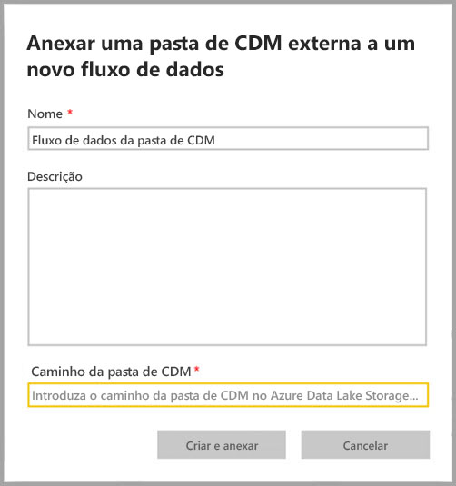
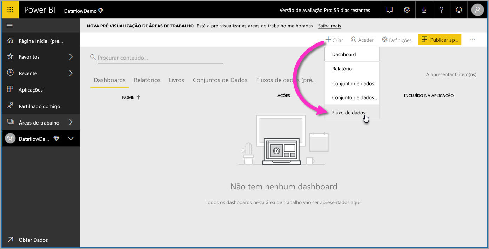
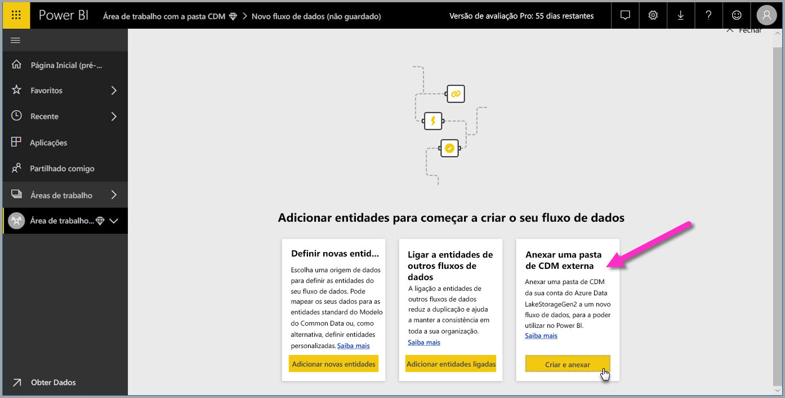
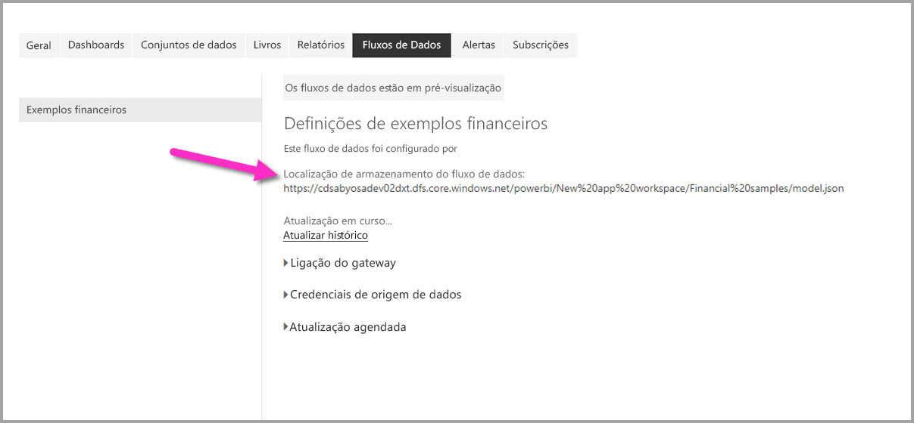

# Adicionar uma pasta de CDM ao Power BI como um fluxo de dados (Pré-visualização)

No Power BI, pode adicionar pastas de CDM (Common Data Service) armazenadas no Azure Data Lake Store Gen2 da sua organização como fluxos de dados. E, depois de criar um fluxo de dados a partir de uma pasta de CDM, pode utilizar o **Power BI Desktop** e o **serviço Power BI** para criar conjuntos de dados, relatórios, dashboards e aplicações que se baseiam nos dados que coloca nas pastas de CDM.

Existem alguns requisitos para a criação de fluxos de dados a partir de pastas de CDM, como a lista seguinte descreve:

* Um administrador tem de ligar a conta de armazenamento ADLS Gen2 no Power BI para a poder utilizar. Veja [Ligar o Azure Data Lake Storage Gen2 para armazenar fluxo de dados](service-dataflows-connect-azure-data-lake-storage-gen2.md) para saber como ligar uma conta ADLS Gen2 ao Power BI.
* A criação de fluxos de dados a partir de pastas de CDM *apenas* está disponível na [nova experiência de área de trabalho](service-create-the-new-workspaces.md). 
* Adicionar uma pasta de CDM ao Power BI requer que o utilizador que adicionar a pasta tenha [autorização para a pasta de CDM e os respetivos ficheiros](https://go.microsoft.com/fwlink/?linkid=2029121).
* Devem ser-lhe concedidas permissões de leitura e de execução em todos os ficheiros e pastas na pasta de CDM, para os adicionar ao Power BI.

As secções seguintes descrevem como criar um fluxo de dados a partir de uma pasta de CDM.

## Autorizar os utilizadores das pastas CDM a criar um fluxo de dados

Para criar um fluxo de dados a partir de uma pasta CDM, as seguintes permissões devem ser adicionadas:
* O utilizador que vai aceder à pasta CDM através do Power BI deve ser listado na função **Proprietário dos Dados do Storage Blob** da conta de armazenamento.
* O utilizador que aceder à pasta CDM através do Power BI deve ter ACLs de **Acesso de Leitura** e **Acesso de Execução** tanto na pasta CDM como em quaisquer ficheiros ou pastas dentro da mesma. 

## Criar um fluxo de dados de uma pasta de CDM

Para começar a criar um fluxo de dados a partir de uma pasta de CDM, inicie o **Serviço Power BI** e selecione uma **área de trabalho** no painel de navegação. Também pode criar uma nova área de trabalho, na qual pode criar o novo fluxo de dados.

No ecrã apresentado, selecione para **Criar e anexar**, conforme mostrado na imagem seguinte.

O ecrã apresentado a seguir permite-lhe atribuir um nome ao fluxo de dados, fornecer uma descrição do fluxo de dados e indicar o caminho para a pasta de CDM na conta do Azure Data Lake Gen2 da sua organização. Leia a seção no artigo que descreve [como obter o caminho da pasta de CDM](service-dataflows-configure-workspace-storage-settings.md#get-the-uri-of-stored-dataflow-files). 

Depois de fornecer as informações, selecione **Criar e anexar** para criar o fluxo de dados.

Os fluxos de dados de pastas de CDM ficam marcados com o ícone *externo* quando são apresentados no Power BI. Na seção seguinte, descreveremos as diferenças entre fluxos de dados padrão e fluxos de dados criados a partir de pastas de CDM.

Assim que as permissões estiverem definidas corretamente, conforme descrito anteriormente neste artigo, pode ligar ao seu fluxo de dados no **Power BI Desktop**.

## Considerações e limitações

Ao trabalhar com permissões para um fluxo de dados criado a partir de uma pasta de CDM, o processo é semelhante ao das origens de dados externas no Power BI. As permissões são geridas na origem de dados e não a partir do Power BI. As permissões têm de ser definidas adequadamente na origem de dados, como um fluxo de dados criado a partir de uma pasta de CDM, para que funcionem corretamente no Power BI.

As listas seguintes ajudam a esclarecer como os fluxos de dados de pastas de CDM funcionam no Power BI.

Áreas de trabalho do Power BI Pro, Premium e Embedded:
* Não pode editar os fluxos de dados de pastas de CDM
* As permissões para ler um fluxo de dados criado a partir de uma pasta de CDM são geridas pelo proprietário da pasta de CDM e não pelo Power BI

Power BI Desktop:
* Apenas os utilizadores que têm autorização para a área de trabalho na qual o fluxo de dados foi criado e para a pasta de CDM podem aceder aos dados a partir do conector de Fluxos de Dados do Power BI

Existem algumas considerações adicionais, descritas na lista seguinte:

* A criação de fluxos de dados a partir de pastas de CDM *apenas* está disponível na [nova experiência de área de trabalho](service-create-the-new-workspaces.md)
* As entidades ligadas não estão disponíveis para fluxos de dados criados a partir de pastas de CDM

Os clientes do **Power BI Desktop** não podem aceder a fluxos de dados armazenados numa conta do Azure Data Lake Storage Gen2, salvo se forem os proprietários do fluxo de dados ou se lhes tiver sido dada autorização explícita para a pasta de CDM do fluxo de dados. Considere a situação seguinte:

1.    A Ana cria uma nova área de trabalho e configura-a para armazenar os fluxos de dados de uma pasta de CDM.
2.    O Nuno, que também é membro da área de trabalho criada pela Ana, quer utilizar o Power BI Desktop e o conector de fluxo de dados para obter dados do fluxo de dados criado pela Ana.
3.    O Miguel recebe um erro porque não foi adicionado como utilizador autorizado à pasta de CDM do fluxo de dados no data lake.

  

Para resolver este problema, devem ser concedidas permissões de leitor ao Nuno à Pasta de CDM e aos respetivos ficheiros. Pode saber mais sobre como conceder acesso à pasta de CDM [neste artigo](https://go.microsoft.com/fwlink/?linkid=2029121).

## Próximos Passos

Este artigo disponibilizou orientação sobre como configurar o armazenamento de área de trabalho para fluxos de dados. Para obter informações adicionais, veja os seguintes artigos:

Para obter mais informações sobre fluxos de dados, CDM e o Azure Data Lake Storage Gen2, veja os seguintes artigos:

* [Fluxos de dados e integração do Azure Data Lake (Pré-visualização)](service-dataflows-azure-data-lake-integration.md)
* [Configure workspace dataflow settings (Preview) (Configurar as definições de fluxos de dados da área de trabalho [Pré-visualização])](service-dataflows-configure-workspace-storage-settings.md)
* [Connect Azure Data Lake Storage Gen2 for dataflow storage (Preview) (Ligar o Azure Data Lake Storage Gen2 para armazenar fluxos de dados [Pré-visualização])](service-dataflows-connect-azure-data-lake-storage-gen2.md)

Para obter informações sobre fluxos de dados em geral, veja estes artigos:

* [Criar e utilizar fluxos de dados no Power BI](service-dataflows-create-use.md)
* [Utilizar entidades calculadas no Power BI Premium](service-dataflows-computed-entities-premium.md)
* [Utilizar fluxos de dados com origens de dados no local](service-dataflows-on-premises-gateways.md)
* [Recursos para programadores para fluxos de dados do Power BI](service-dataflows-developer-resources.md)

Para obter mais informações sobre o armazenamento do Azure, leia estes artigos:
* [Guia de segurança de Armazenamento do Azure](https://docs.microsoft.com/azure/storage/common/storage-security-guide)
* [Configurar a atualização agendada](refresh-scheduled-refresh.md)
* [Introdução aos exemplos do github dos Serviços de Dados do Azure](https://aka.ms/cdmadstutorial)

Para obter mais informações sobre o Common Data Service, pode ler o seguinte artigo de descrição geral:
* [Common Data Service – descrição geral](https://docs.microsoft.com/powerapps/common-data-model/overview)
* [Pastas de CDM](https://go.microsoft.com/fwlink/?linkid=2045304)
* [Definição do ficheiro de modelo do CDM](https://go.microsoft.com/fwlink/?linkid=2045521)

Pode sempre experimentar [colocar perguntas à Comunidade do Power BI](https://community.powerbi.com/).

