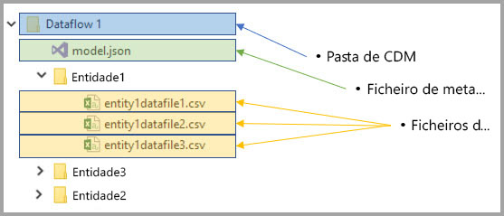
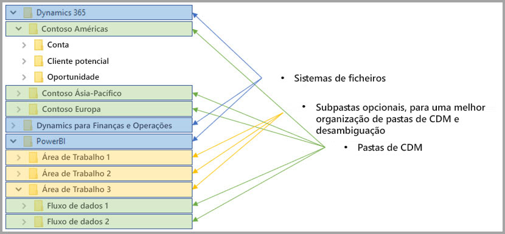

# Integração dos fluxos de dados e do Azure Data Lake (Pré-visualização)

Por predefinição, os dados utilizados com o Power BI são armazenados no armazenamento interno fornecido pelo Power BI. Com a integração dos fluxos de dados e do Azure Data Lake Storage Gen2 (ADLS Gen2), pode armazenar os seus fluxos de dados na conta do Azure Data Lake Storage Gen2 da sua organização. 

> [!NOTE]
> A funcionalidade de fluxos de dados está em pré-visualização e está sujeita a alterações e atualizações antes da disponibilidade geral.

## Relação entre as pastas de CDM e os fluxos de dados

Com os **fluxos de dados**, os utilizadores e as organizações podem unir dados de diferentes origens e prepará-los para fins de modelação. Com o Common Data Model (CDM), as organizações podem utilizar um formato de dados que proporciona consistência semântica entre as aplicações e implementações. Além disso, com o Azure Data Lake Storage Gen2 (ADLS Gen2), é possível aplicar um controlo de acesso e autorização detalhado aos data lakes no Azure. Quando combinados, estes elementos fornecem dados centralizados sólidos, dados estruturados, controlo de acesso detalhado e consistência semântica para aplicações e iniciados em toda a empresa.

Os dados armazenados em formato CDM proporcionam consistência semântica nas aplicações e implementações de uma organização. Com a integração de CDM com o ADLS Gen2, é possível aplicar a mesma consistência estrutural e o mesmo significado semântico aos dados armazenados no ADLS Gen2 através da utilização de pastas de CDM que contêm dados esquematizados em formato CDM padrão. Os metadados padronizados e os dados autodescritivos num Azure Data Lake simplificam a deteção de metadados e a interoperação entre produtores e consumidores de dados, como o Power BI, o Azure Data Factory, o Azure Data Lake, o Databricks e o Azure Machine Learning (ML). 

Os fluxos de dados armazenam a definição e os dados em pastas de CDM, nos seguintes formatos:

**Model.json**
* O ficheiro de descrição de metadados **Model.json** contém informações semânticas sobre os atributos e registos de entidades, bem como ligações para os ficheiros de dados subjacentes. A existência do ficheiro model.json indica a conformidade com o formato de metadados CDM e pode incluir entidades padrão com metadados semânticos multifacetados prontos a utilizar adicionais que as aplicações podem utilizar.
* O Power BI também armazena as informações de cada origem de dados juntamente com a **consulta e as transformações** geradas pela experiência do Editor de Fluxos de Dados no serviço Power BI. As palavras-passe para origens de dados não são armazenadas no ficheiro de modelo.

**Ficheiros de dados**
* Os ficheiros de dados estão incluídos na pasta de CDM numa estrutura e formato bem definidos (as subpastas são opcionais, conforme descrito mais adiante neste artigo) e são referenciados no ficheiro model.json. Atualmente, os ficheiros de dados têm de estar no formato. csv, mas poderão vir a ser suportados formatos adicionais nas atualizações subsequentes. 

O diagrama seguinte mostra uma pasta de CDM de exemplo, criada por um fluxo de dados do Power BI, que contém três entidades:

O ficheiro de metadados ou model.json na imagem anterior estabelece os indicadores para os ficheiros de dados das entidades em toda a pasta de CDM.

## O Power BI organiza as pastas de CDM no data lake

Com os fluxos de dados do Power BI e respetiva integração com o ADLS Gen2, o Power BI pode produzir dados num data lake. Enquanto produtor de dados, o Power BI tem de criar uma pasta de CDM para cada fluxo de dados que contém o ficheiro model.json e respetivos ficheiros de dados associados. O Power BI armazena os dados de forma isolada relativamente a outros produtores de dados no data lake através da utilização de *sistemas de ficheiros*. Pode ler mais sobre o sistema de ficheiros e o espaço de nomes hierárquico do Azure Data Lake Storage Gen2 no [artigo que os descreve](https://docs.microsoft.com/azure/storage/data-lake-storage/namespace).

O Power BI utiliza subpastas para desambiguação e para proporcionar uma melhor organização dos dados quando estes são apresentados no **serviço Power BI**. A nomenclatura e a estrutura das pastas representam áreas de trabalho (Pastas) e fluxos de dados (Pastas de CDM). O diagrama seguinte mostra como um data lake partilhado pelo Power BI e por outros produtores de dados pode ser estruturado. Cada serviço, neste caso o Dynamics 365, o Dynamics for Finance and Operations e o Power BI, cria e mantém o seu próprio sistema de ficheiros. Consoante a experiência em cada serviço, são criadas subpastas para organizar melhor as pastas de CDM dentro do sistema de ficheiros. 

## O Power BI protege os dados no data lake

O Power BI utiliza os tokens de *Portador de OAuth do Active Directory* e a funcionalidade *ACLs POSIX* fornecidos pelo Azure Data Lake Storage Gen2. Estas funcionalidades permitem delimitar o acesso do Power BI ao sistema de ficheiros que gere no data lake, bem como delimitar o acesso das pessoas apenas aos fluxos de dados ou às pastas de CDM criadas por elas. 

Para criar e gerir as pastas de CDM dentro do sistema de ficheiros do Power BI, são necessárias permissões de leitura, escrita e execução relativas ao sistema de ficheiros. Cada fluxo de dados criado no Power BI é armazenado na sua própria pasta de CDM, sendo concedido ao proprietário do fluxo de dados acesso só de leitura à pasta de CDM e respetivo conteúdo. Esta abordagem protege a integridade dos dados gerados pelo Power BI e permite aos administradores monitorizar quem foram os utilizadores que acederam à pasta de CDM através de registos de auditoria. 

### Autorizar utilizadores ou serviços para pastas de CDM

A partilha de pastas de CDM com os consumidores de dados, como utilizadores ou serviços que precisam de ler os dados, é simplificada com os tokens de Portador de OAuth do Active Directory e as ACLs POSIX. Tal permite aos administradores monitorizar quem acedeu à pasta de CDM. A única ação necessária passa por conceder acesso a um objeto do Active Directory à sua escolha (por exemplo, um grupo de utilizadores ou serviço) à pasta de CDM. Recomendamos que todos os acessos à pasta de CDM, para qualquer identidade que não seja o produtor de dados, sejam concedidos como só de leitura. Se o fizer, protege a integridade dos dados gerados pelo produtor.

Para adicionar pastas de CDM ao Power BI, o utilizador que adiciona a Pasta de CDM deve ter ACLs de Acesso de *Leitura* tanto na pasta de CDM propriamente dita como em todos os ficheiros ou pastas aí contidos. Além disso, deve ter ACLs de Acesso de *Execução* tanto na pasta de CDM propriamente dita como em todas as pastas aí contidas. Recomendamos que reveja os artigos [Listas de controlo de acesso em ficheiros e no diretório](https://docs.microsoft.com/azure/storage/blobs/data-lake-storage-access-control#access-control-lists-on-files-and-directories) e [Melhores práticas para a utilização do Azure Data Lake Storage Gen2](https://docs.microsoft.com/azure/storage/blobs/data-lake-storage-best-practices) para obter mais informações.

### Formas alternativas de autorização

As pessoas ou serviços externos ao Power BI também podem tirar partido de formas alternativas de autorização. Estas alternativas concedem aos titulares que detêm o acesso chave a *todos* os recursos na conta, acesso total a todos os recursos no lake, não podendo o acesso ser delimitado aos sistemas de ficheiros ou às Pastas de CDM. Essas alternativas podem ser simples formas de conceder acesso; porém, limitam a capacidade de partilhar recursos específicos no data lake e não fornecem aos utilizadores uma auditoria de quem acedeu o armazenamento. O artigo [Controlo de acesso no Azure Data Lake Storage Gen2](https://docs.microsoft.com/azure/storage/blobs/data-lake-storage-access-control
) fornece detalhes completos sobre os esquemas de autorização disponíveis.

## Próximos passos

Este artigo disponibilizou uma descrição geral da integração dos fluxos de dados do Power BI, das pastas de CDM e do Azure Data Lake Storage Gen2. Para obter informações adicionais, veja os seguintes artigos:

Para obter mais informações sobre fluxos de dados, CDM e o Azure Data Lake Storage Gen2, veja os seguintes artigos:

* [Configure workspace dataflow settings (Preview) (Configurar as definições de fluxos de dados da área de trabalho [Pré-visualização])](service-dataflows-configure-workspace-storage-settings.md)
* [Add a CDM folder to Power BI as a dataflow (Preview) (Adicionar uma pasta de CDM ao Power BI como um fluxo de dados [Pré-visualização])](service-dataflows-add-cdm-folder.md)
* [Connect Azure Data Lake Storage Gen2 for dataflow storage (Preview) (Ligar o Azure Data Lake Storage Gen2 para armazenar fluxos de dados [Pré-visualização])](service-dataflows-connect-azure-data-lake-storage-gen2.md)

Para obter informações sobre fluxos de dados em geral, veja estes artigos:

* [Criar e utilizar fluxos de dados no Power BI](service-dataflows-create-use.md)
* [Utilizar entidades calculadas no Power BI Premium (Pré-visualização)](service-dataflows-computed-entities-premium.md)
* [Utilizar fluxos de dados com origens de dados no local (Pré-visualização)](service-dataflows-on-premises-gateways.md)
* [Recursos para programadores para fluxos de dados do Power BI (Pré-visualização)](service-dataflows-developer-resources.md)

Para obter mais informações sobre o Armazenamento do Azure, leia estes artigos:
* [Guia de segurança de Armazenamento do Azure](https://docs.microsoft.com/azure/storage/common/storage-security-guide)
* [Introdução aos exemplos do github dos Serviços de Dados do Azure](https://aka.ms/cdmadstutorial)

Para obter mais informações sobre o Common Data Service, pode ler o seguinte artigo de descrição geral:
* [Common Data Service – descrição geral](https://docs.microsoft.com/powerapps/common-data-model/overview)
* [Pastas de CDM](https://go.microsoft.com/fwlink/?linkid=2045304)
* [Definição do ficheiro de modelo do CDM](https://go.microsoft.com/fwlink/?linkid=2045521)

Pode sempre experimentar [colocar perguntas à Comunidade do Power BI](http://community.powerbi.com/).
