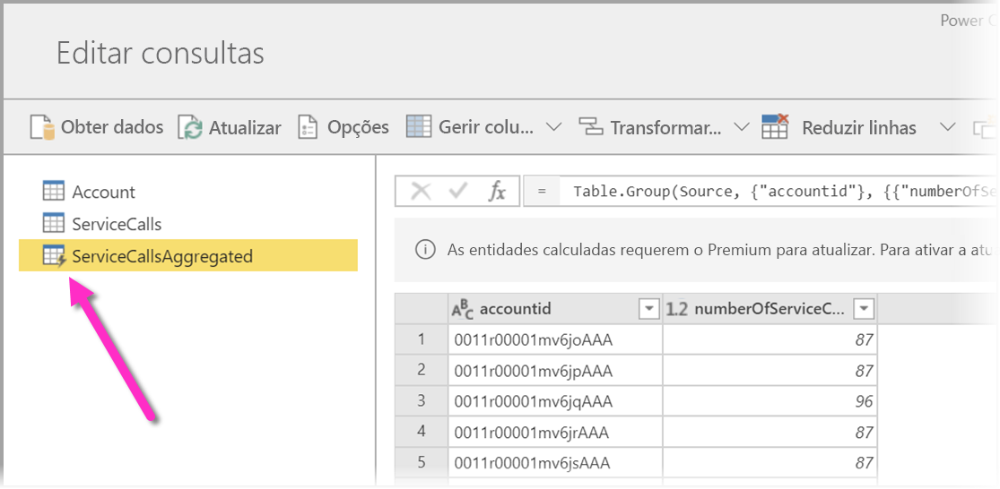
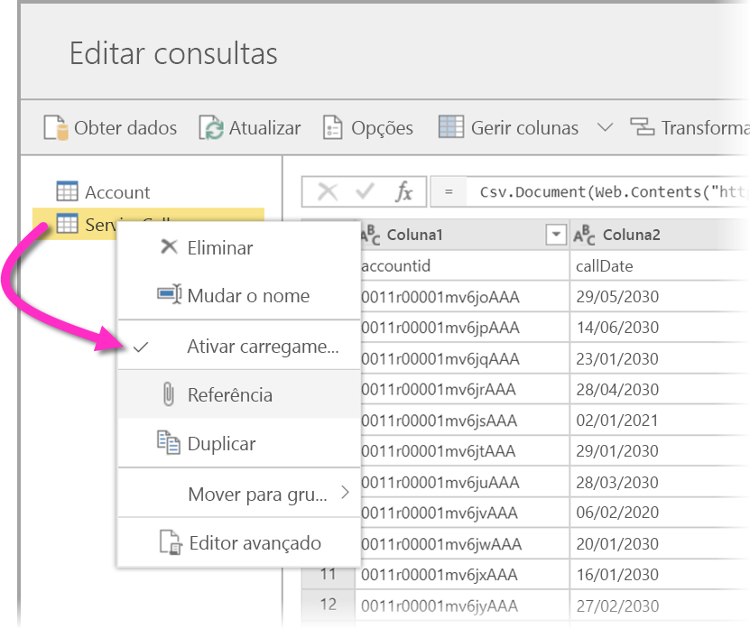
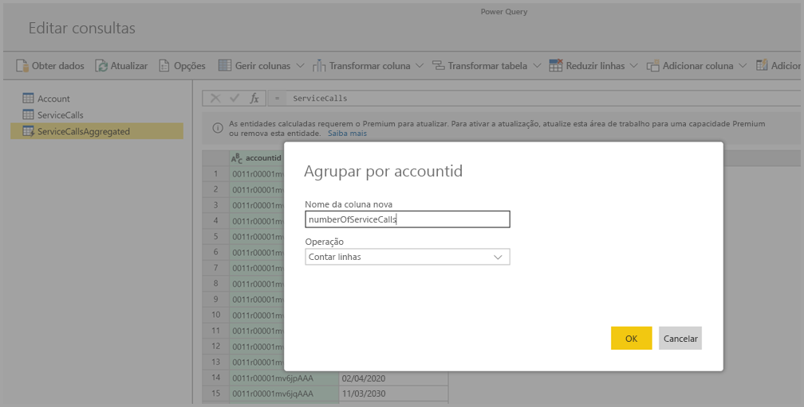
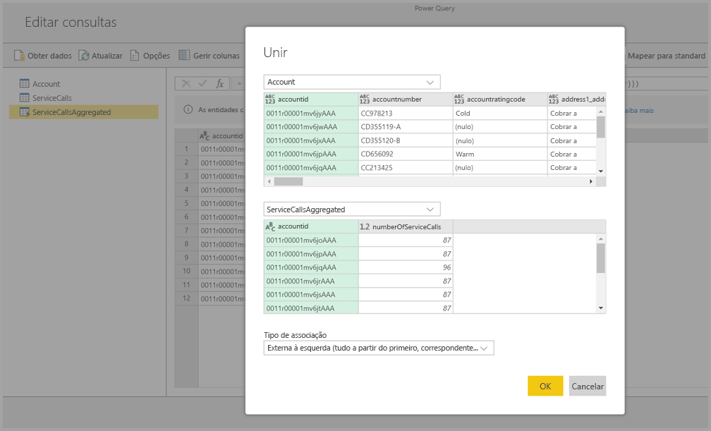
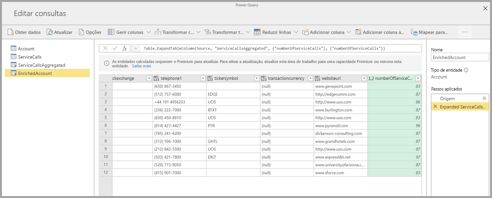

# Utilizar entidades calculadas no Power BI Premium (Pré-visualização)

Pode realizar **cálculos no armazenamento** ao utilizar **fluxos de dados** com uma subscrição do Power BI Premium. Tal permite-lhe realizar cálculos com os seus fluxos de dados existentes e devolver resultados que lhe permitem concentrar-se na criação de relatórios e nas análises. 

Para efetuar **cálculos no armazenamento**, primeiro tem de criar o fluxo de dados e trazer os dados para o armazenamento desse fluxo de dados do Power BI. Assim que tiver um fluxo de dados com dados, pode criar **entidades calculadas**, que são entidades que realizam cálculos no armazenamento. 

Existem duas formas de ligar os dados do fluxo de dados ao Power BI:

* [Utilizar a criação da gestão personalizada de um fluxo de dados](service-dataflows-create-use.md)
* Utilizar um fluxo de dados externo

As secções seguintes descrevem como criar entidades calculadas nos seus dados do fluxo de dados.

> [!NOTE]
> A funcionalidade de fluxos de dados está em pré-visualização e está sujeita a alterações e atualizações antes da disponibilidade geral.

## Como criar entidades calculadas 

Assim que tiver um fluxo de dados com uma lista de entidades, pode realizar cálculos nessas entidades.

Na ferramenta de criação de fluxos de dados no serviço Power BI, selecione **Editar entidades** e, em seguida, clique com o botão direito do rato na entidade que quer utilizar como base para a sua entidade calculada e na qual deseja realizar cálculos. No menu de contexto, escolha **Referência**.

Para a entidade ser elegível como entidade calculada, a opção **Permitir carga** deve ser marcada, conforme mostrado na imagem seguinte. Clique com o botão direito do rato na entidade para apresentar o menu de contexto.

Ao selecionar **Ativar carga**, cria uma nova entidade para a qual a respetiva origem é a entidade referenciada. O ícone é alterado e mostra o ícone **calculado**, conforme mostrado na imagem seguinte.

Qualquer transformação que efetuar nesta entidade recentemente criada será executada nos dados que já residem no armazenamento de fluxo de dados do Power BI. Isso significa que a consulta não será executada com a origem de dados externos da qual os dados foram importados (por exemplo, a base de dados SQL da qual foram obtidos os dados), mas, em vez disso, é executada nos dados que residem no armazenamento do fluxo de dados.

### Casos de utilização de exemplo
Que tipo de transformações podem ser executadas com as entidades calculadas? Todas as transformações que especificar, normalmente, com a interface de utilizador de transformação no Power BI ou no editor M, são suportadas ao realizar o cálculo no armazenamento. 

Considere o seguinte exemplo: tem uma entidade *Conta* que contém os dados não processados de todos os clientes da sua subscrição do Dynamics 365. Tem também dados não processados das *ServiceCalls* do Centro de Assistência, com dados de chamadas de suporte que foram efetuadas a partir de contas diferentes em cada dia do ano.

Imagine que deseja enriquecer a entidade *Conta* com dados das *ServiceCalls*. 

Primeiro, terá de agregar os dados das ServiceCalls para calcular o número de chamadas de suporte que foram feitas para cada conta no último ano. 

Em seguida, deve unir a entidade *Conta* com a entidade *ServiceCallsAggregated* para calcular a tabela **Conta** melhorada.

E, em seguida, pode ver os resultados, mostrados como *EnrichedAccount* na imagem seguinte.

E é tudo. A transformação é executada nos dados no fluxo de dados que reside na sua subscrição do Power BI Premium e não nos dados da origem.

## Considerações e limitações

É importante observar que, se remover a área de trabalho da capacidade do Power BI Premium, o fluxo de dados associado já não será atualizado. 

Ao trabalhar com fluxos de dados criados especificamente numa conta do Azure Data Lake Storage Gen2 de uma organização, as entidades ligadas e as entidades calculadas só funcionam corretamente quando as entidades residem na mesma conta de armazenamento. Para mais informações, veja [Ligar o Azure Data Lake Storage Gen2 para armazenar fluxos de dados (Pré-visualização)](service-dataflows-connect-azure-data-lake-storage-gen2.md).

Alem disso, as entidades ligadas não estão disponíveis para fluxos de dados criados a partir de pastas do CDM. Veja [Adicionar uma pasta do CDM ao Power BI como um fluxo de dados (Pré-visualização)](service-dataflows-add-cdm-folder.md).

## Próximos Passos

Este artigo descreveu as entidades calculadas e os fluxos de dados disponíveis no serviço Power BI. Veja a seguir mais alguns artigos que podem ser úteis.

* [Preparação personalizada de dados com fluxos de dados](service-dataflows-overview.md)
* [Criar e utilizar fluxos de dados no Power BI](service-dataflows-create-use.md)
* [Utilizar fluxos de dados com origens de dados no local (Pré-visualização)](service-dataflows-on-premises-gateways.md)
* [Recursos para programadores para fluxos de dados do Power BI (Pré-visualização)](service-dataflows-developer-resources.md)
* [Configure workspace dataflow settings (Preview) (Configurar as definições de fluxos de dados da área de trabalho [Pré-visualização])](service-dataflows-configure-workspace-storage-settings.md)
* [Add a CDM folder to Power BI as a dataflow (Preview) (Adicionar uma pasta de CDM ao Power BI como um fluxo de dados [Pré-visualização])](service-dataflows-add-cdm-folder.md)
* [Connect Azure Data Lake Storage Gen2 for dataflow storage (Preview) (Ligar o Azure Data Lake Storage Gen2 para armazenar fluxos de dados [Pré-visualização])](service-dataflows-connect-azure-data-lake-storage-gen2.md)

Para obter mais informações sobre o Power Query e a atualização agendada, pode ler estes artigos:
* [Descrição geral das consultas no Power BI Desktop](desktop-query-overview.md)
* [Configurar a atualização agendada](refresh-scheduled-refresh.md)

Para obter mais informações sobre o Common Data Service, pode ler o seguinte artigo de descrição geral:
* [Common Data Service – descrição geral](https://docs.microsoft.com/powerapps/common-data-model/overview)

