# Criar e utilizar fluxos de dados no Power BI (Pré-visualização)

Com a preparação de dados avançada disponível no **Power BI**, pode criar uma coleção de dados chamada fluxo de dados, que, em seguida, pode utilizar para estabelecer ligação a dados de negócio de várias origens, limpar os dados, transformá-los e, em seguida, carregá-los no armazenamento do Power BI.

Um **fluxo de dados** é uma coleção de *entidades* (as entidades são semelhantes a tabelas) que são criadas e geridas em áreas de trabalho de aplicação no serviço Power BI. Pode adicionar e editar entidades no seu fluxo de dados, bem como gerir agendas de atualização de dados, diretamente a partir da área de trabalho na qual o seu fluxo de dados foi criado.

Depois de criar um fluxo de dados, pode utilizar o **Power BI Desktop** e o **serviço Power BI** para criar conjuntos de dados, relatórios, dashboards e aplicações que se baseiam nos dados que coloca nos fluxos de dados do Power BI e, dessa forma, obter informações sobre as suas atividades de negócios.

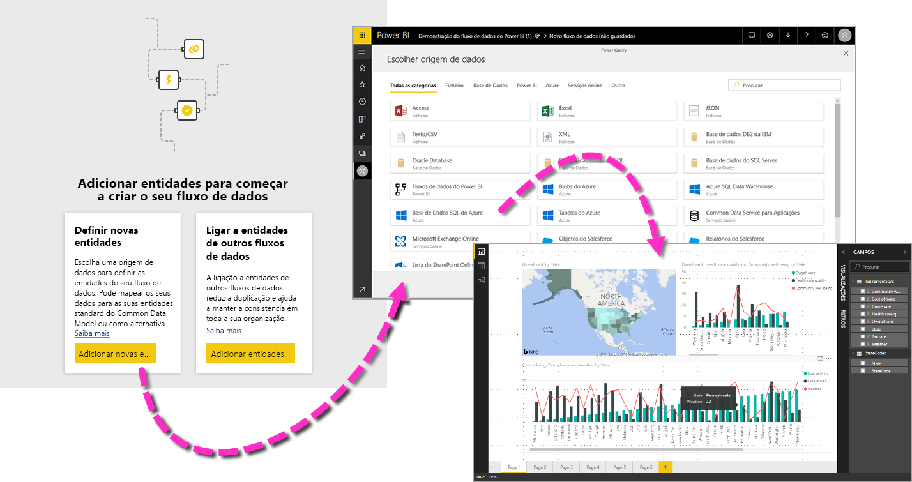

Existem três passos principais para utilizar um fluxo de dados:

1. Criar o fluxo de dados, com as ferramentas da Microsoft que foram concebidas para o fazer de uma forma direta
2. Agendar a frequência de atualização dos dados que pretende trazer para o seu fluxo de dados
3. Criar o conjunto de dados com o seu fluxo de dados, através do Power BI Desktop 

Nas seções a seguir, vamos examinar cada um desses passos e familiarizarmo-nos com as ferramentas disponibilizadas para concluir cada passo. Vamos começar.

> [!NOTE]
> A funcionalidade de fluxos de dados está em pré-visualização e está sujeita a alterações e atualizações antes da disponibilidade geral.

## Criar um fluxo de dados
Para criar um fluxo de dados, inicie o serviço Power BI num browser, em seguida, selecione uma **área de trabalho de aplicação** (os fluxos de dados não estão disponíveis na *minha área de trabalho* no serviço Power BI) no painel de navegação esquerdo, como mostrado no ecrã seguinte. Também pode criar uma nova área para criar o novo fluxo de dados. 

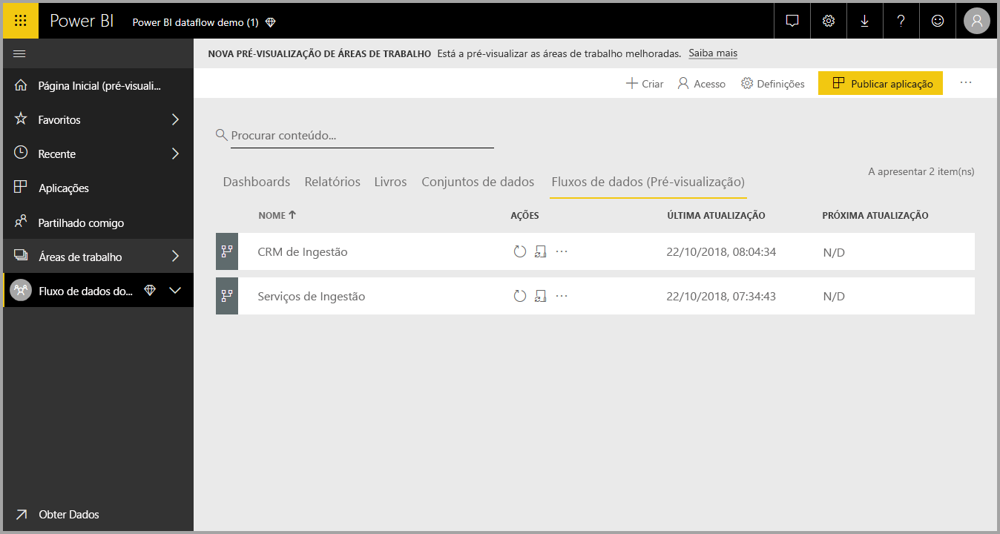

Assim que estiver numa **área de trabalho de aplicação**, onde pode criar um fluxo de dados, o botão **+ Criar** aparece no canto superior direito da tela. Selecione o botão **+ Criar** e, em seguida, selecione **Fluxo de dados** na lista pendente. 

É importante saber que existe apenas *um proprietário* para qualquer fluxo de dados, que é a pessoa que o cria. Apenas o proprietário pode editar o fluxo de dados. Todos os membros da **área de trabalho de aplicação** que têm permissões de leitura ou de escrita para a área de trabalho de aplicação onde é criado o fluxo de dados podem ligar-se ao fluxo de dados a partir do **Power BI Desktop**, conforme descrito mais à frente neste artigo.

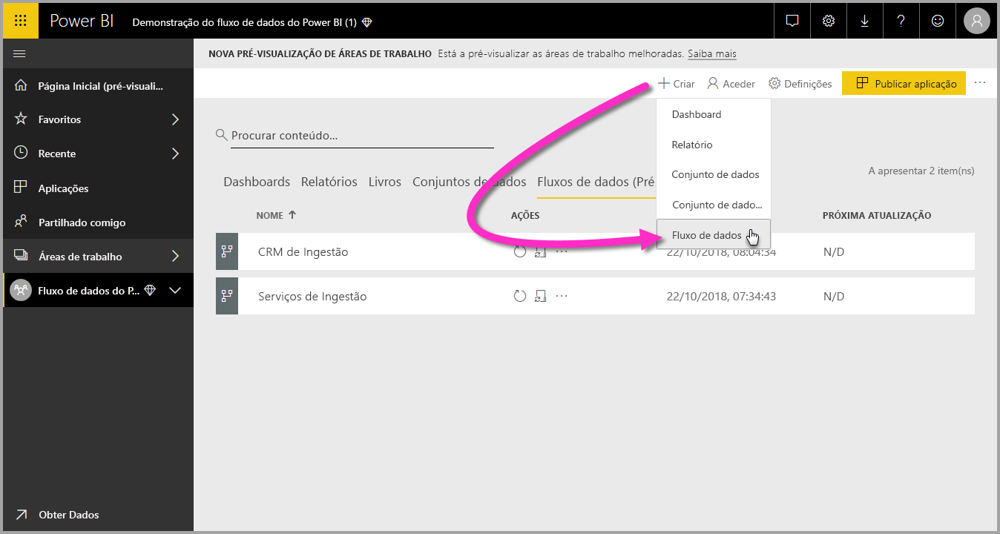

A partir daí, vai adicionar **Entidades**, descritas de forma mais detalhada na secção seguinte.

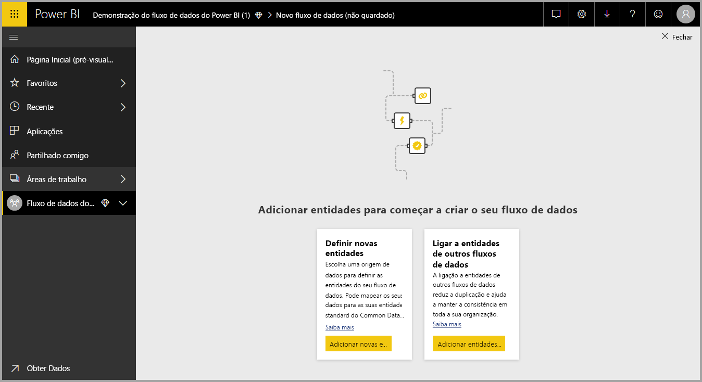

### Adicionar Entidades

Uma **entidade** é um conjunto de campos que servem para armazenar dados, tal como uma tabela numa base de dados. Na imagem seguinte, verá a seleção de origens de dados a partir das quais pode ingerir dados no Power BI.

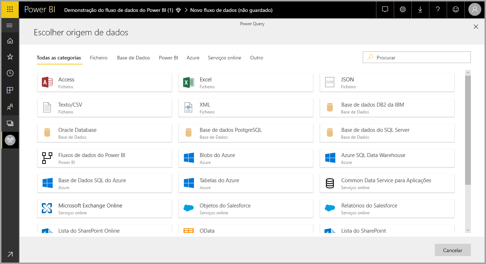

Quando selecionar uma origem de dados, é-lhe pedido para indicar as definições da ligação, incluindo a conta a utilizar ao ligar à origem de dados, conforme mostrado na imagem seguinte.

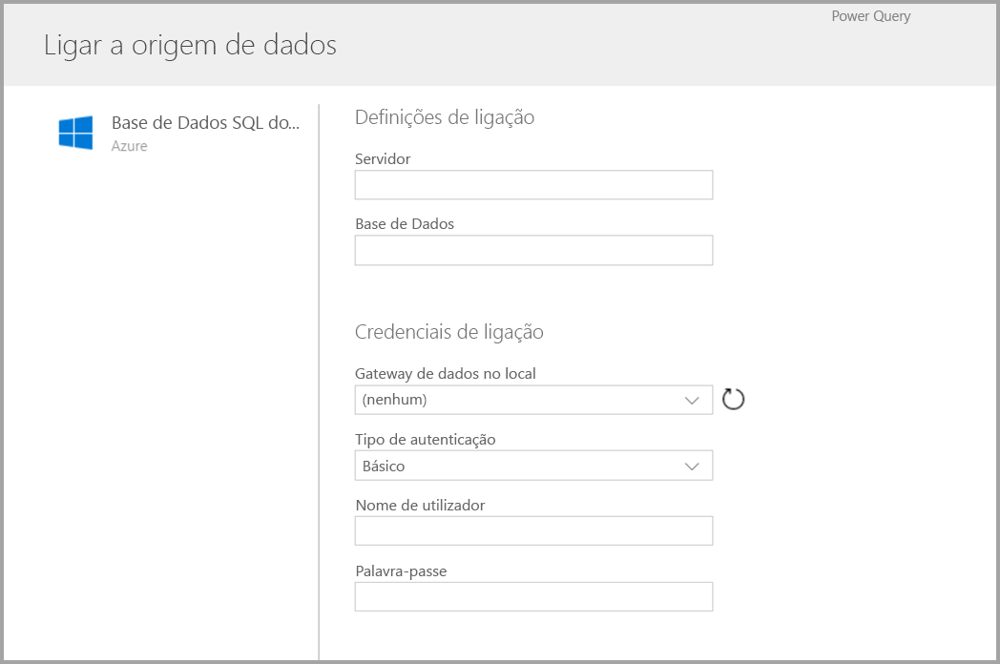

Depois de ligado, pode selecionar os dados a utilizar para a entidade. Ao escolher os dados e uma origem, o Power BI voltará posteriormente a ligar à origem de dados para manter os dados no fluxo de dados atualizados, com a frequência que selecionar mais tarde no processo de configuração.

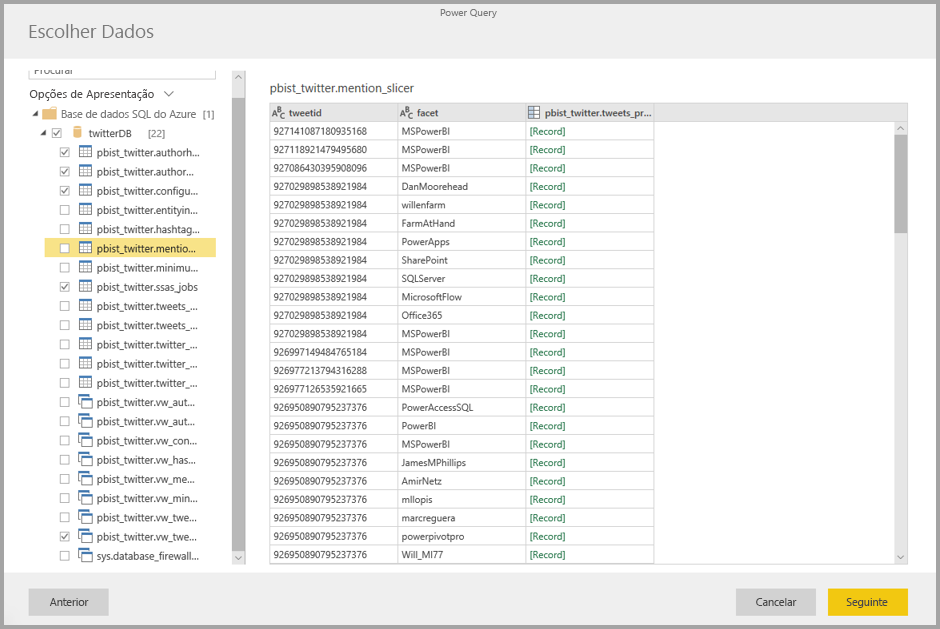

Depois de selecionar os dados para utilização na entidade, pode utilizar o editor de fluxo de dados para formatar ou transformar esses dados no formato necessário a utilizar no fluxo de dados.

### Utilizar o editor de fluxo de dados

Depois de selecionar quais os dados da sua origem a utilizar para a sua entidade, pode formatar a sua seleção de dados num formato mais adequado à sua entidade, através do Power Query, à semelhança do **Editor do Power Query** no **Power BI Desktop**. Pode saber mais sobre o Power Query (o Power Query está incorporado no Power BI Desktop como Editor do Power Query) no [artigo de descrição geral do Query](desktop-query-overview.md) do Power BI Desktop. 

Se pretender ver o código que a Consulta está a criar em cada passo ou criar o seu próprio código de formatação, pode utilizar o **Editor Avançado**. 

### Fluxos de dados e o Common Data Service (CDS)

As entidades de fluxos de dados incluem novas ferramentas para mapear facilmente os dados da sua empresa para o Common Data Service (o esquema padronizado da Microsoft), enriquecê-los com dados da Microsoft e dados de terceiros e obter acesso simplificado à aprendizagem automática. Estas novas capacidades podem ser aproveitadas para proporcionar informações inteligentes e acionáveis sobre os seus dados de negócio. Depois de concluir as transformações no passo Editar Consultas, pode mapear as colunas das suas tabelas de origem de dados para campos de entidade padrão, conforme definido pelo Common Data Service. As entidades padrão têm um esquema conhecido definido pelo Common Data Service.

Obtenha mais informações sobre esta abordagem e sobre o Common Data Service, no artigo [O que é o Common Data Service?](https://docs.microsoft.com/powerapps/common-data-model/overview)

Para tirar partido do Common Data Service com o seu fluxo de dados, clique na transformação **Mapear para Padrão** na caixa de diálogo **Editar Consultas**. No ecrã **Mapear Entidades** apresentado, pode selecionar a entidade padrão para a qual pretende mapear.

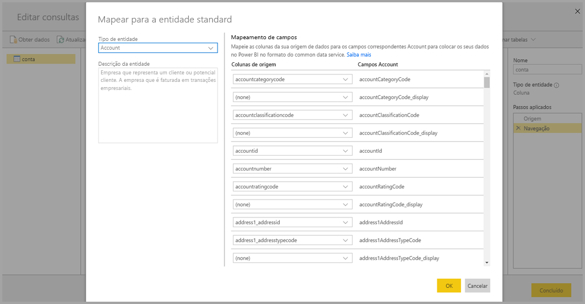

Quando mapear uma coluna da origem para o campo padrão, ocorre o seguinte:

1. A coluna da origem assume o nome do campo padrão (o nome da coluna será alterado se os nomes forem diferentes)
2. A coluna da origem obtém o tipo de dados do campo padrão

Para manter a entidade padrão do Common Data Service, todos os campos padrão que não são mapeados obtêm valores *Nulos*.

Todas as colunas da origem que não estão mapeadas permanecem tal como estão para garantir que o resultado do mapeamento é uma entidade padrão com campos personalizados.

Depois de concluir as suas seleções e quando a sua entidade e as definições de dados estiverem prontas, pode selecionar **Guardar** no menu. Repare que pode criar várias entidades, ao selecionar o botão **Adicionar entidades**, e pode Editar entidades para refinar as consultas e as entidades que criou.

Quando seleciona **Guardar**, é-lhe pedido para dar um nome ao fluxo de dados e indicar uma descrição.

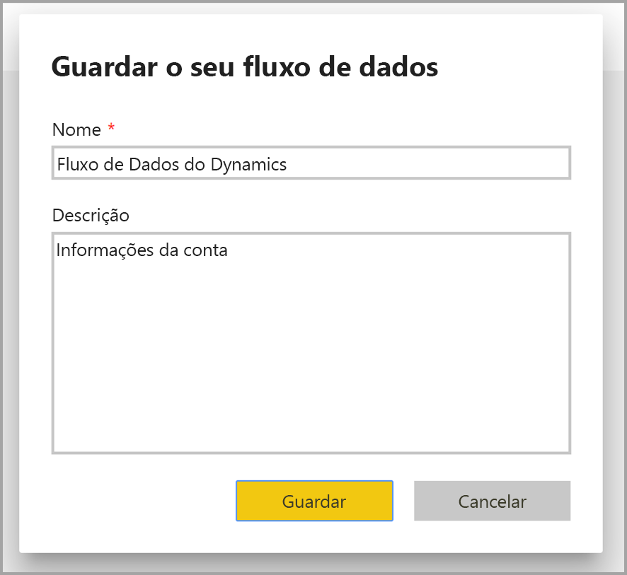

Quando estiver pronto e selecionar o botão **Guardar**, é apresentada uma janela a indicar que o **fluxo de dados** foi criado. 

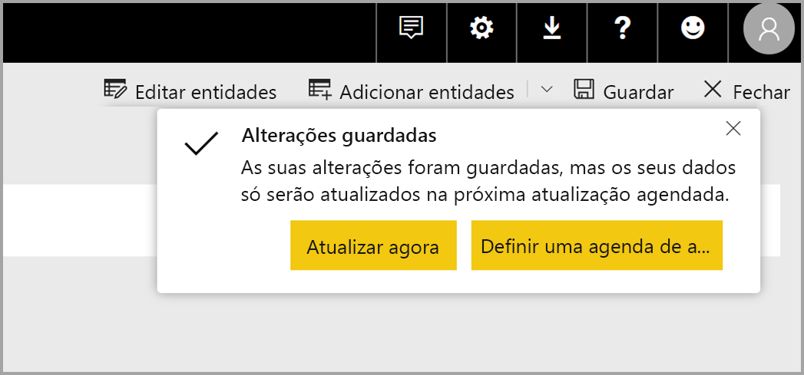

Ótimo, agora está pronto para o próximo passo, que é agendar a frequência de atualização das suas origens de dados.

## Agendar a frequência de atualização

Após guardar o fluxo de dados, vai querer agendar a frequência de atualização para cada uma das suas origens de dados ligadas.

Os fluxos de dados do Power BI utilizam o processo de atualização de dados do Power BI para manter os dados atualizados. No **serviço Power BI**, na secção **área de trabalho de aplicação**, existe uma coleção de áreas onde as suas informações podem ser listadas, incluindo os fluxos de dados, conforme mostrado na imagem seguinte.

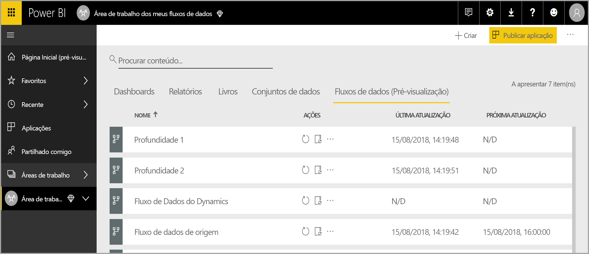

A entrada *Fluxo de dados do Dynamics* na imagem anterior é o fluxo de dados que criámos na secção anterior. Para agendar a atualização, selecione o ícone **Agendar atualização** na secção **Ações**, conforme mostrado na imagem seguinte. 

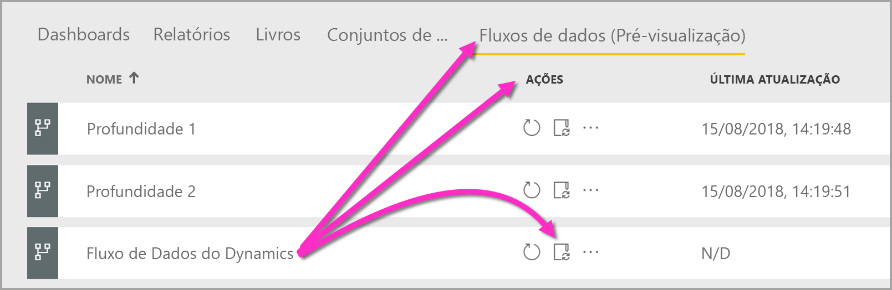

Quando seleciona o ícone **Agendar atualização** será encaminhado para o painel **Agendar atualização**, o qual permite que defina a frequência e a hora de atualização dos fluxos de dados.

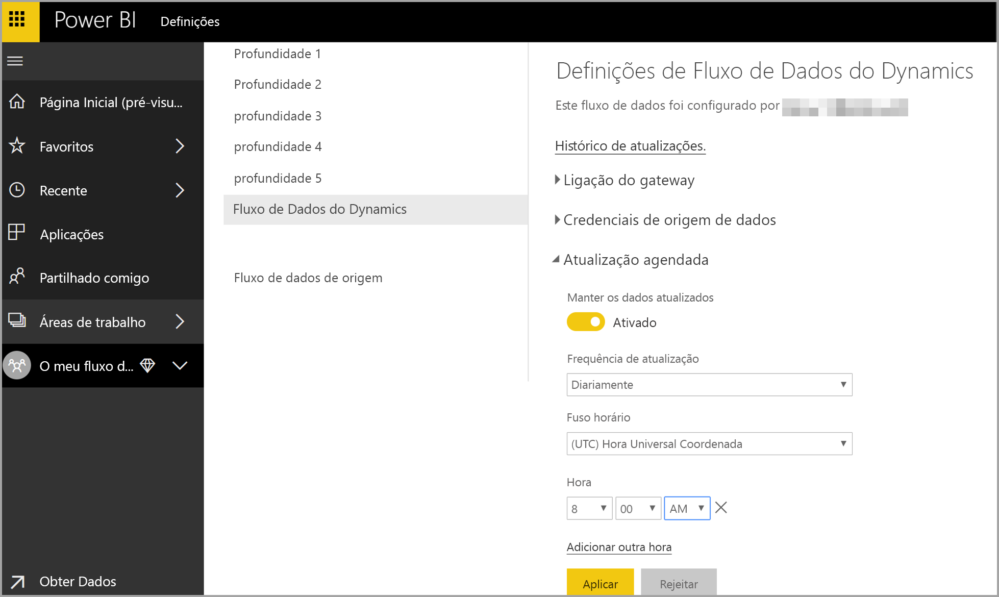

Para obter mais informações sobre o agendamento da atualização, veja o artigo [Configurar a atualização agendada](refresh-scheduled-refresh.md), que descreve o comportamento de atualização dos conjuntos de dados do Power BI. Os fluxos de dados têm o mesmo comportamento dos conjuntos de dados do Power BI em termos de definições de atualização. 

## Ligar aos fluxos de dados no Power BI Desktop

Depois de criar o fluxo de dados e ter agendado a frequência de atualização para cada origem de dados que irá preencher o modelo, está pronto para o terceiro e último passo, que é ligar ao fluxo de dados a partir do **Power BI Desktop**. 

Para ligar a um fluxo de dados, no Power BI Desktop, selecione **Obter Dados > Power BI > Fluxos de dados do Power BI (Beta)**, conforme mostrado na imagem seguinte.

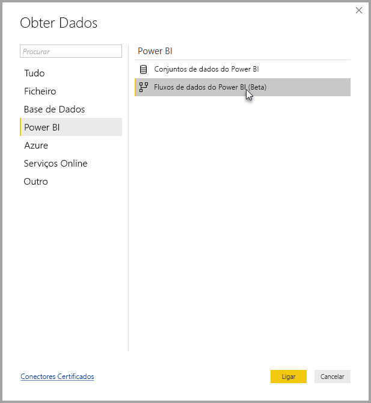

A partir daí, navegue para a **área de trabalho de aplicação** onde guardou o fluxo de dados, selecione o fluxo de dados e, em seguida, selecione as entidades que criou na lista.

Também pode utilizar a **barra de pesquisa**, junto da parte superior da janela, para localizar rapidamente o nome do seu fluxo de dados ou as entidades entre as muitas entidades de fluxo de dados.

Quando selecionar a entidade e, em seguida, selecionar o botão **Carregar**, as entidades são apresentadas no painel **Campos** no **Power BI Desktop** e têm uma apresentação e um comportamento iguais aos das **tabelas** de qualquer outro conjunto de dados.

## Resolução de problemas de ligações de dados

Em determinadas ocasiões, pode deparar-se com problemas ao ligar a origens de dados para os fluxos de dados. Esta seção apresenta sugestões de resolução de problemas, sempre que surgem tais problemas. 

* **Conector do Salesforce** – utilizar uma conta de avaliação para o Salesforce com fluxos de dados resulta numa falha de ligação e não é apresentada nenhuma informação. Para resolver este problema, utilize uma conta do Salesforce de produção ou uma conta de programador para fins de teste.

* **Conector do SharePoint** – garanta que indica o endereço raiz do site do SharePoint, sem subpastas nem documentos. Por exemplo, utilize uma ligação semelhante à seguinte: https://microsoft.sharepoint.com/teams/ObjectModel/ 

## Próximos Passos

Este artigo descreveu como pode criar os seus próprios **fluxos de dados** e criar um conjunto de dados e um relatório no **Power BI Desktop** para tirar partido dos mesmos. Os artigos seguintes são úteis para obter mais informações e cenários quando utilizar fluxos de dados:

* [Preparação personalizada de dados com fluxos de dados](service-dataflows-overview.md)
* [Utilizar entidades calculadas no Power BI Premium (Pré-visualização)](service-dataflows-computed-entities-premium.md)
* [Utilizar fluxos de dados com origens de dados no local (Pré-visualização)](service-dataflows-on-premises-gateways.md)
* [Recursos para programadores para fluxos de dados do Power BI (Pré-visualização)](service-dataflows-developer-resources.md)

Para obter mais informações sobre o Common Data Service, pode ler o seguinte artigo de descrição geral:
* [Common Data Service – descrição geral](https://docs.microsoft.com/powerapps/common-data-model/overview)
* [Saiba mais sobre o esquema do Common Data Service e as entidades no GitHub](https://github.com/Microsoft/CDM)

Artigos do Power BI Desktop relacionados:

* [Ligar a conjuntos de dados no serviço Power BI a partir do Power BI Desktop](desktop-report-lifecycle-datasets.md)
* [Descrição geral de consulta no Power BI Desktop](desktop-query-overview.md)

Artigos do Power BI Desktop relacionados:
* [Configurar a atualização agendada](refresh-scheduled-refresh.md)
