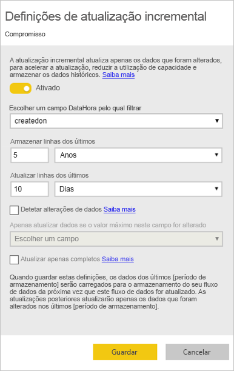
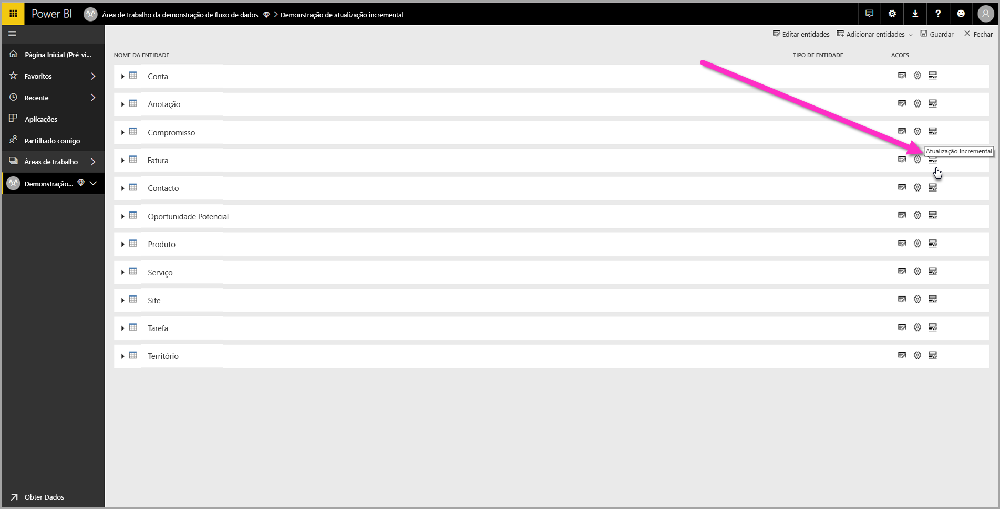
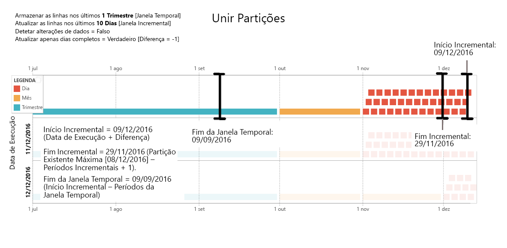
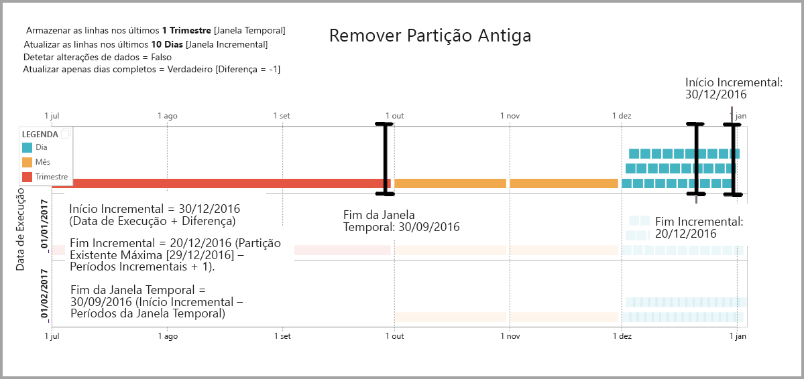
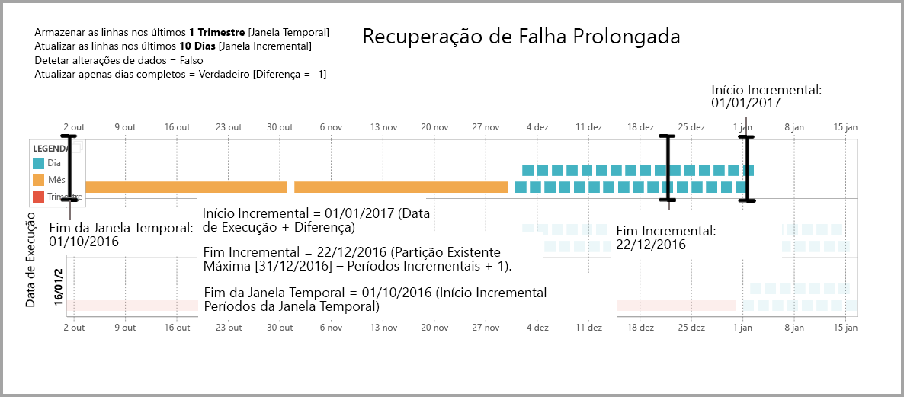

# Utilizar a atualização incremental com os fluxos de dados do Power BI (Pré-visualização)

Com os fluxos de dados, pode trazer grandes quantidades de dados para o Power BI para criar análises e relatórios apelativos. Em alguns casos, no entanto, não é prático atualizar uma cópia completa da origem de dados em cada atualização. Uma boa alternativa é a **atualização incremental**, com as seguintes vantagens para os fluxos de dados:

* **A atualização ocorre de forma mais rápida** – apenas os dados que são alterados têm de ser atualizados. Por exemplo, atualize apenas os últimos cinco dias de um fluxo de dados de dez anos.
* **A atualização é mais fiável** – por exemplo, não é necessário manter ligações de longa duração a sistemas de origens voláteis.
* **O consumo de recursos é reduzido** – uma quantidade menor de dados a atualizar reduz o consumo geral de memória e de outros recursos.

A utilização da atualização incremental dos fluxos de dados do Power BI exige que a área de trabalho onde reside o fluxo de dados esteja na [Capacidade Premium](service-premium.md) para ser executada e a origem de dados ingerida no fluxo de dados tem de ter um campo *datetime* com o qual a atualização incremental pode filtrar. 

## Configurar a atualização incremental dos fluxos de dados

Um fluxo de dados pode conter muitas entidades. A atualização incremental é configurada ao nível da entidade, o que permite que um fluxo de dados armazene entidades totalmente atualizadas e entidades atualizadas de forma incremental.

Para configurar uma entidade para a atualização incremental, comece por configurar a entidade, tal como faria com qualquer outra entidade. Para saber mais sobre a configuração do fluxo de dados, veja [Preparação personalizada de dados no Power BI (Pré-visualização)](service-dataflows-overview.md).

Depois do fluxo de dados ter sido criado e guardado, selecione o ícone de **atualização incremental** na vista de entidade, conforme mostrado na imagem seguinte:

Quando clica no ícone, é apresentada a janela **Definições de atualização incremental**. Depois de mudar a atualização incremental para a posição **Ativa**, poderá configurá-la.

A lista a seguir explica as definições na janela **Definições de atualização incremental**. 

1. **Ativar/desativar atualização incremental** – este controlo de deslize ativa/desativa a política de atualização incremental da entidade
2. **Lista pendente de campo de filtro** – seleciona o campo de consulta para o qual a entidade deve ser filtrada para os incrementos. Este campo contém apenas campos *datetime*. Não poderá utilizar a atualização incremental se a entidade não tiver um campo *datetime*.
3. **Armazenar linhas do passado** – o exemplo a seguir ajuda a explicar as definições que se seguem.

    Para este exemplo, definimos uma política de atualização para armazenar cinco anos de dados no total e para atualizar incrementalmente dez dias de dados. Se a entidade for atualizada diariamente, será executado o seguinte para cada operação de atualização:

    * Adicionar um novo dia de dados.
    * Atualizar 10 dias até à data atual.
    * Remover os anos do calendário com mais de cinco anos antes da data atual. Por exemplo, se a data atual for 1 de janeiro de 2019, o ano 2013 será removido.

    A primeira atualização dos fluxos de dados poderá demorar algum tempo a importar os cinco anos completos, mas as atualizações subsequentes irão provavelmente ser concluídas numa pequena fração do tempo de atualização inicial.

4. **Detetar alterações de dados** – a atualização incremental de dez dias é muito mais eficiente do que uma atualização completa de cinco anos, mas talvez possamos fazer ainda melhor. Se selecionar a caixa de verificação **Detetar alterações de dados**, poderá selecionar uma coluna de data/hora para identificar e atualizar apenas os dias em que os dados foram alterados. Isto pressupõe a existência de uma coluna deste tipo no sistema de origem, que normalmente serve para efeitos de auditoria. O valor máximo desta coluna é avaliado para cada um dos períodos no intervalo incremental. Se esses dados não tiverem sido alterados desde a última atualização, não será necessário atualizar o período. Neste exemplo, poderia reduzir os dias atualizados incrementalmente de dez para dois.

> [!TIP]
> O design atual requer que os dados da coluna onde se pretende detetar alterações sejam persistentes e estejam em cache na memória. Poderá optar por umas das seguintes técnicas para reduzir a cardinalidade e o consumo de memória:
>
>    * Mantenha apenas o valor máximo desta coluna no momento da atualização com, por exemplo, uma função do Power Query.
>    * Reduza a precisão a um nível aceitável, consoante os seus requisitos de frequência de atualização.

5. **Atualizar apenas períodos completos** – imagine que a atualização está agendada para ser executada às 4:00, todas as madrugadas. Se os dados forem apresentados no sistema de origem durante as primeiras quatro horas desse dia, poderá não querer considerá-los. Algumas métricas de negócios, tais como barris por dia na indústria do petróleo e do gás, não são práticas ou sensíveis para considerar com base em dias parciais.

    Outro exemplo onde é apropriado atualizar apenas períodos completos é a atualização de dados de um sistema financeiro. Imagine um sistema financeiro em que os dados do mês anterior são aprovados no 12.º dia do mês. Pode definir o intervalo incremental para 1 mês e agendar a atualização para o 12.º dia do mês. Com esta opção marcada, os dados de janeiro (o mais recente período mensal concluído) seriam atualizados no dia 12 de fevereiro.

> [!NOTE]
> A atualização incremental dos fluxos de dados determina as datas, de acordo com a seguinte lógica: se uma atualização estiver agendada, a atualização incremental dos fluxos de dados utilizará o fuso horário definido na política de atualização. Se não existir nenhum agendamento de atualização, a atualização incremental utilizará a hora do computador que executa a atualização.

## A consulta da atualização incremental

Depois da atualização incremental ter sido configurada, o fluxo de dados altera automaticamente a consulta para incluir o filtro por data. Pode editar a consulta gerada automaticamente com o **Editor Avançado do Power Query** para ajustar ou personalizar a atualização. Leia mais sobre a atualização incremental e como ela funciona na secção seguinte.

## Atualização incremental e entidades ligadas versus calculadas

Para entidades *ligadas*, a atualização incremental atualiza a entidade de origem. Uma vez que as entidades ligadas são simplesmente um ponteiro para a entidade original, a atualização incremental não tem impacto sobre a entidade ligada. Quando atualiza a entidade da origem, de acordo com a política de atualização definida, qualquer entidade ligada deve supor que os dados na origem são atualizados.

As entidades *calculadas* são baseadas em consultas em execução sobre um armazém de dados, que pode ser outro fluxo de dados. Como tal, as entidades calculadas comportam-se da mesma forma que as entidades ligadas.

Uma vez que as entidades calculadas e as entidades ligadas se comportam da mesma forma, os requisitos e os passos de configuração são os mesmos para ambas. Uma diferença é que, para a entidades calculadas, em determinadas configurações, a atualização incremental não pode ser executada de forma otimizada, devido ao modo como as partições são criadas. 

## Alterar entre a atualização incremental e a atualização completa

Os fluxos de dados suportam a alteração da política de atualização entre a atualização incremental e a atualização completa. Quando ocorre uma alteração em qualquer das direções (atualização completa para incremental ou incremental para completa), a alteração afetará o fluxo de dados após a próxima atualização.

Quando mover um fluxo de dados da atualização completa para a incremental, a nova lógica de atualização atualiza o fluxo de dados que adere à janela de atualização e incrementa conforme definido nas definições de atualização incremental.

Ao mover um fluxo de dados da atualização incremental para a completa, todos os dados acumulados na atualização incremental são substituídos pela política definida na atualização completa. Tem de aprovar esta ação.

## Atualização incremental dos fluxos de dados e dos conjuntos de dados

A atualização incremental dos fluxos de dados e a atualização incremental dos conjuntos de dados foram concebidas para funcionar em conjunto. É aceitável e há suporte para ter uma entidade a atualizar de forma incremental num fluxo de dados, totalmente carregada num conjunto de dados, ou uma entidade totalmente carregada no fluxo de dados carregado de forma incremental num conjunto de dados. 

Ambas as abordagens estão de acordo com as definições especificadas nas definições de atualização.
Pode ler mais sobre a atualização incremental em [Atualização incremental no Power BI Premium](service-premium-incremental-refresh.md).

## Suporte de fuso horário na atualização incremental

A atualização incremental dos fluxos de dados está dependente da hora em que é executada. A filtragem da consulta está dependente do dia em que é executada.

Para acomodar essas dependências e para garantir a consistência dos dados, a atualização incremental dos fluxos de dados implementa a seguinte heurística para os cenários *atualizar agora*:

* No caso de uma atualização agendada estar definida no sistema – a atualização incremental utiliza as definições de fuso horário do agendamento de atualização. Este procedimento garante que qualquer que seja o fuso horário em que a pessoa que atualizar o fluxo de dados esteja, este será sempre consistente com a definição do sistema.

* Se não for definido um agendamento de atualização, os fluxos de dados utilizarão o fuso horário do computador do utilizador que faz a atualização.

A atualização incremental também pode ser invocada através de APIs. Neste caso, a chamada à API pode manter uma definição de fuso horário utilizada na atualização. A utilização de APIs pode ser útil para fins de teste e de validação.

## Detalhes de implementação da atualização incremental

Os fluxos de dados utilizam a criação de partições para a atualização incremental. Quando os pontos finais XMLA do Power BI Premium estiverem disponíveis, as partições ficarão visíveis. A atualização incremental nos fluxos de dados retém o número mínimo de partições para satisfazer os requisitos da política de atualização. As partições antigas que ficam fora do intervalo são ignoradas, o que mantém uma janela temporal. As partições são intercaladas de forma oportuna, o que reduz o número total de partições necessárias. Este procedimento melhora a compressão e, em alguns casos, pode melhorar o desempenho da consulta.

Os exemplos nesta secção partilham a próxima política de atualização:

* Armazenar linhas do 1.º Trimestre
* Atualizar linhas dos últimos 10 Dias
* Detetar alterações de dados = Falso
* Atualizar apenas dias completos = Verdadeiro

### Unir partições

Neste exemplo, as partições dos dias são unidas automaticamente ao nível dos meses quando ficam fora do intervalo incremental. As partições no intervalo incremental têm de ser mantidas na granularidade diária para permitir que apenas esses dias sejam atualizados.
A operação de atualização com *Data de Execução 11/12/2016* une os dias em novembro porque ficam fora do intervalo incremental.

### Remover partições antigas

As partições antigas que fiquem fora do intervalo total são removidas. A operação de atualização com *Data de Execução de 02/01/2017* remove a partição referente ao 3.º T de 2016 porque fica fora do intervalo incremental.

### Recuperação de falha prolongada

Este exemplo simula o modo como o sistema recupera corretamente de uma falha prolongada. Digamos que a atualização não é executada com êxito, uma vez que as credenciais da origem de dados expiraram e o tempo de resolução do problema será de 13 dias. O intervalo incremental é apenas de dez dias.

A próxima operação de atualização com êxito, com *Data de Execução de 15/01/2017*, terá de preencher 13 dias e de os atualizar. Terá também de atualizar os nove dias anteriores porque não foram atualizados no agendamento normal. Por outras palavras, o intervalo incremental é aumentado de dez para 22 dias.

A próxima operação de atualização, com *Data de Execução de 16/01/2017*, aproveita a oportunidade de unir os dias em dezembro e os meses no 4.º T de 2016.

## Próximos Passos

Este artigo descreveu a atualização incremental dos fluxos de dados. Veja a seguir mais alguns artigos que podem ser úteis.

* [Preparação personalizada de dados com fluxos de dados](service-dataflows-overview.md)
* [Criar e utilizar fluxos de dados no Power BI](service-dataflows-create-use.md)
* [Utilizar fluxos de dados com origens de dados no local (Pré-visualização)](service-dataflows-on-premises-gateways.md)
* [Recursos para programadores para fluxos de dados do Power BI (Pré-visualização)](service-dataflows-developer-resources.md)

Para obter mais informações sobre o Power Query e a atualização agendada, pode ler estes artigos:
* [Descrição geral de consulta no Power BI Desktop](desktop-query-overview.md)
* [Configurar a atualização agendada](refresh-scheduled-refresh.md)

Para obter mais informações sobre o Common Data Service, pode ler o seguinte artigo de descrição geral:
* [Common Data Service – descrição geral](https://docs.microsoft.com/powerapps/common-data-model/overview)

