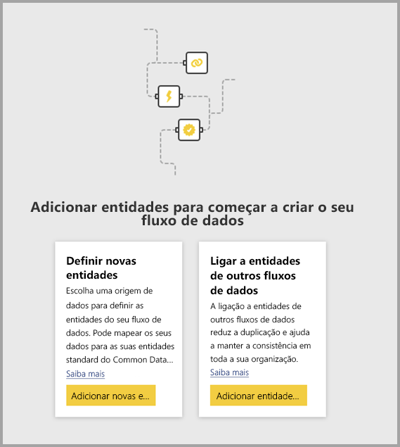
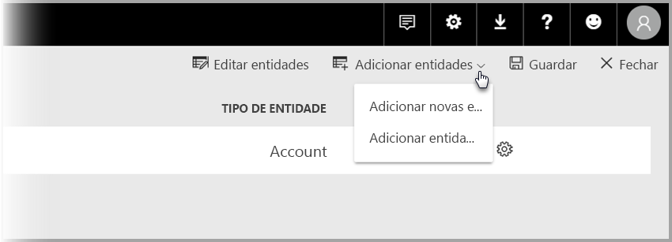

# Ligar entidades entre fluxos de dados no Power BI

Com os fluxos de dados no Power BI, pode ter uma única origem de armazenamento de dados organizacionais, onde os analistas de negócios podem preparar e gerir os seus dados de uma só vez e depois reutilizá-los entre diferentes aplicações de análise na organização. 

Quando liga entidades entre fluxos de dados, pode reutilizar as entidades que já foram ingeridas, limpas e transformadas por outros fluxos de dados pertencentes a outras pessoas sem a necessidade de manter esses dados. As entidades ligadas apontam simplesmente para as entidades noutros fluxos de dados e *não* copiam nem duplicam os dados.

As entidades ligadas são **só de leitura**. Se quiser criar transformações para uma entidade ligada, terá de criar uma nova entidade calculada com uma referência à entidade ligada.

## Disponibilidade das entidades ligadas

As entidades ligadas exigem uma subscrição do [Power BI Premium](service-premium-what-is.md) para atualização. As entidades ligadas estão disponíveis em qualquer fluxo de dados numa área de trabalho alojada numa capacidade do Power BI Premium. Não existem limitações para o fluxo de dados de origem.

As entidades ligadas só funcionam corretamente em novas áreas de trabalho do Power BI. Pode obter mais informações sobre as [novas áreas de trabalho do Power BI](service-create-the-new-workspaces.md). Todos os fluxos de dados ligados têm de estar localizados nas novas áreas de trabalho para funcionarem corretamente.

> [!NOTE]
> As entidades diferem com base no facto de serem entidades padrão ou entidades calculadas. As entidades padrão (muitas vezes simplesmente referidas como entidades) consultam uma origem de dados externa, como uma base de dados SQL. As entidades calculadas requerem a capacidade Premium no Power BI e executam as respetivas transformações nos dados já existentes no armazenamento do Power BI. 
>
>Se o seu fluxo de dados não estiver numa área de trabalho de capacidade Premium, ainda pode referenciar uma única consulta ou combinar duas ou mais consultas, desde que as transformações não estejam definidas como transformações no armazenamento. Essas referências são consideradas entidades padrão. Para tal, desative a opção **Ativar carregamento** para as consultas referenciadas para impedir que os dados sejam materializados e ingeridos no armazenamento. A partir daí, pode referenciar as consultas **Ativar carregamento = false** e definir **Ativar carregamento** como **Ativado** apenas para as consultas resultantes que quer materializar.

## Como ligar entidades entre fluxos de dados

Existem algumas formas de ligar entidades entre fluxos de dados no Power BI. Pode selecionar **Adicionar entidades ligadas** na Ferramenta de criação de fluxos de dados, como mostrado na imagem seguinte. 

Também pode selecionar **Adicionar entidades ligadas** no item de menu **Adicionar entidades** do serviço Power BI.

Para ligar entidades, tem de iniciar sessão com as suas credenciais do Power BI.

A janela **Navegador** é apresentada e permite-lhe escolher um conjunto de entidades às quais se pode ligar. As entidades apresentadas são entidades para as quais tem permissões, em todas as áreas de trabalho do seu inquilino do Power BI. 

Depois de selecionar as entidades ligadas, estas aparecem na lista de entidades do seu fluxo de dados na ferramenta de criação, com um ícone especial que as identifica como Entidades ligadas.

Também pode ver o fluxo de dados de origem nas definições do fluxo de dados da sua entidade ligada.

## Lógica de atualização de entidades ligadas
A lógica de atualização padrão das entidades ligadas altera-se, com base no facto de o fluxo de dados de origem residir na mesma área de trabalho que o fluxo de dados de destino. As secções seguintes descrevem o comportamento de cada uma.

### Ligações entre as áreas de trabalho

A atualização para ligações de entidades em diferentes áreas de trabalho comporta-se como uma origem de dados externa. Quando o fluxo de dados é atualizado, os dados mais recentes passam para a entidade do fluxo de dados de origem. Se o fluxo de dados de origem for atualizado, não afetará automaticamente os dados no fluxo de dados de destino.

### Ligações na mesma área de trabalho

Quando ocorre a atualização dos dados de um fluxo de dados da origem, esse evento aciona automaticamente um processo de atualização das entidades dependentes em todos os fluxos de dados de destino na mesma área de trabalho, incluindo todas as entidades calculadas com base neles. Todas as outras entidades no fluxo de dados de destino são atualizadas de acordo com a agenda do fluxo de dados. As entidades que dependem de mais do que de uma origem atualizam os dados sempre que qualquer uma das suas origens é atualizada com êxito.

Convém ter em atenção que todo o processo de atualização se consolida de uma só vez. Por este motivo, se a atualização do fluxo de dados de destino não ocorrer, atualização do fluxo de dados de origem também falhará.

## Permissões ao visualizar relatórios de fluxos de dados

Ao criar um relatório do Power BI com dados baseados num fluxo de dados, os utilizadores podem ver todas as entidades ligadas apenas quando o utilizador tem acesso ao fluxo de dados de origem.

## Limitações e considerações

Existem algumas limitações a ter em mente ao trabalhar com entidades ligadas:

* Existe um máximo de cinco saltos de referência
* As dependências cíclicas de entidades associadas não são permitidas
* O fluxo de dados tem de residir numa [nova área de trabalho do Power BI](service-create-the-new-workspaces.md)
* Uma entidade ligada não pode ser associada a uma entidade normal que obtém os seus dados a partir de uma origem de dados no local
* Quando uma consulta (consulta A, por exemplo) é utilizada no cálculo de outra consulta (consulta B) nos fluxos de dados, a consulta B torna-se uma entidade calculada. As entidades calculadas não podem fazer referência a origens no local.

## Passos Seguintes

Os artigos seguintes podem ser úteis à medida que criar ou trabalhar com fluxos de dados. 

* [Preparação personalizada de dados no Power BI](service-dataflows-overview.md)
* [Criar e utilizar fluxos de dados no Power BI](service-dataflows-create-use.md)
* [Utilizar entidades calculadas no Power BI Premium](service-dataflows-computed-entities-premium.md)
* [Utilizar fluxos de dados com origens de dados no local](service-dataflows-on-premises-gateways.md)
* [Recursos para programadores para fluxos de dados do Power BI](service-dataflows-developer-resources.md)

Para obter mais informações sobre o Power Query e a atualização agendada, pode ler estes artigos:
* [Descrição geral de consulta no Power BI Desktop](desktop-query-overview.md)
* [Configurar a atualização agendada](refresh-scheduled-refresh.md)

Para obter mais informações sobre o Common Data Service, pode ler o seguinte artigo de descrição geral:
* [Common Data Service – descrição geral](https://docs.microsoft.com/powerapps/common-data-model/overview)

