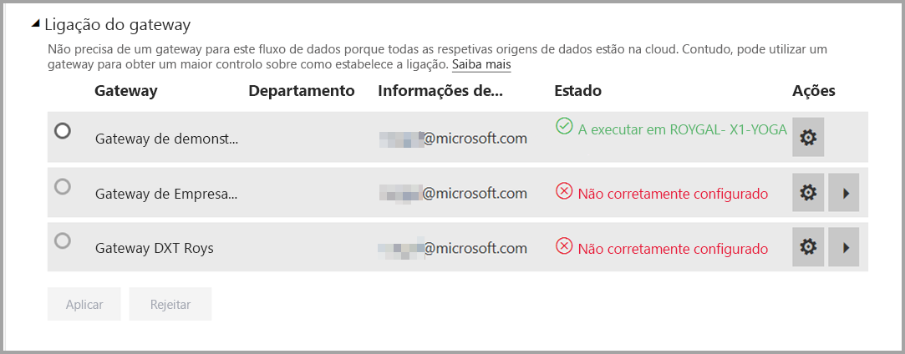
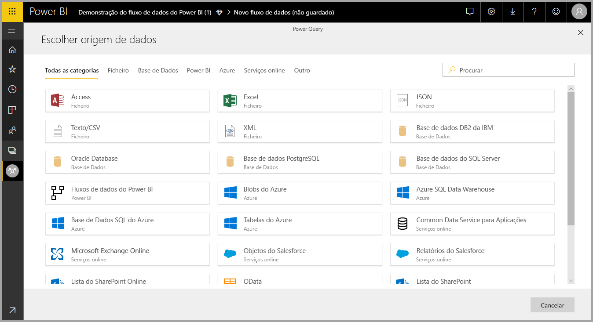
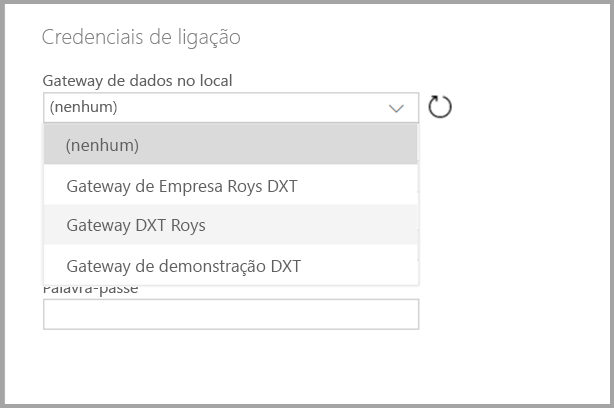

# Utilizar fluxos de dados com origens de dados no local (pré-visualização)

Com os **fluxos de dados**, pode criar uma coleção de dados de várias origens, limpar os dados, transformá-los e, em seguida, carregá-los para o armazenamento do Power BI. Ao criar o fluxo de dados pode querer utilizar origens de dados no local. Este artigo esclarece sobre os requisitos associados à criação de fluxos de dados e sobre como o seu **Gateway de Empresa** tem de ser configurado para ativar essas ligações.

> [!NOTE]
> A funcionalidade de fluxos de dados está em pré-visualização e está sujeita a alterações e atualizações antes da disponibilidade geral.
 
## Configurar um Gateway de Empresa para utilização com os fluxos de dados

Para utilizar uma origem de dados no local num fluxo de dados, qualquer utilizador que criar o fluxo de dados tem de ter um **Gateway de Empresa** instalado e configurado. O utilizador ao criar o fluxo de dados também tem de ser administrador do Gateway de Empresa para poder utilizar esse gateway com um fluxo de dados.

> [!NOTE]
> Os fluxos de dados são apenas suportados através de Gateways de Empresa.

## Utilizar uma origem de dados no local num fluxo de dados

Ao criar um fluxo de dados, selecione uma origem de dados no local na lista de origens de dados, conforme mostrado na imagem seguinte.

Depois de fazer a sua seleção, é-lhe pedido para indicar os detalhes da ligação do Gateway de Empresa, que será utilizado para aceder aos dados no local. Tem de selecionar o próprio gateway e indicar as credenciais do gateway selecionado. Apenas os gateways para os quais o utilizador é administrador aparecem na lista pendente.

## Monitorizar o gateway

Pode monitorizar o Gateway de Empresa para um fluxo de dados da mesma forma que monitoriza gateways para um conjunto de dados.

No ecrã de definições do fluxo de dados do Power BI, pode monitorizar o estado do gateway de um fluxo de dados e atribuir um gateway para o fluxo de dados, conforme mostrado na imagem seguinte.

## Alterar um gateway

Pode alterar o Gateway de Empresa utilizado para um determinado fluxo de dados de duas formas:

1. **Na ferramenta de criação** – pode alterar o gateway atribuído a todas as suas consultas com a ferramenta de criação de fluxos de dados.

    > [!NOTE]
    > O fluxo de dados tentará localizar ou criar as origens de dados necessárias com o novo gateway. Se não for possível, não será capaz de alterar o gateway até que todos os fluxos de dados necessários estejam disponíveis no gateway selecionado.

2. **No ecrã de definições** – pode alterar o gateway atribuído com o ecrã de definições do fluxo de dados do serviço Power BI.

Para saber mais sobre os Gateways de Empresa, veja [Gateway de dados no local](service-gateway-onprem.md).

## Considerações e limitações

Existem algumas limitações conhecidas sobre a utilização de Gateways de Empresa e de fluxos de dados:

* Cada fluxo de dados pode utilizar apenas um gateway. Como tal, todas as consultas devem ser configuradas com o mesmo gateway.
* Alterar o gateway tem impacto sobre todo o fluxo de dados.
* Se forem necessários vários gateways, a prática recomendada será criar vários fluxos de dados (um para cada gateway) e utilizar as capacidades de referência de entidade ou de computação para unificar os dados.
* Os fluxos de dados são apenas suportados através de gateways de empresa. Os gateways pessoais não estarão disponíveis para seleção nas listas pendentes nem nos ecrãs de definições.

## Próximos Passos

Este artigo fornece informações sobre a utilização da origem de dados no local para fluxos de dados e sobre como utilizar e configurar gateways para aceder a esses dados. Os seguintes artigos também podem ser úteis

* [Preparação personalizada de dados com fluxos de dados](service-dataflows-overview.md)
* [Criar e utilizar fluxos de dados no Power BI](service-dataflows-create-use.md)
* [Utilizar entidades calculadas no Power BI Premium (pré-visualização)](service-dataflows-computed-entities-premium.md)
* [Recursos para programadores de fluxos de dados do Power BI (pré-visualização)](service-dataflows-developer-resources.md)

Para obter mais informações sobre o Power Query e a atualização agendada, pode ler estes artigos:
* [Descrição geral das consultas no Power BI Desktop](desktop-query-overview.md)
* [Configurar a atualização agendada](refresh-scheduled-refresh.md)

Para obter mais informações sobre o Common Data Service, pode ler o seguinte artigo de descrição geral:
* [Common Data Service – descrição geral](https://docs.microsoft.com/powerapps/common-data-model/overview)

