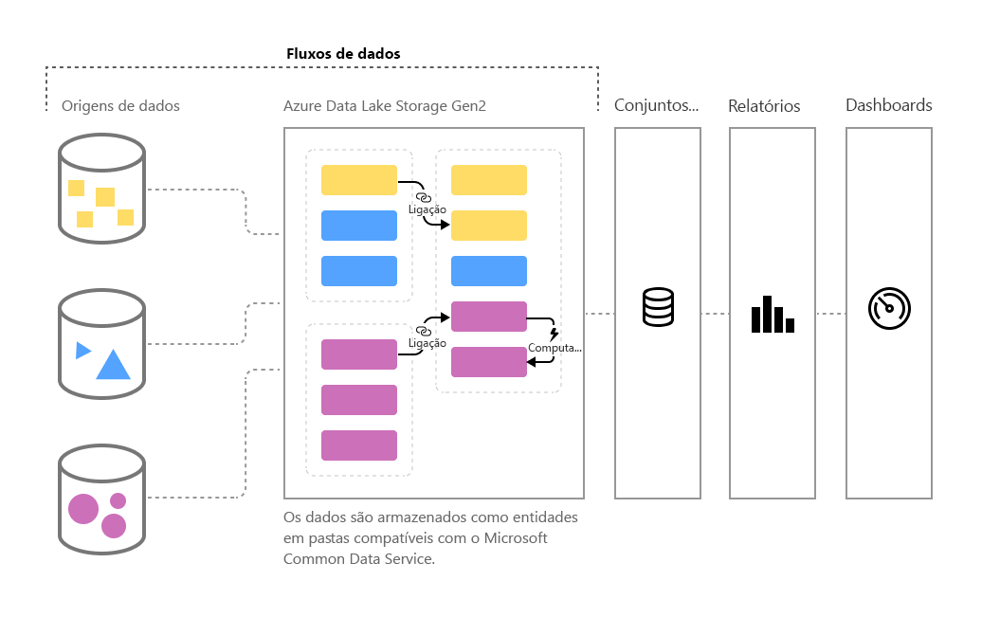

# Preparação personalizada de dados no Power BI

À medida que o volume de dados continua a crescer, o mesmo acontece com o desafio de preparação desses dados em informações acionáveis e bem formadas. Queremos dados que estejam prontos para análises, para preencher elementos visuais, relatórios e dashboards, para que possamos transformar rapidamente os nossos volumes de dados em informações acionáveis. Com a **preparação personalizada de dados** para grandes volumes de dados no Power BI, pode ir dos dados às informações do Power BI com apenas alguns cliques.

O Power BI introduz os **fluxos de dados** para ajudar as organizações a uniformizar os dados de diferentes origens e a prepará-los para a modelação. Os analistas podem criar facilmente fluxos de dados, com ferramentas de gestão personalizada conhecidas. Os fluxos de dados servem para ingerir, transformar, integrar e enriquecer grandes volumes de dados ao definir ligações de origem de dados, lógica ETL, agendas de atualização e muito mais. Além disso, o novo motor de cálculo orientado por modelos, que faz parte dos fluxos de dados, torna o processo de preparação de dados mais gerível, mais determinista e menos pesado, tanto para os analistas de dados como para os criadores de relatórios. Da mesma forma como as folhas de cálculo gerem os recálculos para todas as fórmulas afetadas, os fluxos de dados gerem as alterações para uma entidade ou um elemento de dados por si, ao automatizar as atualizações e aliviá-lo do que costumavam ser verificações lógicas cansativas e demoradas até para uma atualização básica de dados. Com os fluxos de dados, as tarefas que antes exigiam a supervisão dos cientistas de dados (e muitas horas ou dias para serem concluídas) agora podem ser processadas com alguns cliques pelos analistas e pelos criadores de relatórios. 

Os dados são armazenados como entidades no [**Common Data Model**](https://docs.microsoft.com/powerapps/common-data-model/overview) do Azure Data Lake Storage Gen2. Os fluxos de dados são criados e geridos em áreas de trabalho com o serviço Power BI.  
 
Os **fluxos de dados** foram concebidos para utilizar o **Common Data Service**, uma coleção extensível, modular e normalizada de esquemas de dados publicados pela Microsoft que foram concebidos para tornar mais fácil a criação, a utilização e a análise dos dados. Com este modelo, pode ir desde as origens de dados aos dashboards do Power BI sem praticamente nenhum problema.

Pode utilizar os fluxos de dados para ingerir dados de um conjunto grande e crescente de origens de dados com suporte no local e baseadas na cloud, incluindo o Dynamics 365, o Salesforce, a Base de Dados SQL do Azure, o Excel, o SharePoint e muito mais.

Pode, em seguida, mapear os dados para entidades padrão no Common Data Service, modificar e expandir as entidades existentes e criar entidades personalizadas. Os utilizadores avançados podem criar fluxos de dados totalmente personalizados, com uma experiência de criação de pouco código/nenhum código de gestão personalizada do Power Query incorporado, semelhante à experiência do Power Query que milhões de utilizadores do Power BI Desktop e do Excel já conhecem.  

Depois de criar um fluxo de dados, pode utilizar o Power BI Desktop e o serviço Power BI para criar conjuntos de dados, relatórios, dashboards e aplicações que tiram partido do Common Data Service para impulsionar as informações aprofundadas nas suas atividades de negócios. 

O agendamento de atualização dos fluxos de dados é gerido diretamente a partir da área de trabalho em que o fluxo de dados foi criado, da mesma forma que os conjuntos de dados. 

## Como funcionam os fluxos de dados

Veja a seguir alguns exemplos de como os fluxos de dados podem trabalhar para si:

* As organizações podem mapear os dados para entidades padrão no Common Data Service ou criar as suas próprias entidades personalizadas. Estas entidades, em seguida, podem ser utilizadas como blocos modulares para criar relatórios, dashboards e aplicações que funcionam de imediato e distribuí-los aos utilizadores na organização deles. 

* Ao utilizar a ampla coleção de conectores de dados da Microsoft, as organizações podem ligar as suas próprias origens de dados aos fluxos de dados, através da utilização do Power Query para mapear os dados desde a sua origem e trazê-los para o Power BI. Após estes dados serem importados por um fluxo de dados (e atualizados a uma frequência especificada), essas entidades de fluxo de dados podem ser utilizadas na aplicação Power BI Desktop para criar relatórios e dashboards apelativos. 

## Como utilizar os fluxos de dados

Na seção anterior, descrevemos várias formas de utilização dos fluxos de dados para criar rapidamente análises poderosas no Power BI. Nesta secção, vamos apresentar quão rapidamente pode criar informações ao utilizar fluxos de dados numa organização, obter uma vista rápida sobre como os profissionais de BI podem criar os seus próprios fluxos de dados e personalizar as informações para a sua própria organização.

> [!NOTE]
> Tem de ter uma conta paga do Power BI para utilizar fluxos de dados, como uma conta do Power BI Pro ou Power BI Premium. No entanto, a utilização de fluxos de dados não lhe será cobrada separadamente. 

### Alargar o Common Data Service às suas necessidades de negócio
Para organizações que desejam alargar o Common Data Service (CDS), os fluxos de dados permitem aos profissionais de business intelligence personalizar as entidades padrão ou criar novas. Esta abordagem de gestão personalizada para personalizar o modelo de dados pode, em seguida, ser utilizada com fluxos de dados para criar aplicações e dashboards do Power BI adaptados a uma organização.

### Definir os fluxos de dados programaticamente
Pode também querer desenvolver as suas próprias soluções programáticas para criar fluxos de dados. Com as APIs públicas e a capacidade de criar programaticamente ficheiros de definição de fluxo de dados personalizados (model.json), vai criar uma solução personalizada que se adequa às necessidades de análise e aos dados exclusivos da sua organização. 

As APIs públicas permitem aos programadores formas simples e fáceis de interagir com o Power BI e os fluxos de dados.

### Expandir as suas capacidades com o Azure
O Azure Data Lake Storage Gen2 está incluído em cada subscrição do Power BI paga (10 GB por utilizador, 100 TB por nó P1). Por isso, pode começar facilmente com a preparação de dados de gestão personalizada no Azure Data Lake. 

O Power BI pode ser configurado para armazenar dados dos fluxos de dados na conta do Azure Data Lake Storage Gen2 da sua organização. Quando o Power BI está ligado à sua subscrição do Azure, os cientistas e os programadores de dados podem tirar partido dos poderosos produtos do Azure, como o Azure Machine Learning, o Azure Databricks, o Azure Data Factory e muito mais.

O Power BI também pode ser ligado a pastas com dados esquematizados no formato Common Data Service, que são armazenados na conta do Azure Data Lake Storage da sua organização. Estas pastas podem ser criadas por serviços como os serviços de dados do Azure. Ao ligar a estas pastas, os analistas podem trabalhar perfeitamente com estes dados no Power BI. 

Para obter mais informações sobre o Azure Data Lake Storage Gen2 e a integração de fluxos de dados, incluindo como criar fluxos de dados que residem no Azure Data Lake da sua organização, veja [Fluxos de dados e integração do Azure Data Lake (Pré-visualização)](service-dataflows-azure-data-lake-integration.md).

## Capacidades dos fluxos de dados no Power BI Premium

Para que os recursos e as cargas de trabalho dos fluxos de dados funcionem numa subscrição do Power BI Premium, a carga de trabalho dos fluxos de dados para essa capacidade Premium tem de estar ativada. A tabela seguinte descreve as funcionalidades dos fluxos de dados e as suas capacidades ao utilizar uma conta do Power BI Pro em comparação com o Power BI Premium.

|Capacidade dos fluxos de dados | Power BI Pro |   Power BI Premium |
|---------|---------|---------|
|Atualização agendada| 8 por dia|  48|
|Armazenamento Total| 10 GB/utilizador  |100 TB/nó|
|Criação dos Fluxos de Dados com o Power Query Online|    +   |+|
|Gestão dos Fluxos de Dados no Power BI|   +|  +|
|Conector de Dados dos Fluxos de Dados no Power BI Desktop|  +|  +|
|Integração com o Azure|    +|  +|
|Entidades Calculadas (transformações ao armazenamento por meio de M) | |   +|
|Novos conectores|    +|  +|
|Atualização incremental dos fluxos de dados|  |   +|
|Execução na capacidade do Power BI Premium/Execução paralela de transformações|   |   +|
|Entidades associadas dos fluxos de dados| |        +|
|Esquema padronizado/Suporte Incorporado para o Common Data Service|  +|  +|

Para obter mais informações sobre como ativar as cargas de trabalho de fluxo de dados nas capacidades Premium, veja o artigo [Configure workloads in a Premium capacity](service-admin-premium-workloads.md) (Configurar cargas de trabalho numa capacidade Premium). As cargas de trabalho de fluxos de dados não estão atualmente disponíveis nas funcionalidades multigeográficas.

## Resumo da preparação personalizada de dados para grandes volumes de dados no Power BI
Tal como mencionado anteriormente neste artigo, existem vários cenários e exemplos em que os **fluxos de dados** podem permitir que obtenha um melhor controlo (e informações mais rapidamente) dos seus dados de negócio. Ao utilizar um modelo de dados (esquema) padrão definido pelo Common Data Service, os fluxos de dados podem importar os seus valiosos dados de negócios e ter os dados prontos para modelação e criação de informações do BI num período muito curto... em vez do que costumava levar meses, ou mais tempo, a criar. 

Ao armazenar dados de negócio no formato padronizado do **Common Data Service**, os profissionais (ou os programadores) de BI podem criar aplicações que geram relatórios e elementos visuais rápidos, fáceis e automáticos. Estes incluem, entre outros:

* Mapear os seus dados para entidades padrão no Common Data Service para unificar os dados e tirar partido do esquema conhecido para impulsionar as informações integradas
* Criar as suas próprias entidades personalizadas para unificar os dados na sua organização 
* Utilizar e atualizar os **dados externos** como parte de um fluxo de dados e ativar a importação desses dados para impulsionar as informações
* Introdução aos fluxos de dados para os programadores

## Próximos Passos

Este artigo forneceu uma descrição geral da preparação personalizada para macrodados no Power BI e as várias formas de utilização. Os artigos seguintes entram em mais detalhes sobre os cenários de utilização comuns dos fluxos de dados. 

* [Criar e utilizar fluxos de dados no Power BI](service-dataflows-create-use.md)
* [Utilizar entidades calculadas no Power BI Premium](service-dataflows-computed-entities-premium.md)
* [Utilizar fluxos de dados com origens de dados no local](service-dataflows-on-premises-gateways.md)
* [Recursos para programadores para fluxos de dados do Power BI](service-dataflows-developer-resources.md)
* [Integração dos fluxos de dados e do Azure Data Lake](service-dataflows-azure-data-lake-integration.md)

Para obter mais informações sobre o Power Query e a atualização agendada, pode ler estes artigos:
* [Descrição geral das consultas no Power BI Desktop](desktop-query-overview.md)
* [Configurar a atualização agendada](refresh-scheduled-refresh.md)

Para obter mais informações sobre o Common Data Service, pode ler o seguinte artigo de descrição geral:
* [Common Data Service – descrição geral](https://docs.microsoft.com/powerapps/common-data-model/overview)

