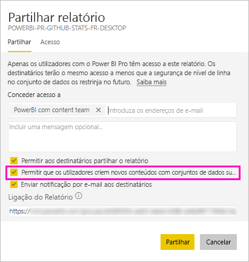

# Partilhar um conjunto de dados (Pré-visualização)

Enquanto criador de *modelos de dados* no Power BI Desktop, pode partilhá-los como *conjuntos de dados* no serviço Power BI. Em seguida, os criadores de relatórios podem detetar e reutilizar facilmente os conjuntos de dados partilhados. Saiba como partilhar conjuntos de dados e controlar quem pode aceder aos dados com a permissão de compilação.

## Passos para partilhar o seu conjunto de dados

1. Comece por criar um ficheiro .pbix com um modelo de dados no Power BI Desktop. Se planear dar este conjunto de dados a outras pessoas para compilarem relatórios, não terá de criar um relatório no ficheiro .pbix.

    A melhor prática é guardar o ficheiro .pbix num grupo do Office 365.

1. Publique o ficheiro .pbix numa [nova experiência de área de trabalho](service-create-the-new-workspaces.md) no serviço Power BI.
    
    Assim, outros membros desta área de trabalho poderão criar relatórios noutras áreas de trabalho, com base neste conjunto de dados.

1. Também pode [publicar uma aplicação](service-create-distribute-apps.md) a partir desta área de trabalho. Quando o fizer, irá especificar quem tem permissões e o que estas pessoas podem fazer na página **Permissões**.

    > [!NOTE]
    > Se selecionar **Toda a organização**, nenhuma pessoa na organização terá permissões de compilação. Este problema já é conhecido. Em vez disto, especifique os endereços de e-mail em **Pessoas ou grupos específicos**.  Se pretender que toda a organização tenha permissões de compilação, especifique um alias de e-mail para toda a organização.

    

1. Selecione **Publicar aplicação** ou **Atualizar aplicação**, se a aplicação já estiver publicada.

## Permissões de compilação para conjuntos de dados partilhados

Uma permissão de compilação só serve para conjuntos de dados. Com esta permissão, os utilizadores podem compilar novos conteúdos num conjunto de dados, como relatórios, dashboards, mosaicos afixados das Perguntas e Respostas e Deteção de Informações. Também podem compilar novos conteúdos no conjunto de dados, como folhas do Excel, fora do Power BI, através da funcionalidade Analisar no Excel, de XMLA e de exportação de dados subjacentes.

Os utilizadores podem obter permissões de compilação de várias formas diferentes:

- Se for membro de uma área de trabalho com, no mínimo, uma função de Contribuidor, terá automaticamente permissão de Compilação para um conjunto de dados e permissão para copiar um relatório.
 
- Um membro da área de trabalho em que o conjunto de dados reside pode atribuir a permissão a utilizadores específicos ou grupos de segurança no centro de permissões. Selecione as reticências (…) junto a um conjunto de dados > **Gerir permissões**.

    

    Será apresentado o centro de permissões deste conjunto de dados, em que poderá definir e alterar as permissões.

    

- Um administrador ou membro da área de trabalho em que o conjunto de dados reside pode decidir, durante a publicação da aplicação, dar também aos utilizadores com permissão para a aplicação a permissão de compilação dos conjuntos de dados subjacentes. Veja [Passos para partilhar o seu conjunto de dados](#steps-to-sharing-your-dataset) neste artigo para obter mais informações.

- Imagine que tem permissões para compilar e voltar a partilhar um conjunto de dados. Quando partilhar um relatório ou dashboard compilado com base nesse conjunto de dados, poderá especificar que os destinatários também obtêm a permissão de compilação do conjunto de dados subjacente.

    

Pode remover as permissões de Compilação de um conjunto de dados atribuídas a uma pessoa. Se o fizer, estas ainda irão poder ver o relatório compilado com o conjunto de dados partilhado, mas já não poderão editá-lo.

## Permissões mais granulares

A permissão de compilação foi lançada no Power BI em junho de 2019, como um complemento das permissões existentes para ler e voltar a partilhar. Todos os utilizadores que já tinham a permissão de leitura de conjuntos de dados nessa altura, através de permissões de aplicações, partilha ou acesso a áreas de trabalho, também receberam permissões de compilação destes conjuntos de dados. Os utilizadores obtiveram a permissão de compilação automaticamente, porque a permissão de leitura já lhes concedia o direito de compilação de novos conteúdos com base no conjunto de dados, através da funcionalidade Analisar no Excel ou Exportar.

Com esta permissão de compilação mais granular, pode selecionar quem apenas pode ver os conteúdos no relatório ou dashboard existente e quem pode criar conteúdos ligados aos conjuntos de dados subjacentes.

Se o seu conjunto de dados estiver a ser utilizado por um relatório fora da área de trabalho do mesmo, não poderá eliminá-lo. Se tentar eliminar o conjunto de dados, será apresentada uma mensagem de erro.

Pode remover permissões de compilação. Se o fizer, as pessoas a quem revogar permissões ainda irão poder ver o relatório, mas já não irão poder editá-lo ou exportar dados subjacentes. Os utilizadores com permissão só de leitura continuarão a poder exportar dados resumidos. 

## Controlar a utilização do seu conjunto de dados

Quando tiver um conjunto de dados partilhado na sua área de trabalho, poderá ter de saber que relatórios noutras áreas de trabalho se baseiam no mesmo.

1. Na vista de lista Conjuntos de dados, selecione **Ver relacionados**.

    

1. A caixa de diálogo **Conteúdo relacionado** apresenta todos os itens relacionados. Nesta lista, são apresentados os itens relacionados nesta área de trabalho e em **Outras áreas de trabalho**.
 
    

## Próximos passos

- [Use datasets across workspaces (Preview)](service-datasets-across-workspaces.md) (Utilizar conjuntos de dados em várias áreas de trabalho [Pré-visualização])
- Perguntas? [Experimente perguntar à Comunidade do Power BI](http://community.powerbi.com/)
