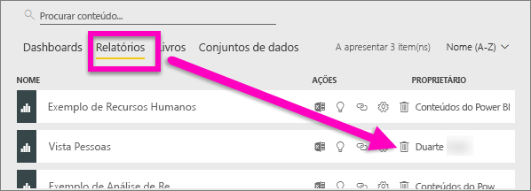
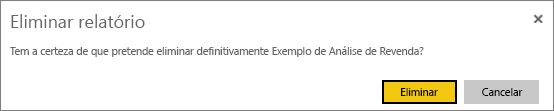
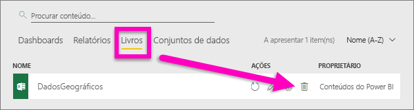
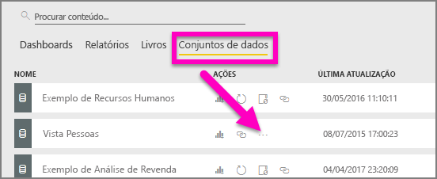
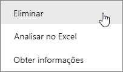
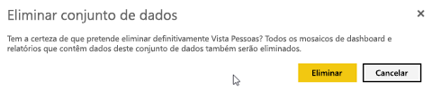
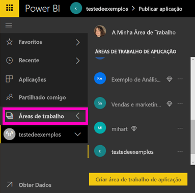
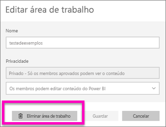
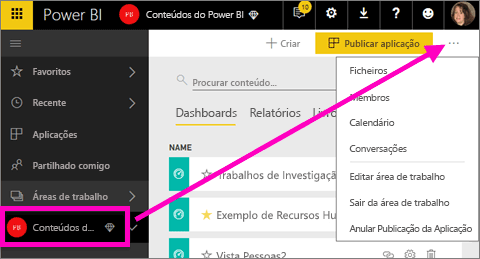
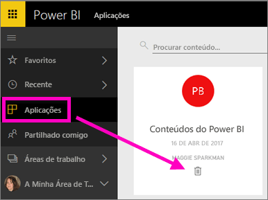

# Eliminar praticamente qualquer coisa no serviço Power BI
Este artigo mostra como eliminar um dashboard, relatório, livro, conjunto de dados, aplicação, visualização e área de trabalho no serviço Power BI.

## Eliminar um dashboard
Os dashboards podem ser removidos. Remover o dashboard não elimina o conjunto de dados subjacente nem os relatórios associados a esse dashboard.

* Se for o proprietário do dashboard, poderá removê-lo. Se partilhou o dashboard com colegas, remover o dashboard da sua área de trabalho do Power BI não remove o dashboard das áreas de trabalho do Power BI dos seus colegas.
* Se um dashboard for partilhado consigo e já não o quiser ver, é possível removê-lo.  Remover um dashboard não o remove da área de trabalho do Power BI de outra pessoa.
* Se o dashboard fizer parte de um [pacote de conteúdos organizacional](service-organizational-content-pack-disconnect.md), a única forma de o remover será remover o conjunto de dados associado.

### Para eliminar um dashboard
1. Na sua área de trabalho, selecione o separador **Dashboards**.
2. Procure o dashboard a eliminar e selecione o ícone Eliminar .

    

## Eliminar um relatório
Não se preocupe, eliminar um relatório não elimina o conjunto de dados no qual o relatório se baseia.  E quaisquer visualizações que tenha afixado a partir do relatório também estão seguras - permanecem no dashboard até as eliminar individualmente.

### Para eliminar um relatório
1. Na sua área de trabalho, selecione o separador **Relatórios**.
2. Procure o relatório a eliminar e selecione o ícone Eliminar   .   

    
3. Confirme a eliminação.

   

   > [!NOTE]
   > Se o relatório fizer parte de um [pacote de conteúdo](service-organizational-content-pack-introduction.md), não poderá eliminá-lo através deste método.  Consulte [Remover a sua ligação a um pacote de conteúdo organizacional](service-organizational-content-pack-disconnect.md).
   >
   >

## Eliminar um livro
Os livros podem ser removidos. No entanto, remover um livro também remove todos os mosaicos de dashboards e relatórios que contêm dados deste livro.

Se o livro estiver armazenado no OneDrive para Empresas, a sua eliminação do Power BI não o elimina do OneDrive.

### Para eliminar um livro
1. Na sua área de trabalho, selecione o separador **Livros**.
2. Procure o livro a eliminar e selecione o ícone Eliminar  .

    
3. Confirme a eliminação.

   

## Eliminar um conjunto de dados
Os conjuntos de dados podem ser eliminados. No entanto, eliminar um conjunto de dados também elimina todos os mosaicos de dashboards e relatórios que contêm dados desse conjunto de dados.

Se o conjunto de dados fizer parte de um ou mais [pacotes de conteúdo organizacional](service-organizational-content-pack-disconnect.md), a única forma de o eliminar é removê-lo dos pacotes de conteúdo onde está a ser utilizado, esperar até que seja processado e tentar eliminá-lo novamente.

### Para eliminar um conjunto de dados
1. Na sua área de trabalho, selecione o separador **Conjuntos de dados**.
2. Procure o conjunto de dados a eliminar e selecione **Mais opções** (...).  

    
3. No menu pendente, selecione **Eliminar**.

   
4. Confirme a eliminação.

   

## Eliminar uma área de trabalho
> [!WARNING]
> Quando criar uma área de trabalho, está a criar um grupo do Office 365. E quando eliminar uma área de trabalho, está a eliminar o respetivo grupo do Office 365. Significa que o seu grupo também será eliminado de outros produtos do O365, como o SharePoint e o Microsoft Teams.
>
>

Como autor da área de trabalho, pode eliminá-la. Quando a eliminar, a aplicação associada também é eliminada para todos os membros do grupo e removida da sua AppSource se tiver publicado a aplicação para toda a organização. Eliminar uma área de trabalho é diferente de sair de uma área de trabalho.

### Eliminar uma área de trabalho – Administradores
1. Na navegação à esquerda, selecione **Áreas de trabalho**

2. Selecione **Mais opções** (...) à direita da área de trabalho a ser eliminada e selecione **Editar área de trabalho**.

    

3. Na janela **Editar área de trabalho**, selecione **Eliminar área de trabalho** > **Eliminar**.

    

### Remover uma área de trabalho da lista
Se já não quiser ser membro de uma área de trabalho, pode ***sair*** e esta será removida da sua lista. Sair de uma área de trabalho deixa-a no local para todos os restantes membros da área de trabalho.  

> [!IMPORTANT]
> Se for o único Administrador da área de trabalho, o Power BI não permitirá que saia.
>
>

1. Comece na área de trabalho cujo nome quer remover.

2. No canto superior direito, selecione **Mais opções** (...) e selecione **Sair da área de trabalho** > **Sair**.

      

   > [!NOTE]
   > As opções que vê no menu pendente variam consoante seja Administrador ou Membro dessa área de trabalho.
   >
   >

## Eliminar ou remover uma Aplicação
As aplicações podem facilmente ser removidas da sua página da lista de aplicações. No entanto, apenas um Administrador de aplicação pode eliminar uma aplicação permanentemente.

### Remover uma aplicação da sua página de lista de aplicações
Eliminar uma aplicação da página de lista de aplicações não elimina a aplicação para outros membros.

1. Na navegação à esquerda, selecione **Aplicações** para abrir a página de lista de aplicações.
2. Passe o cursor sobre a aplicação para eliminar e selecione o ícone Eliminar .

   

   Se remover uma aplicação acidentalmente, terá diversas opções para recuperá-la.  Pode pedir ao criador da aplicação que volte a enviá-la, pode procurar o e-mail original com a ligação para a aplicação, pode ver o seu [Centro de notificações](service-notification-center.md) para saber se a notificação dessa aplicação ainda aparece na lista ou pode consultar o [AppSource](consumer/end-user-apps.md) da sua organização.

## Considerações e resolução de problemas
Este artigo abordou como eliminar os principais blocos modulares do serviço Power BI. No entanto, existem mais coisas que pode eliminar no Power BI.  

* [Remover o seu dashboard em Destaque](service-dashboard-featured.md)
* [Remover um dashboard (remover dos favoritos)](service-dashboard-favorite.md)
* [Eliminar uma página de relatório](service-delete.md)
* [Eliminar um mosaico de dashboard](service-dashboard-edit-tile.md)
* [Eliminar uma visualização de relatório](service-delete.md)

Mais perguntas? [Pergunte à Comunidade do Power BI](http://community.powerbi.com/)
