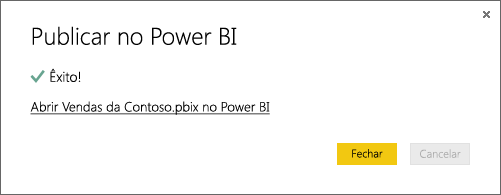

# Obter dados de ficheiros do Power BI Desktop

O **Power BI Desktop** torna a business intelligence e relatórios mais fáceis. Quer esteja a ligar a várias origens de dados, a consultar e transformar dados, a modelar os seus dados e a criar relatórios poderosos e dinâmicos, o **Power BI Desktop** torna as tarefas de business intelligente intuitivas e rápidas. Se não estiver familiarizado com o **Power BI Desktop**, consulte [Introdução ao Power BI Desktop](desktop-getting-started.md).

Assim que tiver dados no **Power BI Desktop** e criar alguns relatórios, está na altura de obter o seu ficheiro guardado no **serviço do Power BI**.

## O local em que o ficheiro é guardado faz a diferença
**Local** – Se guardar o ficheiro numa uma unidade local no computador ou noutro local na sua organização, através do Power BI Desktop, pode *importar* o ficheiro ou *publicá-lo* a partir do Power BI para obter os dados e relatórios para o Power BI. Na verdade, o ficheiro permanecerá na unidade local, pelo que, o ficheiro não é completamente movido para o Power BI. O que realmente acontece é que é criado um novo conjunto de dados no Power BI e os dados e o modelo de dados do ficheiro do Power BI Desktop são carregados para o conjunto de dados. Se o ficheiro tiver relatórios, estes serão apresentados no site do Power BI em Relatórios.

**OneDrive - Empresas** – Caso tenha o OneDrive para Empresas e inicie sessão com a mesma conta utilizada para o início de sessão no Power BI, esta será, sem dúvida, a forma mais eficaz de manter o seu trabalho no Power BI Desktop em sincronização com o conjunto de dados, os relatórios e os dashboards no Power BI. Como o Power BI e o OneDrive estão na cloud, o Power BI *liga* ao ficheiro no OneDrive em intervalos aproximados de uma hora. Caso sejam encontradas alterações, o conjunto de dados, os relatórios e os dashboards serão atualizados automaticamente no Power BI.

**OneDrive - Pessoal** – Caso os ficheiros sejam guardados na sua própria conta do OneDrive, vai aproveitar vários dos mesmos benefícios que teria com o OneDrive para Empresas. A maior diferença é que, na primeira ligação ao ficheiro (ao utilizar Obter Dados > Ficheiros > OneDrive – Pessoal), tem de iniciar sessão no OneDrive com a sua conta Microsoft, a qual é normalmente diferente da utilizada para iniciar sessão no Power BI. Ao iniciar sessão no OneDrive com a sua conta Microsoft, certifique-se de que seleciona a opção Manter sessão iniciada. Dessa forma, o Power BI poderá ligar ao ficheiro em intervalos aproximados de uma hora e garantir que o conjunto de dados no Power BI está sincronizado.

**SharePoint – Sites de Equipa** – Guardar os seus ficheiros do Power BI Desktop no SharePoint – Sites de Equipa é muito semelhante a guardá-los no OneDrive para Empresas. A maior diferença neste caso é como liga ao ficheiro do Power BI. Pode especificar um URL ou ligar à pasta raiz.

## Importar ou ligar a um ficheiro do Power BI Desktop através do Power BI
>[!IMPORTANT]
>O tamanho máximo do ficheiro que pode ser importado no Power BI é de 1 gigabyte.

1. No Power BI, no painel do navegador, clique em **Obter Dados**.
   
   
2. Em **Ficheiros**, clique em **Obter**.
   
   
3. Encontre o ficheiro. Os ficheiros do Power BI Desktop têm a extensão .PBIX.
   
   

## Publicar um ficheiro do Power BI Desktop para o site do Power BI
Utilizar a funcionalidade Publicar através do Power BI Desktop é praticamente o mesmo que utilizar a opção Obter Dados no Power BI para importar o ficheiro a partir de uma unidade local ou ligar ao mesmo no OneDrive.  Segue-se o procedimento mais rápido, mas pode ver [Publicar através do Power BI Desktop](desktop-upload-desktop-files.md) para saber mais.

1. No Power BI Desktop, clique em **Ficheiro** > **Publicar** > **Publicar no Power BI** ou clique em **Publicar** no friso.
   
   
2. Inicie sessão no Power BI. Apenas tem de fazer isto da primeira vez.
   
   Quando terminar, receberá uma ligação para abrir o relatório no site do Power BI.
   
   

## Próximos passos
**Explorar os dados** – Depois de obter dados e relatórios do ficheiro no Power BI, chegou a hora de explorá-los. Se o ficheiro já contiver relatórios, estes aparecerão no painel do navegador em **Relatórios**. Se o ficheiro tinha apenas dados, pode criar novos relatórios; basta clicar com o botão direito do rato no novo conjunto de dados e clicar em **Explorar**.

**Atualizar origens de dados externas** – Se o ficheiro do Power BI Desktop ligar a origens de dados externas, pode configurar a atualização agendada para garantir que o conjunto de dados está sempre atualizado. Na maioria dos casos, é muito fácil configurar a atualização agendada, mas não vamos entrar em detalhes porque está fora do âmbito deste artigo. Veja [Atualização de dados no Power BI](refresh-data.md) para saber mais.

