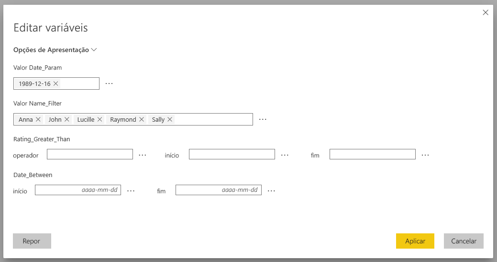
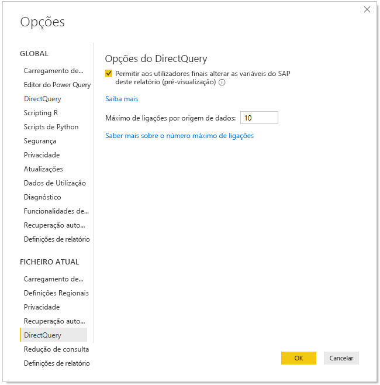
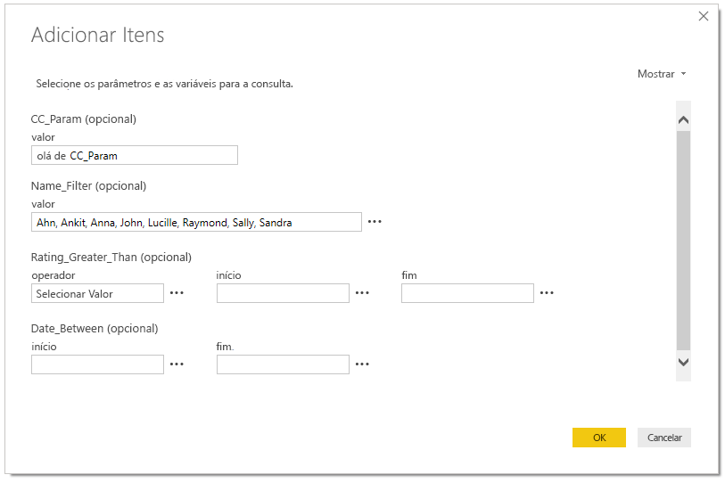
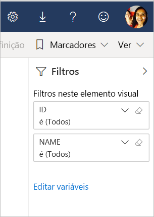

# Editar variáveis de SAP no serviço Power BI (pré-visualização)

Agora, ao utilizar o SAP Business Warehouse ou o SAP HANA com o DirectQuery, os autores de relatórios podem permitir que os utilizadores finais editem variáveis de SAP no **Serviço Power BI** para áreas de trabalho Premium.

Este documento descreve os requisitos para editar variáveis no Power BI, a forma como pode ativar esta funcionalidade de pré-visualização e o local em que pode editar variáveis no serviço Power BI.

## Requisitos da edição de variáveis de SAP

Há alguns requisitos para utilizar a funcionalidade de edição de variáveis de SAP. A seguinte lista descreve estes requisitos.

**Nova Experiência de Filtro necessária** – tem de ter a [nova experiência de filtro](power-bi-report-filter.md) ativa no seu relatório. Eis a forma como pode ativá-la no seu relatório no Power BI Desktop:
- No Power BI Desktop, selecione **Ficheiro** > **Opções e Definições** > **Opções**.
- Na barra de navegação esquerda, em **Ficheiro atual**, selecione **Definições de relatório**.
- Em **Experiência de filtragem**, selecione **Ativar o painel de filtro atualizado**.

**Ligações do DirectQuery necessárias** – tem de estar a ligar à origem de dados de SAP através do DirectQuery. As ligações de importação não são suportadas.

**Subscrição do Power BI Premium necessária** – atualmente, a funcionalidade de edição de variáveis de SAP só funciona em subscrições do Power BI Premium.

**Configuração de SSO necessária** – para que esta funcionalidade funcione, o início de sessão único (SSO) tem de estar configurado. Veja o artigo [Descrição geral do início de sessão único (SSO)](service-gateway-sso-overview.md) para obter mais informações.

**Bits de Novo Gateway necessários** – transfira o gateway mais recente e atualize o seu gateway existente. Veja a definição de [gateway de serviço](service-gateway-onprem.md) para obter mais informações.

**Apenas modelos multidimensionais para SAP HANA** – no SAP HANA, a funcionalidade de edição de variáveis de SAP apenas funciona com modelos multidimensionais e não funciona em origens relacionais.

**Funcionalidade não suportada em Clouds soberanas** – atualmente, o Power Query Online não está disponível em Clouds soberanas; assim, esta funcionalidade também não é suportada em Clouds soberanas.

## Como ativar a funcionalidade

Para ativar a funcionalidade de **edição de variáveis de SAP**, ligue a uma origem de dados SAP HANA ou SAP BW no Power BI Desktop. Em seguida, aceda a **Ficheiro > Opções e definições > Opções** e, na secção Ficheiro Atual no painel esquerdo, selecione **DirectQuery**. Quando selecionar esta opção, irá ver no painel direito opções do DirectQuery e uma caixa de verificação em que pode **Permitir que os utilizadores finais alterem variáveis de SAP no relatório (pré-visualização)**, conforme apresentado na seguinte imagem.

## Utilizar a edição de variáveis de SAP no Power BI Desktop

Ao utilizar a edição de variáveis de SAP no Power BI Desktop, pode editar as variáveis ao selecionar a ligação Editar variáveis a partir do menu **Editar Consultas** no friso. Aqui, é apresentada a seguinte caixa de diálogo. Esta funcionalidade já está disponível no Power BI Desktop há algum tempo. Os criadores de relatórios podem selecionar variáveis para os relatórios através da seguinte caixa de diálogo.

## Utilizar a edição de variáveis de SAP no serviço

Assim que um relatório é publicado no serviço Power BI, os utilizadores podem ver a ligação **Editar variáveis** no novo painel Filtro. Se estiver a publicar um relatório pela primeira vez, a ligação Editar variável pode demorar até 5 minutos a aparecer. Se a ligação não aparecer, terá de atualizar o conjunto de dados manualmente.
Pode fazê-lo da seguinte forma:

1. No serviço Power BI, selecione o separador **Conjuntos de dados** na lista de conteúdos de uma área de trabalho.

2. Localize o conjunto de dados que tem de atualizar e selecione o ícone **Atualizar**.

    

3. Ao selecionar a ligação Editar variáveis, é apresentada a caixa de diálogo **Editar variáveis**, em que os utilizadores podem substituir variáveis. A seleção do botão **Repor** repõe as variáveis para os valores originais que apareceram quando esta caixa de diálogo foi apresentada.

    

4. As alterações na caixa de diálogo **Editar variáveis** serão guardadas apenas para este utilizador (de modo semelhante a outros comportamentos de persistência no Power BI). A seleção da opção **Repor para predefinição**, apresentada na seguinte imagem, repõe o relatório para o estado original definido pelo criador do mesmo, incluindo as variáveis.

    

Ao trabalhar num relatório publicado que utiliza SAP HANA ou SAP BW e tem a funcionalidade **Editar variáveis** ativa no serviço Power BI, o proprietário do relatório pode alterar estas predefinições. O proprietário do relatório pode alterar as variáveis no modo de edição e guardar o relatório para ativar estas definições e torná-las nas *novas predefinições* do mesmo. Todos os outros utilizadores que acederem ao relatório após as alterações feitas pelo proprietário do mesmo irão ver estas novas definições como predefinições.

## Problemas e considerações

Neste momento, a funcionalidade de edição de variáveis de SAP não é suportada em aplicações.

## Próximos passos

Para obter mais informações sobre o SAP HANA, o SAP BW ou o DirectQuery, leia os seguintes artigos:

- [Utilizar o SAP HANA no Power BI Desktop](desktop-sap-hana.md)
- [DirectQuery e SAP Business Warehouse (BW)](desktop-directquery-sap-bw.md)
- [DirectQuery and SAP HANA](desktop-directquery-sap-hana.md) (DirectQuery e SAP HANA)
- [Utilizar o DirectQuery no Power BI](desktop-directquery-about.md)