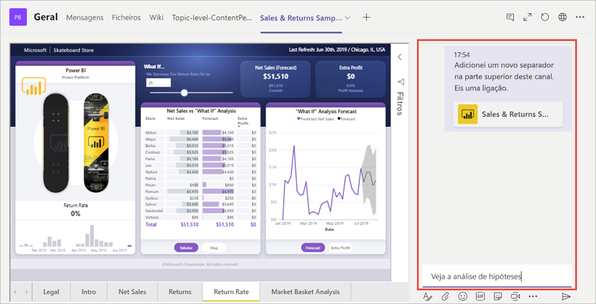

# Incorporar relatório com o separador Power BI para Microsoft Teams

Com o separador Power BI para Microsoft Teams atualizado, pode facilmente incorporar relatórios interativos em canais e chats do Microsoft Teams.

Utilize o separador Power BI para Microsoft Teams para ajudar os seus colegas a encontrar os dados que a sua equipa utiliza e a discutir os dados dentro dos canais da sua equipa.

## Requirements

Para que o **separador Power BI para Microsoft Teams** funcione, é necessário o seguinte:

- Uma licença do Power BI Pro ou o relatório estão incluídos numa [capacidade Premium do Power BI (EM ou P SKU)](service-premium-what-is.md) com uma licença do Power BI.
- O separador Power BI para Microsoft Teams.
- O utilizador tem de iniciar sessão no serviço Power BI para ativar a respetiva licença do Power BI para consumir o relatório.
- O utilizador tem de ter permissão para ver o relatório.

## Incorporar o seu relatório
Para incorporar o seu relatório num canal ou chat do Microsoft Teams, adicione-o como descrito abaixo.

1. Abra o canal ou o chat pretendido no Microsoft Teams e selecione o ícone **+** .

    

2. Selecione o separador Power BI.

    

3. Utilizar as opções fornecidas para selecionar um relatório de Área de trabalho, Partilhado comigo ou uma aplicação Power BI

    

4. O nome do Separador é atualizado automaticamente para corresponder ao nome do relatório, mas pode alterá-lo. 

5. Prima **Guardar**.

## Relatórios suportados

O Separador permite incorporar os seguintes relatórios:

- Relatórios interativos e paginados
- Relatórios em A minha área de trabalho, nova experiência de área de trabalho e áreas de trabalho clássicas
- Relatórios nas aplicações Power BI

## Conceder acesso a relatórios

Incorporar um relatório no Microsoft Teams não dá automaticamente permissão aos utilizadores para verem o relatório. Tem de [permitir que os utilizadores vejam o relatório no Power BI](service-share-dashboards.md). Pode utilizar um Grupo do Office 365 para a sua Equipa para facilitar o processo. 

> [!IMPORTANT]
> Certifique-se de que revê quem pode ver o relatório no serviço Power BI e conceda acesso aos que não estão listados.

Uma forma de garantir que todas as pessoas da sua equipa têm acesso aos relatórios que incorpora, é colocá-los numa única área de trabalho no Power BI e dar ao Grupo do Office 365 da sua equipa acesso à área de trabalho.

## Iniciar uma conversa

Quando adiciona um separador de relatório do Power BI ao Teams, o Teams cria automaticamente uma conversa no separador para acompanhar o relatório. 

- Selecione **Mostrar separador conversa** no canto superior direito.

    

    O primeiro comentário é uma ligação para o relatório. Todas as pessoas nesse canal do Teams podem ver e debater o relatório na conversa.

    

## Limitações e problemas conhecidos

- O Power BI não suporta os mesmos idiomas localizados que o Microsoft Teams. Como tal, poderá não ver uma devida localização no relatório incorporado.
- Os dashboards do Power BI não podem ser incorporados no Separador Power BI para Microsoft Teams.
- Um utilizador sem licença Power BI ou permissão para o relatório verá uma mensagem "Conteúdo não disponível".
- Poderá encontrar problemas se estiver a utilizar o Internet Explorer 10. <!--You can look at the [browsers support for Power BI](consumer/end-user-browsers.md) and for [Office 365](https://products.office.com/office-system-requirements#Browsers-section). -->
- Os [filtros de URL](service-url-filters.md) não são suportados com o separador Power BI para Microsoft Teams.
- Nas clouds nacionais, o novo separador Power BI não está disponível. Pode ser disponibilizada uma versão mais antiga que não suporta a nova experiência de área de trabalho ou relatórios em aplicações Power BI. 
- Depois de guardado o separador, o nome do separador não pode ser alterado através das definições do mesmo. Utilize a opção de alteração de nome para o alterar.

## Próximos passos
- [Partilhar um dashboard com colegas e outros utilizadores](service-share-dashboards.md)  
- [Create and distribute an app in Power BI](service-create-distribute-apps.md) (Criar e distribuir uma aplicação no Power BI)  
- [O que é o Power BI Premium?](service-premium-what-is.md)

Mais perguntas? [Experimente perguntar à Comunidade do Power BI](https://community.powerbi.com/)
