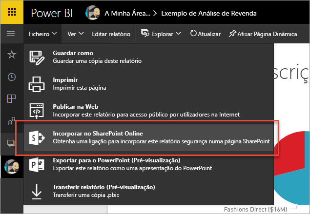
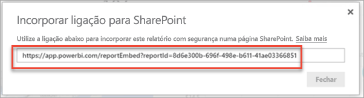
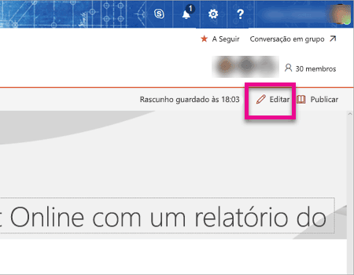
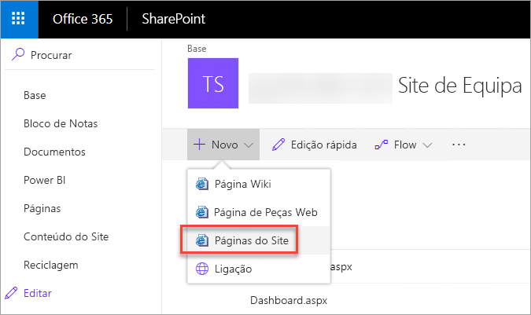
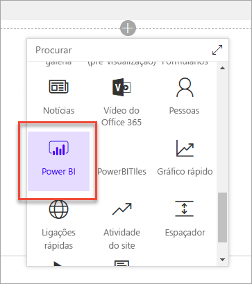
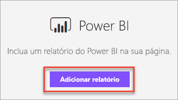
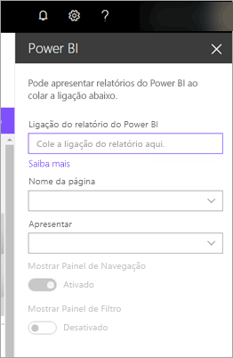
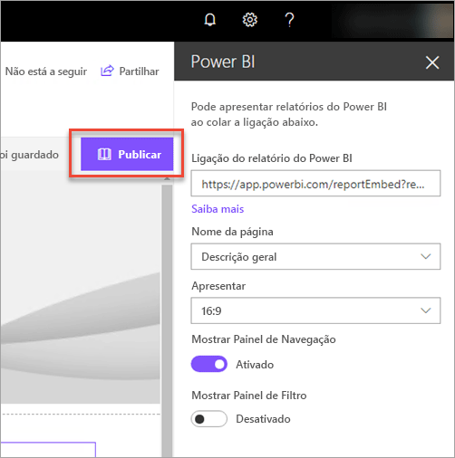
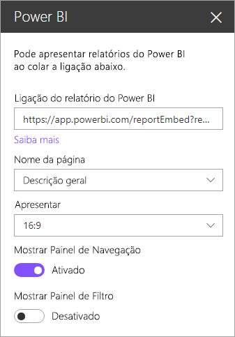
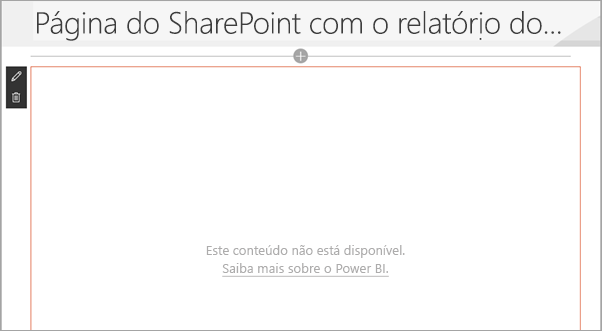

# Incorporar com peças Web de relatórios no SharePoint Online

Com a nova peça Web de relatórios do Power BI para o SharePoint Online, pode facilmente incorporar relatórios interativos do Power BI em páginas do SharePoint Online.

Ao utilizar a opção nova **Incorporar no SharePoint Online**, os relatórios incorporados ficam completamente protegidos, para que possa criar facilmente portais internos seguros.

## Requisitos

Eis alguns requisitos para que os relatórios **Incorporar no SharePoint Online** funcionem.

* Precisa de uma licença do Power BI Pro ou uma [capacidade do Power BI Premium (EM ou P SKU)](service-premium.md#premium-capacity-nodes) com uma licença do Power BI.
* A peça Web do Power BI para o SharePoint Online requer as [Páginas Modernas](https://support.office.com/article/Allow-or-prevent-creation-of-modern-site-pages-by-end-users-c41d9cc8-c5c0-46b4-8b87-ea66abc6e63b).

## Incorporar o seu relatório

Para incorporar o seu relatório no SharePoint Online, tem primeiro de obter o URL do relatório e, em seguida, utilizar esse URL com a nova peça Web do Power BI no SharePoint Online.

### Obter um URL do seu relatório

1. Veja o relatório no serviço Power BI.

2. Selecione o item de menu **Ficheiro**.

3. Selecione **Incorporar no SharePoint Online**.

    

4. Copie o URL da caixa de diálogo.

    

### Adicionar o relatório do Power BI a uma página do SharePoint Online

1. Abra a página pretendida no SharePoint Online e selecione **Editar**.

    

    Também pode selecionar **+ Novo**, no SharePoint Online, para criar uma página de site moderna nova.

    

2. Selecione **+** e selecione a peça Web **Power BI**.

    

3. Selecione **Adicionar relatório**.

    

4. Cole o URL do relatório no painel da propriedade. Este é o URL do relatório que copiou nos passos anteriores. O relatório é carregado automaticamente.

    

5. Selecione **Publicar** para tornar a alteração visível para os seus utilizadores do SharePoint Online.

    

## Conceder acesso a relatórios

Incorporar um relatório no SharePoint Online não dá automaticamente permissão aos utilizadores para ver o relatório. As permissões para ver o relatório são definidas no serviço Power BI.

> [!IMPORTANT]
> Certifique-se de que revê quem pode ver o relatório no serviço Power BI e conceda acesso aos que não estão listados.

Existem duas formas de dar acesso ao relatório no serviço Power BI. Se estiver a utilizar um Grupo do Office 365 para criar o seu site de equipa do SharePoint Online, deve listar o utilizador como membro da **área de trabalho de aplicação no serviço Power BI** e da **página do SharePoint**. Isto garante que os utilizadores conseguem ver o conteúdo desse grupo. Para obter mais informações, veja [Create and distribute an app in Power BI](service-create-distribute-apps.md) (Criar e distribuir uma aplicação no Power BI).

Em alternativa, pode partilhar um relatório diretamente com os utilizadores ao incorporar o relatório numa aplicação. A aplicação tem de estar previamente instalada para incorporar o relatório. Pode configurar a aplicação para ser previamente instalada através da funcionalidade **Instalar aplicação automaticamente**.

   

> [!NOTE]
> **O utilizador precisa de acesso à página do SharePoint e ao relatório para ver o relatório na página do SharePoint.**

## Autenticação multifator

Se o seu ambiente do Power BI requerer que inicie sessão através da autenticação multifator, poderá ser-lhe pedido que inicie sessão com um dispositivo de segurança para verificar a sua identidade. Isto ocorre se não tiver iniciado sessão no SharePoint Online através da autenticação multifator, mas o seu ambiente do Power BI requerer uma conta validada por um dispositivo de segurança.

> [!NOTE]
> A autenticação multifator ainda não é suportada no Azure Active Directory 2.0. Os utilizadores recebem uma mensagem a indicar *erro*. Se o utilizador voltar a iniciar sessão no SharePoint Online através do respetivo dispositivo de segurança, este conseguirá ver o relatório.

## Definições de peças Web

Segue-se uma descrição das definições que podem ser ajustadas na peça Web Power BI para o SharePoint Online.

| Propriedade | Descrição |
| --- | --- |
| Nome da página |Predefine a página que é mostrada pela peça Web. Selecione um valor no menu pendente. Se não forem apresentadas páginas, significa que o seu relatório tem uma página ou que o URL que colou contém um nome de página. Remova a secção de relatório do URL para selecionar uma página específica. |
| Apresentar |Opção para personalizar o ajuste do relatório na página do SharePoint Online. |
| Mostrar Painel de Navegação |Mostra ou oculta o painel de navegação de páginas. |
| Mostrar Painel de Filtro |Mostra ou oculta o painel de filtro. |

## Relatórios que não são carregados

O seu relatório poderá não ser carregado na peça Web Power BI, apresentando a seguinte mensagem.

*Este conteúdo não está disponível.*

Existem dois motivos comuns para esta mensagem.

1. Não tem acesso ao relatório.
2. O relatório foi eliminado.

Contacte o proprietário da página do SharePoint Online para que este o ajude a resolver o problema.

## Licensing

Os utilizadores que visualizam um relatório no SharePoint precisam de uma **licença do Power BI Pro** ou os conteúdos precisam de estar numa área de trabalho com  **[capacidade do Power BI Premium (SKU EM ou P)](service-admin-premium-purchase.md)**.

## Limitações e problemas conhecidos

* Erro: “Ocorreu um erro; tente terminar e voltar a iniciar sessão e, em seguida, revisite esta página. ID de correlação: não definido, estado de resposta HTTP: 400, código de erro de servidor 10001, mensagem: Token atualizado em falta”
  
  Se receber este erro, experimente um dos passos de resolução de problemas abaixo.
  
  1. Termine a sessão no SharePoint e volte a iniciá-la. Certifique-se de que fecha todas as janelas do browser antes de voltar a iniciar sessão.

  2. Se a sua conta de utilizador requer autenticação multifator (MFA), certifique-se de que inicia sessão no SharePoint através do seu dispositivo de autenticação multifator (aplicação para telemóvel, smart card, etc.)
  
  3. As contas de utilizadores Convidados do Azure B2B não são suportadas. Os utilizadores veem o logótipo do Power BI que mostra que a peça está a ser carregada, mas não será apresentado o relatório.

* O Power BI não suporta os mesmos idiomas localizados que o SharePoint Online. Como tal, poderá não ver uma devida localização no relatório incorporado.

* Poderá encontrar problemas se estiver a utilizar o Internet Explorer 10. Pode ver a [compatibilidade de browsers do Power BI](consumer/end-user-browsers.md) e do [Office 365](https://products.office.com/office-system-requirements#Browsers-section).

* A peça Web do Power BI não está disponível para [clouds soberanas](https://powerbi.microsoft.com/en-us/clouds/).

* O SharePoint Server clássico não é suportado com esta peça Web.

* Os [filtros de URL](service-url-filters.md) não são suportados na peça Web do SPO.

## Próximos passos

[Allow or prevent creation of modern site pages by end users](https://support.office.com/article/Allow-or-prevent-creation-of-modern-site-pages-by-end-users-c41d9cc8-c5c0-46b4-8b87-ea66abc6e63b) (Permitir ou impedir a criação de páginas de sites modernos por utilizadores finais)  
[Create and distribute an app in Power BI](service-create-distribute-apps.md) (Criar e distribuir uma aplicação no Power BI)  
[Partilhar um dashboard com colegas e outros utilizadores](service-share-dashboards.md)  
[O que é o Power BI Premium?](service-premium.md)  

Mais perguntas? [Experimente perguntar à Comunidade do Power BI](http://community.powerbi.com/)