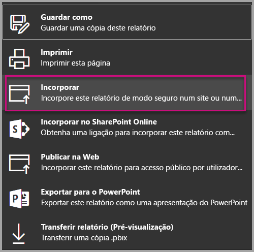
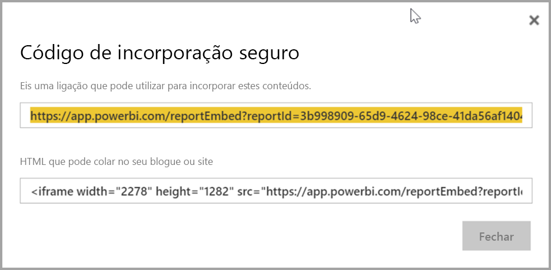
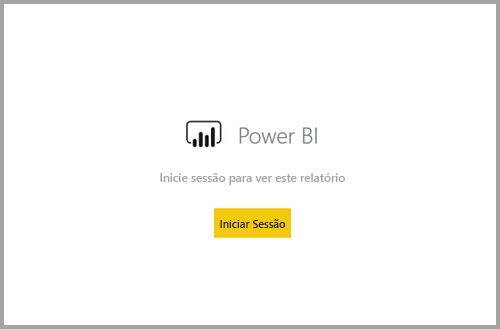
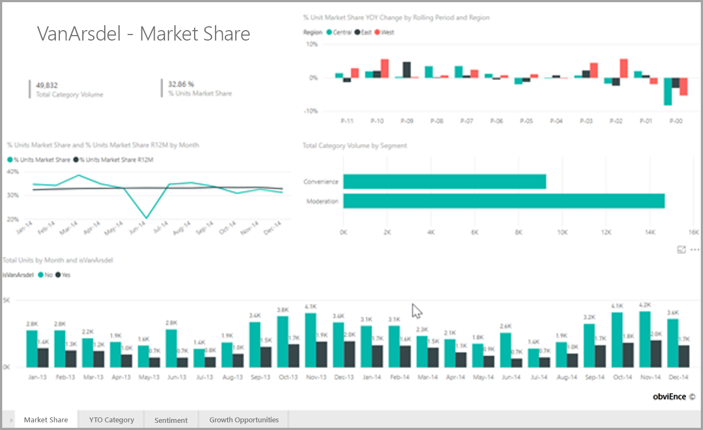

# <a name="embed-a-report-in-a-secure-portal-or-website"></a>Incorporar um relatório num site ou portal seguro

A nova opção **Incorporar** segura para relatórios no Power BI permite que os utilizadores incorporem relatórios com facilidade e segurança em portais Web internos, sejam **com base na cloud** ou **alojados no local**, como o SharePoint 2019. Os relatórios incorporados desta forma respeitam todas as permissões de itens e a segurança de dados através da segurança ao nível da linha (RLS). A funcionalidade foi criada para permitir incorporação sem código em qualquer portal que aceite um URL ou um iFrame para incorporar.

A opção **Incorporar** também suporta [Filtros de URL](service-url-filters.md) e definições de URL. A opção **Incorporar** permite-lhe integrar portais através de uma abordagem de código reduzido que requer conhecimento básico de HTML e JavaScript.

## <a name="how-to-embed-power-bi-reports-into-portals"></a>Como **Incorporar** relatórios do Power BI em portais

1. A nova opção **Incorporar** está disponível no menu **Ficheiro** para relatórios no serviço Power BI.

    

2. Selecione a opção Incorporar para abrir uma caixa de diálogo que apresenta uma ligação e um iFrame que é utilizado para incorporar o relatório de forma segura.

    

3. Depois de incorporar o URL no portal Web, ou se abrir o URL diretamente, o utilizador é autenticado antes de lhe ser concedido acesso ao relatório. Abaixo, o utilizador não iniciou sessão no Power BI na sessão do browser. Quando o utilizador prime **Iniciar sessão**, um novo separador ou janela do browser poderá ter de ser aberto. Se não receber o pedido para iniciar sessão, verifique se existem bloqueadores de janelas pop-up.

    

4. Depois de o utilizador iniciar sessão, o relatório abre-se e mostra os dados, permitindo que os utilizadores naveguem nas páginas e definam filtros. O relatório é apresentado apenas aos utilizadores que têm permissão para ver o relatório no Power BI. Todas as regras de segurança ao nível da linha (RLS) também são aplicadas. Por último, o utilizador tem de estar licenciado corretamente, seja porque precisa de uma licença do Power BI Pro ou porque o relatório tem de estar numa área de trabalho que esteja numa capacidade do Power BI Premium. O utilizador tem de iniciar sessão sempre que abrir uma nova janela do browser, mas depois de iniciar sessão uma vez, os outros relatórios carregam automaticamente.

    

5. Quando utilizar a opção iFrame, é recomendável que edite o HTML apresentado para especificar a altura e a largura desejadas para ajustar à página Web do seu portal.

    

## <a name="granting-access-to-reports"></a>Conceder acesso a relatórios

A opção Incorporar não permite automaticamente aos utilizadores ver o relatório. As permissões para ver o relatório são definidas no serviço Power BI.

Para conceder acesso ao relatório no serviço Power BI, pode partilhar o relatório com os utilizadores que precisem de acesso ao relatório incorporado. Se estiver a utilizar um Grupo do Office 365, pode listar o utilizador como membro da área de trabalho de aplicação no serviço Power BI. Para obter mais informações, veja como [gerir uma área de trabalho de aplicação](service-manage-app-workspace-in-power-bi-and-office-365.md).

## <a name="licensing"></a>Licensing

Os utilizadores que visualizam o relatório incorporado precisam de uma licença do Power BI Pro ou o conteúdo tem de estar numa área de trabalho com [capacidade do Power BI Premium (SKU EM ou P)](service-admin-premium-purchase.md).

## <a name="customize-your-embed-experience-using-url-settings"></a>Personalizar a experiência de incorporação com definições de URL

O URL de incorporação suporta várias definições de entrada que o ajudam a personalizar a sua experiência de utilizador. Se estiver a utilizar o iFrame fornecido, certifique-se de que atualiza o URL nas definições de src do iFrame.

| Propriedade  | Descrição  |  |  |  |
|--------------|-----------------------------------------------------------------------------------------------------------------------------------------------------------------------------------------------------------------------|---|---|---|
| pageName  | Pode utilizar o parâmetro de cadeia de consulta **pageName** para definir a página de relatório que quer abrir. O valor **pageName** corresponde ao final do URL do relatório ao visualizar um relatório no serviço Power BI, conforme mostrado abaixo. |  |  |  |
| Filtros de URL  | Pode utilizar [Filtros de URL](service-url-filters.md) no URL de incorporação que recebeu da IU do Power BI para filtrar o conteúdo da incorporação. Desta forma, pode criar integrações de código reduzido tendo apenas experiência básica de HTML e JavaScript.  |  |  |  |

## <a name="set-which-page-opens-when-the-report-is-embedded"></a>Definir que página abre quando o relatório é incorporado

O valor fornecido na definição *pageName* corresponde ao final do URL do relatório ao visualizar um relatório no serviço Power BI.

1. Abra o relatório a partir do serviço Power BI no seu browser e, em seguida, copie o URL da barra de endereço.

    

2. Anexe a definição *pageName* ao URL.

    

## <a name="filter-report-content-using-url-filters"></a>Filtrar conteúdo do relatório com filtros de URL

Para obter algumas funcionalidades avançadas, pode utilizar [Filtros de URL](service-url-filters.md) para criar mais experiências com o relatório. Por exemplo, o URL abaixo filtra o relatório para mostrar dados do setor da Energia.

A utilização da combinação de **pageName** e [Filtros de URL](service-url-filters.md) pode ser eficiente. Pode criar experiências com HTML e JavaScript básicos.

Por exemplo, eis como pode adicionar um botão a uma página HTML:

```html
<button class="textLarge" onclick='show("ReportSection", "Energy");' style="display: inline-block;">Show Energy</button>
```

Quando premido, o botão chama uma função para atualizar o iFrame com um URL atualizado, o que inclui o filtro para o setor da Energia.

```javascript
function show(pageName, filterValue)

{

var newUrl = baseUrl + "&pageName=" + pageName;

if(null != filterValue && "" != filterValue)

{

newUrl += "&$filter=Industries/Industry eq '" + filterValue + "'";

}

//Assumes there’s an iFrame on the page with id=”iFrame”

var report = document.getElementById("iFrame")

report.src = newUrl;

}
```


Pode adicionar quantos botões quiser para criar uma experiência personalizada com código reduzido. 

## <a name="considerations-and-limitations"></a>Considerações e limitações

* Não suporta utilizadores convidados externos com a capacidade empresa-empresa (B2B) do Azure.

* A incorporação segura funciona para os relatórios publicados no serviço Power BI.

* O utilizador precisa de iniciar sessão para ver o relatório sempre que abrir uma nova janela do browser.

* Nalguns browsers, terá de atualizar a página depois de iniciar sessão, especialmente nos modos InPrivate ou Incógnito.

* Para obter uma experiência de início de sessão único, utilize a opção Incorporar no SharePoint Online ou crie uma integração personalizada através da abordagem [O utilizador detém os dados](developer/embed-sample-for-your-organization.md). Saiba mais sobre a abordagem [O utilizador detém os dados](developer/embed-sample-for-your-organization.md).

* A capacidade de autenticação automática fornecida com a opção **Incorporar** não funciona com a API de JavaScript do Power BI. Para a API de JavaScript do Power BI, utilize a abordagem [O utilizador detém os dados](developer/embed-sample-for-your-organization.md) para incorporar. Saiba mais sobre a abordagem [O utilizador detém os dados](developer/embed-sample-for-your-organization.md).

## <a name="next-steps"></a>Próximos passos

* [Formas de partilhar o seu trabalho](service-how-to-collaborate-distribute-dashboards-reports.md)

* [Filtros de URL](service-url-filters.md)

* [Peça Web de relatórios do SharePoint Online](service-embed-report-spo.md)

* [Publicar na Web](service-publish-to-web.md)