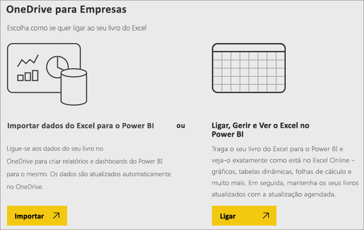
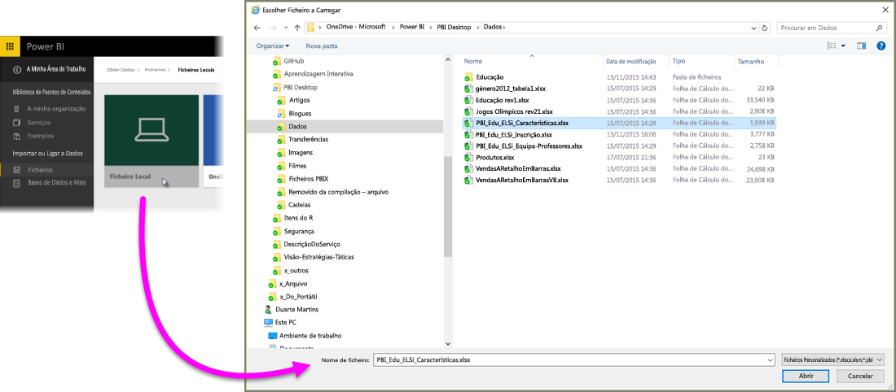
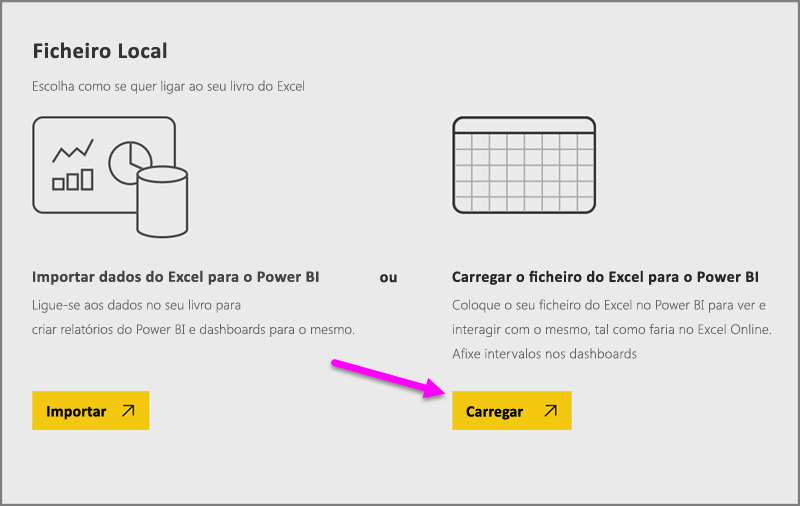
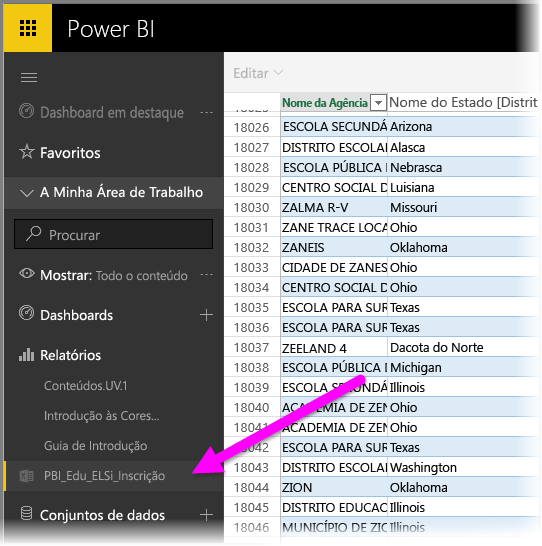

# Obter dados de ficheiros de livros do Excel

O Microsoft Excel é uma das aplicações de negócios mais amplamente utilizadas no mundo. É também uma das formas mais comuns de introduzir dados no Power BI.

## Que tipos de livros o Power BI suporta?
O Power BI suporta a importação ou ligação a livros criados no Excel 2007 e posterior. Os livros devem ser guardados com o tipo de ficheiro .xlsx ou .xlsm e ter menos de 1 GB. Algumas funcionalidades descritas neste artigo estão disponíveis apenas em versões posteriores do Excel.

### Livros com intervalos ou tabelas de dados
Caso o livro tenha folhas de cálculo simples com intervalos de dados, certifique-se de que formata esses intervalos como tabelas para aproveitar ao máximo os seus dados no Power BI. Assim, ao criar relatórios no Power BI, verá tabelas e colunas com nome no painel Campos, facilitando a visualização dos dados.

### Livros com modelos de dados
Os livros podem conter um modelo de dados com uma ou mais tabelas de dados carregadas, ao utilizar tabelas ligadas, o Power Query (Obter e Transformar no Excel 2016) ou o Power Pivot. O Power BI suporta todas as propriedades de modelo de dados como relações, medidas, hierarquias e KPIs.

> [!NOTE]
> Os livros com modelos de dados não podem ser partilhados em inquilinos do Power BI. Por exemplo, um utilizador que iniciar sessão no Power BI com uma conta *contoso.com* não consegue partilhar um livro do Excel com um utilizador que iniciar sessão com uma conta de início de sessão do Power BI de *woodgrovebank.com*.
> 
> 

### Livros com ligações a origens de dados externas
Se utilizar o Excel para ligar a uma origem de dados externa, depois de inserir o livro no Power BI, poderá criar relatórios e dashboards baseados nos dados dessa origem de dados ligada. Também é possível configurar a Atualização Agendada para ligar de forma automática diretamente à origem de dados e obter atualizações. Já não terá de fazer a atualização manual a partir do friso Dados no Excel. Todas as visualizações nos relatórios e mosaicos em dashboards baseados nos dados dessa origem de dados serão atualizados automaticamente. Para saber mais, veja [Atualização de dados no Power BI](refresh-data.md).

### Livros com folhas de cálculo do Power View, Tabelas Dinâmicas e gráficos
A forma como as folhas de cálculo do PowerView, as Tabelas Dinâmicas e os gráficos são apresentados ou não no Power BI dependerá do local em que o ficheiro de livro é guardado e de como optar por inseri-los no Power BI. Vamos examinar este aspeto mais detalhadamente abaixo.

## Tipo de dados
O Power BI suporta os seguintes tipos de dados: Número Inteiro, Número Decimal, Moeda, Data, Verdadeiro/Falso e Texto. Marcar os dados no Excel como tipos de dados específicos melhora a experiência do Power BI.

## Preparar o livro para o Power BI
Assista a este vídeo bastante útil para saber mais sobre como garantir que os livros do Excel estão prontos para o Power BI.

<iframe width="500" height="281" src="https://www.youtube.com/embed/l2wy4XgQIu0" frameborder="0" allowfullscreen></iframe>

## O local em que o ficheiro de livro é guardado faz a diferença
**Local** - se guardar o ficheiro de livro numa unidade local do seu computador ou noutra localização da organização, a partir do Power BI, pode carregar o ficheiro para o Power BI. Na verdade, o ficheiro permanecerá na unidade local; portanto, o ficheiro completo não é, de facto, importado para o Power BI. O que realmente ocorre é que um novo conjunto de dados é criado no Power BI e os dados e o modelo de dados (caso existam) do livro são carregados para o conjunto de dados. Se o livro tiver folhas do Power View, serão apresentadas no site do Power BI em Relatórios. O Excel 2016 também tem a funcionalidade **Publicar** (no menu **Ficheiro**). A utilização de **Publicar** é praticamente a mesma que a utilização de **Obter Dados > Ficheiro > Ficheiro Local** do Power BI, mas, em geral, será mais fácil atualizar o conjunto de dados no Power BI se efetuar alterações regulares do livro.

**OneDrive - Empresas** – Caso tenha o OneDrive para Empresas e inicie sessão com a mesma conta utilizada para o início de sessão no Power BI, esta será, sem dúvida, a maneira mais efetiva de manter o seu trabalho no Excel em sincronia com o seu conjunto de dados, os seus relatórios e dashboards no Power BI. Visto que tanto o Power BI quanto o OneDrive ficam na cloud, o Power BI *liga* ao ficheiro de livro no OneDrive em intervalos aproximados de sessenta minutos. Caso sejam encontradas alterações, o conjunto de dados, os relatórios e os dashboards serão atualizados automaticamente no Power BI. Da mesma forma que guardou o livro numa unidade local, também é possível utilizar Publicar para atualizar o conjunto de dados e os relatórios no Power BI imediatamente. Caso contrário, o Power BI será sincronizado de forma automática, geralmente, dentro de uma hora.

**OneDrive - Pessoal** – Caso os ficheiros de livro sejam guardados na sua conta do OneDrive, terá vários dos mesmos benefícios que teria com o OneDrive para Empresas. A maior diferença é que, na primeira ligação ao ficheiro (com Obter Dados > Ficheiros > OneDrive – Pessoal), será necessário iniciar sessão no OneDrive com a sua conta da Microsoft, que, normalmente, é diferente da que é utilizada para iniciar sessão no Power BI. Ao iniciar sessão no OneDrive com a sua conta da Microsoft, certifique-se de que seleciona a opção Manter sessão iniciada. Desta forma, o Power BI poderá ligar ao ficheiro de livro em intervalos aproximados de sessenta minutos e garantir que o conjunto de dados e os relatórios no Power BI estão sincronizados.

**SharePoint – Sites de Equipa** – Guardar os seus ficheiros do Power BI Desktop no SharePoint – Sites de Equipa é muito semelhante a guardá-los no OneDrive para Empresas. A maior diferença neste caso é como liga ao ficheiro do Power BI. É possível especificar um URL ou ligar à pasta raiz.

## Um livro do Excel – duas formas de utilizá-lo
Caso guarde os ficheiros de livro no **OneDrive**, terá duas formas de explorar os dados no Power BI

### Importar dados do Excel para o Power BI
Ao escolher **Importar**, todos os dados suportados em tabelas e/ou num modelo de dados são importados para um novo conjunto de dados no Power BI. Caso tenha folhas de cálculo do Power View, serão recriadas no Power BI como relatórios.

É possível continuar a editar o livro. Quando as alterações forem guardadas, serão sincronizadas com o conjunto de dados no Power BI, geralmente, dentro de uma hora. Caso precise de mais resultados imediatos, basta clicar em Publicar novamente, e as alterações serão exportadas imediatamente. Todas as visualizações contidas em relatórios e dashboards também serão atualizadas.

Escolha esta opção caso tenha utilizado Obter e Transformar dados ou o Power Pivot para carregar dados para um modelo de dados, ou se o livro tiver folhas de cálculo do Power View com visualizações que deseja ver no Power BI.

No Excel 2016, também é possível utilizar Publicar > Exportar. É quase a mesma coisa. Para saber mais, veja [Publicar no Power BI a partir do Excel 2016](service-publish-from-excel.md).

### Ligar, gerir e ver o Excel no Power BI
Ao escolher **Ligar**, o livro será apresentado no Power BI, exatamente como apareceria no Excel Online. Mas, ao contrário do Excel Online, terá algumas excelentes funcionalidades para ajudá-lo a afixar elementos das suas folhas de cálculo diretamente nos dashboards.

Não é possível editar o livro no Power BI. No entanto, se precisar de fazer alterações, clique em Editar e escolha a opção para editar o livro no Excel Online ou abri-lo no Excel no seu computador. Todas as alterações feitas são guardadas no livro no OneDrive.

Ao escolher essa opção, nenhum conjunto de dados será criado no Power BI. O livro será apresentado no painel de navegação da área de trabalho do Power BI em Relatórios. Os livros ligados têm um ícone especial do Excel.

Escolha esta opção se tiver apenas dados em folhas de cálculo ou se desejar afixar intervalos, Tabelas Dinâmicas e gráficos nos dashboards.

No Excel 2016, também é possível utilizar Publicar > Carregar. É quase a mesma coisa. Para saber mais, veja [Publicar no Power BI a partir do Excel 2016](service-publish-from-excel.md).

## Importar ou ligar a um livro do Excel a partir do Power BI
1. No Power BI, no painel de navegação, clique em **Obter Dados**.
   
   
2. Em Ficheiros, clique em **Obter**.
   
   
3. Encontre o ficheiro.
   
   
4. Se o ficheiro de livro estiver no OneDrive ou SharePoint – Sites de Equipa, escolha **Importar** ou **Ligar**.

## Livros do Excel locais
Também pode utilizar um ficheiro do Excel local e carregá-lo para o Power BI. Basta selecionar **Ficheiro Local** no menu anterior e navegar para a localização onde guardou os livros do Excel.

Depois de selecionado, escolha Carregar o ficheiro para o Power BI.

Depois de o livro estar carregado, receberá uma notificação de que o livro está pronto.

Assim que o livro estiver pronto, pode encontrá-lo na secção **Relatórios** do Power BI.

## Publicar no seu site do Power BI a partir do Excel 2016
A utilização da funcionalidade **Publicar no Power BI** no Excel 2016 é praticamente o mesmo que utilizar **Obter Dados** no Power BI para importar ou ligar ao ficheiro. Não entraremos em detalhes aqui, mas pode ver [Publicar no Power BI a partir do Excel 2016](service-publish-from-excel.md) para saber mais.

## Resolução de Problemas
O ficheiro de livro é muito grande? Confira [Reduzir o tamanho de um livro do Excel para apresentá-lo no Power BI](reduce-the-size-of-an-excel-workbook.md).

Atualmente, ao escolher a opção Importar, o Power BI importa apenas os dados que fazem parte de uma tabela ou de um modelo de dados com nome. Como resultado, se o livro não contiver nenhuma tabela, folhas de cálculo do Power View ou modelos de dados do Excel com nome, poderá ver este erro: **“Não foi possível localizar dados no livro do Excel”**. [Este artigo](service-admin-troubleshoot-excel-workbook-data.md) explica como corrigir o livro e importá-lo novamente.

## Passos seguintes
**Explore os dados** – Depois de obter dados e relatórios do seu ficheiro no Power BI, está na altura de explorá-los. Basta clicar com o botão direito do rato no novo conjunto de dados e clicar em Explorar. Caso tenha decidido ligar a um ficheiro de livro no OneDrive no passo 4, o livro será apresentado em Relatórios. Ao clicar nele, será aberto no Power BI, da mesma forma como seria aberto se estivesse no Excel Online.

**Agendar atualização** – Se o ficheiro de livro do Excel ligar a origens de dados externas ou se tiver sido importado de uma unidade local, pode configurar a atualização agendada para garantir que o conjunto de dados ou relatório está sempre atualizado. Na maioria dos casos, é muito fácil configurar a atualização agendada, no entanto, não entraremos em detalhes sobre esta configuração porque está fora do âmbito deste artigo. Veja [Atualização de dados no Power BI](refresh-data.md) para saber mais.

[Publicar no Power BI a partir do Excel 2016](service-publish-from-excel.md)

[Power BI Publisher para Excel](publisher-for-excel.md)

[Atualização de dados no Power BI](refresh-data.md)

