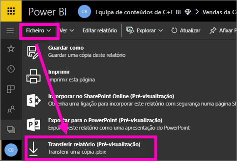
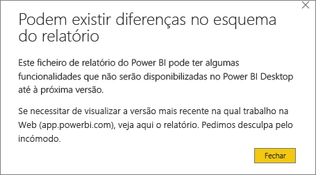
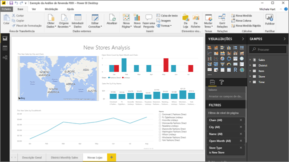

# Exportar um relatório do serviço Power BI para Desktop (pré-visualização)
No Power BI Desktop, pode exportar (ou *transferir*) um relatório para o serviço Power BI ao guardar o relatório e selecionar **Publicar**. Também pode exportar na outra direção e transferir um relatório do serviço Power BI para Desktop. A extensão dos ficheiros exportados é *.pbix* em ambas as direções.

Existem algumas limitações e considerações a ter em conta, que são abrangidas mais adiante neste artigo.

## Transferir o relatório como .pbix
Para transferir o ficheiro .pbix, siga estes passos:

1. No **serviço Power BI**, abra o relatório que pretende transferir na [Vista de edição](service-reading-view-and-editing-view.md).
2. Na barra de menu, selecione **Ficheiro > Transferir relatório**.
   
   > [!NOTE]
   > O relatório deverá ter sido [criado com o Power BI Desktop](guided-learning/publishingandsharing.yml?tutorial-step=2) após o 23 de novembro de 2016 (e atualizado desde então) para o poder transferir. Se não tiver sido, a opção de menu *Transferir Relatório* no serviço Power BI ficará a cinzento.
   > 
   > 
3. Enquanto o ficheiro .pbix estiver a ser criado, uma faixa de estado apresenta o progresso. Quando o ficheiro estiver pronto, ser-lhe-á pedido que abra ou guarde o ficheiro .pbix. O nome do ficheiro corresponde ao título do relatório.
   
    
   
    Tem agora a opção de abrir o ficheiro .pbix no serviço Power BI (app.powerbi.com) ou no Power BI Desktop.     
4. Para abrir imediatamente o relatório no Desktop, selecione **Abrir**. Para guardar o ficheiro numa localização específica, selecione **Guardar > Guardar como**. Se ainda não o fez, [instale o Power BI Desktop](desktop-get-the-desktop.md).
   
    Quando abrir o relatório no Desktop, poderá ver uma mensagem a avisá-lo de que algumas das funcionalidades disponíveis no relatório do serviço Power BI poderão não estar disponíveis no Desktop.
   
    

5. O editor de relatório no Desktop é muito semelhante ao editor de relatório no serviço Power BI.  
   
    

## Considerações e resolução de problemas
Existem algumas considerações e limitações importantes associadas à transferência (exportação) de um ficheiro *.pbix* do serviço Power BI.

* Para transferir o ficheiro, tem de ter acesso de edição ao relatório
* O relatório deverá ter sido criado com o **Power BI Desktop** e *publicado* no **serviço Power BI**. Ou, o .pbix deverá ter sido *carregado* para o serviço.
* Os relatórios têm de ter sido publicados ou atualizados após 23 de novembro de 2016. Os relatórios publicados antes desta data não podem ser transferidos.
* Esta funcionalidade não é compatível com relatórios originalmente criados no **serviço Power BI**, incluindo pacotes de conteúdos.
* Deve sempre utilizar a versão mais recente do **Power BI Desktop** ao abrir ficheiros transferidos. Os ficheiros *.pbix* transferidos poderão não ser abertos em versões não atuais do **Power BI Desktop**.
* Se o seu administrador tiver desativado a capacidade de exportar dados, esta funcionalidade não estará visível no **serviço Power BI**.
* Não é possível transferir um conjunto de dados com atualização incremental para um ficheiro *.pbix*.

## Próximos passos
Veja o vídeo de um minuto do canal **Guy in a Cube** sobre esta funcionalidade:

<iframe width="560" height="315" src="https://www.youtube.com/embed/ymWqU5jiUl0" frameborder="0" allowfullscreen></iframe>

Além disso, eis alguns artigos adicionais que o podem ajudar a saber como utilizar o **serviço Power BI**:

* [Relatórios no Power BI](service-reports.md)
* [Power BI - Conceitos Básicos](service-basic-concepts.md)

Após instalar o **Power BI Desktop**, os seguintes conteúdos poderão ajudá-lo a começar rapidamente:

* [Introdução ao Power BI Desktop](desktop-getting-started.md)

Mais perguntas? [Pergunte à Comunidade do Power BI](http://community.powerbi.com/)   

