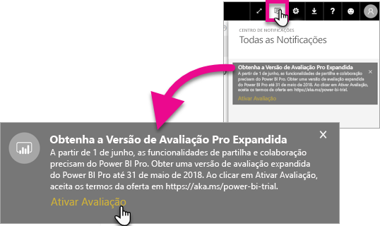
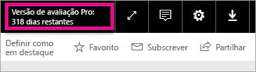

# Ativação da Avaliação Pro Expandida
A partir de 1 de junho de 2017, todos os utilizadores elegíveis poderão optar ativamente pela Avaliação Pro Expandida do serviço Power BI.

<iframe width="640" height="360" src="https://www.youtube.com/embed/tPsNoPyY9aA?showinfo=0" frameborder="0" allowfullscreen></iframe>

Como parte do [anúncio do Power BI Premium de 3 de maio de 2017](https://powerbi.microsoft.com/blog/microsoft-accelerates-modern-bi-adoption-with-power-bi-premium/), a Microsoft comunicou as alterações ao serviço Power BI gratuito em vigor a partir de 1 de junho de 2017. Estas alterações incluem a expansão do acesso a todas as origens de dados, maiores limites de armazenamento da área de trabalho e taxas de atualização e transmissão em fluxo superiores para o serviço Gratuito, tornando-o equivalente ao Power BI Pro.

Foi também anunciada que as funcionalidades de partilha e colaboração serão exclusivas dos utilizadores do Power BI Pro, incluindo a partilha de dashboards ponto a ponto, o agrupamento de áreas de trabalho (agora denominadas áreas de trabalho de aplicação), a exportação para o PowerPoint e a análise no Excel com aplicações do Power BI. A exportação para CSV/Excel e PowerPoint foi identificada na comunicação de 3 de maio como uma capacidade limitada do Power BI Pro, mas, após receber os comentários da comunidade abrangente de utilizadores, a estratégia evoluiu para disponibilizar a capacidade também aos utilizadores do serviço Gratuito.

A partir de 1 de junho de 2017, os utilizadores existentes do serviço Gratuito que estiveram ativos durante o ano passado (até 2 de maio de 2017) serão elegíveis para uma avaliação gratuita expandida de 12 meses do Power BI Pro. A oferta permitirá aos utilizadores tirar partido das funcionalidades completas do Power BI Pro durante o próximo ano como um sinal de agradecimento à comunidade e dar-lhes o tempo necessário para ajustarem as alterações.

A 1 de junho de 2017, os utilizadores elegíveis receberão uma notificação quando iniciarem sessão no serviço, a informá-los de que as alterações entraram em vigor com um pedido de registo na oferta de avaliação expandida do Power BI Pro. O administrador de TI de um utilizador não controla as notificações no produto, nem tem a capacidade de se registar na avaliação expandida do Power BI Pro em nome de um utilizador. Cada utilizador elegível tem de agir individualmente para concluir este processo.

Os utilizadores podem optar por se registarem na oferta em qualquer altura durante o período de 12 meses, mas a Avaliação Pro Expandida estará concluída para todos os utilizadores a 31 de maio de 2018, independentemente de quando aceitam a oferta. Neste momento, os utilizadores terão da opção de comprar o Power BI Pro ou serem convertidos para a versão Gratuita do Power BI, sem as capacidades de partilha e colaboração, se optarem por não fazer nada e comprarem o Power BI Pro.

Não estão a ser feitas alterações ao Power BI Pro. Estes utilizadores não são afetados e não irão receber notificações quando iniciarem sessão no serviço a 1 de junho de 2017 ou após essa data. Os utilizadores que recusarem a oferta de avaliação expandida do Power BI Pro ou não forem elegíveis para a oferta, irão continuar a utilizar a versão Gratuita do Power BI sem as capacidades de partilha e colaboração. Podem registar-se em qualquer altura numa avaliação padrão do Power BI Pro de 60 dias através do [site](https://powerbi.microsoft.com/get-started/) do Power BI.

## Elegibilidade para a Avaliação Pro Expandida
A sua conta tem de cumprir os seguintes requisitos para ser elegível para a oferta Avaliação Pro Expandida.

* Os utilizadores do Power BI Gratuito ativos entre 3 de maio de 2016 e 2 de maio de 2017 são elegíveis para uma Avaliação Pro Expandida.
* Os utilizadores que utilizaram anteriormente ou estão atualmente na *avaliação Pro no produto de 60 dias* ainda são elegíveis para a Avaliação Pro Expandida.

> [!NOTE]
> Os utilizadores que possuem licenças atribuídas a partir de subscrições do Power BI Pro ou Avaliação do Power BI Pro, no Office 365, estão excluídos desta oferta.
> 
> 

## Como ativar
Existem duas formas de ativar a Avaliação Pro Expandida. A primeira é ao iniciar sessão no Power BI. Se tiver ignorado esse pedido, verá também uma opção na área de notificações.

> [!NOTE]
> As comunicações no produto não são controladas pelo administrador e serão enviadas aos utilizadores elegíveis.
> 
> 

### Experiência de início de sessão
Quando iniciar sessão no serviço Power BI e for elegível, irá receber um aviso de pop-up. A seleção de **Ativar Avaliação** começará a Avaliação Pro Expandida. Não será necessária nenhuma ação adicional.

Em seguida, tem a capacidade de aceder a todos os relatórios e dashboards partilhados existentes durante a duração da avaliação.

Se tiver selecionado **Agora Não**, a Avaliação Pro Expandida pode ser ativada a qualquer altura até ao fim do período de avaliação, a 31 de maio de 2018.

### Ativação numa data posterior
Se tiver ignorado o pop-up ao selecionar **Agora Não**, a Avaliação Pro Expandida pode ser ativada a qualquer altura até ao fim do período de avaliação, a 31 de maio de 2018. Isto pode ser feito no **Centro de notificações**.

No centro de notificações, verá uma notificação sobre a Avaliação Pro Expandida. A notificação estará disponível até o utilizador a ignorar.

Na notificação, pode selecione **Ativar Avaliação** para iniciar a avaliação. Não será necessária nenhuma ação adicional.

Em seguida, tem a capacidade de aceder a todos os relatórios e dashboards partilhados existentes durante a duração da avaliação.

## Após a ativação
Após a ativação, verá o número de dias restantes na sua avaliação na parte superior direita.

Pode rever os termos nos [Termos e condições da oferta Avaliação Pro Expandida](https://aka.ms/power-bi-trial). A Avaliação Pro Expandida está em vigor até 31 de maio de 2018 para todos os utilizadores elegíveis.

## Perguntas mais frequentes
**O que acontece aos novos utilizadores que se inscreveram após 3 de maio de 2017?**

Os utilizadores que se inscreveram no Power BI Gratuito a partir de 3 de maio de 2017 não são elegíveis para a Avaliação Pro Expandida. No entanto, são elegíveis para a Avaliação Pro standard de 60 dias.

**Como sei quem na minha organização é elegível para a Avaliação Pro Expandida?**

Apesar de não haver uma forma direta de o descobrir, pode ver o relatório de Aplicações Integradas do Azure Active Directory para que o Power BI veja quem são os utilizadores ativos na sua organização nos últimos 30 dias. Isto pode dar-lhe uma ideia de quem pode ser elegível. Para obter mais informações, consulte [Encontrar utilizadores do Power BI que iniciaram sessão](service-admin-access-usage.md).

Esses utilizadores ativos no período de elegibilidade, e que têm licenças gratuitas, receberão a notificação pop-up. 

> [!NOTE]
> O relatório do Azure ID não indica se um utilizador é Gratuito ou Pro no Power BI. Reporta apenas que utilizadores iniciaram sessão no Power BI e quando iniciaram sessão. Se um utilizador estiver listado neste relatório, não significa necessariamente que seja elegível para a Avaliação Pro Expandida.
> 
> 

**os administradores podem impedir um utilizador de ativar a Avaliação Pro Expandida?**

Não. Os administradores não têm uma forma de impedir os utilizadores de ativarem a Avaliação Pro Expandida ou a avaliação de 60 dias do serviço Power BI Pro.

## Passos seguintes
[Termos e condições da oferta Avaliação Pro Expandida](https://aka.ms/power-bi-trial)  
[Contrato de serviço do Power BI para utilizadores individuais](https://powerbi.microsoft.com/terms-of-service/)  
[Anúncio do Power BI Premium](https://aka.ms/pbipremium-announcement)  
[Encontrar utilizadores do Power BI que iniciaram sessão](service-admin-access-usage.md)

Mais perguntas? [Experimente perguntar à Comunidade do Power BI](https://community.powerbi.com/)

