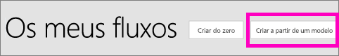
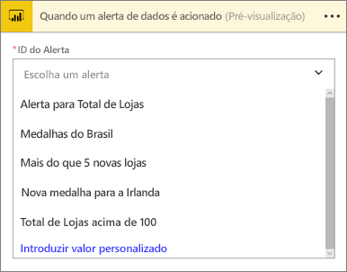
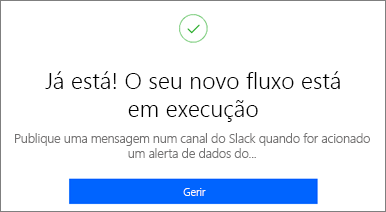
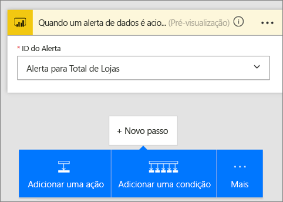
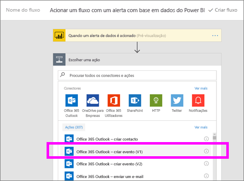
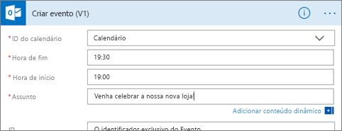
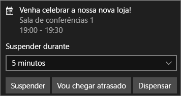

# Microsoft Flow e Power BI

O [Microsoft Flow](https://flow.microsoft.com/en-us/documentation/getting-started) é uma oferta SaaS para automatizar fluxos de trabalho entre o número cada vez maior de aplicações e serviços SaaS em que os utilizadores empresariais confiam. Com o Flow, pode automatizar tarefas ao integrar os seus serviços e aplicações favoritos (incluindo o Power BI) de forma a obter notificações, sincronizar ficheiros, recolher dados e muito mais. As tarefas repetitivas tornam-se mais fáceis com a automatização de fluxos de trabalho.

[Comece agora a utilizar o Flow.](https://flow.microsoft.com/documentation/getting-started)

Veja o Sirui a criar um Fluxo que envia um e-mail detalhado aos colegas quando um alerta do Power BI é acionado. Depois, siga as instruções passo a passo abaixo do vídeo para experimentar.

<iframe width="560" height="315" src="https://www.youtube.com/embed/YhmNstC39Mw" frameborder="0" allowfullscreen></iframe>

## Criar um fluxo acionado por um alerta de dados do Power BI
Este tutorial mostra-lhe como criar dois fluxos diferentes: um a partir de um modelo e um de raiz. Para continuar, [crie um alerta de dados no Power BI](service-set-data-alerts.md) e [inscreva-se no Microsoft Flow](https://flow.microsoft.com/en-us/#home-signup) (é gratuito!).

## Criar um fluxo que utilize o Power BI a partir de um modelo
Nesta tarefa vamos utilizar um modelo para criar um fluxo simples que é acionado por um alerta de dados do Power BI (notificação).

1. Inicie sessão no Microsoft Flow (flow.microsoft.com).
2. Selecione **Os meus fluxos**.
   
   
3. Selecione **Criar a partir de um modelo**.
   
    
4. Utilize a caixa de Pesquisa para encontrar modelos do Power BI e selecione **Publique uma mensagem num canal do Slack quando for acionado um alerta de dados do Power BI**.
   
    
5. Selecione **Utilizar este modelo**.
   
   
6. Se lhe for pedido, ligue-se ao Slack e ao Power BI selecionando **Iniciar sessão** e siga as instruções. Aparecerá uma marca de verificação verde a informá-lo de que tem sessão iniciada.  Após confirmar as suas ligações, selecione **Continuar**.
   
   

### Criar o fluxo
Este modelo tem um acionador (alerta de dados do Power BI para novas medalhas olímpicas para a Irlanda) e uma ação (publicar uma mensagem no Slack). Ao selecionar um campo, o Flow mostra os conteúdos dinâmicos que pode incluir.  Neste exemplo vamos incluir o valor do mosaico e o URL do mosaico no corpo da mensagem.

1. No menu pendente do acionador, selecione um alerta de dados do Power BI. Selecione **Nova medalha para a Irlanda**. Para saber como criar um alerta, selecione [Alertas de dados no Power BI](service-set-data-alerts.md).
   
   
2. Para publicar no Slack, introduza o nome de um canal e o texto da mensagem (também pode selecionar a mensagem predefinida que o Flow cria). Repare nos conteúdos dinâmicos que incluímos no campo de texto da mensagem.
   
   > [!NOTE]
   > Inclua "@" no início do nome do canal.  Por exemplo, se o canal do Slack tiver o nome de "channelA", no Flow, introduza "@channelA".
   > 
   > 
   
   
3. Quando concluir, selecione **Criar fluxo** ou **Guardar fluxo**.  O fluxo é criado e avaliado.  O Flow avisa-o caso encontre erros.
4. Se forem encontrados erros, selecione **Editar fluxo** para corrigi-los. Caso contrário, selecione **Concluído** para executar o novo fluxo.
   
   
5. Abra a sua conta do Slack para ver a mensagem.  
   
   

## Criar um Fluxo de raiz que utiliza o Power BI (em branco)
Nesta tarefa vamos criar de raiz um fluxo simples que é acionado por um alerta de dados do Power BI (notificação).

1. Inicie sessão no Microsoft Flow.
2. Selecione **Os meus fluxos** > **Criar do zero**.
   
   
3. Utilize a caixa de Pesquisa para encontrar um acionador do Power BI e selecione **Acionar um fluxo com um alerta com base em dados do Power BI**.

### Criar o seu fluxo
1. No menu pendente, selecione o nome do seu alerta.  Para saber como criar um alerta, selecione [Alertas de dados no Power BI](service-set-data-alerts.md).
   
    
2. Selecione **Novo passo** > **Adicionar uma ação**.
   
   
3. Pesquise **Outlook** e selecione **Criar evento**.
   
   
4. Preencha os campos do evento. Ao selecionar um campo, o Flow mostra os conteúdos dinâmicos que pode incluir.
   
   
5. Selecione **Criar fluxo** depois de concluir.  O Flow guarda e avalia o fluxo. Se não houver erros, selecione **Concluído** para executar este fluxo.  O novo fluxo é adicionado à página **Os meus fluxos**.
   
   
6. Quando este fluxo for acionado pelo seu alerta de dados do Power BI, receberá uma notificação de evento do Outlook semelhante a esta.
   
    

## Passos seguintes
* [Introdução ao Microsoft Flow](https://flow.microsoft.com/en-us/documentation/getting-started/)
* [Definir alertas de dados no serviço Power BI](service-set-data-alerts.md)
* [Definir alertas de dados no iPhone](mobile-set-data-alerts-in-the-mobile-apps.md)
* [Definir alertas de dados na aplicação móvel Power BI para Windows 10](mobile-set-data-alerts-in-the-mobile-apps.md)
* Mais perguntas? [Experimente a Comunidade do Power BI](http://community.powerbi.com/)

