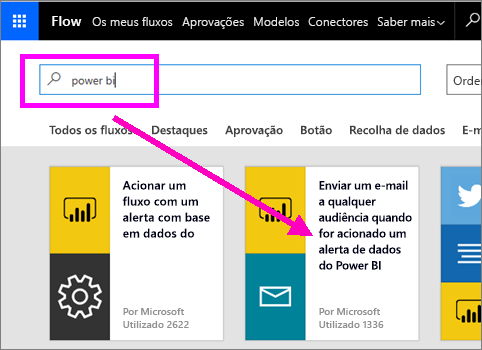
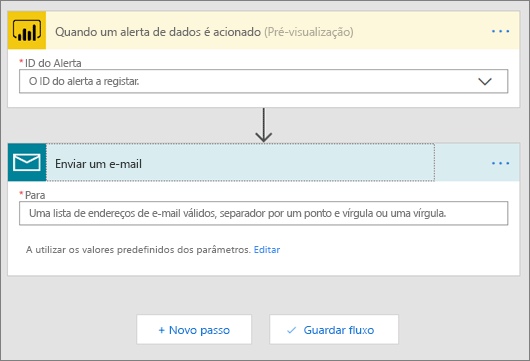
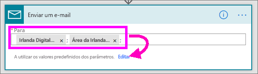
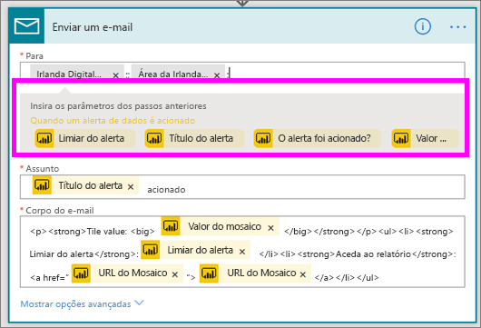
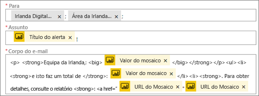
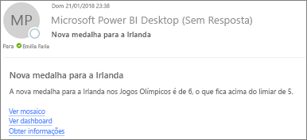
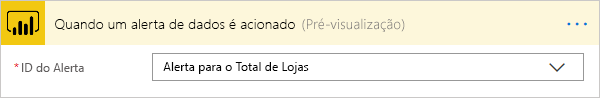

# Power Automate e Power BI

O [Power Automate](https://flow.microsoft.com/documentation/getting-started) é uma oferta SaaS para automatizar fluxos de trabalho entre o número cada vez maior de aplicações e serviços SaaS em que os utilizadores empresariais confiam. Com o Flow, pode automatizar tarefas ao integrar os seus serviços e aplicações favoritos (incluindo o Power BI) de forma a obter notificações, sincronizar ficheiros, recolher dados e muito mais. As tarefas repetitivas tornam-se mais fáceis com a automatização de fluxos de trabalho.

[Comece agora a utilizar o Flow.](https://flow.microsoft.com/documentation/getting-started)

Veja o Sirui a criar um Fluxo que envia um e-mail detalhado aos colegas quando um alerta do Power BI é acionado. Depois, siga as instruções passo a passo abaixo do vídeo para experimentar.

<iframe width="560" height="315" src="https://www.youtube.com/embed/YhmNstC39Mw" frameborder="0" allowfullscreen></iframe>

## Criar um fluxo acionado por um alerta de dados do Power BI

### Pré-requisitos
Este tutorial mostra-lhe como criar dois fluxos diferentes: um a partir de um modelo e um de raiz. Para acompanhar, [crie um alerta de dados no Power BI](service-set-data-alerts.md), crie uma conta do Slack gratuita e [inscreva-se no Power Automate](https://flow.microsoft.com/#home-signup) (é gratuito).

## Criar um fluxo que utilize o Power BI a partir de um modelo
Nesta tarefa vamos utilizar um modelo para criar um fluxo simples que é acionado por um alerta de dados do Power BI (notificação).

1. Inicie sessão no Power Automate (flow.microsoft.com).
2. Selecione **Os meus fluxos**.
   
   
3. Selecione **Criar a partir de um modelo**.
   
    
4. Utilize a caixa de Pesquisa para localizar modelos do Power BI e selecione **Enviar um e-mail a qualquer audiência quando for acionado um alerta de dados do Power BI > Continuar**.
   
    

### Criar o fluxo
Este modelo tem um acionador (alerta de dados do Power BI para novas medalhas olímpicas para a Irlanda) e uma ação (enviar um e-mail). Ao selecionar um campo, o Flow mostra os conteúdos dinâmicos que pode incluir.  Neste exemplo vamos incluir o valor do mosaico e o URL do mosaico no corpo da mensagem.

1. No menu pendente do acionador, selecione um alerta de dados do Power BI. Selecione **Nova medalha para a Irlanda**. Para saber como criar um alerta, selecione [Alertas de dados no Power BI](service-set-data-alerts.md).
   
   
2. Introduza um ou mais endereços de e-mail válidos e, em seguida, selecione **Editar** (mostrado abaixo) ou **Adicionar conteúdo dinâmico**. 
   
   

3. O fluxo cria um título e uma mensagem que pode manter ou modificar. Todos os valores que definir aquando da criação do alerta no Power BI estão disponíveis para utilização – basta colocar o cursor sobre eles e selecionar a partir da área realçada cinzenta. 

   

1.  Por exemplo, se tiver criado um título do alerta no Power BI de **Ganhámos outra medalha**, pode selecionar **Título do alerta** para adicionar esse texto ao campo Assunto do e-mail.

    

    Pode também aceitar o corpo do e-mail predefinido ou criar o seu próprio. O exemplo acima contém algumas modificações na mensagem.

1. Quando concluir, selecione **Criar fluxo** ou **Guardar fluxo**.  O fluxo é criado e avaliado.  O Flow avisa-o caso encontre erros.
2. Se forem encontrados erros, selecione **Editar fluxo** para corrigi-los. Caso contrário, selecione **Concluído** para executar o novo fluxo.
   
   
5. Quando o alerta de dados é acionado, será enviado um e-mail para os endereços que indicou.  
   
   

## Criar um Fluxo de raiz que utiliza o Power BI (em branco)
Nesta tarefa vamos criar de raiz um fluxo simples que é acionado por um alerta de dados do Power BI (notificação).

1. Inicie sessão no Power Automate.
2. Selecione **Os meus fluxos** > **Criar do zero**.
   
   
3. Utilize a caixa de Pesquisa para localizar um acionador do Power BI e selecione **Power BI - quando um alerta de dados é acionado**.

### Criar o seu fluxo
1. No menu pendente, selecione o nome do seu alerta.  Para saber como criar um alerta, selecione [Alertas de dados no Power BI](service-set-data-alerts.md).
   
    
2. Selecione **Novo passo** > **Adicionar uma ação**.
   
   
3. Pesquise **Outlook** e selecione **Criar evento**.
   
   
4. Preencha os campos do evento. Ao selecionar um campo, o Flow mostra os conteúdos dinâmicos que pode incluir.
   
   
5. Selecione **Criar fluxo** depois de concluir.  O Flow guarda e avalia o fluxo. Se não houver erros, selecione **Concluído** para executar este fluxo.  O novo fluxo é adicionado à página **Os meus fluxos**.
   
   
6. Quando este fluxo for acionado pelo seu alerta de dados do Power BI, receberá uma notificação de evento do Outlook semelhante a esta.
   
    

## Próximos passos
* [Introdução ao Power Automate](https://flow.microsoft.com/documentation/getting-started/)
* [Definir alertas de dados no serviço Power BI](service-set-data-alerts.md)
* [Definir alertas de dados no iPhone](consumer/mobile/mobile-set-data-alerts-in-the-mobile-apps.md)
* [Definir alertas de dados na aplicação móvel do Power BI para Windows 10](consumer/mobile/mobile-set-data-alerts-in-the-mobile-apps.md)
* Mais perguntas? [Pergunte à Comunidade do Power BI](https://community.powerbi.com/)

