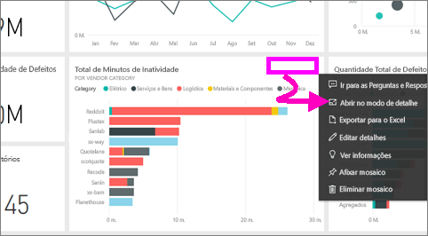
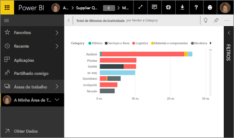
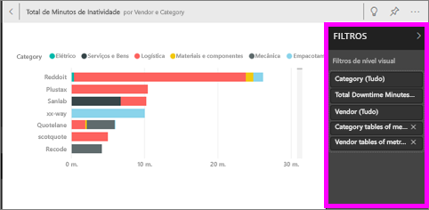
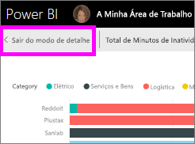
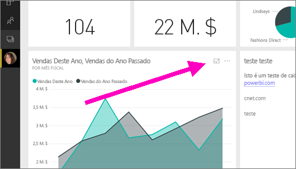
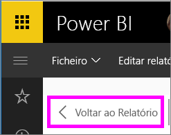

# Apresentar um mosaico do dashboard ou um elemento visual do relatório no modo de detalhe

<iframe width="560" height="315" src="https://www.youtube.com/embed/dtdLul6otYE" frameborder="0" allowfullscreen></iframe>

## O que é o modo de detalhe?

O modo de ***detalhe*** permite-lhe expandir (destacar) conteúdo para ver mais detalhes.  No modo de detalhe, pode ver e modificar os filtros que foram aplicados quando o elemento visual foi criado.  No serviço Power BI pode utilizar o modo de detalhe num mosaico do dashboard ou num elemento visual de relatório e no Power BI Desktop pode utilizar o modo de detalhe num [elemento visual de relatório](desktop-report-view.md).

> [!NOTE]
> O modo de detalhe é diferente do [modo de ecrã inteiro](service-fullscreen-mode.md).
> 

## Modo de detalhe para os mosaicos do dashboard

1. Passe o rato sobre a visualização de mosaico, selecione as reticências (…) e escolha **Abrir no modo de detalhe**. 

    .

2. O mosaico é aberto e ocupa toda a tela do relatório. 

   

3. Expanda o painel Filtros para ver todos os filtros aplicados a este visual.
   
   

4. Explore ainda mais ao modificar os filtros e, se detetar algo interessante, afixe o elemento visual a um dashboard.

5. Saia do modo de detalhe e regresse ao dashboard ao selecionar **< Sair do modo de detalhe** (no canto superior esquerdo do elemento visual).
   
        

## Modo de detalhe para visualizações de relatório

1. Passe o rato sobre a visualização de relatório e selecione o ícone do **modo de detalhe** .  
   
   
2. A visualização é aberta e ocupa toda a tela. 

   
3. Expanda o painel Filtros para ver todos os filtros aplicados a este visual.
   
   
4. Explore ainda mais ao modificar os filtros e, se detetar algo interessante, afixe o elemento visual a um dashboard.   
5. Saia do modo de detalhe e regresse ao relatório ao selecionar **Regressar ao relatório** (no canto superior esquerdo do elemento visual). 
   
      

## Passar do modo de detalhe para o modo de ecrã inteiro
No modo de detalhe, o mosaico ou o elemento visual pode ser [visualizado em ecrã inteiro (Modo de TV)](service-fullscreen-mode.md). O modo de ecrã inteiro é apresentado sem a distração dos menus nem dos botões de navegação.

## Considerações e resolução de problemas
* Ao utilizar o modo de detalhe com uma visualização num relatório, poderá ver e modificar todos os filtros: ao nível do Elemento visual, da Página, do Pormenorização e do Relatório.    
* Ao utilizar o modo de detalhe com uma visualização num dashboard, poderá ver e modificar apenas ao nível do elemento visual.

Mais perguntas? [Pergunte à Comunidade do Power BI](http://community.powerbi.com/)

