# De um livro do Excel a um relatório incrível num instante
A sua gestora quer ver um relatório sobre os números de vendas mais recentes combinado com as impressões da última campanha até ao fim do dia. No entanto, os dados mais recentes residem em vários sistemas de terceiros e em ficheiros no seu portátil. Anteriormente, levava várias horas a criar elementos visuais e a formatar um relatório. Está a começar a ficar ansioso.

Não se preocupe. Com o Power BI, pode criar um relatório incrível em pouco tempo.

Neste exemplo, vamos carregar um ficheiro do Excel a partir de um sistema local, criar um novo relatório e partilhá-lo com colegas – tudo no Power BI.

## Preparar os dados
Vamos utilizar um ficheiro simples do Excel como exemplo. Antes de carregar o ficheiro do Excel no Power BI, tem de organizar os dados numa tabela simples. Isto significa que cada coluna contém o mesmo tipo de dados, por exemplo, texto, data, número ou moeda. Deve ter uma linha de cabeçalho, mas não devem existir colunas ou linhas com os totais.

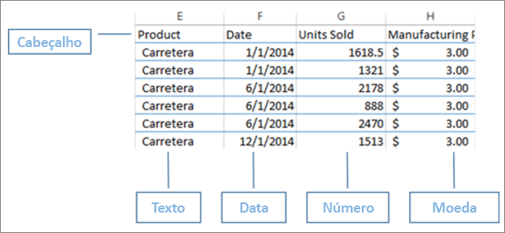

Em seguida, formate os dados como uma tabela. No Excel, no separador Base, no grupo Estilos, selecione **Formatar como Tabela**. Selecione um estilo de tabela a aplicar à folha de cáculo. A folha de cáculo do Excel está agora pronta para ser carregada para o Power BI.

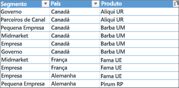

## Carregar o ficheiro do Excel para o Power BI
O Power BI liga-se a várias origens de dados, incluindo ficheiros do Excel que residem no seu computador. Para começar, inicie sessão no Power BI. Se ainda não se inscreveu, [pode fazê-lo gratuitamente](https://powerbi.com).

Crie um novo dashboard. Abra **A minha área de trabalho** e selecione o ícone **+ Criar**.

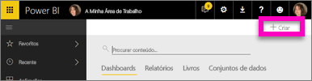

Selecione **Dashboard**, introduza um nome e selecione **Criar**. O novo dashboard é apresentado – sem dados.

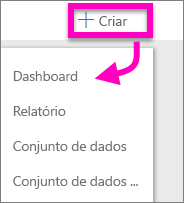

Na parte inferior do painel de navegação esquerdo, selecione **Obter Dados**. Na página Obter Dados, em Importar ou Ligar a Dados, na caixa Ficheiros, selecione **Obter**.

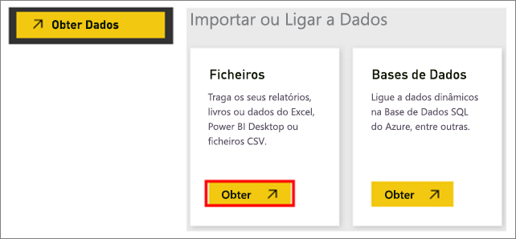

Na página Ficheiros, selecione **Ficheiro Local**. Navegue até ao ficheiro do livro do Excel no seu computador e selecione-o para carregar para o Power BI. Selecione **Importar**.

> **NOTA**: para acompanhar o resto deste tutorial, utilize o [Livro de exemplo financeiro](sample-financial-download.md).
> 
> 

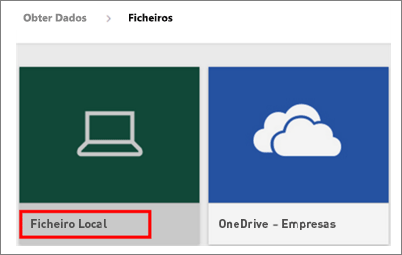

## Criar o relatório
Depois de o Power BI importar o ficheiro do Excel, comece a criar o seu relatório. Quando a mensagem **O conjunto de dados está pronto** é apresentada, selecione **Ver conjunto de dados**.  O Power BI é aberto na vista de edição e apresenta a tela de relatórios. No lado direito, estão os painéis Visualizações, Filtros e Campos.

Tenha em atenção que os dados de tabela do livro do Excel aparecem no painel Campos. Abaixo do nome da tabela, o Power BI lista os cabeçalhos de coluna como campos individuais.

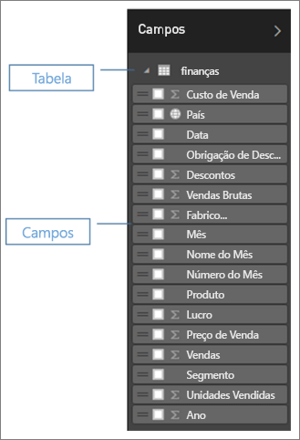

Agora, pode começar a criar visualizações. A sua gestora quer ver o lucro ao longo do tempo. No painel Campos, arraste **Lucro** para a tela do relatório. Por predefinição, o Power BI apresenta um gráfico de barras. Em seguida, arraste **Data** para a tela do relatório. O Power BI atualiza o gráfico de barras para mostrar o lucro por data.

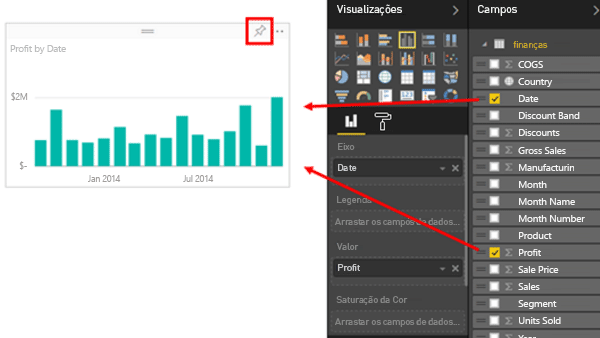

> **DICA**: se o seu gráfico não for parecido com o que era esperado, verifique as suas agregações. Por exemplo, no poço **Valor**, clique com o botão direito do rato no campo que acabou de adicionar e certifique-se de que os dados estão a ser agregados da forma que pretende.  Neste exemplo, estamos a utilizar **Soma**.
> 
> 

A sua gestora quer saber quais os países mais lucrativos. Impressione-a com uma visualização de mapa. Selecione uma área em branco na tela e, no painel Campos, arraste-a sobre os campos **País** e **Lucro**. O Power BI cria um elemento visual de mapa com bolhas que representam o lucro relativo de cada local.

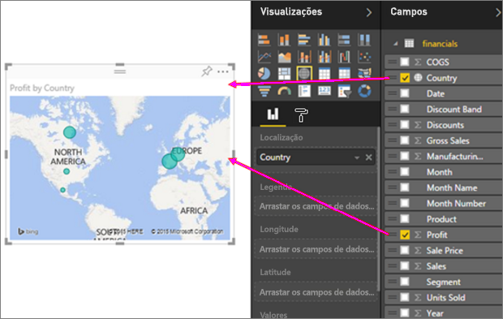

Que tal apresentar um elemento visual que mostre as vendas por produto e segmento de mercado? Isso é fácil. No painel Campos, selecione as caixas de verificação junto aos campos Vendas, Produto e Segmento. O Power BI cria um gráfico de barras instantaneamente. Altere o tipo de gráfico ao escolher um dos ícones no menu Visualizações. Por exemplo, altere-o para um gráfico de Barras Empilhadas.  Para ordenar o gráfico, selecione as reticências (...) > **Ordenar por**.

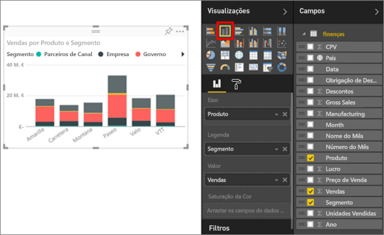

Afixe todos os elementos visuais ao seu Dashboard. Está pronto para partilhá-lo com os seus colegas.

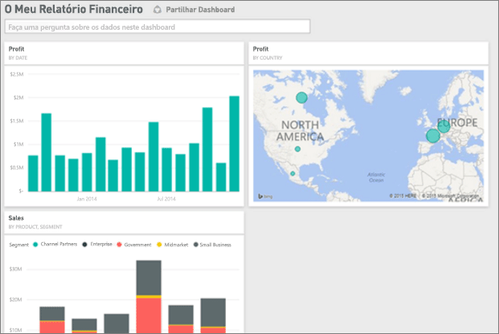

## Partilhar o dashboard
Quer partilhar o seu dashboard com a sua gestora, Paula. Pode partilhar o dashboard e o relatório subjacente com os colegas que tenham uma conta do Power BI. Podem interagir com o relatório, mas não podem guardar alterações.

Para partilhar o relatório, na parte superior do dashboard, selecione **Partilhar**.

O Power BI apresenta a página Partilhar Dashboard. Na área superior, introduza os endereços de e-mail dos destinatários. Adicione uma mensagem no campo abaixo. Para permitir que os destinatários partilhem o dashboard com outras pessoas, selecione **Permitir aos destinatários partilhar o dashboard**. Selecione **Partilhar**.

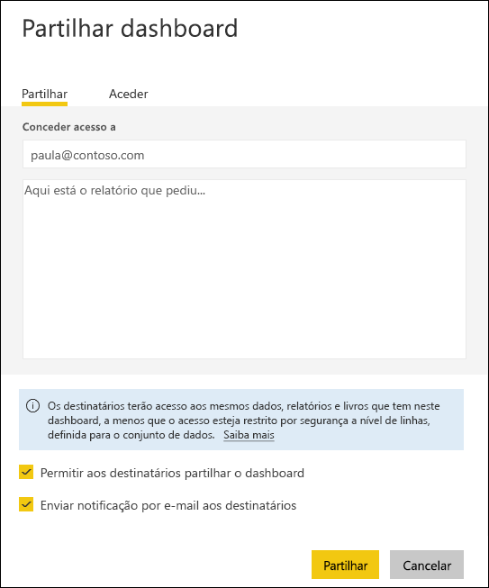

Próximos passos

* [Introdução ao serviço Power BI](service-get-started.md)
* [Introdução ao Power BI Desktop](desktop-getting-started.md)
* [Power BI - Conceitos Básicos](service-basic-concepts.md)
* Mais perguntas? [Experimente a Comunidade do Power BI](http://community.powerbi.com/)

