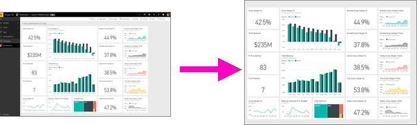
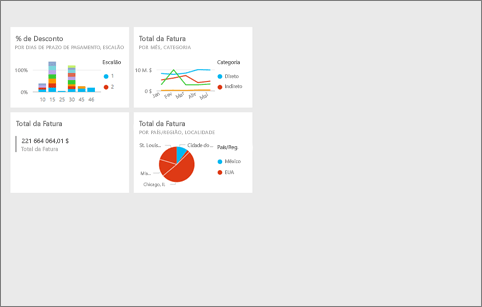
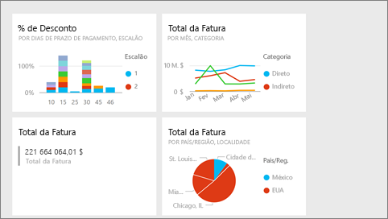
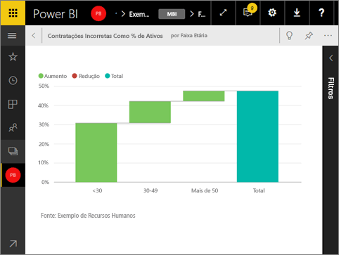

# Modo de Ecrã Inteiro no Power BI
## O que é o modo de Ecrã Inteiro?

Mostre os seus conteúdos (dashboards, relatórios, páginas, mosaicos e visualizações) sem a distração dos menus e das barras de navegação.  Obtém uma visão completa e não adulterada dos seus conteúdos de relance e a qualquer altura. Isto, às vezes, é chamado de Modo de TV. O funcionamento disponível no modo de Ecrã Inteiro varia consoante o conteúdo.  

Alguns usos para o modo de Ecrã Inteiro são:

* apresentar o seu dashboard, mosaico, visual ou relatório numa reunião ou conferência
* apresentar num escritório, num ecrã grande ou projetor dedicado
* ver num ecrã pequeno
* rever no modo bloqueado: pode tocar no ecrã ou passar o cursor sobre os mosaicos sem abrir o relatório ou dashboard subjacente

> **NOTA**: o modo de Ecrã Inteiro difere do [Modo de detalhe (isolar)](service-focus-mode.md).
> 
> 

Veja a Amanda a abrir e navegar no seu dashboard em modo de Ecrã Inteiro e a aplicar parâmetros de URL para controlar a apresentação predefinida. Em seguida, siga as instruções passo a passo abaixo do vídeo para experimentar.

<iframe width="560" height="315" src="https://www.youtube.com/embed/c31gZkyvC54" frameborder="0" allowfullscreen></iframe>

## Dashboards e páginas de relatório no modo de Ecrã Inteiro
1. Na barra de menus do Power BI, acima do seu dashboard ou relatório, selecione o ícone de **Ecrã Inteiro**  . A sua página de relatório ou tela de dashboard preenche todo o ecrã. O exemplo abaixo é um dashboard.
   
      
2. No modo de Ecrã Inteiro, tem diversas opções de menu.  Para fazer surgir o menu, faça passar o rato ou cursor. 
   
     Menu para dashboards    
         
   
     Menu para páginas de relatório    
        
   
        
    Utilize o botão **Voltar** para navegar para a página anterior no seu browser. Se a página anterior era uma página do Power BI, esta também será apresentada no modo de Ecrã Inteiro.  O modo de Ecrã Inteiro continuará ativo até que saia.
   
        
    Utilize este botão para imprimir o seu dashboard ou página de relatório no modo de Ecrã Inteiro. 
   
        
    Utilize o botão **Ajustar ao ecrã** para mostrar o seu dashboard no maior tamanho possível sem incluir barras de deslocamento.     
   
    
   
           
    Há alturas em que não se quer ter barras de deslocamento, mas procura-se fazer com que o dashboard preencha toda a largura do espaço disponível. Selecione o botão **Ajustar à largura**.    
   
    
   
           
    Nos relatórios em Ecrã Inteiro, utilize estas setas para se deslocar entre as páginas no relatório.    
3. Para sair do modo de Ecrã Inteiro, selecione **Sair do Modo de Ecrã Inteiro**.
   
      

## Visualizações e mosaicos de dashboards no modo de Ecrã Inteiro
1. Para ver mosaicos de dashboards e visualizações de relatórios no modo de Ecrã Inteiro, tem de começar com esse mosaico em visualização já em [Modo de detalhe](service-focus-mode.md). 
   
    
2. Em seguida, selecione o ícone de Ecrã Inteiro   correspondente a esse mosaico ou visual. O mosaico ou visual será apresentado em ecrã inteiro sem menus ou barras de navegação.
   
    

## Próximos passos
[Dashboards no Power BI](service-dashboards.md)  
[Modo de detalhe para dashboards e mosaicos de dashboards](service-focus-mode.md)    

Mais perguntas? [Experimente a Comunidade do Power BI](http://community.powerbi.com/)

