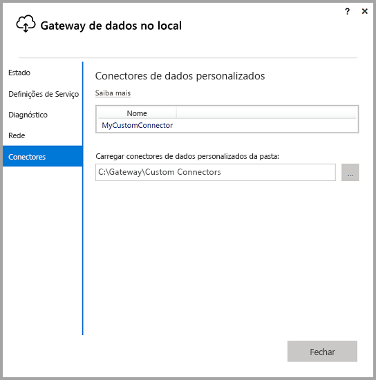
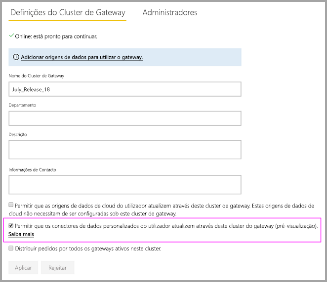
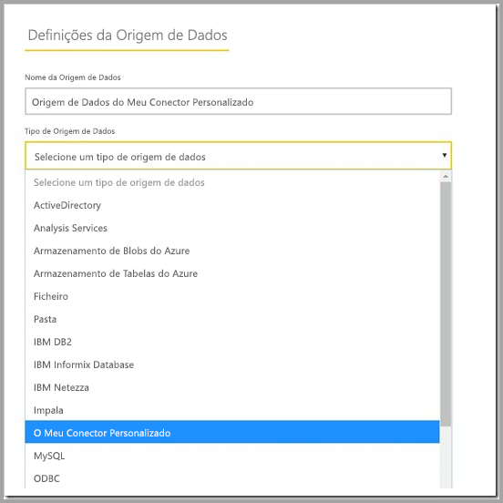

# Utilizar conectores de dados personalizados com o gateway de dados no local

[!INCLUDE [gateway-rewrite](includes/gateway-rewrite.md)]

Com os conectores de dados do Power BI, pode ligar e aceder a dados de uma aplicação, serviço ou origem de dados. Pode desenvolver conectores de dados personalizados e utilizá-los no Power BI Desktop.

Para saber mais sobre como desenvolver conectores de dados personalizados do Power BI, veja a [página do Conector de dados SDK do GitHub](https://aka.ms/dataconnectors). Este site inclui informações sobre como começar e exemplos do Power BI e Power Query.

Ao criar relatórios no Power BI Desktop que utilizam conectores de dados personalizados, pode utilizar o gateway de dados no local para atualizar esses relatórios a partir do serviço Power BI.

## Ativar e utilizar esta funcionalidade

Quando instalar a versão de julho de 2018 do gateway de dados no local ou uma versão posterior, verá o separador **Conectores** na aplicação do gateway de dados no local. Na caixa **Carregar conectores de dados personalizados da pasta**, selecione uma pasta que possa ser acedida pelo utilizador que executa o serviço de gateway. O utilizador predefinido é *NT SERVICE\PBIEgwService*. O gateway carrega automaticamente os ficheiros de conectores personalizados localizados nessa pasta. Os ficheiros são apresentados na lista de conectores de dados.

Se estiver a utilizar o gateway de dados no local (modo pessoal), pode carregar o seu relatório do Power BI para o serviço Power BI e utilizar o gateway para o atualizar.

No caso do gateway de dados no local, tem de criar uma origem de dados para o seu conector personalizado. Na página de definições do gateway no serviço Power BI, quando selecionar o cluster de gateway, deverá ver uma opção para permitir a utilização de conectores personalizados. Certifique-se de que todos os gateways no cluster têm a versão atualizada de julho de 2018 ou posterior para que esta opção esteja disponível. Selecione a opção para ativar a utilização de conectores personalizados com este cluster.

Quando esta opção estiver ativa, verá os seus conectores personalizados como origens de dados disponíveis que pode criar neste cluster de gateway. Após criar uma origem de dados que utiliza o seu novo conector personalizado, pode atualizar os relatórios do Power BI através deste conector, no serviço Power BI.

## Considerações e limitações

* Certifique-se de que a pasta que cria está acessível ao serviço de gateway em segundo plano. Normalmente, as pastas que se encontram na pasta Windows ou nas pastas de sistema do utilizador não estarão acessíveis. Se a pasta não estiver acessível, a aplicação de gateway de dados no local apresenta uma mensagem. Esta instrução não se aplica ao gateway de dados no local (modo pessoal).
* Para que os conectores personalizados possam funcionar com o gateway de dados no local, é necessário que seja implementada uma secção "TestConnection" no código do conector personalizado. Esta secção não é necessária ao utilizar conectores personalizados com o Power BI Desktop. Por este motivo, pode ter um conector que funciona com o Power BI Desktop, mas não com o gateway. Para obter mais informações sobre como implementar uma secção TestConnection, veja [esta documentação](https://github.com/Microsoft/DataConnectors/blob/master/docs/m-extensions.md#implementing-testconnection-for-gateway-support).

## Próximos passos

* [Gerir a sua origem de dados – Analysis Services](service-gateway-enterprise-manage-ssas.md)  
* [Gerir a sua origem de dados – SAP HANA](service-gateway-enterprise-manage-sap.md)  
* [Gerir a sua origem de dados – SQL Server](service-gateway-enterprise-manage-sql.md)  
* [Gerir a sua origem de dados – Oracle](service-gateway-onprem-manage-oracle.md)  
* [Gerir a origem de dados – atualização importada/agendada](service-gateway-enterprise-manage-scheduled-refresh.md)
* [Configurar as definições de proxy do gateway de dados no local](/data-integration/gateway/service-gateway-proxy)
* [Utilizar o Kerberos para SSO (início de sessão único) a partir do Power BI para origens de dados no local](service-gateway-sso-kerberos.md)  

Mais perguntas? Experimente perguntar à [Comunidade do Power BI](https://community.powerbi.com/).
