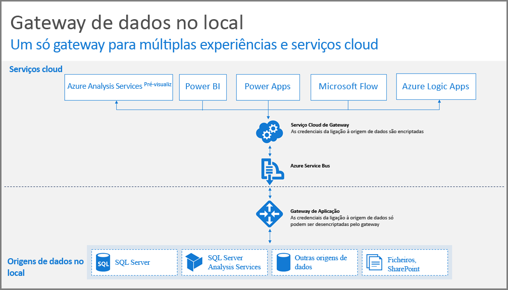
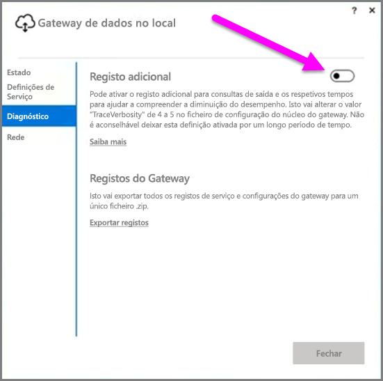
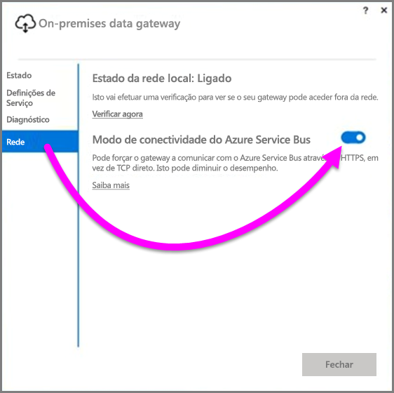

# Diretrizes para implementar um gateway de dados para o Power BI

Este artigo fornece orientação e considerações para implementar um gateway de dados no seu ambiente de rede. O **gateway** é um software que facilita o acesso a dados que residem numa rede privada, no local, para utilização posterior num serviço em nuvem, como o Power BI. Este artigo guia-o durante a implementação e fornece orientações para a configuração do **Gateway de dados no local**.

Para obter mais informações sobre o **Gateway de dados no local**, incluindo uma ligação para instalá-lo, consulte a [mensagem de blogue](https://powerbi.microsoft.com/blog/power-bi-gateways-march-update/).

## Considerações sobre a instalação do Gateway de dados no local
Antes de começar a ler em pormenor os detalhes da instalação e da implementação, há algumas considerações que deve ter em consideração. As secções seguintes descrevem aspetos importantes a ter em conta.

### Número de utilizadores
O número de utilizadores que utilizam um relatório que execute o gateway é uma métrica importante para decidir o local de instalação do gateway. Eis algumas questões a considerar:

* Os utilizadores estão a utilizar estes relatórios em períodos diferentes do dia?
* Que tipos de ligações estão a utilizar (DirectQuery ou Importar)?
* Todos os utilizadores utilizam o mesmo relatório?

Se todos os utilizadores estiverem a aceder em simultâneo a um determinado relatório todos os dias, é aconselhável instalar o gateway num computador que seja capaz de processar todos os esses pedidos (consulte os seguintes secções sobre contadores de desempenho e os requisitos mínimos que podem ajudá-lo a determinar isto).

Há uma restrição no **Power BI** que permite apenas *um* gateway por *relatório*, por isso, mesmo que um relatório se baseie em várias origens de dados, todas estas origens de dados devem passar por um único gateway. No entanto, se um dashboard se basear em *vários* relatórios, pode utilizar um gateway dedicado para cada relatório e, deste modo, distribuir a carga de gateway entre os vários relatórios que contribuem para esse dashboard individual.

### Tipo de ligação
O **Power BI** oferece dois tipos de ligações, **DirectQuery** e **Importar**. Nem todas as origens de dados suportam os dois tipos de ligação e muitos motivos podem contribuir para escolher um em detrimento de outros, tais como requisitos de segurança, desempenho, limites de dados e tamanhos de modelos de dados. Pode saber mais sobre o tipo de ligação e as origens de dados suportadas na secção *lista de tipos de origens de dados disponíveis* do [artigo sobre o gateway de dados no local](service-gateway-onprem.md).

Dependendo do tipo de ligação utilizada, a utilização do gateway pode ser diferente. Por exemplo, deve utilizar origens de dados **DirectQuery** diferentes das origens de dados **Atualização Agendada** sempre que possível (partindo do princípio de que estão em relatórios diferentes e podem ser separadas). Deste modo, impede que o gateway tenha milhares de pedidos DirectQuery em fila, ao mesmo tempo que a atualização agendada da manhã de um modelo de dados de grande dimensão utilizado para o dashboard principal da empresa. Eis o que considerar para cada:

* Para **Atualização Agendada**: consoante o tamanho da consulta e o número de atualizações que ocorrem por dia, pode optar por manter os requisitos mínimos de hardware recomendados ou atualizar para um computador de desempenho superior. Se uma determinada consulta não for integrada, as transformações ocorrem no computador do gateway e, como tal, o computador do gateway beneficia de um maior número de RAM disponível.
* Para o **DirectQuery**: deve ser enviada uma consulta sempre que qualquer utilizador abrir o relatório ou analisar os dados. Por isso, se prever que um número superior a 1000 utilizadores vai aceder os dados em simultâneo, pode ser útil certificar-se de que o seu computador em componentes de hardware robustas e capazes. Um maior número de núcleos de CPU irá resultar num melhor débito de uma ligação **DirectQuery**.

Os requisitos para um computador no qual instala um **Gateway de dados no local** são os seguintes:

**Mínimo:**

* .NET 4.5 Framework
* Versão de 64 bits do Windows 7/Windows Server 2008 R2 (ou posterior)

**Recomendado:**

* CPU de 8 núcleos
* 8 GB de memória
* Versão de 64 bits do Windows 2012 R2 (ou posterior)

### Localização
A localização da instalação do gateway pode ter impacto considerável no desempenho da sua consulta, por isso, tente certificar-se de que o gateway, as localizações da origem de dados e o inquilino do Power BI estão o mais próximo possível entre si para minimizar a latência de rede. Para determinar a localização de inquilino do Power BI, no serviço Power BI, selecione o ícone **?** no canto superior direito e, em seguida, selecione **Sobre o Power BI**.

### Monitorizar gateways
Existem algumas ferramentas que pode utilizar para monitorizar a utilização e o desempenho dos seus gateways instalados.

#### Contadores de desempenho
Existem muitos contadores de desempenho que podem ser utilizados para avaliar a atividade ocorrida no gateway. Os contadores podem ajudá-lo a compreender se tem um grande volume de atividades com o tipo específico, o que pode fazer com que tenha de implementar um novo gateway.

> [!NOTE]
> Estes contadores não captam a duração de tarefas específicas.
> 
> 

O *contador de gateways*, além dos contadores do seu computador, fornece-lhe uma ideia da carga processada pelo seu computador, e indicar se a capacidade dos recursos do servidor está a atingir o limite ou a ser excedida.

Estes contadores podem ser acedidos a partir do **Monitor de Desempenho do Windows**e podem ser utilizados por quaisquer ferramentas de relatórios que utiliza para esta finalidade. Para obter instruções detalhadas sobre como utilizar o monitor de desempenho de gateways com o Power BI, consulte a seguinte mensagem de blogue de community-create.

* [Monitorizar Gateways de dados no local](https://insightsquest.com/2016/08/08/monitor-on-premises-data-gateways/)

#### Registos
Os registos de configuração e serviço fornecem outra dimensão sobre o que acontece com o gateway. Verifique sempre os registos do gateway se a sua ligação não estiver a funcionar conforme esperado, porque nem todas as mensagens de erro são apresentadas no serviço Power BI.

Uma maneira fácil de ver todos os ficheiros de registo no seu computador local é utilizar o botão *Exportar Registos* no **Gateway de dados no local** quando abrir de novo o gateway após a conclusão da instalação inicial e, em seguida, selecione **Diagnóstico > Exportar Registos**.

#### Registo adicional
Por predefinição, o gateway efetua o registo básico. Se estiver a investigar problemas de gateway e necessitar de mais informações sobre os detalhes de ligação de consulta, pode ativar temporariamente *registo verboso* para recolher informações de registo adicionais. Para fazê-lo, selecione **Diagnóstico > Registo adicional** no gateway instalado.

É provável que a ativação desta definição aumente o tamanho do registo consideravelmente, com base na utilização do gateway. Depois de rever os registos, é recomendável desativar **Registo adicional**. Não é recomendado deixar esta definição ativada durante a utilização normal do gateway.

#### Configuração de rede
O gateway cria uma ligação de saída para o **Barramento de Serviço do Azure**. O gateway comunica nas seguintes portas de saída:

* TCP 443 (predefinição)
* 5671
* 5672
* 9350 através da 9354

O gateway *não* requer portas de entrada. Todas as portas necessárias estão listadas na lista acima.

Recomenda-se que coloque os endereços IP na lista branca, para a sua região de dados, na firewall. Pode transferir a lista de endereços IP, que estão indicadas na [lista de IP do Centro de Dados do Microsoft Azure](https://www.microsoft.com/download/details.aspx?id=41653). Essa lista é atualizada semanalmente. O gateway comunica com o **Barramento de Serviço do Azure** utilizando o IP especificado, em conjunto com o nome de domínio completamente qualificado (FQDN). Se estiver a forçar o gateway para comunicar através de HTTPS, o gateway utiliza estritamente apenas FQDN e não ocorre qualquer comunicação com os endereços IP.

#### Forçar a comunicação HTTPS com o Barramento de Serviço do Azure
Pode forçar o gateway a comunicar com o **Barramento de Serviço do Azure** utilizando HTTPS, em vez de TCP direto. Se o fizer, o desempenho diminui ligeiramente. Pode também forçar o gateway a comunicar com o **Barramento de Serviço do Azure** através de HTTPS utilizando a interface de utilizador do gateway (que terá início a março de 2017 com o lançamento do gateway).

Para tal, no gateway selecione **rede**, em seguida, ativar o **modo de conectividade do Service Bus do Azure** **no**.

### Orientações adicionais
Esta secção fornece orientação adicional para implementação e gestão de gateways.

* Evite ter um ponto único de falha. Se for possível, distribua as origens de dados no local através de vários gateways. Neste caso, se um computador ficar indisponível, poderá atualizar partes dos seus dados e não perder essa funcionalidade por completo.
* O gateway não pode ser instalado num controlador de domínio, por isso não planeie ou tente fazê-lo.
* Não instale um gateway num computador que possa ser desativado, entrar em modo de suspensão ou que não esteja ligado à Internet (por exemplo, um computador portátil), porque o gateway não pode ser executado em qualquer uma dessas circunstâncias.
* Evite instalar um gateway numa rede sem fios, uma vez que o desempenho pode ser afetado se utilizar uma rede sem fios.

#### Recuperação do gateway
Pode recuperar o gateway existente ou movê-lo para um novo computador, utilizando a **chave de recuperação**. A chave de recuperação é fornecida ao utilizador que instala o gateway e *não pode*  ser alterada mais tarde. A chave de recuperação é utilizada para encriptação de dados e recuperação de gateways.

Para recuperar o gateway, certifique-se de que é administrador no gateway, certifique-se de que sabe o nome do gateway, certifique-se de que tem a chave de recuperação correta e de que tem uma nova máquina disponível com características de desempenho semelhantes.

Depois de iniciar sessão, selecione a opção **Migrar um gateway existente**. Em seguida, escolha o gateway que pretende recuperar ou migrar, forneça a chave de recuperação e prima Configurar. Quando esse passo for concluído, o gateway antigo será substituído pelo novo gateway e o novo gateway irá herdar o respetivo nome e todas as origens de dados configuradas anteriormente. Todas as origens de dados vão passar pelo novo computador, não sendo necessário voltar a publicar o que quer que seja. A ativação pós-falha automática ainda não é suportada, mas é uma funcionalidade que a equipa de gateway está a ponderar de maneira ativa.

#### Administradores
O **serviço Power BI** inclui uma lista dos administradores de gateway. Quando iniciar sessão no serviço **Power BI**, selecione **Definições** (o ícone de engrenagem) **> Gerir Gateways > IU do gateway**.  

Em seguida, pode selecionar um gateway e ver a lista de administradores do gateway. Os administradores listados podem aceder, recuperar e eliminar o gateway. Também podem adicionar e eliminar origens de dados no gateway. Para certificar-se de que todos os administradores da organização têm acesso a todos os gateways no respetivo grupo, recomendamos o seguinte:

* Crie um grupo de segurança **AAD** e adicione outros utilizadores. Em seguida, adicione este grupo de segurança à lista dos respetivos administradores do gateway. Em caso de falha, isto garante que mais de uma pessoa tenha acesso ao gateway ou se for necessário recuperar ou migrar o gateway. Isto também permite aos outros administradores saber que gateways estão a ser utilizados nos respetivos grupos e que origens de dados existem em cada gateway.

## Próximos passos
[Configurar definições de proxy](service-gateway-proxy.md)  
[Resolução de problemas do Gateway de dados no local](service-gateway-onprem-tshoot.md)  
[FAQ do gateway de dados no local](service-gateway-onprem-faq.md)  

Mais perguntas? [Pergunte à Comunidade do Power BI](http://community.powerbi.com/)

