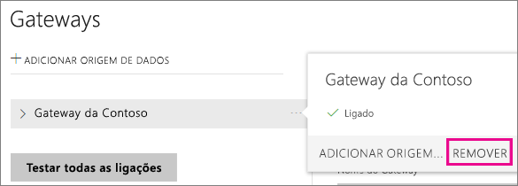
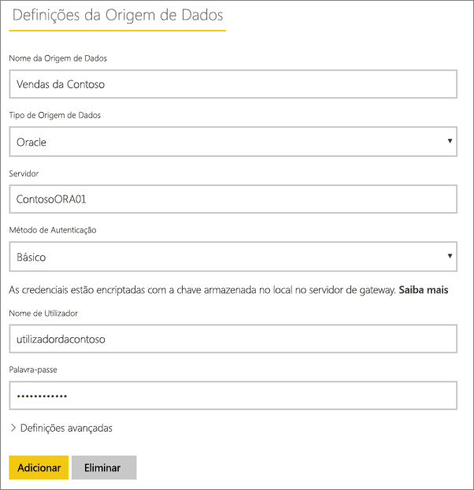
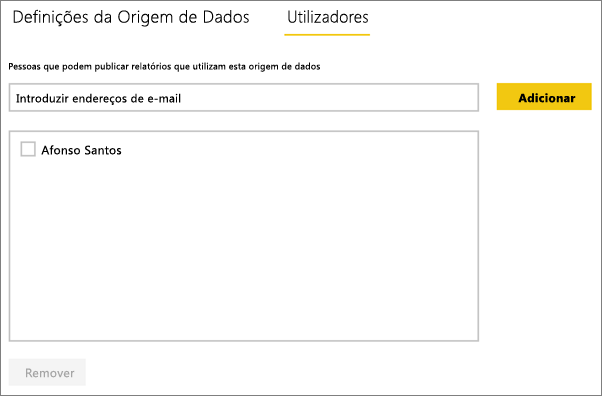
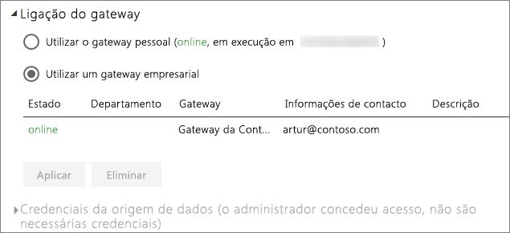

# Gerir a origem de dados – Atualização Importada/Agendada
Depois de instalar o Gateway de dados no local, terá de adicionar as origens de dados que podem ser utilizadas com o gateway. Este artigo analisará como trabalhar com gateways e origens de dados utilizadas para atualização agendada em vez do DirectQuery ou de ligações dinâmicas.

## Transferir e instalar o gateway
Pode transferir o gateway a partir do serviço Power BI. Selecione **Transferências** > **Gateway de Dados** ou aceda à [página de transferência do gateway](https://go.microsoft.com/fwlink/?LinkId=698861).

## Adicionar um gateway
Para adicionar um gateway, basta [transferir](https://go.microsoft.com/fwlink/?LinkId=698863) e instalar o gateway empresarial num servidor do ambiente. Depois de instalar o gateway, este será apresentado na lista de gateways em **Gerir gateways**.

> [!NOTE]
> **Gerir gateways** não será apresentado até ser o administrador de, pelo menos, um gateway. Isto pode acontecer ao ser adicionado como um administrador ou ao instalar e configurar um gateway.
> 
> 

## Remover um gateway
A remoção de um gateway também elimina as origens de dados contidas no mesmo.  Isto também interromperá todos os dashboards e relatórios que dependem dessas origens de dados.

1. Selecione o ícone de engrenagem  no canto superior direito > **Gerir gateways**.
2. Gateway > **Remover**
   
   

## Adicionar uma origem de dados
Pode adicionar uma origem de dados ao selecionar um gateway e clicar em **Adicionar origem de dados** ou ir para Gateway > **Adicionar origem de dados**.

Pode selecionar o **Tipo de Origem de Dados** na lista. Todas as origens de dados relacionadas podem ser utilizadas para atualização agendada com o gateway empresarial. O Analysis Services, o SQL Server e o SAP HANA podem ser utilizados para atualização agendada ou DirectQuery/ligações dinâmicas.

Em seguida, é necessário preencher as informações sobre a origem de dados, que inclui as informações de origem e as credenciais utilizadas para aceder à origem de dados.

> [!NOTE]
> Todas as consultas à origem de dados serão executadas com estas credenciais. Para obter mais informações, veja o artigo principal sobre o Gateway de dados no local para saber mais sobre como as [credenciais](service-gateway-onprem.md#credentials) são armazenadas.
> 
> 

Pode clicar em **Adicionar** depois preencher tudo.  Pode agora utilizar esta origem de dados para atualização agendada com os seus dados no local. Verá *Ligação Com Êxito* se tiver êxito.

<!-- Shared Install steps Include -->
[!INCLUDE [gateway-onprem-datasources-include](./includes/gateway-onprem-datasources-include.md)]

### Definições avançadas
Pode configurar o nível de privacidade para a sua origem de dados. Controla a forma como os dados podem ser combinados. É utilizado apenas para atualização agendada. [Saiba mais](https://support.office.com/article/Privacy-levels-Power-Query-CC3EDE4D-359E-4B28-BC72-9BEE7900B540)

## Remover uma origem de dados
A remoção de uma origem de dados interromperá todos os dashboards ou relatórios que dependem da origem de dados em questão.  

Para remover uma Origem de Dados, vá para Origem de Dados > **Remover**.

## Gerir administradores
No separador Administradores, do gateway, pode adicionar e remover os utilizadores que podem administrar o gateway. Neste momento, apenas pode adicionar utilizadores. Não é possível adicionar grupos de segurança.

## Gerir utilizadores
No separador Utilizadores, da origem de dados, pode adicionar e remover os utilizadores ou grupos de segurança que podem utilizar esta origem de dados.

> [!NOTE]
> A lista de utilizadores controla apenas quem tem permissão para publicar relatórios. Os proprietários do relatório podem criar dashboards ou pacotes de conteúdos e partilhá-los com outros utilizadores.
> 
> 

## Utilizar a origem de dados para a atualização agendada
Depois de criar a origem de dados, esta ficará disponível para utilização com qualquer uma das ligações do DirectQuery ou através da atualização agendada.

> [!NOTE]
> Os nomes do servidor e da base de dados têm de corresponder entre o Power BI Desktop e a origem de dados do Gateway de dados no local!
> 
> 

A ligação entre o conjunto de dados e a origem de dados no gateway é baseada no nome do servidor e no nome da base de dados. Estes têm de corresponder. Por exemplo, se fornecer um Endereço IP ao nome do servidor, no Power BI Desktop, terá de utilizar o Endereço IP para a origem de dados na configuração do gateway. Se utilizar *SERVIDOR\INSTÂNCIA*, no Power BI Desktop, terá de utilizar o mesmo na origem de dados configurada para o gateway.

Se estiver listado no separador **Utilizadores** da origem de dados configurada no gateway, e o nome do servidor e da base de dados corresponderem, irá ver o gateway como uma opção a utilizar com a atualização agendada.

> [!WARNING]
> Se o conjunto de dados contém várias origens de dados, cada origem de dados tem de ser adicionada ao gateway. Se uma ou mais origens de dados não são adicionadas no gateway, não verá o gateway como disponível para a atualização agendada.
> 
> 

## Limitações
* O OAuth não é um esquema de autenticação suportado com o Gateway de dados no local. Não é possível adicionar origens de dados que necessitam o OAuth. Se o conjunto de dados tem uma origem de dados que requere OAuth, não poderá utilizar o gateway para a atualização agendada.

## Próximos passos
[Gateway de dados no local](service-gateway-onprem.md)  
[Gateway de dados no local - detalhado](service-gateway-onprem-indepth.md)  
[Resolução de problemas do Gateway de dados no local](service-gateway-onprem-tshoot.md)  
Mais perguntas? [Pergunte à Comunidade do Power BI](http://community.powerbi.com/)

