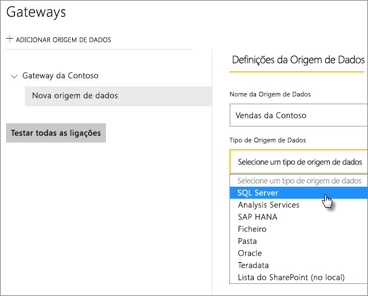
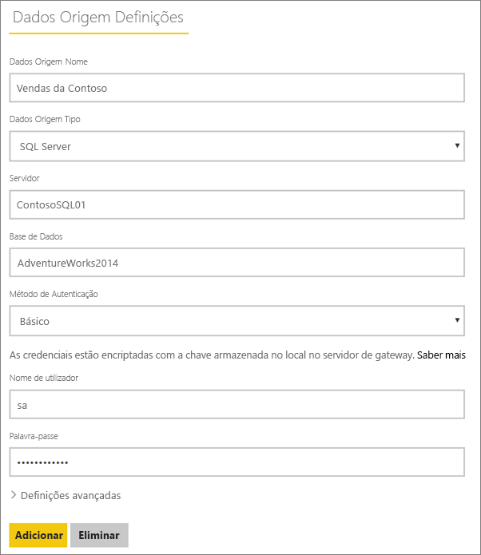
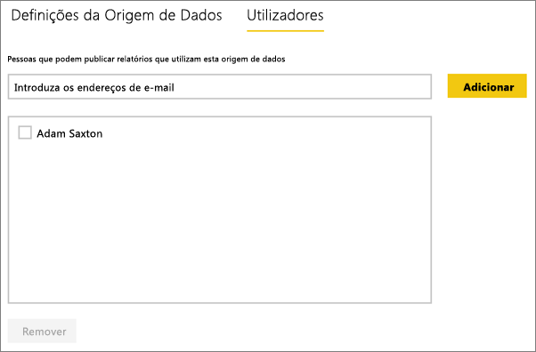
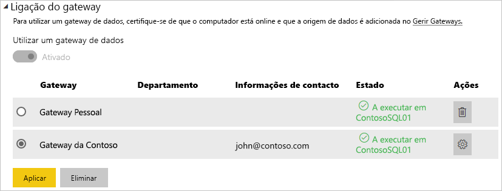

# Gerir a origem de dados – SQL Server
Depois de instalar o Gateway de dados no local, pode adicionar as origens de dados que podem ser utilizadas com o gateway. Este artigo abordará como trabalhar com gateways e origens de dados. Pode utilizar a origem de dados do SQL Server para a atualização agendada ou para o DirectQuery.

## Transferir e instalar o gateway
Pode transferir o gateway a partir do serviço Power BI. Selecione **Transferências** > **Gateway de Dados** ou aceda à [página de transferência do gateway](https://go.microsoft.com/fwlink/?LinkId=698861).

## Adicionar um gateway
Para adicionar um gateway, basta [Transferir](https://go.microsoft.com/fwlink/?LinkId=698861) e instalar o gateway num servidor do seu ambiente. Depois de instalar o gateway, será apresentado na lista de gateways em **Gerir gateways**.

> [!NOTE]
> **Gerir gateways** não será apresentado até ser o administrador de, pelo menos, um gateway. Isto ocorre quando é adicionado como administrador de um gateway ou instala e configura um gateway por si.
> 
> 

## Remover um gateway
A remoção de um gateway também elimina as origens de dados contidas no mesmo.  Isto também interromperá todos os dashboards e relatórios que dependem dessas origens de dados.

1. Selecione o ícone de engrenagem  no canto superior direito > **Gerir gateways**.
2. Gateway > **Remover**
   
   

## Adicionar uma origem de dados
Pode adicionar uma origem de dados ao selecionar um gateway e clicar em **Adicionar origem de dados** ou ir para Gateway > **Adicionar origem de dados**.

Pode selecionar o **Tipo de Origem de Dados** na lista.

> [!NOTE]
> Quando utiliza o DirectQuery, o gateway suporta apenas o **SQL Server 2012 SP1** e versões posteriores.
> 
> 

Em seguida, é necessário preencher as informações sobre a origem de dados, que incluem o **Servidor** e a **Base de Dados**.  

Também é necessário selecionar um **Método de Autenticação**.  Pode ser **Windows** ou **Básico**.  Deve selecionar **Básico** se for utilizar a Autenticação do SQL em vez da Autenticação do Windows. Em seguida, introduza as credenciais que serão utilizadas nesta origem de dados.

> [!NOTE]
> Todas as consultas à origem de dados serão executada através destas credenciais, exceto se o Início de Sessão Único (SSO) Kerberos estiver configurado e ativado para a origem de dados. Com o SSO, os conjuntos de dados de importação utilizam as credenciais armazenadas, mas os conjuntos de dados do DirectQuery utilizam o utilizador atual do Power BI para executar as consultas através de SSO. Para obter mais informações, veja o artigo principal sobre o Gateway de dados no local para saber mais sobre como as [credenciais](service-gateway-onprem.md#credentials) são armazenadas ou o artigo que descreve como [utilizar o Kerberos para SSO (início de sessão único) no Power BI para origens de dados no local](service-gateway-kerberos-for-sso-pbi-to-on-premises-data.md).
> 
> 

Pode clicar em **Adicionar** depois preencher tudo.  Agora pode utilizar esta origem de dados para atualização agendada, ou para o DirectQuery, num SQL Server local. Verá *Ligação Efetuada com Êxito* se tiver êxito.

### Definições avançadas
Pode configurar o nível de privacidade para a sua origem de dados. Controla a forma como os dados podem ser combinados. É utilizado apenas para a atualização agendada. Não se aplica ao DirectQuery. [Saiba mais](https://support.office.com/article/Privacy-levels-Power-Query-CC3EDE4D-359E-4B28-BC72-9BEE7900B540)

## Remover uma origem de dados
A remoção de uma origem de dados interromperá todos os dashboards ou relatórios que dependem da origem de dados em questão.  

Para remover uma Origem de Dados, vá para Origem de Dados > **Remover**.

## Gerir administradores
No separador Administradores no gateway, pode adicionar e remover os utilizadores (ou grupos de segurança) que podem administrar o gateway.

## Gerir utilizadores
No separador Utilizadores, da origem de dados, pode adicionar e remover os utilizadores ou grupos de segurança que podem utilizar esta origem de dados.

> [!NOTE]
> A lista de utilizadores controla apenas quem tem permissão para publicar relatórios. Os proprietários de relatório podem criar dashboards ou pacotes de conteúdos e partilhá-los com outros utilizadores.
> 
> 

## Utilizar a origem de dados
Depois de criar a origem de dados, esta ficará disponível para utilização com qualquer uma das ligações do DirectQuery ou através da atualização agendada.

> [!NOTE]
> Os nomes do servidor e da base de dados têm de corresponder entre o Power BI Desktop e a origem de dados do Gateway de dados no local!
> 
> 

A ligação entre o conjunto de dados e a origem de dados no gateway é baseada no nome do servidor e no nome da base de dados. Estes têm de corresponder. Por exemplo, se fornecer um Endereço IP ao nome do servidor, no **Power BI Desktop**, terá de utilizar o Endereço IP para a origem de dados na configuração do gateway. Se utilizar *SERVIDOR\INSTÂNCIA*, no Power BI Desktop, terá de utilizar o mesmo na origem de dados configurada para o gateway.

Este é o caso do DirectQuery e da atualização agendada.

### Utilizar a origem de dados com ligações do DirectQuery
Terá de se certificar de que os nomes do servidor e da base de dados correspondem entre o **Power BI Desktop** e a origem de dados configurada para o gateway. Também terá de se certificar de que o utilizador está listado no separador **Utilizadores** da origem de dados para poder publicar conjuntos de dados do DirectQuery. Para o DirectQuery, a seleção ocorre no Power BI Desktop quando importa dados pela primeira vez. [Saiba mais](desktop-use-directquery.md)

Depois de publicar, a partir do Power BI Desktop ou de **Obter Dados**, os seus relatórios devem começar a funcionar. Poderá demorar vários minutos, depois de criar a origem de dados dentro do gateway, para a ligação ser utilizável.

### Utilizar a origem de dados com a atualização agendada
Se estiver listado no separador **Utilizadores** da origem de dados configurada no gateway, e o nome do servidor e da base de dados corresponderem, irá ver o gateway como uma opção a utilizar com a atualização agendada.

## Próximos passos
* [Gateway de dados no local](service-gateway-onprem.md)  
* [Gateway de dados no local - detalhado](service-gateway-onprem-indepth.md)  
* [Resolução de problemas do Gateway de dados no local](service-gateway-onprem-tshoot.md)
* [Utilizar o Kerberos para SSO (início de sessão único) do Power BI para origens de dados no local](service-gateway-kerberos-for-sso-pbi-to-on-premises-data.md). 
* Mais perguntas? [Pergunte à Comunidade do Power BI](http://community.powerbi.com/)

